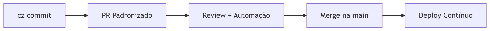

# O que é o Ciclo de Vida do Desenvolvimento de Software (SDLC - Software Development Lifecycle)?

O Ciclo de Vida do Desenvolvimento de Software é um conjunto de práticas que compõem uma estrutura para padronizar a construção de aplicações de software. O SDLC define as tarefas a serem realizadas em cada etapa do desenvolvimento de software. Essa metodologia visa melhorar a qualidade do software e do processo de desenvolvimento, superando as expectativas dos clientes e cumprindo prazos e estimativas de custo.
Por exemplo, com o aumento da demanda dos clientes e do poder computacional, os custos de software aumentam, assim como a dependência de desenvolvedores. O SDLC fornece uma maneira de medir e aprimorar o processo de desenvolvimento, oferecendo insights e análises de cada etapa, maximizando a eficiência e reduzindo os custos.

## Como o SDLC funciona?

O Ciclo de Vida do Desenvolvimento de Software fornece a orientação necessária para criar uma aplicação de software. Ele faz isso dividindo as tarefas em fases que formam o SDLC. Padronizar as tarefas dentro de cada fase aumenta a eficiência do processo de desenvolvimento. Cada fase é dividida em tarefas menores que podem ser medidas e monitoradas. Isso permite acompanhar o andamento dos projetos para garantir que permaneçam no cronograma.
O objetivo do SDLC é estabelecer processos repetíveis e resultados previsíveis dos quais projetos futuros possam se beneficiar. As fases do SDLC geralmente são divididas entre 6 a 8 etapas.

As fases são:

- Planejamento: a fase de planejamento abrange todos os aspectos da gestão de projetos e produtos, incluindo alocação de recursos, cronograma do projeto, estimativa de custos, entre outros.

- Definição de Requisitos: considerada parte do planejamento, essa etapa determina o que a aplicação deve fazer e quais são os seus requisitos. Por exemplo, um aplicativo de rede social precisaria da capacidade de se conectar com amigos.

- Design e Prototipagem: nesta fase se define como o software funcionará, qual linguagem de programação será usada, como os componentes irão se comunicar entre si, arquitetura, etc.

- Desenvolvimento de Software: envolve construir o programa, escrever o código e a documentação.

- Testes: nesta fase, garante-se que os componentes funcionem corretamente e possam interagir entre si. Por exemplo, verifica-se se cada função está funcionando corretamente, se as diferentes partes do aplicativo operam juntas de forma integrada e se o desempenho está adequado, sem travamentos.

- Implantação (Deployment): nesta etapa, o aplicativo ou projeto é disponibilizado para os usuários.

- Operações e Manutenção: aqui os engenheiros respondem a problemas na aplicação ou a falhas relatadas pelos usuários, e às vezes planejam funcionalidades adicionais para versões futuras.

As empresas podem optar por reorganizar essas fases, dividindo ou unificando etapas, resultando em 6 a 8 fases no total. Por exemplo, é possível mesclar a fase de testes com a de desenvolvimento em cenários onde a segurança é incorporada em cada etapa do desenvolvimento, já que os desenvolvedores corrigem falhas durante os testes.

Fonte: [Try Hack Me - What is Software Development Lifecycle (SDLC)?](https://tryhackme.com/room/sdlc)

# Quais são as melhores práticas de controle de versão do Git?

## A importância das melhores práticas de controle de versão do Git

As melhores práticas de controle de versão do Git ajudam as equipes de desenvolvimento de software a atender às dinâmicas demandas de alterações do setor, juntamente com a crescente necessidade de novos recursos por parte dos clientes. A velocidade com que as equipes precisam trabalhar pode levar a silos, o que diminui a agilidade. As equipes de desenvolvimento de software recorrem ao controle de versão para simplificar a colaboração e eliminar os silos de informações.

Com as melhores práticas do Git, as equipes podem coordenar todas as alterações em um projeto de software e usar o branching rápido para ajudar as equipes a colaborar e compartilhar feedback rapidamente, levando a alterações imediatas e aplicáveis. O Git, como base fundamental do desenvolvimento de software moderno, oferece um conjunto de ferramentas e recursos potentes criados para otimizar os ciclos de desenvolvimento, melhorar a qualidade de código e promover a colaboração entre os membros da equipe.

## Faça pequenas alterações incrementais

Escreva a menor quantidade de código possível para resolver um problema. Depois de identificar um problema ou melhoria, a maneira ideal de experimentar algo novo e não testado é dividir a atualização em pequenas partes que possam ser fácil e rapidamente testadas com o usuário final para provar a validade da solução proposta e reverter caso não funcione, sem prejudicar toda a nova funcionalidade.

Fazer o commit de código em pequenos lotes diminui a probabilidade de conflitos de integração, porque quanto mais tempo um branch permanece separado do branch principal ou da linha de código, mais tempo outros desenvolvedores passam fazendo merge de alterações no branch principal, aumentando a probabilidade de conflitos de integração durante o merge. Pequenos commits frequentes resolvem esse problema. As alterações incrementais também ajudam os membros da equipe a reverter facilmente se ocorrerem conflitos de merge, especialmente quando essas alterações foram devidamente documentadas na forma de mensagens descritivas de commit.

## Mantenha os commits atômicos

Relacionados a fazer pequenas alterações, os commits atômicos são uma unidade de trabalho, envolvendo apenas uma tarefa ou uma correção (por exemplo, atualização, correção de bug, refatoração). Commits atômicos tornam as revisões de código mais rápidas e as reversões mais fáceis, pois podem ser aplicados ou revertidos sem efeitos secundários indesejados.

O objetivo dos commits atômicos não é criar centenas de commits, mas agrupá-los por contexto. Por exemplo, se um desenvolvedor precisar refatorar o código e adicionar um novo recurso, ele deverá criar dois commits separados em vez de criar um commit monolítico, que inclui alterações com finalidades diferentes.

## Desenvolva usando branches

Com os branches, as equipes de desenvolvimento de software podem fazer alterações sem afetar a linha de código principal. O histórico de execução das alterações é rastreado em um branch e, quando o código está pronto, ele é mesclado no branch principal.

O branching organiza o desenvolvimento e separa o trabalho em andamento do código estável e testado no branch principal. O desenvolvimento em branches garante que bugs e vulnerabilidades não entrem no código-fonte e afetem os usuários, pois testá-los e encontrá-los em um branch é mais fácil.

## Escreva mensagens de commit descritivas

As mensagens de commit descritivas são tão importantes quanto uma alteração. Escreva mensagens de commit descritivas começando com um verbo no tempo presente no modo imperativo para indicar o propósito de cada commit de maneira clara e concisa. Cada commit deve ter apenas um propósito explicado em detalhes na mensagem do commit. A documentação do Git dá orientações sobre como escrever mensagens de commit descritivas.

Descreva suas alterações no modo imperativo, por exemplo, "faça xyzzy do frotz" em vez de "[Este patch] faz xyzzy do frotz" ou "[Eu] mudei o xyzzy para fazer frotz", como se você estivesse dando comandos ao codebase para alterar o comportamento dele. Tente garantir que sua explicação possa ser entendida sem recursos externos. Em vez de disponibilizar um URL para um arquivo de lista de discussão, resuma os pontos relevantes da conversa.

Escrever mensagens de commit dessa forma força as equipes de software a entenderem o valor que uma adição ou correção traz à linha de código existente. Se as equipes acharem impossível encontrar o valor e descrevê-lo, talvez valha a pena reavaliar as motivações por trás do commit. Sempre há tempo para fazer o commit depois, pois as alterações são armazenadas e há uniformidade nos commits.

## Obtenha feedback por meio de revisões de código

Solicitar feedback de outras pessoas é uma excelente maneira de garantir a qualidade do código. As revisões de código são um método eficaz para identificar se uma proposta resolve um problema da maneira mais eficiente possível. Pedir a membros de outras equipes que revisem o código é importante, porque algumas áreas do codebase podem incluir conhecimento de domínio específico ou até mesmo implicações de segurança além das atribuições do colaborador individual.

Incluir um stakeholder específico na conversa é uma boa prática e cria um ciclo de feedback mais rápido, evitando problemas posteriores no ciclo de vida do desenvolvimento de software. Isso é especialmente importante para desenvolvedores juniores, pois, por meio da revisão de código, desenvolvedores sêniores podem transferir conhecimento de uma maneira muito prática e direta.

## Identifique uma estratégia de gerenciamento de branches

As equipes de desenvolvimento de software incluem profissionais com experiências e formações diversas, o que pode causar fluxos de trabalho conflitantes. Determinar uma única estratégia de gerenciamento de branches é a solução para evitar uma experiência de desenvolvimento caótica.

Embora existam várias abordagens para o desenvolvimento, as mais comuns são:

- Fluxo de trabalho centralizado: as equipes usam apenas um único repositório e fazem o commit diretamente no branch principal.

- Gerenciamento de branches de recursos: as equipes usam um novo branch para cada recurso e não fazem commit diretamente no branch principal.

- [GitFlow](./gitflow/README.md): uma versão extrema de gerenciamento de branches de recursos, na qual o desenvolvimento ocorre no branch de desenvolvimento, passa para um branch de lançamento e é mesclado no branch principal.

- Gerenciamento de branches pessoais: semelhante ao gerenciamento de branches de recursos, mas em vez de desenvolver em um branch por recurso, o desenvolvimento é feito por cada desenvolvedor em seu próprio branch. Cada usuário faz merge no branch principal quando conclui seu trabalho.

Muitas equipes decidem seguir um fluxo de trabalho estabelecido, mas outras criam uma abordagem personalizada com base em necessidades específicas. Independentemente da estratégia, é importante comunicar a decisão e a logística do fluxo de trabalho aos membros da equipe e oferecer treinamento se a abordagem for nova para alguns deles.

## Conclusão

A adoção das melhores práticas de controle de versão do Git é crucial para as equipes de desenvolvimento de software, permitindo que elas utilizem recursos e ferramentas incríveis que melhoram os fluxos de trabalho de desenvolvimento e o gerenciamento do histórico de versões. Isso garante a colaboração eficiente entre os membros da equipe, agiliza o processo de revisão e protege a integridade de código do software. A integração de sistemas de controle de versão no ciclo de desenvolvimento tornou-se um requisito fundamental.

Os benefícios do controle de versão são inegáveis, oferecendo um roteiro de sucesso para empresas que desejam prosperar no cenário competitivo do desenvolvimento de software. Ao adotar essas melhores práticas, as equipes podem preparar o terreno para crescimento e inovação futuros.

Fonte: [GitLab - Quais são as melhores práticas de controle de versão do Git?](https://about.gitlab.com/pt-br/topics/version-control/version-control-best-practices/)

# [Trunk-based](./trunk-based/README.md)

# [Gitflow](./gitflow/README.md)

# Boas Práticas para SDLC (Software Development Life Cycle)

## 1. Padrão de Commits com Commitizen
### Ferramenta
- Uso do [Commitizen](./commitizen/README.md) para padronizar mensagens de commit via CLI interativa.

### Fluxo de Trabalho
- Substitua `git commit -m "..."` por:
    ```bash
    git add . && cz commit
    ```
- **Tipos de commit obrigatórios**:
    - `fix`: Correção de bug. Correlaciona-se com PATCH no SemVer.
    - `feat`: Nova funcionalidade. Correlaciona-se com MINOR no SemVer.
    - `docs`: Alterações apenas na documentação.
    - `style`: Alterações que não afetam o significado do código (espaços em branco, formatação, ponto e vírgula ausente, etc.).
    - `refactor`: Alteração de código que não corrige um bug nem adiciona uma funcionalidade.
    - `perf`: Alteração de código que melhora o desempenho.
    - `test`: Adição ou correção de testes existentes.
    - `build`: Alterações que afetam o sistema de build ou dependências externas (ex.: pip, docker, npm).
    - `ci`: Alterações nos arquivos de configuração ou scripts de CI (ex.: GitLabCI).

---

## 2. Padrão de Política de Pull Request (PR)
### Requisitos Mínimos
- **Título**: Descritivo (ex: `[FEAT] Login com OAuth`).
- **Descrição**: Contexto, motivação e testes realizados.
- **Links**: Relacione à issue (ex: `Resolve #123`).

### Revisão de Código
- **Aprovações**: Mínimo de 1 reviewer (2 para projetos críticos).
- **Checklist**:
    - [ ] Testes passando.
    - [ ] Documentação atualizada.
    - [ ] Impacto em performance avaliado.

### Automação
- Use **GitHub Actions/GitLab CI** para:
    - Rodar testes e linters.

---

## 3. Padrão de Branches e Commits
### Estratégia de Branching
- **[GitFlow](./gitflow/README.md)** (para releases planejadas) ou **Trunk-Based** (para CI/CD).
- **Nomes de branches**:
    - `feat/oauth-support` (novas funcionalidades).
    - `fix/checkout-race` (correções).

### Convenção de Commits
- Exemplo:
    ```bash
    feat(auth): add OAuth2 support
    fix(checkout): resolve race condition
    ```

---

## 4. Treinamento em SCM (GitFlow vs. Trunk-Based)
### GitFlow
- **Branches**: `main`, `develop`, `feature/*`, `release/*`, `hotfix/*`.
- **Uso**: Projetos com versões estáveis (ex: enterprise).

### Trunk-Based
- **Branches**: `main` (sempre deployável) + feature flags.
- **Uso**: Times ágeis com deploys diários.

### Workshop
- Práticas de `rebase`, `cherry-pick` e resolução de conflitos.

---

## 5. Linter e Code Quality
### Ferramentas
- **[SonarQube](./sonarqube_codesense/README.md)**: Análise estática e cobertura de testes.
- **[CodeScene](./sonarqube_codesense/README.md)**: Análise de hotspots e colaboração.
- **Linters**:
    - ESLint/Prettier (JavaScript).
    - Pylint (Python).
- **Validação**:
    - Bloquear merge se:
        - Cobertura de testes < 80%.
        - Critical issues no Sonar.

---

## 6. API Design (Swagger/Stoplight)
### Documentação
- **[Swagger/OpenAPI](./swagger_stoplight/README.md)**: Especificação contratual.
- **[Stoplight](./swagger_stoplight/README.md)**: Design colaborativo.
- **Padrões**:
    - Versionamento (`/v1/users`).
    - Exemplos de payloads.

---

## 7. Documentação e Treinamento
### Arquitetura
- **Diagramas**: C4 Model ou UML (usando Draw.io).
- **ADRs**: Registro de decisões técnicas.

### Onboarding
- Wiki com:
    - Guia de setup.
    - Fluxo de deploy.

---

## 8. Políticas de Segurança no GitHub
### Mínimo Recomendado
- **Branch Protection**:
    - Bloquear `force push` em `main`.
    - Exigir 2FA para todos os devs.
- **Dependências**:
    - Scan com Dependabot.

---

## Fluxo Completo SDLC

