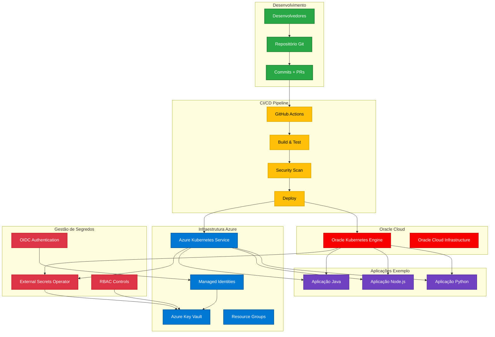
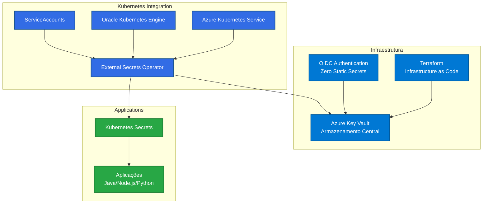
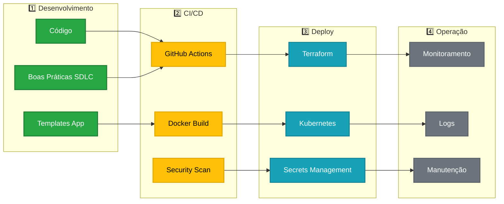

<p align="center">
  
</p>

# 🏢 Embracon - Toolbox de DevOps e Infraestrutura

## 🎯 Sobre o Projeto

O **Embracon Toolbox** é uma coleção abrangente de ferramentas, práticas e templates de DevOps desenvolvidos especificamente para a **Embracon**, fornecendo soluções padronizadas para desenvolvimento seguro, CI/CD, gerenciamento de segredos e melhores práticas de SDLC (Software Development Life Cycle).

Este repositório serve como **centro de conhecimento** e **toolkit operacional** para equipes de desenvolvimento, oferecendo:
- 🔐 **Soluções de segurança** para gerenciamento de segredos
- 🚀 **Pipelines CI/CD** padronizados e otimizados  
- 📋 **Boas práticas SDLC** documentadas e implementáveis
- 🏗️ **Templates de infraestrutura** como código
- 🎯 **Aplicações de exemplo** em múltiplas linguagens

## 🏗️ Arquitetura Geral da Solução



## 📁 Estrutura do Repositório

### 📊 Visão Geral das Pastas

```
embracon/
├── 📱 app/                          # Aplicações de exemplo e demonstração
├── 📚 Boas práticas de SDLC/        # Metodologias e práticas de desenvolvimento
├── 🚀 CI-CD/                        # Pipelines e automação CI/CD
├── 🖼️ img/                          # Recursos visuais e diagramas
├── 📦 pipeline-templates/           # Templates reutilizáveis de pipeline
└── 🔐 Secret Management/            # Gestão segura de credenciais e segredos
```

## 📱 **`app/` - Aplicações de Demonstração**

Contém aplicações de exemplo em diferentes linguagens, demonstrando integração com a infraestrutura da Embracon.

### **Subdiretórios:**
- **`java/`** - Aplicação Spring Boot com integração Maven
  - `Dockerfile` - Containerização da aplicação Java
  - `pom.xml` - Dependências e configuração Maven
  - `src/` - Código fonte da aplicação
  
- **`nodejs/`** - Aplicação Node.js/Express
  - `server.js` - Servidor HTTP principal
  - `package.json` - Dependências npm
  - `index.html` - Interface web
  - `Dockerfile` - Containerização da aplicação Node.js
  
- **`python/`** - Aplicação Flask/Python
  - `app.py` - Aplicação Flask principal
  - `requirements.txt` - Dependências Python
  - `templates/` - Templates HTML Jinja2
  - `static/` - Recursos estáticos (CSS, JS, imagens)
  - `Dockerfile` - Containerização da aplicação Python

### **🎯 Propósito:**
- Demonstrar integração com Azure Key Vault
- Exemplificar uso do External Secrets Operator
- Mostrar padrões de containerização
- Servir como base para novas aplicações

---

## 📚 **`Boas práticas de SDLC/` - Metodologias de Desenvolvimento**

Documentação abrangente das melhores práticas de Software Development Life Cycle adotadas pela Embracon.

### **Subdiretórios:**
- **`commitizen/`** - Padronização de commits com Conventional Commits
- **`gitflow/`** - Estratégia de branching GitFlow
- **`pre-commit/`** - Hooks de validação antes de commits
- **`sonarqube_codesense/`** - Análise de qualidade de código
- **`swagger_stoplight/`** - Documentação de APIs
- **`trunk-based/`** - Desenvolvimento baseado em trunk

### **🎯 Propósito:**
- Padronizar processos de desenvolvimento
- Garantir qualidade de código
- Facilitar colaboração entre equipes
- Implementar controles de qualidade automatizados

---

## 🚀 **`CI-CD/` - Pipelines e Automação**

Contém templates, documentação e padrões para implementação de pipelines CI/CD na Embracon.

### **Subdiretórios:**
- **`ACT/`** - Ferramenta para testar GitHub Actions localmente
- **`docker-standards/`** - Padrões de containerização Docker
  - `approval-workflow/` - Workflows de aprovação
  - `base-images/` - Imagens base padronizadas
  - `security/` - Práticas de segurança Docker
- **`docs/`** - Documentação técnica de CI/CD
- **`pipelines-standards/`** - Padrões de pipeline
  - `cache/` - Estratégias de cache
  - `security/` - Segurança em pipelines
- **`templates/`** - Templates reutilizáveis
- **`training/`** - Material de treinamento

### **🎯 Propósito:**
- Automatizar builds e deployments
- Padronizar pipelines entre projetos
- Implementar security scanning
- Otimizar tempos de build com cache

---

## 📦 **`pipeline-templates/` - Templates Reutilizáveis**

Templates e scripts comuns para uso em diferentes projetos da Embracon.

### **Conteúdo:**
- **`healthcheck.sh`** - Script de verificação de saúde
- **`vars.yml`** - Variáveis compartilhadas
- **`dockerfiles/`** - Coleção de Dockerfiles padronizados
  - Multiple versioned Docker images para diferentes stacks:
    - `embracon-jdk11/jdk17/jdk21` - Images Java
    - `embracon-mvn3-*` - Images Maven
    - `embracon-kafka-*` - Images Kafka
    - `embracon-kaasapi-*` - Images API específicas

### **🎯 Propósito:**
- Reutilizar configurações comuns
- Manter versionamento de imagens Docker
- Centralizar scripts de utilidade
- Facilitar manutenção de templates

---

## 🔐 **`Secret Management/` - Gestão de Segredos**

**Sistema centralizado e seguro** para gerenciamento de credenciais, tokens e segredos usando Azure Key Vault com integração Kubernetes.

### **Arquitetura da Solução:**



### **Subdiretórios:**
- **`AKS/`** - Integração com Azure Kubernetes Service
  - `README.md` - Visão geral com diagramas
  - `README-Linux.md` - Guia completo para Linux/macOS
  - `README-Windows.md` - Guia completo para Windows
  
- **`infra-secrets/`** - Infraestrutura Terraform
  - `module/` - Módulo Terraform reutilizável
  - `resource/` - Implementação de exemplo
  
- **`OKE/`** - Integração com Oracle Kubernetes Engine
  - `README.md` - Guia de configuração cross-cloud
  - `cluster-enable-oidc.json` - Configuração OIDC OKE

### **Arquivos de Configuração:**
- `external-secret.yaml` - Sincronização de segredos
- `secret-store.yaml` - Conexão com Azure Key Vault
- `service-account.yaml` - Workload Identity
- `external-secret-2.yaml` / `secret-store-2.yaml` - Configurações alternativas

### **🎯 Funcionalidades:**
- ✅ **Autenticação OIDC** sem secrets estáticos
- ✅ **Multi-cloud** (Azure AKS + Oracle OKE)
- ✅ **Terraform** para infraestrutura como código
- ✅ **RBAC granular** para controle de acesso
- ✅ **External Secrets Operator** para sincronização automática
- ✅ **GitHub Actions** com Managed Identity

---

## 🔄 Fluxo de Trabalho Integrado

### **1️⃣ Desenvolvimento → 2️⃣ CI/CD → 3️⃣ Deploy → 4️⃣ Operação**



## 🚀 Como Começar

### **Para Desenvolvedores:**
1. 📖 Leia as [**Boas práticas de SDLC**](Boas%20práticas%20de%20SDLC/README.md)
2. 🔍 Explore as [**aplicações de exemplo**](app/)
3. 🛠️ Configure o [**ambiente de desenvolvimento**](CI-CD/docs/)

### **Para DevOps/SRE:**
1. 🏗️ Configure a [**infraestrutura com Terraform**](Secret%20Management/infra-secrets/)
2. 🔐 Implemente o [**gerenciamento de segredos**](Secret%20Management/)
3. 🚀 Configure os [**pipelines CI/CD**](CI-CD/)

### **Para Arquitetos:**
1. 📋 Revise a [**arquitetura da solução**](Secret%20Management/SOLUTION-DIAGRAM.md)
2. 🔄 Entenda os [**fluxos de integração**](CI-CD/docs/cicd-flow.md)
3. 🛡️ Analise as [**práticas de segurança**](CI-CD/docker-standards/security/)

## 🎯 Casos de Uso Principais

### **🔐 Gerenciamento Seguro de Credenciais**
- Armazenamento centralizado no Azure Key Vault
- Acesso via OIDC sem secrets estáticos
- Sincronização automática para Kubernetes
- Suporte multi-cloud (Azure + Oracle)

### **🚀 Deploy Automatizado**
- Pipelines padronizados GitHub Actions
- Containerização com Docker
- Deploy em múltiplos ambientes
- Rollback automático em caso de falha

### **📋 Desenvolvimento Padronizado**
- Templates de aplicação prontos
- Boas práticas documentadas
- Ferramentas de qualidade integradas
- Processo de review automatizado

### **🏗️ Infraestrutura como Código**
- Terraform para provisionamento
- Versionamento de infraestrutura
- Ambientes reproduzíveis
- Configuração declarativa

## 🛡️ Segurança e Compliance

### **Principais Medidas de Segurança:**
- ✅ **Zero Static Secrets** - Apenas tokens temporários
- ✅ **RBAC Granular** - Controle de acesso por recurso
- ✅ **OIDC Federation** - Autenticação federada
- ✅ **Security Scanning** - Análise automática de vulnerabilidades
- ✅ **Audit Logging** - Rastreabilidade completa
- ✅ **Least Privilege** - Princípio de menor privilégio

### **Compliance:**
- 📋 Conformidade com políticas internas da Embracon
- 🔍 Auditoria de acesso a segredos
- 📊 Relatórios de segurança automatizados
- 🛡️ Controles de governança implementados

## 📞 Suporte e Contribuição

### **Para Dúvidas e Suporte:**
- 📧 Entre em contato com a equipe de DevOps
- 📖 Consulte a documentação específica de cada módulo
- 🔍 Verifique os guias de troubleshooting

### **Para Contribuições:**
- 🍴 Fork o repositório
- 🌿 Crie uma branch para sua feature
- 📝 Siga as boas práticas de commit
- 📤 Abra um Pull Request

### **Estrutura de Branches:**
- `main` - Código estável em produção
- `develop` - Desenvolvimento ativo
- `feature/*` - Novas funcionalidades
- `hotfix/*` - Correções urgentes

---

<p align="center">
  <strong>🚀 Toolbox Tech - Transformamos empresas com educação e consultoria em DevOps, automação e SRE simplificado.</strong><br>
  <em>DevOps • Cloud • Security • Best Practices</em>
</p>
