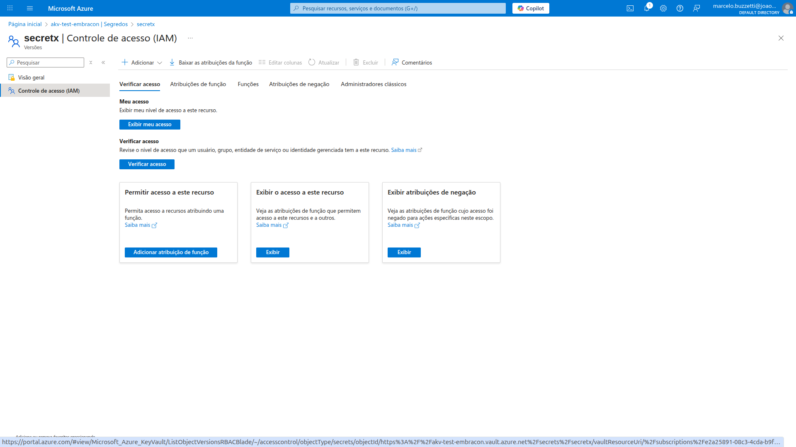
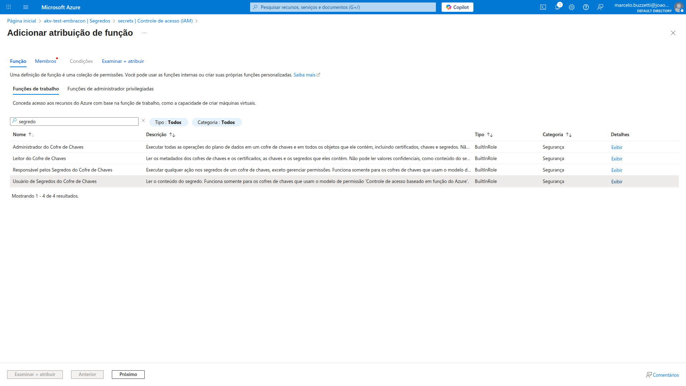

# Guia para acessar um segredo no Azure Key Vault (AKV) a partir do Azure Kubernetes Service (AKS)

Este guia apresenta um passo a passo para acessar segredos do Azure Key Vault (AKV) a partir do Azure Kubernetes Service (AKS) de forma segura, utilizando a Federação de Identidade de Carga de Trabalho (Workload Identity Federation) via OIDC, External Secrets Operator e RBAC do Azure.

## Visão Geral

- **Elimina o "Secret Zero"**: Não é necessário armazenar secrets fixos no cluster.
- **Segurança aprimorada**: O acesso é feito por tokens temporários emitidos via OIDC.
- **Automação**: Permissões dinâmicas para workloads, sem rotacionar secrets manualmente.
- **Gerenciamento centralizado**: RBAC do Azure AD controla o acesso aos segredos.

---

## 1. Conceitos-Chave

- **Secret Zero**: Segredo inicial que, se exposto, compromete todo o acesso. Eliminado com OIDC.
- **OIDC (OpenID Connect)**: Protocolo de autenticação que permite ao AKS emitir tokens para workloads.
- **Workload Identity Federation**: Permite que pods do AKS assumam identidades do Azure AD sem secrets.
- **External Secrets Operator**: Sincroniza segredos do AKV para o Kubernetes.
- **RBAC do Azure**: Gerencia quem pode acessar quais segredos no AKV.

---

## 2. Pré-requisitos

- Azure CLI configurado (`az login`)
- Permissões para criar recursos no Azure (AKS, Key Vault, Managed Identity, Grupos)
- Helm instalado para deploy do External Secrets Operator

---

## 3. Fluxo Resumido

1. Crie um grupo no Azure AD para controle de acesso.
2. Crie uma Managed Identity para workloads do AKS.
3. Adicione a Managed Identity ao grupo criado.
4. Crie o Key Vault com RBAC habilitado.
5. Crie ou atualize o cluster AKS com OIDC habilitado.
6. Configure a federação de identidade entre o AKS e a Managed Identity.
7. Instale o External Secrets Operator no cluster.
8. Crie a ServiceAccount no Kubernetes com as anotações necessárias.
9. Crie o SecretStore apontando para o Key Vault.
10. Conceda permissões de acesso ao grupo no Key Vault.
11. Crie o recurso ExternalSecret para sincronizar segredos do AKV para o Kubernetes.

---

## 4. Passo a Passo

### 4.1. Faça login e defina a subscription

Antes de iniciar, faça login no Azure CLI e defina a subscription correta:

```bash
az login
az account set --subscription "<SUA_SUBSCRIPTION_ID>"
```

Substitua `<SUA_SUBSCRIPTION_ID>` pelo ID da subscription desejada.

### 4.2. Defina Variáveis

```bash
SEU_GROUP_NAME="akv-access-group"
SEU_IDENTITY_MANAGED_NAME="test-aks-akv"
SEU_RESOURCE_GROUP="Embracon"
SEU_KEYVAULT_NAME="akv-test-embracon"
SUA_LOCALIZACAO="brazilsouth"
SEU_AKS_NAME="aks-test"
SERVICE_ACCOUNT_NAME="workload-identity-sa"
NAMESPACE="default"
TENANT_ID="$(az account show --query tenantId -o tsv)"
```

### 4.3. Crie os Recursos no Azure

```bash
# Grupo de acesso
az ad group create --display-name "$SEU_GROUP_NAME" --mail-nickname "$SEU_GROUP_NAME"

# Managed Identity
az identity create --name "$SEU_IDENTITY_MANAGED_NAME" --resource-group "$SEU_RESOURCE_GROUP" --location "$SUA_LOCALIZACAO"
IDENTITY_PRINCIPAL_ID="$(az identity show --name "$SEU_IDENTITY_MANAGED_NAME" --resource-group "$SEU_RESOURCE_GROUP" --query principalId -o tsv)"
CLIENT_ID="$(az identity show --name "$SEU_IDENTITY_MANAGED_NAME" --resource-group "$SEU_RESOURCE_GROUP" --query clientId -o tsv)"

# Adicione a Managed Identity ao grupo
az ad group member add --group "$SEU_GROUP_NAME" --member-id "$IDENTITY_PRINCIPAL_ID"

# Key Vault com RBAC
az keyvault create \
  --name "$SEU_KEYVAULT_NAME" \
  --resource-group "$SEU_RESOURCE_GROUP" \
  --location "$SUA_LOCALIZACAO" \
  --enable-rbac-authorization true
KEY_VAULT_URL="$(az keyvault show --name "$SEU_KEYVAULT_NAME" --resource-group "$SEU_RESOURCE_GROUP" --query properties.vaultUri -o tsv)"
```

### 4.4. Crie ou Atualize o AKS com OIDC

**Novo cluster:**
```bash
az aks create \
  --name "$SEU_AKS_NAME" \
  --resource-group "$SEU_RESOURCE_GROUP" \
  --location "$SUA_LOCALIZACAO" \
  --enable-oidc-issuer \
  --enable-managed-identity \
  --node-count 1 \
  --enable-cluster-autoscaler \
  --min-count 1 \
  --max-count 3 \
  --tier free
```

**Cluster existente:**
```bash
az aks update --name "$SEU_AKS_NAME" --resource-group "$SEU_RESOURCE_GROUP" --enable-oidc-issuer
```

Obtenha as credenciais:
```bash
az aks get-credentials --name "$SEU_AKS_NAME" --resource-group "$SEU_RESOURCE_GROUP"
```

Descubra o issuer URL do OIDC:
```bash
AKS_OIDC_ISSUER=$(az aks show --name "$SEU_AKS_NAME" --resource-group "$SEU_RESOURCE_GROUP" --query "oidcIssuerProfile.issuerUrl" -o tsv)
```

### 4.5. Configure a Federação de Identidade

```bash
az identity federated-credential create --name "kubernetes-federated-credential" \
  --identity-name "$SEU_IDENTITY_MANAGED_NAME" \
  --resource-group "$SEU_RESOURCE_GROUP" \
  --issuer "$AKS_OIDC_ISSUER" \
  --subject system:serviceaccount:$NAMESPACE:$SERVICE_ACCOUNT_NAME
```

### 4.6 Conecte-se ao cluster criado

```bash
az aks get-credentials --name "$SEU_AKS_NAME" --resource-group "$SEU_RESOURCE_GROUP"
```

### 4.7. Instale o External Secrets Operator

```bash
helm repo add external-secrets https://charts.external-secrets.io
helm install external-secrets external-secrets/external-secrets -n external-secrets --create-namespace
```

### 4.8. Crie a ServiceAccount no Kubernetes

Crie um arquivo `service-account.yaml` com as anotações necessárias (client-id, tenant-id).
(substitua pelos valores das variáveis que você obteve anteriormente):

```yaml
apiVersion: v1
kind: ServiceAccount
metadata:
  name: workload-identity-sa
  annotations:
    azure.workload.identity/client-id: "<CLIENT_ID>"
    azure.workload.identity/tenant-id: "<TENANT_ID>"
```

> **Nota:**  
> - Substitua `<CLIENT_ID>` pelo valor da variável `$CLIENT_ID`.
> - Substitua `<TENANT_ID>` pelo valor da variável `$TENANT_ID`.

```bash
kubectl apply -f service-account.yaml
```

### 4.9. Crie o Secret Store

Crie um arquivo `secret-store.yaml` com o seguinte conteúdo, substituindo os valores conforme necessário:

```yaml
apiVersion: external-secrets.io/v1
kind: SecretStore
metadata:
  name: akv-secret-manager-store
  namespace: <namespace>
spec:
  provider:
    azurekv:
      authType: WorkloadIdentity
      vaultUrl: "<KEY_VAULT_URL>"
      serviceAccountRef:
        name: workload-identity-sa
```

> **Nota:**  
> - Substitua `<namespace>` pelo namespace desejado no cluster Kubernetes (por exemplo, `default` se estiver usando o namespace padrão).
> - Substitua `<KEY_VAULT_URL>` pelo valor da variável `$KEY_VAULT_URL`.

Aplique o recurso:

```bash
kubectl apply -f secret-store.yaml
```

### 4.10. Conceda Permissões no Key Vault

No portal do Azure ou via CLI, atribua a função **Usuário de Segredos do Cofre de Chaves** ao grupo `$SEU_GROUP_NAME` no Key Vault para ter acesso a todos os Segredos do Cofre.

Caso queira dar acesso somente a um segredo específico, vá até o segredo, clique no mesmo, acesse Controle de acesso IAM e adicione a função **Usuário de Segredos do Cofre de Chaves** ao grupo `$SEU_GROUP_NAME`.







### 4.11. Crie o External Secret 

Crie um arquivo `external-secret.yaml` com o seguinte conteúdo, substituindo os valores conforme necessário:

```yaml
apiVersion: external-secrets.io/v1
kind: ExternalSecret
metadata:
  name: akv-external-secret-manager-store
  namespace: <namespace>
spec:
  refreshInterval: 1h
  secretStoreRef:
    name: akv-secret-manager-store
    kind: SecretStore
  target:
    name: my-app-secret-k8s-akv
    creationPolicy: Owner
  data:
    - secretKey: my-akv-secret-key
      remoteRef:
        key: <nome-do-segredo-no-akv>
```

> **Nota:**  
> - Substitua `<namespace>` pelo namespace desejado no cluster Kubernetes (por exemplo, `default` se estiver usando o namespace padrão).
> - Substitua `nome-do-segredo-no-akv` pelo nome do segredo existente no Key Vault que deseja sincronizar.
> - O campo `secretKey` define o nome da chave no Secret do Kubernetes.

Aplique o recurso:

```bash
kubectl apply -f external-secret.yaml
```
