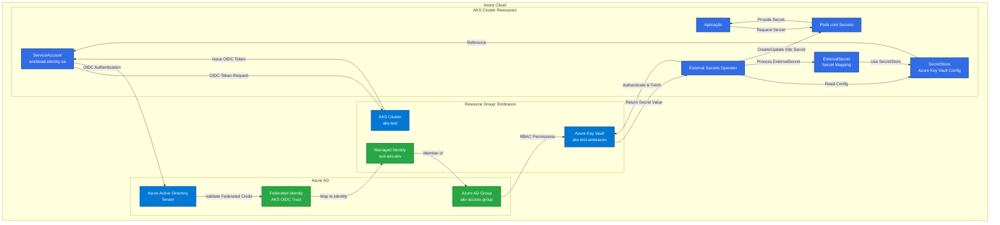
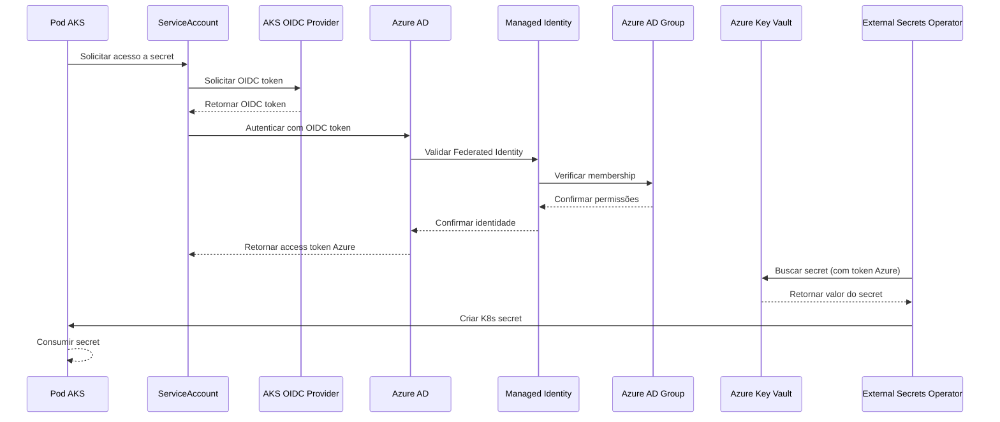

<p align="center">
  
</p>

# Azure Kubernetes Service (AKS) com Azure Key Vault

## 🏗️ Diagrama da Solução - AKS com Azure Key Vault



## 🔄 Fluxo de Autenticação Nativo Azure



## 📋 Componentes da Solução AKS

### **Componentes Azure Nativos**
| Componente | Propósito | Configuração |
|-----------|---------|---------------|
| **AKS Cluster** | Cluster Kubernetes gerenciado | Enhanced com OIDC habilitado |
| **Azure Key Vault** | Armazenamento central de secrets | RBAC habilitado |
| **Managed Identity** | Identidade para workloads AKS | `test-aks-akv` |
| **Azure AD Group** | Controle de acesso agrupado | `akv-access-group` |
| **Federated Credentials** | Confiança OIDC com AKS | Trust relationship nativo |

### **Componentes Kubernetes**
| Componente | Propósito | Configuração |
|-----------|---------|---------------|
| **External Secrets Operator** | Sincronização de secrets | Instalado via Helm |
| **ServiceAccount** | Identidade de workload | Anotações Azure configuradas |
| **SecretStore** | Configuração de conexão | Referência ao Key Vault |
| **ExternalSecret** | Mapeamento de secrets | Define quais secrets sincronizar |
| **K8s Secrets** | Secrets nativos do cluster | Criados automaticamente |

## 🔐 Configuração de Segurança Nativa Azure

### **Vantagens da Integração AKS + Azure Key Vault:**
✅ **Integração Nativa**: Solução completamente Azure
✅ **Workload Identity**: Autenticação sem secrets
✅ **RBAC Granular**: Controle via Azure AD Groups
✅ **Zero Secrets**: Tokens OIDC de curta duração
✅ **Auditoria Centralizada**: Logs no Azure Monitor
✅ **Gestão Simplificada**: Ferramentas Azure nativas

### **Modelo de Segurança:**
1. **AKS** gera tokens OIDC para ServiceAccounts
2. **Azure AD** valida tokens via Federated Credentials
3. **Managed Identity** mapeia para Azure AD Group
4. **Azure AD Group** possui permissões RBAC no Key Vault
5. **External Secrets Operator** sincroniza automaticamente

### **Controle de Acesso RBAC:**

#### **Nível Key Vault (Acesso Completo):**
```bash
# Conceder acesso a todos os secrets do cofre
az role assignment create \
  --assignee-object-id $(az ad group show --group "akv-access-group" --query id -o tsv) \
  --assignee-principal-type Group \
  --role "Key Vault Secrets User" \
  --scope $(az keyvault show --name "akv-test-embracon" --resource-group "Embracon" --query id -o tsv)
```

#### **Nível Secret (Acesso Granular):**
```bash
# Conceder acesso apenas a um secret específico
az role assignment create \
  --assignee-object-id $(az ad group show --group "akv-access-group" --query id -o tsv) \
  --assignee-principal-type Group \
  --role "Key Vault Secrets User" \
  --scope "/subscriptions/{subscription-id}/resourceGroups/{rg}/providers/Microsoft.KeyVault/vaults/{vault}/secrets/{secret-name}"
```

## 📚 Guias de Implementação

O **Guia completo para acessar segredos no Azure Key Vault (AKV) a partir do Azure Kubernetes Service (AKS)** está disponível em dois arquivos específicos para diferentes sistemas operacionais:

### **📖 Guias Disponíveis:**

#### **🐧 Para Linux/macOS:**
📁 **Arquivo:** [`README-Linux.md`](./README-Linux.md)
- Comandos específicos para sistemas Unix-like
- Scripts em Bash
- Variáveis de ambiente estilo Unix
- Exemplos com `export` e sintaxe Linux

#### **🪟 Para Windows:**
📁 **Arquivo:** [`README-Windows.md`](./README-Windows.md)
- Comandos específicos para Windows PowerShell
- Scripts em PowerShell
- Variáveis de ambiente estilo Windows (`$Env:`)
- Exemplos com sintaxe PowerShell

### **📋 Conteúdo dos Guias:**

Ambos os guias contêm o **mesmo processo completo**, adaptado para cada sistema operacional:

1. **🏷️ Configuração de Variáveis** - Definição de nomes e identificadores
2. **🏗️ Criação de Recursos Azure** - Resource Group, Managed Identity, Key Vault
3. **☁️ Configuração do AKS** - Cluster com OIDC habilitado
4. **🔄 Federação de Identidade** - Configuração de trust OIDC
5. **📦 External Secrets Operator** - Instalação e configuração
6. **🧑‍💻 ServiceAccount** - Criação com anotações Azure
7. **🏪 SecretStore** - Configuração de conexão com Key Vault
8. **🛂 Permissões RBAC** - Controle de acesso granular
9. **🔁 ExternalSecret** - Sincronização de secrets
10. **✅ Teste e Validação** - Verificação da solução

### **🎯 Escolha do Guia:**

- **Use `README-Linux.md`** se estiver trabalhando em:
  - Linux (Ubuntu, CentOS, etc.)
  - macOS
  - WSL (Windows Subsystem for Linux)
  - Cloud Shell (Bash)

- **Use `README-Windows.md`** se estiver trabalhando em:
  - Windows PowerShell
  - Windows PowerShell Core
  - Azure Cloud Shell (PowerShell)
  - Visual Studio Code com PowerShell

Ambos os guias levam ao **mesmo resultado final**: uma integração segura e funcional entre AKS e Azure Key Vault usando Workload Identity e External Secrets Operator.

## 🔗 Recursos Relacionados

- 📖 [Documentação oficial do Azure Workload Identity](https://azure.github.io/azure-workload-identity/)
- 🔧 [External Secrets Operator Documentation](https://external-secrets.io/)
- 🛡️ [Azure Key Vault RBAC Guide](https://docs.microsoft.com/en-us/azure/key-vault/general/rbac-guide)
- ☁️ [AKS OIDC Issuer Documentation](https://docs.microsoft.com/en-us/azure/aks/use-oidc-issuer)

---

<p align="center">
  <strong>🚀 Secret Management 🛡️</strong><br>
    <em>☁️ Azure Kubernetes Service</em>
</p>