<p align="center">
  
</p>

# OIDC no Oracle Cloud (OKE)

## 🏗️ Diagrama da Solução - OKE com Azure Key Vault

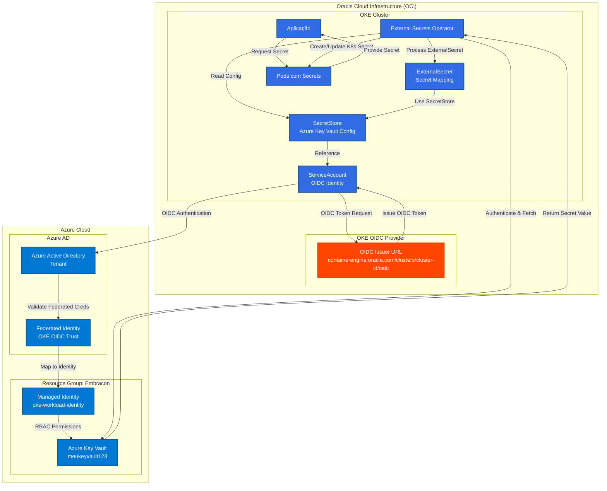
```mermaid
graph TB
    %% Oracle Cloud Infrastructure
    subgraph "Oracle Cloud Infrastructure (OCI)"
        subgraph "OKE Cluster"
            direction TB
            APP[Aplicação]
            ESO[External Secrets Operator]
            SS[SecretStore<br/>Azure Key Vault Config]
            ES[ExternalSecret<br/>Secret Mapping]
            SA[ServiceAccount<br/>OIDC Identity]
            PODS[Pods com Secrets]
        end
        
        subgraph "OKE OIDC Provider"
            OIDC_OKE["OIDC Issuer URL<br/>containerengine.oracle.com/clusters/cluster-id/oidc"]
        end
    end

    %% Azure Cloud
    subgraph "Azure Cloud"
        subgraph "Resource Group: Embracon"
            AKV[Azure Key Vault<br/>meukeyvault123]
            MI_OKE[Managed Identity<br/>oke-workload-identity]
        end
        
        subgraph "Azure AD"
            AAD[Azure Active Directory<br/>Tenant]
            FIC_OKE[Federated Identity<br/>OKE OIDC Trust]
        end
    end

    %% Cross-Cloud Connections
    SA -->|OIDC Token Request| OIDC_OKE
    OIDC_OKE -->|Issue OIDC Token| SA
    SA -->|OIDC Authentication| AAD
    AAD -->|Validate Federated Creds| FIC_OKE
    FIC_OKE -->|Map to Identity| MI_OKE
    MI_OKE -->|RBAC Permissions| AKV
    
    %% Kubernetes Workflow
    APP -->|Request Secret| PODS
    ESO -->|Read Config| SS
    SS -->|Reference| SA
    ES -->|Use SecretStore| SS
    ESO -->|Process ExternalSecret| ES
    ESO -->|Authenticate & Fetch| AKV
    AKV -->|Return Secret Value| ESO
    ESO -->|Create/Update K8s Secret| PODS
    PODS -->|Provide Secret| APP

    %% Styling
    classDef oracle fill:#ff4500,stroke:#cc3400,stroke-width:2px,color:#fff
    classDef azure fill:#0078d4,stroke:#005a9e,stroke-width:2px,color:#fff
    classDef k8s fill:#326ce5,stroke:#1a5490,stroke-width:2px,color:#fff
    classDef secret fill:#ff6b35,stroke:#cc5429,stroke-width:2px,color:#fff

    class OIDC_OKE oracle
    class AKV,MI_OKE,AAD,FIC_OKE azure
    class APP,ESO,SS,ES,SA,PODS k8s
```

## 🔄 Fluxo de Autenticação Cross-Cloud

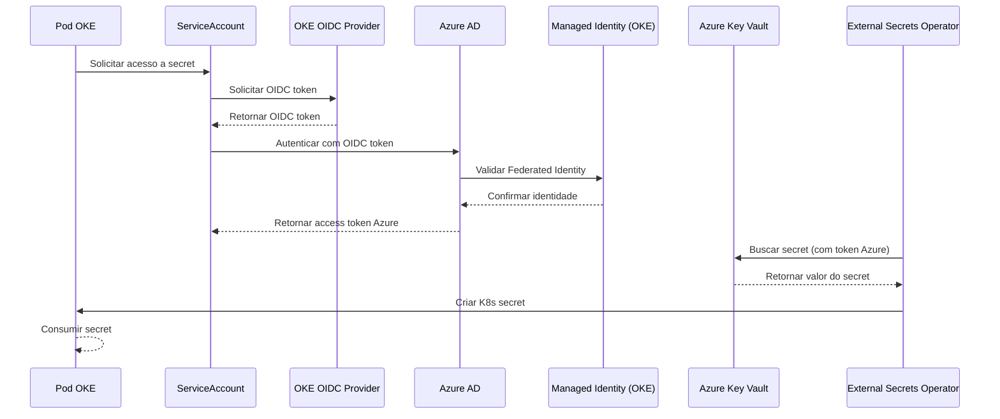
```mermaid
sequenceDiagram
    participant Pod as Pod OKE
    participant SA as ServiceAccount
    participant OKE as OKE OIDC Provider
    participant AAD as Azure AD
    participant MI as Managed Identity (OKE)
    participant AKV as Azure Key Vault
    participant ESO as External Secrets Operator

    Pod->>SA: Solicitar acesso a secret
    SA->>OKE: Solicitar OIDC token
    OKE-->>SA: Retornar OIDC token
    SA->>AAD: Autenticar com OIDC token
    AAD->>MI: Validar Federated Identity
    MI-->>AAD: Confirmar identidade
    AAD-->>SA: Retornar access token Azure
    ESO->>AKV: Buscar secret (com token Azure)
    AKV-->>ESO: Retornar valor do secret
    ESO->>Pod: Criar K8s secret
    Pod-->>Pod: Consumir secret
```

## 📋 Componentes da Solução OKE

### **Componentes Oracle Cloud**
| Componente | Propósito | Configuração |
|-----------|---------|---------------|
| **OKE Cluster** | Cluster Kubernetes gerenciado | Enhanced cluster com OIDC habilitado |
| **OIDC Provider** | Provedor de identidade OKE | `https://containerengine.oracle.com/clusters/{cluster-id}/oidc` |
| **ServiceAccount** | Identidade de workload | Configurado com anotações Azure |
| **External Secrets Operator** | Sincronização de secrets | Instalado via Helm ou manifests |

### **Componentes Azure (Cross-Cloud)**
| Componente | Propósito | Configuração |
|-----------|---------|---------------|
| **Azure Key Vault** | Armazenamento de secrets | `meukeyvault123.vault.azure.net` |
| **Managed Identity (OKE)** | Identidade para workloads OKE | `oke-workload-identity` |
| **Federated Credentials** | Confiança OIDC com OKE | Trust relationship com OKE OIDC issuer |
| **RBAC Roles** | Controle de acesso | Key Vault Secrets User ou granular |

### **Integração Kubernetes**
| Componente | Propósito | Configuração |
|-----------|---------|---------------|
| **SecretStore** | Configuração de conexão | Referência ao ServiceAccount e vault |
| **ExternalSecret** | Mapeamento de secrets | Define quais secrets buscar |
| **K8s Secrets** | Secrets nativos do cluster | Criados automaticamente pelo ESO |

## 🔐 Configuração de Segurança Cross-Cloud

### **Vantagens da Integração OKE + Azure Key Vault:**
✅ **Centralização**: Secrets centralizados no Azure Key Vault
✅ **Cross-Cloud**: Acesso seguro entre Oracle e Azure
✅ **Zero Secrets**: Nenhum secret armazenado no cluster OKE
✅ **OIDC Nativo**: Usa OIDC provider do próprio OKE
✅ **RBAC Granular**: Controle fino de acesso por workload
✅ **Auditoria**: Logs centralizados no Azure Monitor

### **Fluxo de Segurança:**
1. **OKE** gera tokens OIDC para workloads
2. **Azure AD** valida tokens via Federated Credentials
3. **Managed Identity** mapeia identidade OKE para Azure
4. **RBAC** controla acesso granular ao Key Vault
5. **External Secrets Operator** sincroniza secrets automaticamente

No Oracle Kubernetes Engine (OKE), o processo de configuração do OIDC é diferente do AKS, pois o OKE não expõe um endpoint OIDC por padrão para autenticação de workloads. 

Para a utilização do OIDC é necessário que o cluster seja do tipo `ENHANCED_CLUSTER` e deve-se ativar o `Open Id Connect Discovery`.

## Requisitos principais antes de habilitar o OIDC no OKE

- Disponível apenas em clusters com Kubernetes versão 1.21 ou superior.
- Compatível exclusivamente com clusters nativos de VCN, ou seja, clusters cujos endpoints da API Kubernetes estão em uma sub-rede do seu próprio VCN. Consulte a [documentação de migração para clusters nativos de VCN](https://docs.oracle.com/en-us/iaas/Content/ContEng/Tasks/contengmovingvcnnative.htm).
- Suportado em nós gerenciados, nós virtuais e nós autogerenciados.
- Permitido somente em clusters do tipo *enhanced* (não disponível para clusters do tipo *basic*).

## Como fazer login usando o OCI CLI

Para autenticar-se e usar o OCI CLI, siga os passos abaixo:

1. **Instale o OCI CLI**  
    Siga as instruções oficiais:  
    https://docs.oracle.com/en-us/iaas/Content/API/SDKDocs/cliinstall.htm

2. **Configure o CLI**  
    Execute o comando abaixo e siga o assistente interativo:
    ```sh
    oci setup config
    ```
    Você precisará informar:
    - OCID do usuário
    - OCID do tenancy
    - Região
    - Caminho para a chave privada

3. **Faça login**  
    O OCI CLI utiliza as credenciais configuradas no arquivo `~/.oci/config`. Após configurar, você já estará autenticado para executar comandos.

4. **Teste a autenticação**  
    Por exemplo, para listar os compartimentos:
    ```sh
    oci iam compartment list --all
    ```
    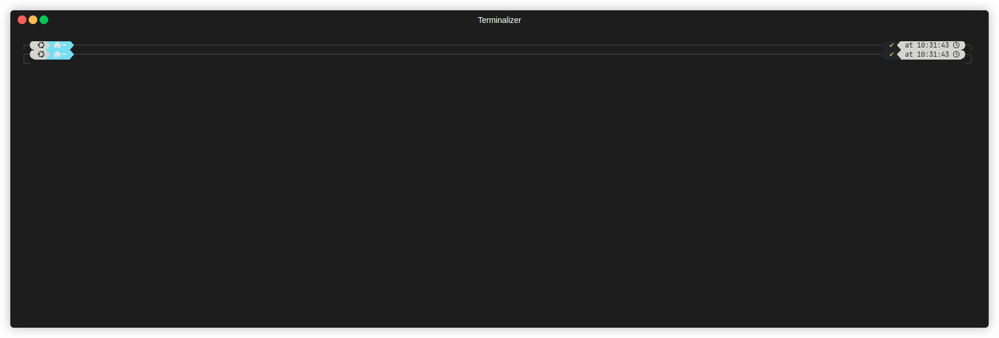

> **Nota:** O login via OIDC é utilizado para workloads no cluster OKE, enquanto o OCI CLI usa autenticação baseada em chave.

## Como criar um cluster OKE via Console

### Abra o menu de navegação e selecione **Developer Services**. Em **Containers & Artifacts**, clique em **Kubernetes Clusters (OKE)**.

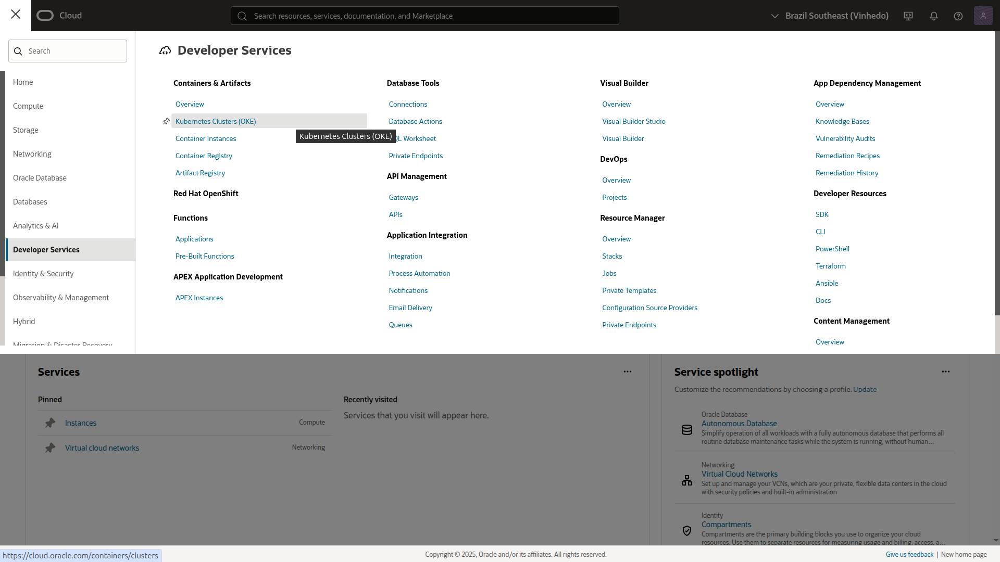

### Clique em `Create Cluster`

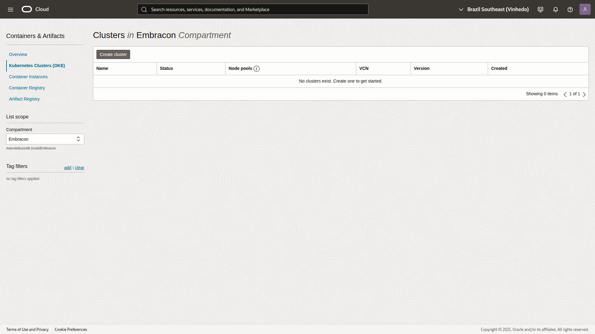

### Escolha em `Quick create`


> Nota
>
> O Quick create irá criar automaticamente:
> - Virtual Cloud Network (VCN)
> - Internet Gateway (IG)
> - NAT Gateway (NAT)
> - Service Gateway (SGW)
> - Kubernetes cluster
> - Kubernetes worker node(s) e node pool  
> Esses recursos são provisionados para facilitar a criação rápida do cluster OKE.

### Coloque o nome e escolha as definições necessárias

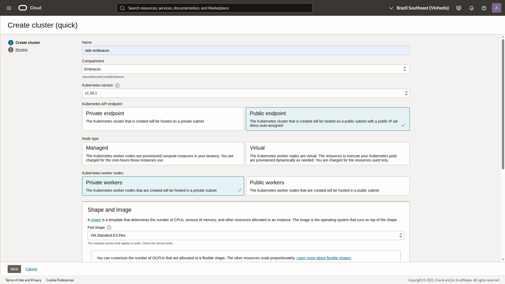

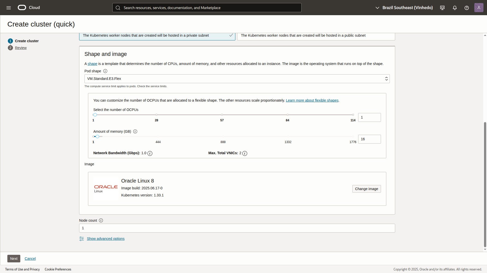

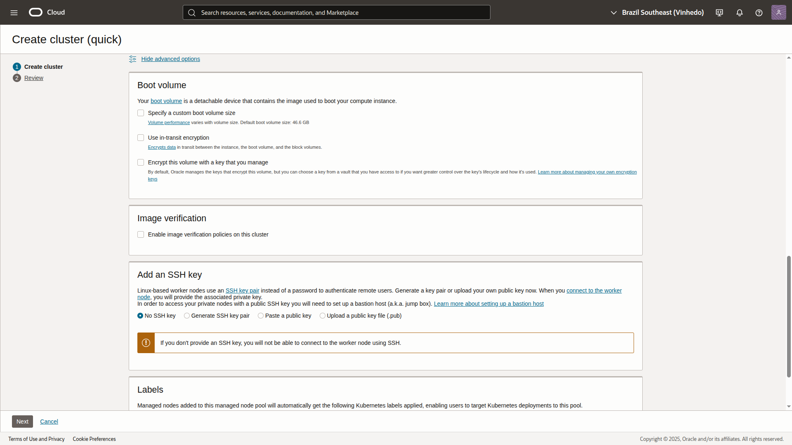

### Clique em `Next`

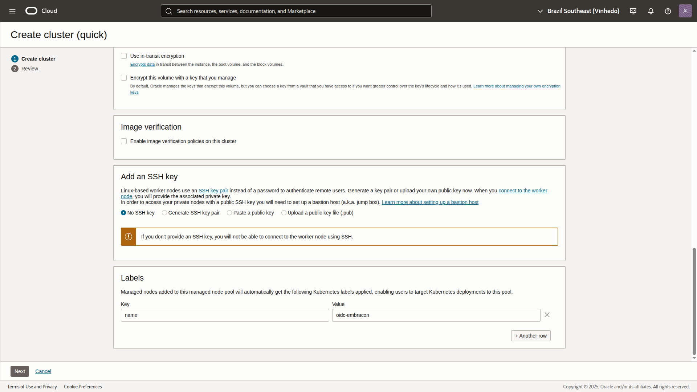

### Verifique e clique em `Create cluster`

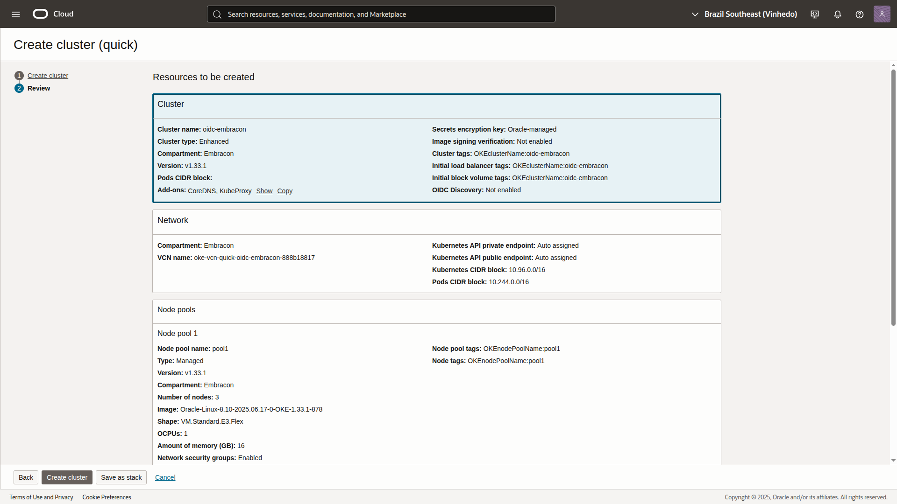

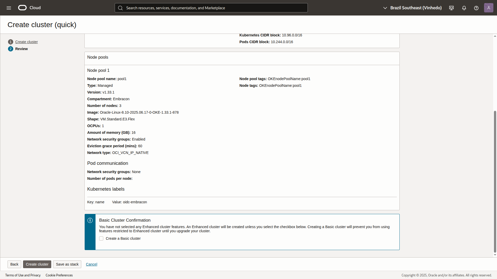

### Aguarde o provisionamento e clique em `Close`

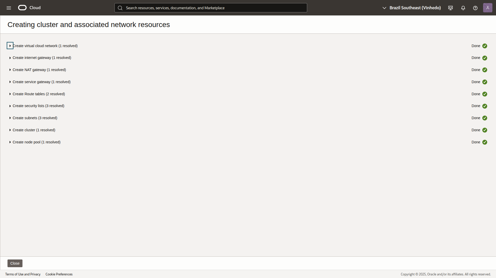

### Aguarde o `Cluster status` virar `Active`


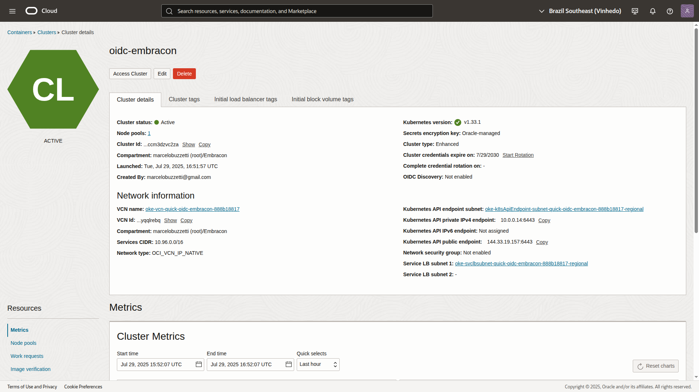

> Nota
>
> Observer que o OIDC Discovery está como `Not enabled`

### Anote o OCID do cluster.

## Atualizando um cluster para o tipo `ENHANCED_CLUSTER`

### Via Cli

```bash
oci ce cluster update --cluster-id <cluster-ocid> --type ENHANCED_CLUSTER
```


### Via Console

1. Abra o menu de navegação e selecione **Developer Services**. Em **Containers & Artifacts**, clique em **Kubernetes Clusters (OKE)**.
2. Selecione o compartimento que contém o cluster desejado.
3. Na página de clusters, clique no nome do cluster do tipo *Basic* que você deseja atualizar para *Enhanced*.
4. Na página de detalhes do cluster, verifique que o tipo está como **Cluster type: Basic**.
5. Clique em **Upgrade to Enhanced Cluster**.
6. Confirme a opção **Upgrade to Enhanced Cluster** para prosseguir com a atualização.  
  > **Atenção:** Após a atualização, não é possível reverter o cluster para o tipo *Basic*.
7. Clique em **Upgrade** para iniciar o processo.
8. Após a conclusão, a página de detalhes do cluster exibirá **Cluster type: Enhanced**.

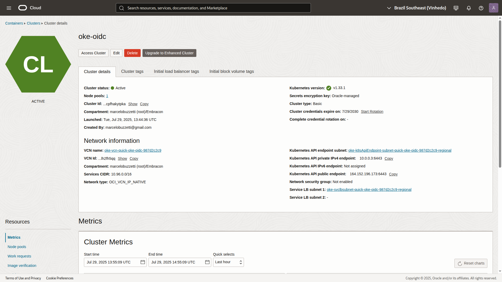

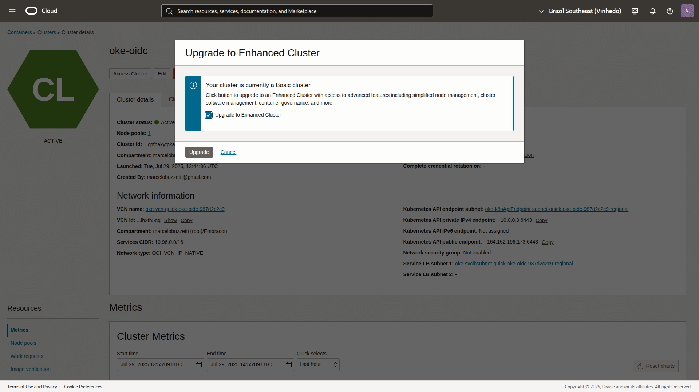

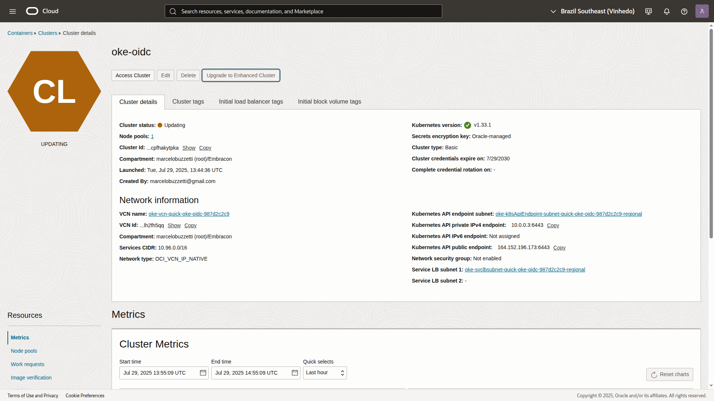


## Como ativar o Open Id Connect Discovery via Console

### Clique em editar

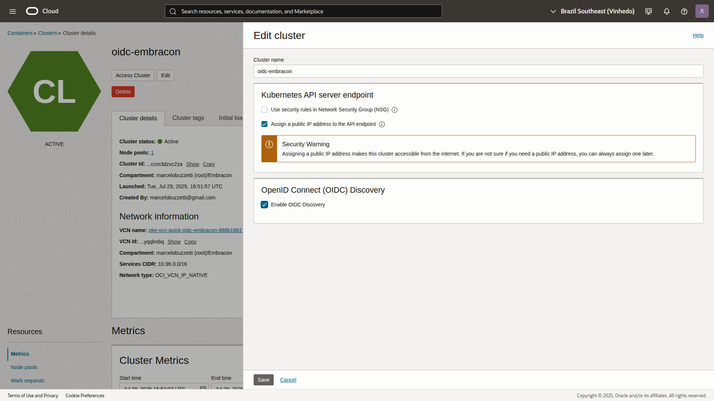

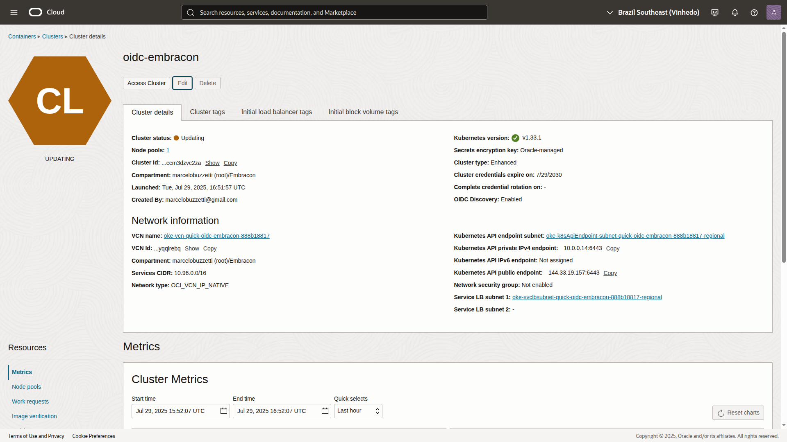

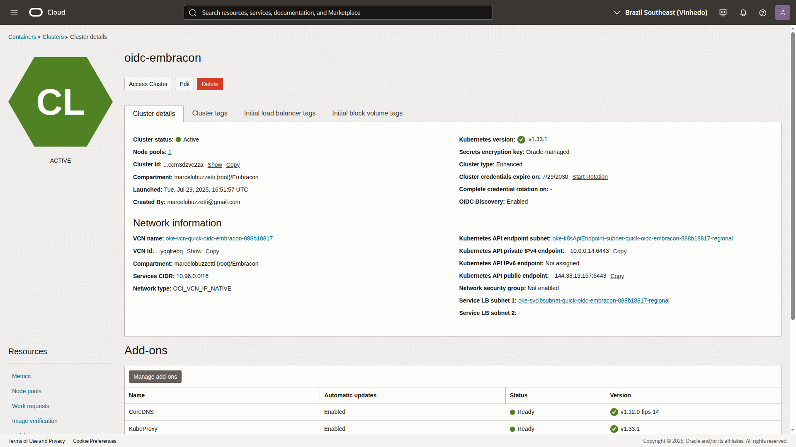

## Como ativar o Open Id Connect Discovery via CLI

1. Crie o arquivo [cluster-enable-oidc.json](cluster-enable-oidc.json) e coloque o seguinte conteúdo:

```json
{
  "options": {
    "openIdConnectDiscovery": {
      "isOpenIdConnectDiscoveryEnabled": true
    }
  }
}
```

2. Para atualizar o cluster, execute o seguinte comando :
```bash
oci ce cluster update --cluster-id <CLUSTER_OCID> --from-json file://cluster-enable-oidc.json
```
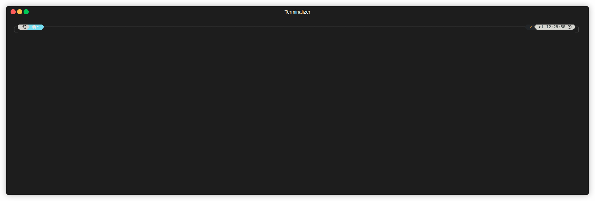

>Nota
>
> Substitua o <CLUSTER_OCID> pelo OCDI do Cluster
> Caso apareça `WARNING: Updates to options and freeform-tags and defined-tags and image-policy-config will replace any existing values. Are you sure you want to continue? [y/N]:` digite y

3. Pegue o `open-id-connect-discovery-endpoint` com o comando:
```bash
oci ce cluster get --cluster-id <CLUSTER_OCID> | grep -B1 'open-id-connect-discovery'
```

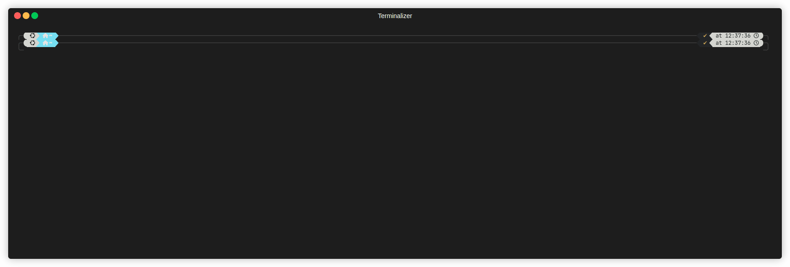
>Nota
>
> Substitua o <CLUSTER_OCID> pelo OCDI do Cluster

## Acessar o AKV a partir de um OKE

### 1. Crie uma Federated Credential em uma Managed Identity na Azure

```sh
az identity federated-credential create \
  --name "oke-federated-credential" \
  --identity-name "<NOME_DA_MANAGED_IDENTITY>" \
  --resource-group "<RESOURCE_GROUP>" \
  --issuer "<open-id-connect-discovery-endpoint>" \
  --subject "system:serviceaccount:<NAMESPACE>:<SERVICE_ACCOUNT_NAME>"
```

### 2. Conecte-se ao cluster criado

```bash
oci ce cluster create-kubeconfig --cluster-id "$CLUSTER_OCID" --file $HOME/.kube/config --region "$REGION" --token-version 2.0.0 --kube-endpoint PUBLIC_ENDPOINT
```

### 3. Instale o External Secrets Operator

```bash
helm repo add external-secrets https://charts.external-secrets.io
helm install external-secrets external-secrets/external-secrets -n external-secrets --create-namespace
```

### 4. Crie a ServiceAccount no Kubernetes

Crie um arquivo `service-account.yaml` com as anotações necessárias (client-id, tenant-id).
(Substitua pelos valores das variáveis que você obteve anteriormente):

```yaml
apiVersion: v1
kind: ServiceAccount
metadata:
  name: workload-identity-sa
  annotations:
    azure.workload.identity/client-id: "<CLIENT_ID>"
    azure.workload.identity/tenant-id: "<TENANT_ID>"
```

> **Nota:**  
> - Substitua `<CLIENT_ID>` pelo valor da variável `$CLIENT_ID`.
> - Substitua `<TENANT_ID>` pelo valor da variável `$TENANT_ID`.

```bash
kubectl apply -f service-account.yaml
```

### 5. Crie o Secret Store

Crie um arquivo `secret-store.yaml` com o seguinte conteúdo, substituindo os valores conforme necessário:

```yaml
apiVersion: external-secrets.io/v1
kind: SecretStore
metadata:
  name: akv-secret-manager-store
  namespace: <namespace>
spec:
  provider:
    azurekv:
      authType: WorkloadIdentity
      vaultUrl: "<KEY_VAULT_URL>"
      serviceAccountRef:
        name: workload-identity-sa
```

> **Nota:**  
> - Substitua `<namespace>` pelo namespace desejado no cluster Kubernetes (por exemplo, `default` se estiver usando o namespace padrão).
> - Substitua `<KEY_VAULT_URL>` pelo valor da variável `$KEY_VAULT_URL`.

Aplique o recurso:

```bash
kubectl apply -f secret-store.yaml
```

### 6. Conceda Permissões no Key Vault

No portal do Azure ou via CLI, atribua a função **Usuário de Segredos do Cofre de Chaves** ao grupo `$SEU_GROUP_NAME` no Key Vault para ter acesso a todos os Segredos do Cofre.

Caso queira dar acesso somente a um segredo específico, vá até o segredo, clique no mesmo, acesse Controle de acesso IAM e adicione a função **Usuário de Segredos do Cofre de Chaves** ao grupo `$SEU_GROUP_NAME`.

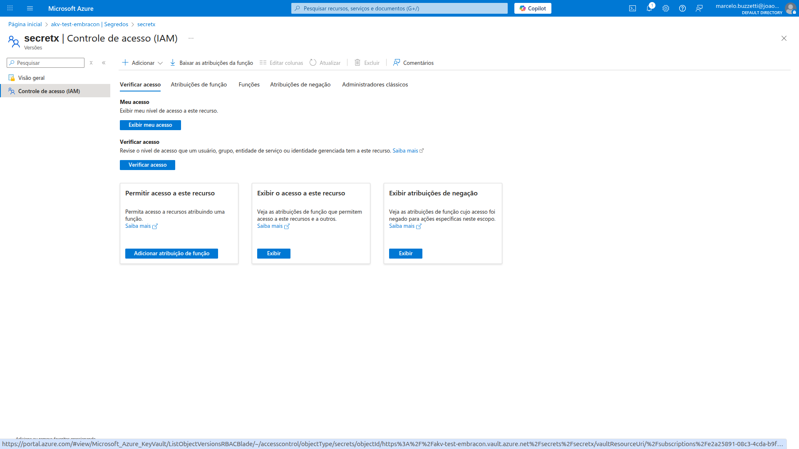

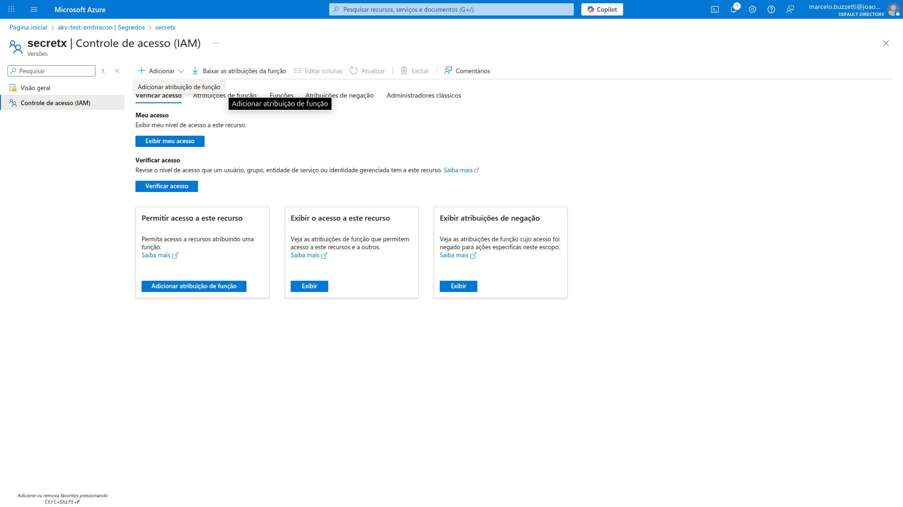

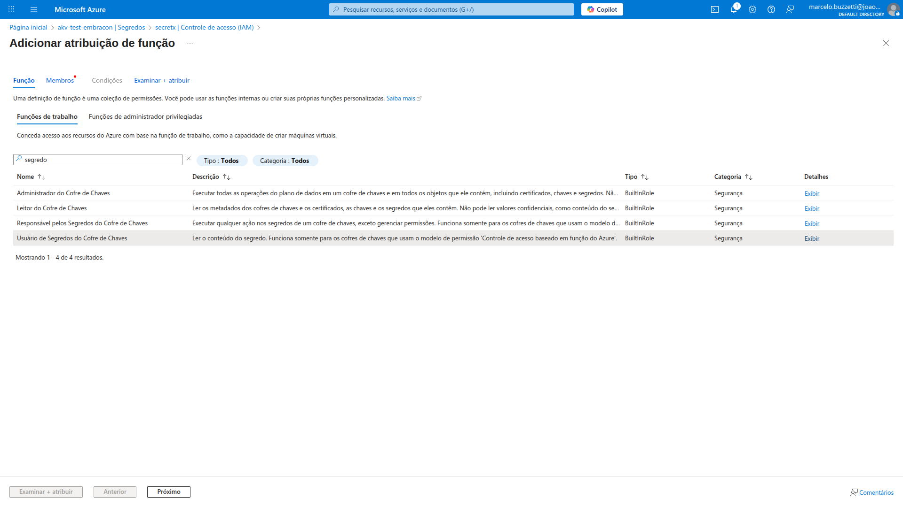

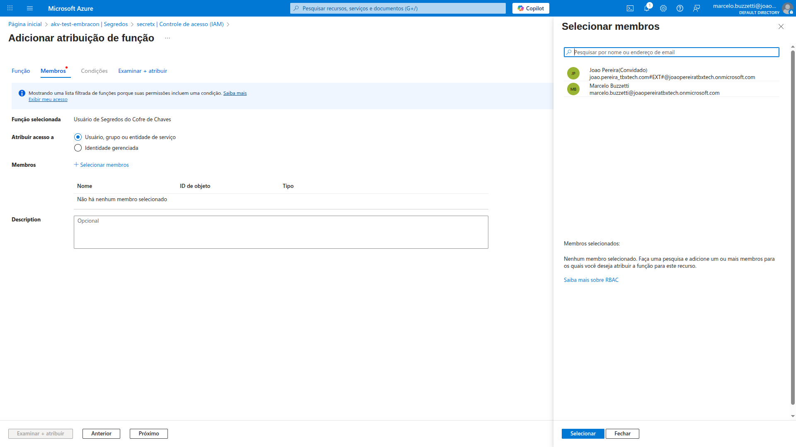

### 7. Crie o External Secret

Crie um arquivo `external-secret.yaml` com o seguinte conteúdo, substituindo os valores conforme necessário:

```yaml
apiVersion: external-secrets.io/v1
kind: ExternalSecret
metadata:
  name: akv-external-secret-manager-store
  namespace: <namespace>
spec:
  refreshInterval: 1h
  secretStoreRef:
    name: akv-secret-manager-store
    kind: SecretStore
  target:
    name: my-app-secret-k8s-akv
    creationPolicy: Owner
  data:
    - secretKey: my-akv-secret-key
      remoteRef:
        key: <nome-do-segredo-no-akv>
```

> **Nota:**  
> - Substitua `<namespace>` pelo namespace desejado no cluster Kubernetes (por exemplo, `default` se estiver usando o namespace padrão).
> - Substitua `nome-do-segredo-no-akv` pelo nome do segredo existente no Key Vault que deseja sincronizar.
> - O campo `secretKey` define o nome da chave no Secret do Kubernetes.

Aplique o recurso:

```bash
kubectl apply -f external-secret.yaml
```

---

<p align="center">
  <strong>🚀 Secret Management 🛡️</strong><br>
    <em>☁️ Oracle Cloud - OKE</em>
</p>
