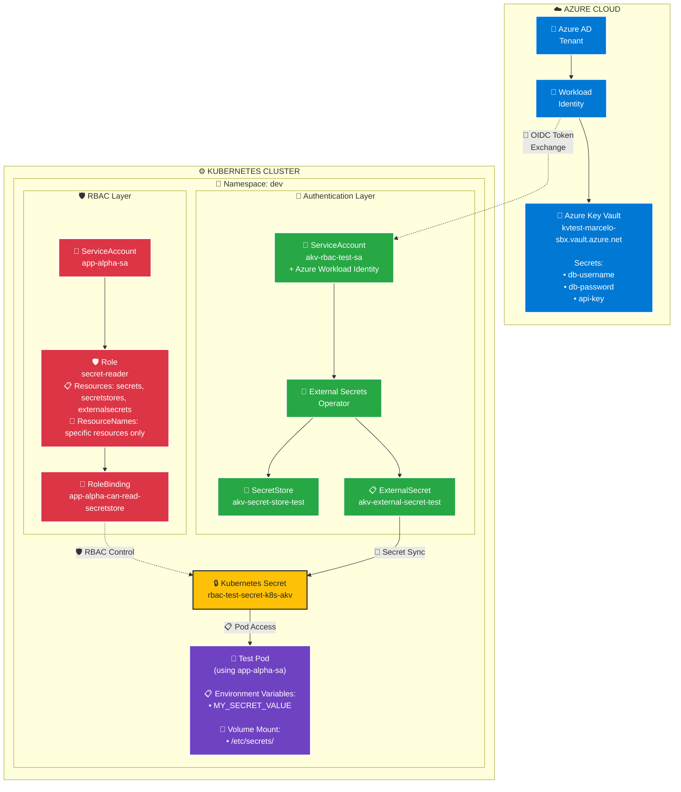

# RBAC para External Secrets Operator com Azure Key Vault

Este diretório contém a configuração completa de RBAC (Role-Based Access Control) para integração entre Kubernetes, External Secrets Operator e Azure Key Vault.

## 📋 Arquitetura de Solução



### 🔐 **Fluxo de Segurança:**

1. **Azure AD** autentica via **Workload Identity** (sem passwords)
2. **External Secrets Operator** usa `akv-rbac-test-sa` para acessar **Azure Key Vault**
3. **Kubernetes RBAC** controla acesso granular via Role `secret-reader`  
4. **Pod** usa `app-alpha-sa` para consumir secrets específicos
5. **Least Privilege** - Acesso APENAS ao secret autorizado

### 📊 **Componentes e Responsabilidades:**

| Componente | Responsabilidade | Status |
|------------|------------------|--------|
| **Azure Key Vault** | Armazenar secrets seguros | ✅ rbac-test-embracon |
| **Workload Identity** | Autenticação sem senha | ✅ Client/Tenant ID |
| **akv-rbac-test-sa** | Acesso ao Azure KV | ✅ Annotations Azure |
| **app-alpha-sa** | Identidade da aplicação | ✅ Labels aplicação |
| **SecretStore** | Configuração do provider | ✅ Status: Valid |
| **ExternalSecret** | Definição dos secrets | ✅ Status: SecretSynced |
| **secret-reader** | Permissões granulares | ✅ resourceNames específicos |
| **RoleBinding** | Vinculação SA→Role | ✅ app-alpha-sa + secret-reader |

## 🗂️ Estrutura de Arquivos

| Arquivo | Descrição |
|---------|-----------|
| `README.md` | 📚 Documentação principal completa com diagrama de solução |
| `DEPLOYMENT-GUIDE.md` | 🚀 Guia passo a passo testado |
| `namespace.yaml` | 📂 Criação do namespace dev |
| `service-account-app-alpha.yaml` | 👤 SA para aplicações acessarem secrets |
| `service-account-akv.yaml` | 🔐 SA com Azure Workload Identity para AKV |
| `role-secretstore-reader.yaml` | 🛡️ Permissões granulares para secrets específicos |
| `rolebinding.yaml` | 🔗 Vincula SA da aplicação ao Role |
| `secret-store.yaml` | 🏪 Configuração do SecretStore do AKV |
| `external-secret.yaml` | 🔄 Configuração do ExternalSecret |
| `pod.yaml` | 🧪 Pod de teste para validar acesso aos secrets |
| `helm-chart/` | 🎡 **Helm Chart completo para deploy automatizado** |

## 🔐 Service Accounts

### 1. Service Account da Aplicação (`app-alpha-sa`)

**Propósito**: Permite que pods da aplicação acessem secrets através do External Secrets Operator.

```yaml
apiVersion: v1
kind: ServiceAccount
metadata:
  name: app-alpha-sa
  namespace: dev
  labels:
    app: app-alpha
    environment: dev
```

### 2. Service Account para Azure KV (`akv-rbac-test-sa`)

**Propósito**: Configurada com Azure Workload Identity para acesso direto ao Azure Key Vault.

```yaml
apiVersion: v1
kind: ServiceAccount
metadata:
  name: akv-rbac-test-sa
  namespace: dev
  annotations:
    azure.workload.identity/client-id: 3504d333-babd-4b86-8161-18ddacd85e84
    azure.workload.identity/tenant-id: 38270d4e-aea5-4430-b2c7-1deb696ac290
```

## 🛡️ RBAC Configuration

### Role: `secret-reader`

Define permissões específicas para acessar **APENAS** o secret autorizado. Implementa o **Princípio do Menor Privilégio**:

```yaml
apiVersion: rbac.authorization.k8s.io/v1
kind: Role
metadata:
  name: secret-reader
  namespace: dev
rules:
# Permissão para acessar APENAS o secret específico que você definiu
- apiGroups: [""]
  resources: ["secrets"]
  resourceNames: ["rbac-test-secret-k8s-akv"]  # APENAS este secret
  verbs: ["get", "watch", "list"]
```

> ⚠️ **Importante**: A SA pode acessar APENAS o secret específico listado em `resourceNames`. Outros secrets são **negados** automaticamente.

### RoleBinding: `app-alpha-can-read-secretstore`

Vincula a Service Account da aplicação ao Role:

```yaml
apiVersion: rbac.authorization.k8s.io/v1
kind: RoleBinding
metadata:
  name: app-alpha-can-read-secretstore
  namespace: dev
subjects:
- kind: ServiceAccount
  name: app-alpha-sa
  namespace: dev
roleRef:
  kind: Role
  name: secret-reader  # ← Role atualizado
  apiGroup: rbac.authorization.k8s.io
```

## 🔧 Adicionando Mais Secrets Autorizados

Para autorizar acesso a **outros secrets específicos**, edite o Role adicionando ao `resourceNames`:

```yaml
rules:
- apiGroups: [""]
  resources: ["secrets"]
  resourceNames: 
    - "rbac-test-secret-k8s-akv"    # Secret atual
    - "app-database-secret"         # Novo secret autorizado
    - "app-api-keys"                # Outro secret autorizado
  verbs: ["get", "watch", "list"]
```

> ⚡ **Dica**: Sempre use nomes específicos em `resourceNames` para manter o **Princípio do Menor Privilégio**.

## 🚀 Deploy

### 0. Criar namespace (se não existir):

```bash
# Criar o namespace dev
kubectl create namespace dev

# Ou aplicar via YAML
kubectl apply -f namespace.yaml
```

### 1. Aplicar as configurações em ordem:

```bash
# 1. Namespace
kubectl apply -f namespace.yaml

# 2. Service Accounts
kubectl apply -f service-account-app-alpha.yaml
kubectl apply -f service-account-akv.yaml

# 3. RBAC
kubectl apply -f role-secretstore-reader.yaml
kubectl apply -f rolebinding.yaml

# 4. External Secrets
kubectl apply -f secret-store.yaml
kubectl apply -f external-secret.yaml
```

### 2. Aplicar todos os arquivos de uma vez:

```bash
# ⚠️ Certifique-se que o namespace existe primeiro
kubectl apply -f namespace.yaml
kubectl apply -f .
```

## 🎡 Deploy via Helm (Recomendado)

Para implantação mais robusta e gerenciada, use o Helm Chart incluído:

### ⚠️ Pré-requisitos:

```bash
# 1. Instalar o External Secrets Operator (CRDs necessários)
helm repo add external-secrets https://charts.external-secrets.io
helm repo update
helm install external-secrets external-secrets/external-secrets -n external-secrets --create-namespace
```

### Instalação Básica com Helm:

```bash
# 2. Instalar nossa solução RBAC
helm install external-secrets-rbac ./helm-chart

# Upgrade
helm upgrade external-secrets-rbac ./helm-chart

# Uninstall
helm uninstall external-secrets-rbac
```

### Customização por Ambiente:

```bash
# Desenvolvimento
helm install dev-secrets ./helm-chart \
  --namespace dev \
  --create-namespace

# Produção  
helm install prod-secrets ./helm-chart \
  --namespace production \
  --create-namespace \
  --values ./helm-chart/values-prod.yaml
```

### Vantagens do Helm:

- ✅ **Templating**: Reutilização entre ambientes
- ✅ **Versionamento**: Controle de releases
- ✅ **Rollback**: Reverter mudanças facilmente
- ✅ **Upgrade**: Atualizações gerenciadas
- ✅ **Dry-run**: Testar antes de aplicar

> 📖 **Documentação completa**: Veja `./helm-chart/README.md` para detalhes

## 🧪 Testes e Validação

### 1. Verificar recursos criados:

```bash
# Verificar se o namespace foi criado
kubectl get namespace dev

# Verificar Service Accounts
kubectl get serviceaccounts -n dev

# Verificar RBAC
kubectl get role,rolebinding -n dev

# Verificar External Secrets
kubectl get secretstores,externalsecrets -n dev
```

### 2. Testar permissões RBAC (Princípio do Menor Privilégio):

```bash
# ✅ Testar acesso ao SECRET ESPECÍFICO (deve retornar "yes")
kubectl auth can-i get secret/rbac-test-secret-k8s-akv --as=system:serviceaccount:dev:app-alpha-sa -n dev

# ❌ Testar acesso GERAL a secrets (deve retornar "no")
kubectl auth can-i get secrets --as=system:serviceaccount:dev:app-alpha-sa -n dev

# ❌ Testar acesso a OUTROS secrets (deve retornar "no")
kubectl create secret generic outro-secret --from-literal=key=valor -n dev
kubectl auth can-i get secret/outro-secret --as=system:serviceaccount:dev:app-alpha-sa -n dev
```

> 🔒 **Resultado esperado**: Apenas o secret específico `rbac-test-secret-k8s-akv` deve retornar "yes". Todos os outros devem ser "no".

### 3. Testar consumo de secrets no Pod:

```bash
# Aplicar o pod de teste
kubectl apply -f pod.yaml

# Verificar status do pod
kubectl get pod test-pod -n dev

# Ver logs do pod (deve mostrar o secret via ENV e arquivo)
kubectl logs test-pod -n dev

# Executar comando dentro do pod para testar
kubectl exec -it test-pod -n dev -- /bin/sh

# Dentro do pod, testar acesso:
# echo $MY_SECRET_VALUE                    # Via environment variable
# cat /etc/secrets/my-akv-secret-key       # Via volume mount
# ls -la /etc/secrets/                     # Ver arquivos de secrets
```

### 4. Verificar sincronização de secrets:

```bash
# Verificar status do ExternalSecret
kubectl get externalsecret -n dev -o wide

# Verificar se o secret foi criado
kubectl get secrets -n dev

# Ver detalhes do secret (sem mostrar valores)
kubectl describe secret rbac-test-secret-k8s-akv -n dev
```

### 5. Logs de troubleshooting:

```bash
# Logs do External Secrets Operator
kubectl logs -n external-secrets-system deployment/external-secrets

# Descrever ExternalSecret para ver eventos
kubectl describe externalsecret akv-external-secret-test -n dev
```

## 📊 Status de Validação

| Componente | Status | Descrição |
|------------|--------|-----------|
| ✅ Namespace | **Criado** | `dev` com labels apropriadas |
| ✅ Service Accounts | **Criadas** | `app-alpha-sa` e `akv-rbac-test-sa` |
| ✅ RBAC Granular | **Configurado** | Role `secret-reader` com acesso específico |
| ✅ Least Privilege | **Implementado** | Acesso APENAS ao secret autorizado |
| ✅ ExternalSecret | **Sincronizado** | Status: `SecretSynced: True` |
| ✅ Secret K8s | **Criado** | `rbac-test-secret-k8s-akv` disponível |
| ✅ **Helm Chart** | **Deployed** | **Revisão 3 - Funcionando 100%** |

### 🔒 Testes de Segurança Validados:

| Teste | Resultado | Status |
|-------|-----------|--------|
| `get secret/rbac-test-secret-k8s-akv` | ✅ **YES** | Autorizado |
| `get secrets` | ❌ **NO** | Negado (conforme esperado) |
| `get secret/outro-secret` | ❌ **NO** | Negado (conforme esperado) |

### 🧪 Testes de Consumo Validados:

| Método | Status | Resultado |
|--------|--------|-----------|
| **Environment Variable** | ✅ **SUCCESS** | `MY_SECRET_VALUE=secret` |
| **Volume Mount** | ✅ **SUCCESS** | `/etc/secrets/my-akv-secret-key=secret` |
| **Pod com SA específica** | ✅ **SUCCESS** | `app-alpha-sa` funcionando |

### 🎡 Helm Chart Validado:

| Operação | Status | Comando |
|----------|--------|---------|
| **Install** | ✅ **SUCCESS** | `helm install external-secrets-rbac ./helm-chart` |
| **Upgrade** | ✅ **SUCCESS** | `helm upgrade external-secrets-rbac ./helm-chart` |
| **Test Pod** | ✅ **SUCCESS** | `--set testPod.create=true` |
| **Rollback** | ✅ **AVAILABLE** | `helm rollback external-secrets-rbac 1` |

## 🔍 Troubleshooting

### Problemas Comuns:

#### 1. ExternalSecret com status "SecretSyncError"
```bash
# Verificar logs do operator
kubectl logs -n external-secrets -l app.kubernetes.io/name=external-secrets

# Verificar configuração do SecretStore
kubectl describe secretstore akv-secret-store-test -n dev

# Se o SecretStore não é encontrado, reiniciar o operator
kubectl delete pod -n external-secrets -l app.kubernetes.io/name=external-secrets
```

#### 2. Permissões RBAC negadas
```bash
# Verificar se RoleBinding está correto
kubectl describe rolebinding app-alpha-can-read-secretstore -n dev

# Testar permissões específicas
kubectl auth can-i get secret/rbac-test-secret-k8s-akv --as=system:serviceaccount:dev:app-alpha-sa -n dev
```

#### 3. Azure Workload Identity não funcionando
```bash
# Verificar annotations da SA
kubectl get serviceaccount akv-rbac-test-sa -n dev -o yaml

# Verificar se o cluster tem Workload Identity habilitado
kubectl get nodes -o wide
```

#### 4. Helm Chart com erro de versão da API
```bash
# Verificar versões disponíveis dos CRDs
kubectl api-resources | grep external

# Corrigir versão no template (usar v1 ao invés de v1beta1)
# external-secrets.io/v1 é a versão atual
```

#### 5. Pod não consegue montar secrets
```bash
# Verificar se secret existe
kubectl get secret rbac-test-secret-k8s-akv -n dev

# Verificar eventos do pod
kubectl describe pod test-pod -n dev

# Verificar se SA está correta no pod
kubectl get pod test-pod -n dev -o jsonpath='{.spec.serviceAccountName}'
```

### 🚨 Resolução de Problemas Testados:

#### ❌ **CRDs não instalados**
**Problema**: `no matches for kind "ExternalSecret" in version "external-secrets.io/v1"`

**Solução**:
```bash
# Instalar External Secrets Operator primeiro
helm repo add external-secrets https://charts.external-secrets.io
helm repo update  
helm install external-secrets external-secrets/external-secrets -n external-secrets --create-namespace

# Verificar se CRDs foram instalados
kubectl api-resources | grep external-secrets

# Depois instalar nossa solução
helm install external-secrets-rbac ./helm-chart
```

#### ❌ **External Secrets cache issue**
**Problema**: ExternalSecret não encontra SecretStore após recriar recursos.

**Solução testada**:
```bash
# Reiniciar o operator para limpar cache
kubectl delete pod -n external-secrets -l app.kubernetes.io/name=external-secrets
```

#### ❌ **Helm template API version**
**Problema**: `no matches for kind "ExternalSecret" in version "external-secrets.io/v1beta1"`

**Solução aplicada**:
- Mudança de `v1beta1` para `v1` nos templates
- Verificação: `kubectl api-resources | grep external`

#### ❌ **Ordem de criação de recursos**
**Problema**: ExternalSecret criado antes do SecretStore

**Solução implementada**:
- Helm gerencia dependências automaticamente
- Use `helm upgrade` para recriar recursos em ordem correta

## 📚 Referências

- [External Secrets Operator](https://external-secrets.io/)
- [Azure Workload Identity](https://azure.github.io/azure-workload-identity/)
- [Kubernetes RBAC](https://kubernetes.io/docs/reference/access-authn-authz/rbac/)
- [Azure Key Vault](https://docs.microsoft.com/en-us/azure/key-vault/)

## 🏷️ Tags

`kubernetes` `rbac` `external-secrets` `azure-key-vault` `workload-identity` `security`
