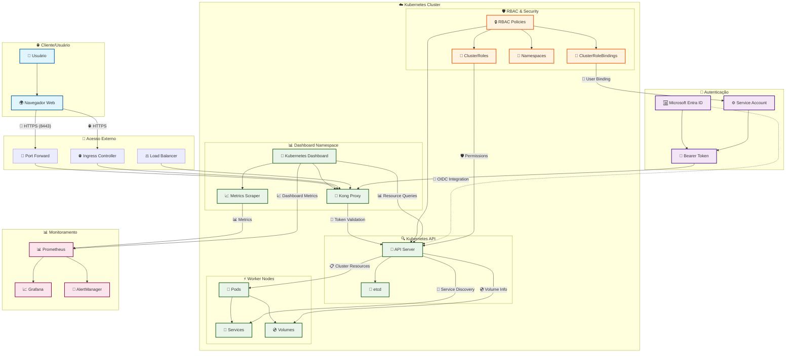
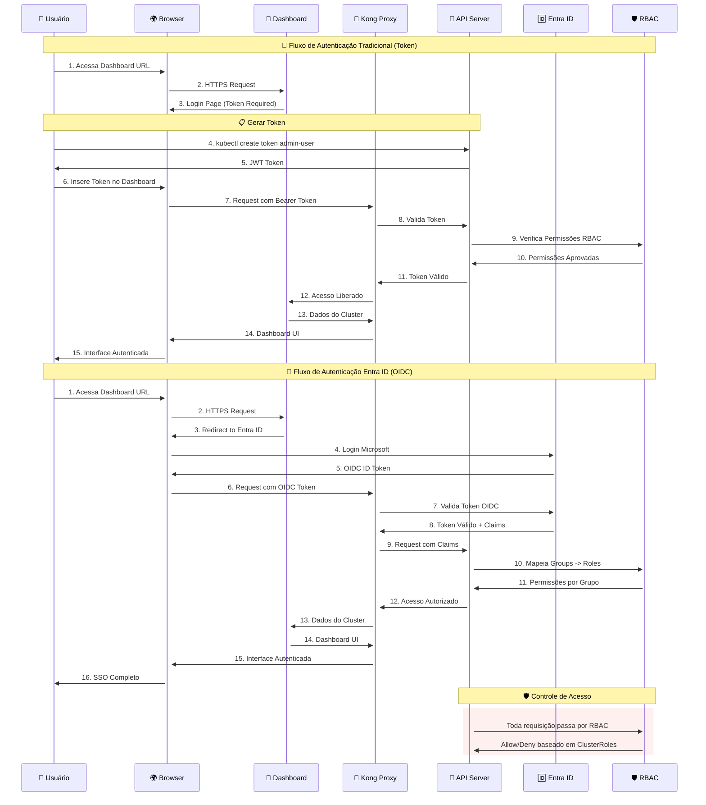
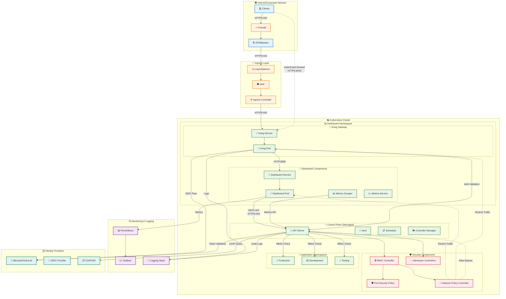

<p align="center">
  
</p>

# Kubernetes Dashboard: Instalação, Uso e Segurança


Esta documentação abrange como instalar, configurar, usar e principalmente **proteger** o Kubernetes Dashboard seguindo as melhores práticas de segurança.

## 📋 Índice

- [🚀 Instalação do Dashboard](#-instalação-do-dashboard)
- [🔐 Configuração de Segurança](#-configuração-de-segurança)
- [🌐 Acesso ao Dashboard](#-acesso-ao-dashboard)
- [👤 Gerenciamento de Usuários](#-gerenciamento-de-usuários)
- [� Integração com Microsoft Entra ID (Azure AD)](#-integração-com-microsoft-entra-id-azure-ad)
- [🧪 Testes de Permissões RBAC](#-testes-de-permissões-rbac)
- [�🛡️ Melhores Práticas de Segurança](#️-melhores-práticas-de-segurança)
- [🔧 Troubleshooting](#-troubleshooting)

## 🏗️ Arquitetura da Solução



### 🔍 Componentes da Arquitetura

#### **🌐 Camada de Acesso**
- **Port Forward**: Acesso local seguro via `kubectl port-forward`
- **Ingress Controller**: Acesso externo com balanceamento de carga
- **Kong Proxy**: Proxy reverso com autenticação integrada

#### **🔐 Camada de Autenticação**
- **Microsoft Entra ID**: Integração OIDC empresarial
- **Service Accounts**: Contas de serviço com tokens JWT
- **Bearer Tokens**: Autenticação baseada em tokens

#### **🛡️ Camada de Autorização**
- **RBAC Policies**: Controle granular de permissões
- **ClusterRoles**: Definição de permissões globais
- **RoleBindings**: Associação usuário-permissões

#### **📊 Camada de Monitoramento**
- **Prometheus**: Coleta de métricas
- **Grafana**: Visualização de dados
- **AlertManager**: Alertas proativos

## 🚀 Instalação do Dashboard

### Método Recomendado: Helm

O Kubernetes Dashboard agora suporta **apenas instalação via Helm** para melhor controle de dependências:

```bash
# Adicionar o repositório oficial
helm repo add kubernetes-dashboard https://kubernetes.github.io/dashboard/ && helm repo update

# Instalar o Dashboard
helm upgrade --install kubernetes-dashboard kubernetes-dashboard/kubernetes-dashboard --create-namespace --namespace kubernetes-dashboard
```

### Verificação da Instalação

```bash
# Verificar pods do Dashboard
kubectl get pods -n kubernetes-dashboard

# Verificar serviços
kubectl get svc -n kubernetes-dashboard
```

## 🔐 Configuração de Segurança

### ⚠️ Aviso de Segurança Importante

> **O Dashboard implementa configuração mínima de RBAC por padrão.** Para proteger seus dados do cluster, você deve configurar autenticação adequada.

### 1. Criar Service Account de Administração

```yaml
# dashboard-admin-user.yaml
apiVersion: v1
kind: ServiceAccount
metadata:
  name: admin-user
  namespace: kubernetes-dashboard
```

### 2. Criar ClusterRoleBinding

```yaml
# dashboard-admin-rolebinding.yaml
apiVersion: rbac.authorization.k8s.io/v1
kind: ClusterRoleBinding
metadata:
  name: admin-user
roleRef:
  apiGroup: rbac.authorization.k8s.io
  kind: ClusterRole
  name: cluster-admin
subjects:
- kind: ServiceAccount
  name: admin-user
  namespace: kubernetes-dashboard
```

### 3. Aplicar Configurações

```bash
# Aplicar as configurações
kubectl apply -f dashboard-admin-user.yaml && kubectl apply -f dashboard-admin-rolebinding.yaml
```

## 🌐 Acesso ao Dashboard

### 1. Configurar Port-Forward

```bash
# Fazer port-forward para o Dashboard (HTTPS obrigatório)
kubectl -n kubernetes-dashboard port-forward svc/kubernetes-dashboard-kong-proxy 8443:443
```

### 2. Acessar via Browser

Acesse: **https://localhost:8443**

> ⚠️ **Importante**: O login via token **APENAS funciona via HTTPS**. HTTP não é suportado para autenticação.

### 3. Obter Token de Autenticação

#### Token Temporário (Recomendado)

```bash
# Gerar token temporário
kubectl -n kubernetes-dashboard create token admin-user
```

#### Token de Longa Duração (Use com Cuidado)

```yaml
# admin-user-token.yaml
apiVersion: v1
kind: Secret
metadata:
  name: admin-user
  namespace: kubernetes-dashboard
  annotations:
    kubernetes.io/service-account.name: "admin-user"
type: kubernetes.io/service-account-token
```

```bash
# Aplicar o Secret
kubectl apply -f admin-user-token.yaml

# Obter o token
kubectl get secret admin-user -n kubernetes-dashboard -o jsonpath="{.data.token}" | base64 -d
```

## 👤 Gerenciamento de Usuários

### Usuário com Acesso Limitado (Read-Only)

Para criar usuários com permissões limitadas, use esta abordagem:

```yaml
# readonly-user.yaml
apiVersion: v1
kind: ServiceAccount
metadata:
  name: dashboard-readonly
  namespace: kubernetes-dashboard
---
apiVersion: rbac.authorization.k8s.io/v1
kind: ClusterRole
metadata:
  name: dashboard-readonly
rules:
- apiGroups: [""]
  resources: ["*"]
  verbs: ["get", "list", "watch"]
- apiGroups: ["apps"]
  resources: ["*"]
  verbs: ["get", "list", "watch"]
- apiGroups: ["extensions"]
  resources: ["*"]
  verbs: ["get", "list", "watch"]
---
apiVersion: rbac.authorization.k8s.io/v1
kind: ClusterRoleBinding
metadata:
  name: dashboard-readonly
roleRef:
  apiGroup: rbac.authorization.k8s.io
  kind: ClusterRole
  name: dashboard-readonly
subjects:
- kind: ServiceAccount
  name: dashboard-readonly
  namespace: kubernetes-dashboard
```

### Usuário com Acesso por Namespace

```yaml
# namespace-user.yaml
apiVersion: v1
kind: ServiceAccount
metadata:
  name: dev-user
  namespace: dev
---
apiVersion: rbac.authorization.k8s.io/v1
kind: Role
metadata:
  name: dev-user-role
  namespace: dev
rules:
- apiGroups: ["", "apps", "extensions"]
  resources: ["*"]
  verbs: ["get", "list", "watch", "create", "update", "patch", "delete"]
---
apiVersion: rbac.authorization.k8s.io/v1
kind: RoleBinding
metadata:
  name: dev-user-binding
  namespace: dev
roleRef:
  apiGroup: rbac.authorization.k8s.io
  kind: Role
  name: dev-user-role
subjects:
- kind: ServiceAccount
  name: dev-user
  namespace: dev
```

## 🔐 Integração com Microsoft Entra ID (Azure AD)

Para clusters AKS, você pode integrar o Dashboard diretamente com Microsoft Entra ID para autenticação mais robusta e gerenciamento centralizado de identidades.

### ⚠️ Importante

> **Microsoft Entra ID** (anteriormente Azure Active Directory) oferece integração nativa com AKS, eliminando a necessidade de gerenciar tokens manualmente.

### 🔄 Fluxo de Autenticação e Autorização



### 🔍 Comparação: Token vs Entra ID

| Aspecto | 🎫 Token Tradicional | 🆔 Microsoft Entra ID |
|---------|---------------------|----------------------|
| **Setup** | Simples | Configuração inicial complexa |
| **Segurança** | Token de longa duração | Tokens com expiração automática |
| **SSO** | ❌ Não | ✅ Sim |
| **Auditoria** | Limitada | ✅ Logs completos no Azure |
| **Gestão** | Manual | ✅ Centralized Identity Management |
| **MFA** | ❌ Não suportado | ✅ Suportado nativamente |
| **Revogação** | Manual (deletar SA) | ✅ Automática via grupos |
| **Downtime** | ❌ Sem downtime | ⚠️ Requer restart do cluster |

### Pré-requisitos

- **Azure CLI** versão 2.29.0 ou superior
- **kubectl** versão mínima 1.18.1 
- **kubelogin** para autenticação
- **Grupo do Microsoft Entra ID** para administradores do cluster

```bash
# Verificar versões
az --version && kubectl version --client

# Instalar kubelogin (se necessário)
az aks install-cli
```

### 0. Criar Grupo de Administradores (Obrigatório)

> ⚠️ **Importante**: Você **deve** ter um grupo do Microsoft Entra ID antes de habilitar a integração.

```bash
# Criar grupo para administradores do cluster
az ad group create --display-name "AKS-Cluster-Admins" --mail-nickname "aks-cluster-admins" --description "Administradores do cluster AKS"

# Obter o Object ID do grupo (anote este valor!)
$Env:GROUP_ID=$(az ad group show --group "AKS-Cluster-Admins" --query id -o tsv); Write-Host "Group Object ID: $Env:GROUP_ID"

# Adicionar usuários ao grupo
az ad group member add --group "AKS-Cluster-Admins" --member-id <user-object-id>

# Verificar membros do grupo
az ad group member list --group "AKS-Cluster-Admins" --output table
```

### 1. Criar Cluster AKS com Entra ID

#### Novo Cluster

```bash
# Criar grupo de recursos
az group create --name myResourceGroup --location centralus

# Pegar o Tenant Id
$Env:TENANT_ID="$(az account show --query tenantId -o tsv)"

# Criar cluster com integração Entra ID (sem downtime)
az aks create --resource-group myResourceGroup --name myManagedCluster  --node-vm-size "Standard_B2s" --enable-aad --location "brazilsouth" --enable-oidc-issuer --enable-managed-identity --node-count 1 --enable-cluster-autoscaler --min-count 1 --max-count 3 --aad-admin-group-object-ids $Env:GROUP_ID --aad-tenant-id $Env:TENANT_ID --generate-ssh-keys

# Verificar configuração do AAD Profile
az aks show --resource-group myResourceGroup --name myManagedCluster --query aadProfile -o table
```

#### Cluster Existente

> ⚠️ **AVISO CRÍTICO - POSSÍVEL INDISPONIBILIDADE**
> 
> - **Clusters de camada gratuita**: Podem ter **tempo de inatividade** do servidor de API durante a atualização
> - **Clusters pagos**: Geralmente **zero downtime**, mas pode haver breve instabilidade
> - **Recomendação**: Execute durante **janela de manutenção** ou horário de baixo uso
> - **kubeconfig**: Será **alterado** após a atualização - você precisará executar `az aks get-credentials` novamente

```bash
# ⚠️ EXECUTE EM JANELA DE MANUTENÇÃO ⚠️
# Habilitar integração em cluster existente
az aks update --resource-group myResourceGroup --name myManagedCluster --enable-aad --aad-admin-group-object-ids $Env:GROUP_ID --aad-tenant-id $Env:TENANT_ID

# ✅ OBRIGATÓRIO: Atualizar kubeconfig após a mudança
az aks get-credentials --resource-group myResourceGroup --name myManagedCluster --overwrite-existing
```

#### Migrar Cluster Legado (Azure AD v1)

> ⚠️ **AVISO DE MIGRAÇÃO**
> 
> - **Tempo de inatividade**: Esperado para clusters de camada gratuita
> - **Alteração de kubeconfig**: Formato será modificado
> - **Não reversível**: Não há suporte para downgrade
> - **Teste primeiro**: Execute em ambiente não-produtivo

```bash
# ⚠️ MIGRAÇÃO COM POSSÍVEL DOWNTIME ⚠️
az aks update --resource-group myResourceGroup --name myManagedCluster --enable-aad --aad-admin-group-object-ids $Env:GROUP_ID --aad-tenant-id <tenant-id>

# Verificar resultado da migração
az aks show --resource-group myResourceGroup --name myManagedCluster --query aadProfile
```

### 2. Configurar Acesso ao Cluster

```bash
# Obter credenciais do cluster
az aks get-credentials --resource-group myResourceGroup --name myManagedCluster

# Configurar kubelogin
kubelogin convert-kubeconfig -l azurecli

# Testar acesso
kubectl get nodes
```

### 3. Integrar Dashboard com Entra ID

#### Configurar RBAC para Grupos do Entra ID

```yaml
# entra-id-dashboard-rbac.yaml
apiVersion: rbac.authorization.k8s.io/v1
kind: ClusterRoleBinding
metadata:
  name: dashboard-admin-entra-id
roleRef:
  apiGroup: rbac.authorization.k8s.io
  kind: ClusterRole
  name: cluster-admin
subjects:
- kind: Group
  name: "<object-id-do-grupo-admin>"  # Object ID do grupo Entra ID
  apiGroup: rbac.authorization.k8s.io
```

#### Configurar Usuário Read-Only via Entra ID

```yaml
# entra-id-readonly-rbac.yaml
apiVersion: rbac.authorization.k8s.io/v1
kind: ClusterRole
metadata:
  name: dashboard-readonly-entra
rules:
- apiGroups: [""]
  resources: ["*"]
  verbs: ["get", "list", "watch"]
- apiGroups: ["apps", "extensions"]
  resources: ["*"]
  verbs: ["get", "list", "watch"]
---
apiVersion: rbac.authorization.k8s.io/v1
kind: ClusterRoleBinding
metadata:
  name: dashboard-readonly-entra-binding
roleRef:
  apiGroup: rbac.authorization.k8s.io
  kind: ClusterRole
  name: dashboard-readonly-entra
subjects:
- kind: Group
  name: "<object-id-grupo-readonly>"  # Object ID do grupo read-only
  apiGroup: rbac.authorization.k8s.io
```

### 4. Obter Token via Entra ID

```bash
# Token via CLI do Azure para Kubernetes (recomendado)
az account get-access-token --resource 6dae42f8-4368-4678-94ff-3960e28e3630 --query accessToken -o tsv

# Para obter o server-id automaticamente do kubeconfig atual:
SERVER_ID=$(kubectl config view --minify -o jsonpath='{.users[0].user.exec.args[5]}')
az account get-access-token --resource $SERVER_ID --query accessToken -o tsv

# Ou usar kubelogin diretamente com kubectl proxy
kubectl proxy --port=8001 &
# Abrir: http://localhost:8001/api/v1/namespaces/kubernetes-dashboard/services/https:kubernetes-dashboard:/proxy/
```

### 5. Autenticação Não-Interativa

Para pipelines CI/CD e automação:

```bash
# Via Service Principal
kubelogin convert-kubeconfig -l spn

# Configurar variáveis de ambiente
$Env:AAD_SERVICE_PRINCIPAL_CLIENT_ID="<client-id>"; $Env:AAD_SERVICE_PRINCIPAL_CLIENT_SECRET="<client-secret>"; $Env:AAD_TENANT_ID="<tenant-id>"

# Via Managed Identity
kubelogin convert-kubeconfig -l msi
```

### 6. Gerenciar Grupos e Permissões

#### Criar Grupo de Administradores

```bash
# Criar grupo para admins do Dashboard
az ad group create --display-name "AKS-Dashboard-Admins" --mail-nickname "aks-dashboard-admins" --description "Administradores do Kubernetes Dashboard"

# Adicionar usuários ao grupo
az ad group member add --group "AKS-Dashboard-Admins" --member-id <user-object-id>
```

#### Configurar Permissões por Namespace

```yaml
# namespace-specific-rbac.yaml
apiVersion: rbac.authorization.k8s.io/v1
kind: Role
metadata:
  namespace: production
  name: dashboard-prod-viewer
rules:
- apiGroups: ["", "apps", "extensions"]
  resources: ["*"]
  verbs: ["get", "list", "watch"]
---
apiVersion: rbac.authorization.k8s.io/v1
kind: RoleBinding
metadata:
  name: dashboard-prod-viewer-binding
  namespace: production
subjects:
- kind: Group
  name: "<prod-viewers-group-id>"
  apiGroup: rbac.authorization.k8s.io
roleRef:
  kind: Role
  name: dashboard-prod-viewer
  apiGroup: rbac.authorization.k8s.io
```

### 7. Troubleshooting Entra ID

#### Problema: "Error getting token"

```bash
# Verificar login no Azure
az login

# Reconfigurar kubelogin
kubelogin convert-kubeconfig -l azurecli

# Verificar grupos do usuário
az ad signed-in-user list-owned-objects
```

#### Problema: "Forbidden" com Entra ID

```bash
# ⚠️ IMPORTANTE: Testes com grupos requerem impersonação de usuário
# Verificar permissões do grupo (CORRETO - com usuário)
kubectl auth can-i "*" "*" --as=test-user --as-group="2b3bff4c-0758-47b2-b433-ec4312efe33b"

# ❌ INCORRETO - só grupo (vai dar erro de impersonação)
kubectl auth can-i "*" "*" --as-group="2b3bff4c-0758-47b2-b433-ec4312efe33b"

# Verificar se você pertence ao grupo
az ad group member check --group "2b3bff4c-0758-47b2-b433-ec4312efe33b" --member-id $(az ad signed-in-user show --query id -o tsv)

# Listar todos os grupos do usuário atual
az ad signed-in-user get-member-groups --query "[].displayName" -o table

# Verificar configuração do cluster
az aks show --resource-group Embracon --name myManagedCluster --query aadProfile.adminGroupObjectIDs

# Testar token do Entra ID
TOKEN=$(az account get-access-token --resource 6dae42f8-4368-4678-94ff-3960e28e3630 --query accessToken -o tsv)
kubectl get pods --token="$TOKEN"
```

#### Problema: kubelogin não encontrado

```bash
# Instalar kubelogin
az aks install-cli

# Ou download manual
curl -LO https://github.com/Azure/kubelogin/releases/latest/download/kubelogin-linux-amd64.zip && unzip kubelogin-linux-amd64.zip && sudo mv bin/linux_amd64/kubelogin /usr/local/bin/
```

### 8. Limitações e Considerações Importantes

- ⚠️ **Não pode ser desabilitada** após habilitação
- ⚠️ **Não há suporte para downgrade** para clusters legados
- ⚠️ **Requer RBAC habilitado** no cluster
- ⚠️ **Kubernetes 1.24+** usa formato exec por padrão

#### ⚠️ **Impactos de Disponibilidade**

| Operação | Cluster Gratuito | Cluster Pago | Recomendação |
|----------|------------------|--------------|--------------|
| **Novo Cluster** | ✅ Sem impacto | ✅ Sem impacto | Qualquer horário |
| **Cluster Existente** | ⚠️ Possível downtime | ⚠️ Breve instabilidade | Janela de manutenção |
| **Migração Legado** | 🔴 Downtime esperado | ⚠️ Possível impacto | Janela de manutenção obrigatória |

#### 📋 **Checklist Pré-Habilitação**

```bash
# 1. Verificar se cluster tem RBAC habilitado
az aks show --resource-group myResourceGroup --name myManagedCluster --query enableRbac

# 2. Verificar tier do cluster (Free vs Paid)
az aks show --resource-group myResourceGroup --name myManagedCluster --query sku

# 3. Criar grupo de admins ANTES da habilitação
az ad group create --display-name "AKS-Admins" --mail-nickname "aks-admins"

# 4. Planejar janela de manutenção para clusters existentes
# 5. Comunicar equipe sobre possível indisponibilidade
# 6. Ter rollback plan (não aplicável - operação irreversível)
```

### 9. Vantagens da Integração Entra ID

| Recurso | Benefício |
|---------|-----------|
| **SSO** | Login único com credenciais corporativas |
| **MFA** | Autenticação multi-fator automática |
| **Conditional Access** | Políticas de acesso baseadas em contexto |
| **Group Management** | Gerenciamento centralizado via Entra ID |
| **Audit Logs** | Logs centralizados no Azure AD |
| **Token Management** | Renovação automática de tokens |

```bash
# Aplicar configurações
kubectl apply -f entra-id-dashboard-rbac.yaml && kubectl apply -f entra-id-readonly-rbac.yaml && kubectl apply -f namespace-specific-rbac.yaml
```

## 🧪 Testes de Permissões RBAC

### ⚠️ Importante: Limitações do Usuário Criador

> **ATENÇÃO**: O usuário que criou o cluster AKS **sempre terá permissões completas** (cluster-admin), independente das configurações RBAC. Para testar permissões limitadas, você deve usar contas de usuários diferentes.

### 🔍 Verificar Suas Permissões Atuais

```bash
# Verificar se você tem permissões de cluster-admin
kubectl auth can-i "*" "*"
# Resposta esperada para criador do cluster: yes

# Ver suas atribuições de função no Azure
az role assignment list --resource-group Embracon --assignee $(az account show --query user.name -o tsv) | grep -i kubernetes

# Verificar grupos do seu usuário
az ad signed-in-user get-member-groups --query "[].displayName" -o table
```

### 1. Testes para Service Accounts

#### Teste Admin User (Cluster Admin)

```bash
# Verificar permissões do admin user
kubectl auth can-i "*" "*" --as=system:serviceaccount:kubernetes-dashboard:admin-user
# Resposta esperada: yes

kubectl auth can-i create pods --as=system:serviceaccount:kubernetes-dashboard:admin-user
# Resposta esperada: yes

kubectl auth can-i delete clusterroles --as=system:serviceaccount:kubernetes-dashboard:admin-user  
# Resposta esperada: yes

kubectl auth can-i get secrets --as=system:serviceaccount:kubernetes-dashboard:admin-user -A
# Resposta esperada: yes
```

#### Teste Read-Only User

Primeiro, crie o usuário read-only:

```bash
# Criar usuário read-only para testes
kubectl apply -f - <<EOF
apiVersion: v1
kind: ServiceAccount
metadata:
  name: readonly-test-user
  namespace: kubernetes-dashboard
---
apiVersion: rbac.authorization.k8s.io/v1
kind: ClusterRole
metadata:
  name: dashboard-readonly-test
rules:
- apiGroups: [""]
  resources: ["pods", "services", "nodes", "namespaces", "configmaps"]
  verbs: ["get", "list", "watch"]
- apiGroups: ["apps"]
  resources: ["deployments", "replicasets", "daemonsets", "statefulsets"]
  verbs: ["get", "list", "watch"]
- apiGroups: ["extensions", "networking.k8s.io"]
  resources: ["ingresses"]
  verbs: ["get", "list", "watch"]
---
apiVersion: rbac.authorization.k8s.io/v1
kind: ClusterRoleBinding
metadata:
  name: dashboard-readonly-test-binding
roleRef:
  apiGroup: rbac.authorization.k8s.io
  kind: ClusterRole
  name: dashboard-readonly-test
subjects:
- kind: ServiceAccount
  name: readonly-test-user
  namespace: kubernetes-dashboard
EOF
```

Agora teste as permissões:

```bash
# ✅ Operações READ (devem funcionar)
kubectl auth can-i get pods --as=system:serviceaccount:kubernetes-dashboard:readonly-test-user
# Resposta esperada: yes

kubectl auth can-i list services --as=system:serviceaccount:kubernetes-dashboard:readonly-test-user
# Resposta esperada: yes

kubectl auth can-i watch deployments --as=system:serviceaccount:kubernetes-dashboard:readonly-test-user
# Resposta esperada: yes

kubectl auth can-i get nodes --as=system:serviceaccount:kubernetes-dashboard:readonly-test-user
# Resposta esperada: yes

# ❌ Operações WRITE (devem falhar)
kubectl auth can-i create pods --as=system:serviceaccount:kubernetes-dashboard:readonly-test-user
# Resposta esperada: no

kubectl auth can-i delete services --as=system:serviceaccount:kubernetes-dashboard:readonly-test-user
# Resposta esperada: no

kubectl auth can-i update deployments --as=system:serviceaccount:kubernetes-dashboard:readonly-test-user
# Resposta esperada: no

kubectl auth can-i patch configmaps --as=system:serviceaccount:kubernetes-dashboard:readonly-test-user
# Resposta esperada: no

# ❌ Recursos Sensíveis (devem falhar)
kubectl auth can-i get secrets --as=system:serviceaccount:kubernetes-dashboard:readonly-test-user
# Resposta esperada: no

kubectl auth can-i create serviceaccounts --as=system:serviceaccount:kubernetes-dashboard:readonly-test-user
# Resposta esperada: no

kubectl auth can-i delete clusterroles --as=system:serviceaccount:kubernetes-dashboard:readonly-test-user
# Resposta esperada: no
```

### 2. Testes para Grupos do Entra ID

> **Nota**: Para testar grupos, você precisa especificar um usuário junto com o grupo.

```bash
# Teste com impersonação de usuário + grupo admin
kubectl auth can-i "*" "*" --as=test-user --as-group="2b3bff4c-0758-47b2-b433-ec4312efe33b"
# Resposta esperada: yes

# Teste com grupo read-only (se configurado)
kubectl auth can-i get pods --as=test-user --as-group="grupo-readonly-id"
# Resposta esperada: yes

kubectl auth can-i create pods --as=test-user --as-group="grupo-readonly-id"  
# Resposta esperada: no
```

### 3. Script de Teste Automatizado

```bash
#!/bin/bash
# test-rbac-permissions.sh

echo "=== 🧪 Teste Completo de Permissões RBAC ==="
echo ""

# Cores para output
RED='\033[0;31m'
GREEN='\033[0;32m'
YELLOW='\033[1;33m'
NC='\033[0m' # No Color

# Função para teste
test_permission() {
    local description="$1"
    local command="$2"
    local expected="$3"
    
    echo -n "Testando: $description... "
    
    result=$(eval "$command" 2>/dev/null)
    
    if [[ "$result" == "$expected" ]]; then
        echo -e "${GREEN}✅ PASSOU${NC} (resultado: $result)"
    else
        echo -e "${RED}❌ FALHOU${NC} (esperado: $expected, obtido: $result)"
    fi
}

echo "=== Testes Admin User (deve ter acesso total) ==="
test_permission "Admin pode listar pods" "kubectl auth can-i get pods --as=system:serviceaccount:kubernetes-dashboard:admin-user" "yes"
test_permission "Admin pode criar pods" "kubectl auth can-i create pods --as=system:serviceaccount:kubernetes-dashboard:admin-user" "yes"
test_permission "Admin pode deletar secrets" "kubectl auth can-i delete secrets --as=system:serviceaccount:kubernetes-dashboard:admin-user" "yes"

echo ""
echo "=== Testes ReadOnly User (deve ter acesso limitado) ==="
test_permission "ReadOnly pode listar pods" "kubectl auth can-i get pods --as=system:serviceaccount:kubernetes-dashboard:readonly-test-user" "yes"
test_permission "ReadOnly NÃO pode criar pods" "kubectl auth can-i create pods --as=system:serviceaccount:kubernetes-dashboard:readonly-test-user" "no"
test_permission "ReadOnly NÃO pode ver secrets" "kubectl auth can-i get secrets --as=system:serviceaccount:kubernetes-dashboard:readonly-test-user" "no"
test_permission "ReadOnly NÃO pode deletar deployments" "kubectl auth can-i delete deployments --as=system:serviceaccount:kubernetes-dashboard:readonly-test-user" "no"

echo ""
echo "=== Testes por Namespace ==="
test_permission "ReadOnly pode ver pods em kube-system" "kubectl auth can-i get pods --as=system:serviceaccount:kubernetes-dashboard:readonly-test-user -n kube-system" "yes"
test_permission "ReadOnly NÃO pode criar configmaps em default" "kubectl auth can-i create configmaps --as=system:serviceaccount:kubernetes-dashboard:readonly-test-user -n default" "no"

echo ""
echo "=== Resumo dos Testes ==="
echo -e "${YELLOW}⚠️  Se você é o criador do cluster, sempre verá 'yes' para suas próprias permissões${NC}"
echo -e "${GREEN}✅ Para testar realmente RBAC, use contas de usuários diferentes${NC}"
```

### 4. Teste Prático no Dashboard

#### Preparar Token Read-Only

```bash
# Gerar token para usuário read-only
TOKEN_READONLY=$(kubectl create token readonly-test-user -n kubernetes-dashboard --duration=24h)
echo "Token Read-Only:"
echo $TOKEN_READONLY
```

#### Teste no Dashboard Web

1. **Acesse**: https://localhost:8443
2. **Login**: Cole o token read-only
3. **Teste as funcionalidades**:

**✅ Deve Funcionar (Read-Only):**
- Visualizar pods, deployments, services
- Ver logs de containers  
- Navegar entre namespaces
- Ver detalhes de recursos
- Acessar métricas básicas

**❌ Não Deve Funcionar (Write Operations):**
- Botões "Delete" devem estar desabilitados/ocultos
- "Edit" deve dar erro 403 Forbidden
- "Create" deve falhar
- "Scale" deve ser bloqueado
- Exec em pods deve ser negado

### 5. Verificação de Logs

```bash
# Ver logs de tentativas negadas no Dashboard
kubectl logs -n kubernetes-dashboard -l k8s-app=kubernetes-dashboard --tail=50 | grep -i "forbidden\|denied\|unauthorized"

# Ver logs de auditoria (se habilitado)
kubectl get events --all-namespaces | grep -i "forbidden"
```

### 6. Limpar Recursos de Teste

```bash
# Remover usuário de teste
kubectl delete serviceaccount readonly-test-user -n kubernetes-dashboard
kubectl delete clusterrole dashboard-readonly-test
kubectl delete clusterrolebinding dashboard-readonly-test-binding
```

### 7. Testes para Múltiplos Grupos

Se você configurou múltiplos grupos:

```bash
# Criar grupos diferentes no Entra ID
az ad group create --display-name "AKS-ReadOnly-Users" --mail-nickname "aks-readonly-users"
az ad group create --display-name "AKS-Developers" --mail-nickname "aks-developers"
az ad group create --display-name "AKS-DevOps" --mail-nickname "aks-devops"

# Obter IDs dos grupos
az ad group list --display-name "AKS-*" --query "[].{Name:displayName, ObjectId:id}" -o table

# Testar permissões por grupo (com impersonação)
kubectl auth can-i get pods --as=user1 --as-group="readonly-group-id"
kubectl auth can-i create deployments --as=user2 --as-group="developer-group-id"  
kubectl auth can-i "*" "*" --as=user3 --as-group="admin-group-id"
```

### 📊 Matriz de Permissões Esperadas

| Usuário/Grupo | get/list/watch | create/update | delete | secrets | cluster-admin |
|---------------|----------------|---------------|--------|---------|---------------|
| **Criador AKS** | ✅ | ✅ | ✅ | ✅ | ✅ |
| **admin-user SA** | ✅ | ✅ | ✅ | ✅ | ✅ |
| **readonly-test-user** | ✅ | ❌ | ❌ | ❌ | ❌ |
| **Admin Group** | ✅ | ✅ | ✅ | ✅ | ✅ |
| **ReadOnly Group** | ✅ | ❌ | ❌ | ❌ | ❌ |

## 🛡️ Melhores Práticas de Segurança

### 🏗️ Estrutura RBAC do Dashboard

```mermaid
graph TB
    subgraph "👥 Usuários e Identidades"
        ADMIN[👑 Cluster Admin]
        DEV[👨‍💻 Developer]
        VIEWER[👀 Viewer]
        SVC[🔧 Service Account]
        ENTRA_GROUP[🏢 Entra ID Groups]
    end

    subgraph "🛡️ RBAC Components"
        subgraph "🌐 Cluster-Level"
            CR_ADMIN[🔴 cluster-admin]
            CR_VIEW[🔵 view]
            CR_EDIT[🟡 edit]
            CR_CUSTOM[🟣 custom-roles]
            
            CRB_ADMIN[🔗 admin-binding]
            CRB_VIEW[🔗 view-binding]
            CRB_DEV[🔗 dev-binding]
        end

        subgraph "📁 Namespace-Level"
            R_PROD[🔴 prod-admin]
            R_DEV[🟡 dev-user]
            R_MONITOR[🔵 monitoring]
            
            RB_PROD[🔗 prod-binding]
            RB_DEV[🔗 dev-binding]
            RB_MONITOR[🔗 monitor-binding]
        end
    end

    subgraph "📊 Dashboard Resources"
        DASH_ADMIN[📱 Full Dashboard Access]
        DASH_NS[📱 Namespace Dashboard]
        DASH_VIEW[📱 Read-Only Dashboard]
    end

    subgraph "🎯 Kubernetes Resources"
        subgraph "📦 Core Resources"
            PODS[🐳 Pods]
            SVC_RES[🔧 Services]
            CM[📄 ConfigMaps]
            SECRETS[🔐 Secrets]
        end

        subgraph "📋 Workload Resources"
            DEPLOY[🚀 Deployments]
            RS[📊 ReplicaSets]
            DS[🔄 DaemonSets]
            STS[📚 StatefulSets]
        end

        subgraph "🌐 Network Resources"
            INGRESS[🚪 Ingress]
            NP[🛡️ NetworkPolicies]
            EP[🔗 Endpoints]
        end
    end

    %% Fluxos de Autorização - Cluster Admin
    ADMIN --> CRB_ADMIN
    CRB_ADMIN --> CR_ADMIN
    CR_ADMIN --> DASH_ADMIN
    DASH_ADMIN --> PODS
    DASH_ADMIN --> SVC_RES
    DASH_ADMIN --> CM
    DASH_ADMIN --> SECRETS
    DASH_ADMIN --> DEPLOY
    DASH_ADMIN --> INGRESS

    %% Fluxos de Autorização - Developer
    DEV --> CRB_DEV
    CRB_DEV --> CR_EDIT
    CR_EDIT --> DASH_NS
    DEV --> RB_DEV
    RB_DEV --> R_DEV
    R_DEV --> DASH_NS
    DASH_NS --> PODS
    DASH_NS --> DEPLOY
    DASH_NS --> SVC_RES

    %% Fluxos de Autorização - Viewer
    VIEWER --> CRB_VIEW
    CRB_VIEW --> CR_VIEW
    CR_VIEW --> DASH_VIEW
    DASH_VIEW --> PODS
    DASH_VIEW --> SVC_RES

    %% Service Accounts
    SVC --> CRB_ADMIN
    SVC --> RB_MONITOR
    RB_MONITOR --> R_MONITOR
    R_MONITOR --> DASH_VIEW

    %% Entra ID Integration
    ENTRA_GROUP --> CRB_ADMIN
    ENTRA_GROUP --> CRB_DEV
    ENTRA_GROUP --> RB_PROD
    RB_PROD --> R_PROD
    R_PROD --> DASH_ADMIN

    %% Estilos
    classDef userStyle fill:#e3f2fd,stroke:#1976d2,stroke-width:2px
    classDef clusterStyle fill:#fff3e0,stroke:#f57c00,stroke-width:2px
    classDef namespaceStyle fill:#f3e5f5,stroke:#7b1fa2,stroke-width:2px
    classDef dashboardStyle fill:#e8f5e8,stroke:#388e3c,stroke-width:2px
    classDef resourceStyle fill:#fce4ec,stroke:#c2185b,stroke-width:2px

    class ADMIN,DEV,VIEWER,SVC,ENTRA_GROUP userStyle
    class CR_ADMIN,CR_VIEW,CR_EDIT,CR_CUSTOM,CRB_ADMIN,CRB_VIEW,CRB_DEV clusterStyle
    class R_PROD,R_DEV,R_MONITOR,RB_PROD,RB_DEV,RB_MONITOR namespaceStyle
    class DASH_ADMIN,DASH_NS,DASH_VIEW dashboardStyle
    class PODS,SVC_RES,CM,SECRETS,DEPLOY,RS,DS,STS,INGRESS,NP,EP resourceStyle
```



### 🎯 Matriz de Permissões

| Papel | Cluster Scope | Namespace Scope | Dashboard Access | Recursos |
|-------|--------------|----------------|-----------------|----------|
| 🔴 **Cluster Admin** | cluster-admin | Todos | Full Dashboard | Todos os recursos |
| 🟡 **Developer** | edit | Específicos | Namespace Dashboard | Workloads + Services |
| 🔵 **Viewer** | view | Específicos/Todos | Read-Only Dashboard | Visualização apenas |
| 🟣 **Monitor** | custom | Específicos | Metrics Dashboard | Pods + Services + Metrics |
| 🏢 **Entra Groups** | Mapeados | Baseado no grupo | Baseado no grupo | Baseado no grupo |

### 1. Princípio do Menor Privilégio

```yaml
# Exemplo: Usuário específico para monitoramento
apiVersion: rbac.authorization.k8s.io/v1
kind: ClusterRole
metadata:
  name: dashboard-monitoring
rules:
- apiGroups: [""]
  resources: ["pods", "services", "nodes"]
  verbs: ["get", "list", "watch"]
- apiGroups: ["apps"]
  resources: ["deployments", "replicasets"]
  verbs: ["get", "list", "watch"]
- apiGroups: ["metrics.k8s.io"]
  resources: ["*"]
  verbs: ["get", "list"]
```

### 2. Rotação Regular de Tokens

```bash
# Script para rotacionar tokens
#!/bin/bash
NAMESPACE="kubernetes-dashboard"
SERVICE_ACCOUNT="admin-user"

# Deletar token antigo
kubectl delete secret ${SERVICE_ACCOUNT} -n ${NAMESPACE} --ignore-not-found=true

# Criar novo token
kubectl create secret generic ${SERVICE_ACCOUNT} --from-literal=token="$(kubectl create token ${SERVICE_ACCOUNT} -n ${NAMESPACE})" -n ${NAMESPACE}

echo "Token rotacionado com sucesso!"
```

### 3. Configuração de Rede Segura

```yaml
# network-policy.yaml
apiVersion: networking.k8s.io/v1
kind: NetworkPolicy
metadata:
  name: dashboard-netpol
  namespace: kubernetes-dashboard
spec:
  podSelector:
    matchLabels:
      k8s-app: kubernetes-dashboard
  policyTypes:
  - Ingress
  ingress:
  - from:
    - namespaceSelector:
        matchLabels:
          name: kube-system
    - podSelector: {}
    ports:
    - protocol: TCP
      port: 8443
```

### 4. Auditoria e Monitoramento

```yaml
# audit-policy.yaml (para configurar no kube-apiserver)
apiVersion: audit.k8s.io/v1
kind: Policy
rules:
- level: Metadata
  namespaces: ["kubernetes-dashboard"]
  resources:
  - group: ""
    resources: ["secrets", "serviceaccounts"]
  - group: "rbac.authorization.k8s.io"
    resources: ["roles", "rolebindings", "clusterroles", "clusterrolebindings"]
```

## 🔧 Troubleshooting

### 1. Erro: "Invalid Token"

**Problema**: Token não aceito na interface de login.

**Soluções**:
```bash
# Verificar se está acessando via HTTPS
# ❌ http://localhost:8443 - NÃO FUNCIONARÁ
# ✅ https://localhost:8443 - CORRETO

# Gerar novo token
kubectl -n kubernetes-dashboard create token admin-user

# Verificar se Service Account existe
kubectl get sa admin-user -n kubernetes-dashboard
```

### 2. Erro: "Forbidden" no Dashboard

**Problema**: Usuário sem permissões adequadas.

**Soluções**:
```bash
# Verificar permissões do usuário (Service Account)
kubectl auth can-i "*" "*" --as=system:serviceaccount:kubernetes-dashboard:admin-user

# Verificar permissões com impersonação de grupo Entra ID
kubectl auth can-i get pods --as=seu-email@dominio.com --as-group="2b3bff4c-0758-47b2-b433-ec4312efe33b"

# Verificar ClusterRoleBinding
kubectl describe clusterrolebinding admin-user
kubectl describe clusterrolebinding dashboard-admin-entra-id

# Listar todas as permissões disponíveis para um usuário
kubectl auth can-i --list --as=system:serviceaccount:kubernetes-dashboard:admin-user

# Testar permissões específicas por namespace
kubectl auth can-i create pods --as=system:serviceaccount:kubernetes-dashboard:admin-user -n default
kubectl auth can-i get secrets --as=system:serviceaccount:kubernetes-dashboard:admin-user -n kube-system

# Recriar binding se necessário
kubectl delete clusterrolebinding admin-user && kubectl apply -f dashboard-admin-rolebinding.yaml
```

### 3. Dashboard Não Carrega

**Problema**: Interface não carrega ou apresenta erros.

**Soluções**:
```bash
# Verificar status dos pods
kubectl get pods -n kubernetes-dashboard

# Ver logs do Dashboard
kubectl logs -n kubernetes-dashboard deployment/kubernetes-dashboard

# Verificar port-forward
kubectl -n kubernetes-dashboard port-forward svc/kubernetes-dashboard-kong-proxy 8443:443
```

### 4. Problemas de Certificado SSL

**Problema**: Erros de certificado no browser.

**Soluções**:
```bash
# Aceitar certificado self-signed no browser
# Ou configurar certificado válido:

# Gerar certificado para o Dashboard
openssl req -x509 -nodes -days 365 -newkey rsa:2048 -keyout dashboard.key -out dashboard.crt -subj "/CN=kubernetes-dashboard"

# Criar secret com certificado
kubectl create secret tls kubernetes-dashboard-certs --key dashboard.key --cert dashboard.crt -n kubernetes-dashboard
```

## 📊 Recursos do Dashboard

### 1. Visão Administrativa
- **Nodes**: CPU e memória agregados
- **Namespaces**: Overview de recursos
- **PersistentVolumes**: Armazenamento do cluster

### 2. Workloads
- **Deployments**: Status e especificações
- **ReplicaSets**: Pods controlados
- **StatefulSets**: Aplicações com estado
- **DaemonSets**: Pods em todos os nodes

### 3. Networking
- **Services**: Exposição de serviços
- **Ingress**: Roteamento externo
- **Network Policies**: Controle de tráfego

### 4. Storage
- **PersistentVolumeClaims**: Requisições de armazenamento
- **StorageClasses**: Classes de armazenamento

### 5. Configuration
- **ConfigMaps**: Configurações de aplicação
- **Secrets**: Dados sensíveis
- **Resource Quotas**: Limites de recursos

## 🌐 Topologia de Rede e Segurança



### 🔒 Camadas de Segurança

| Camada | Componente | Função de Segurança |
|--------|------------|-------------------|
| **🌍 Perimeter** | Firewall + VPN | Controle de acesso de rede |
| **🚪 Ingress** | WAF + Load Balancer | Proteção contra ataques web |
| **🦍 Proxy** | Kong Gateway | Autenticação e rate limiting |
| **🎯 API** | Kubernetes API Server | Autenticação e autorização |
| **🛡️ RBAC** | Role-based Access Control | Controle granular de permissões |
| **📁 Namespace** | Network Policies | Isolamento de rede |
| **🐳 Pod** | Security Context | Privilégios mínimos |
| **💾 Data** | Secrets + etcd encryption | Proteção de dados sensíveis |

### 🚨 Pontos Críticos de Segurança

1. **🔐 Authentication**: Múltiplos métodos (Token, OIDC, Certificados)
2. **🛡️ Authorization**: RBAC granular por namespace e recursos
3. **🌐 Network**: Network Policies para isolamento
4. **🔍 Monitoring**: Logs de auditoria e métricas de segurança
5. **🔄 Rotation**: Rotação automática de tokens e certificados

## 🔄 Limpeza de Recursos

### Remover Usuário Admin

```bash
# Remover Service Account e ClusterRoleBinding
kubectl -n kubernetes-dashboard delete serviceaccount admin-user && kubectl delete clusterrolebinding admin-user

# Remover secrets (se criados)
kubectl -n kubernetes-dashboard delete secret admin-user
```

### Desinstalar Dashboard

```bash
# Via Helm
helm uninstall kubernetes-dashboard -n kubernetes-dashboard

# Remover namespace
kubectl delete namespace kubernetes-dashboard
```

## � Arquivos de Configuração Incluídos

Esta pasta contém os seguintes arquivos de configuração RBAC para o Kubernetes Dashboard:

### 🔐 Service Accounts (Tradicionais)

#### `dashboard-admin-user.yaml`
**Propósito**: Service Account com permissões completas de cluster-admin  
**Uso**: Para administradores que precisam de acesso total via token

````yaml
apiVersion: v1
kind: ServiceAccount
metadata:
  name: admin-user
  namespace: kubernetes-dashboard
---
apiVersion: rbac.authorization.k8s.io/v1
kind: ClusterRoleBinding
metadata:
  name: admin-user
roleRef:
  apiGroup: rbac.authorization.k8s.io
  kind: ClusterRole
  name: cluster-admin
subjects:
- kind: ServiceAccount
  name: admin-user
  namespace: kubernetes-dashboard
````

**Comandos de uso**:
````bash
# Aplicar configuração
kubectl apply -f dashboard-admin-user.yaml

# Obter token
kubectl create token admin-user -n kubernetes-dashboard --duration=24h
````

---

#### `dashboard-readonly-user.yaml`
**Propósito**: Service Account com permissões somente leitura  
**Uso**: Para usuários que precisam apenas visualizar recursos

````yaml
apiVersion: v1
kind: ServiceAccount
metadata:
  name: dashboard-readonly
  namespace: kubernetes-dashboard
---
apiVersion: rbac.authorization.k8s.io/v1
kind: ClusterRole
metadata:
  name: dashboard-readonly
rules:
- apiGroups: [""]
  resources: ["*"]
  verbs: ["get", "list", "watch"]
- apiGroups: ["apps"]
  resources: ["*"]
  verbs: ["get", "list", "watch"]
- apiGroups: ["extensions"]
  resources: ["*"]
  verbs: ["get", "list", "watch"]
---
apiVersion: rbac.authorization.k8s.io/v1
kind: ClusterRoleBinding
metadata:
  name: dashboard-readonly
roleRef:
  apiGroup: rbac.authorization.k8s.io
  kind: ClusterRole
  name: dashboard-readonly
subjects:
- kind: ServiceAccount
  name: dashboard-readonly
  namespace: kubernetes-dashboard
````

**Comandos de uso**:
````bash
# Aplicar configuração
kubectl apply -f dashboard-readonly-user.yaml

# Obter token
kubectl create token dashboard-readonly -n kubernetes-dashboard --duration=24h

# Testar permissões
kubectl auth can-i create pods --as=system:serviceaccount:kubernetes-dashboard:dashboard-readonly
# Resultado esperado: no
````

---

#### `dev-namespace-only-user.yaml`
**Propósito**: Service Account com acesso limitado ao namespace "dev"  
**Uso**: Para desenvolvedores que trabalham apenas no ambiente de desenvolvimento

**Recursos incluídos**:
- ✅ Acesso completo ao namespace `dev`
- ✅ Pode criar/editar/deletar recursos no namespace `dev`
- ❌ Não tem acesso a outros namespaces
- ❌ Não tem permissões de cluster-admin

**Comandos de uso**:
````bash
# Criar namespace dev primeiro
kubectl create namespace dev

# Aplicar configuração
kubectl apply -f dev-namespace-only-user.yaml

# Obter token
kubectl create token dev-namespace-user -n dev --duration=24h

# Testar permissões no namespace dev
kubectl auth can-i create pods --as=system:serviceaccount:dev:dev-namespace-user -n dev
# Resultado esperado: yes

# Testar acesso negado a outros namespaces
kubectl auth can-i get pods --as=system:serviceaccount:dev:dev-namespace-user -n kube-system
# Resultado esperado: no
````

### 🏢 Integração com Microsoft Entra ID

#### `entra-id-dashboard-rbac.yaml`
**Propósito**: Integração com grupo do Entra ID para administradores  
**Uso**: Para autenticação SSO com credenciais corporativas (permissões completas)

````yaml
apiVersion: rbac.authorization.k8s.io/v1
kind: ClusterRoleBinding
metadata:
  name: dashboard-admin-entra-id
roleRef:
  apiGroup: rbac.authorization.k8s.io
  kind: ClusterRole
  name: cluster-admin
subjects:
- kind: Group
  name: "2b3bff4c-0758-47b2-b433-ec4312efe33b"  # Object ID do grupo Entra ID
  apiGroup: rbac.authorization.k8s.io
````

**Pré-requisitos**:
- Cluster AKS com integração Entra ID habilitada
- Grupo criado no Entra ID com usuários adicionados
- kubelogin configurado

**Comandos de uso**:
````bash
# Aplicar configuração
kubectl apply -f entra-id-dashboard-rbac.yaml

# Obter token do Entra ID
az account get-access-token --resource 6dae42f8-4368-4678-94ff-3960e28e3630 --query accessToken -o tsv

# Verificar se usuário pertence ao grupo
az ad group member check --group "2b3bff4c-0757-47b2-b433-ec4312efe33b" --member-id $(az ad signed-in-user show --query id -o tsv)
````

---

#### `entra-id-readonly-rbac.yaml`
**Propósito**: Integração com grupo do Entra ID para usuários somente leitura  
**Uso**: Para usuários corporativos que precisam apenas visualizar recursos

````yaml
apiVersion: rbac.authorization.k8s.io/v1
kind: ClusterRole
metadata:
  name: dashboard-readonly-entra
rules:
- apiGroups: [""]
  resources: ["*"]
  verbs: ["get", "list", "watch"]
- apiGroups: ["apps", "extensions"]
  resources: ["*"]
  verbs: ["get", "list", "watch"]
---
apiVersion: rbac.authorization.k8s.io/v1
kind: ClusterRoleBinding
metadata:
  name: dashboard-readonly-entra-binding
roleRef:
  apiGroup: rbac.authorization.k8s.io
  kind: ClusterRole
  name: dashboard-readonly-entra
subjects:
- kind: Group
  name: "2b3bff4c-0758-47b2-b433-ec4312efe33b"  # Object ID do grupo read-only
  apiGroup: rbac.authorization.k8s.io
````

**Comandos de uso**:
````bash
# Aplicar configuração  
kubectl apply -f entra-id-readonly-rbac.yaml

# Testar com impersonação (usuário + grupo)
kubectl auth can-i get pods --as=test-user --as-group="2b3bff4c-0758-47b2-b433-ec4312efe33b"
# Resultado esperado: yes

kubectl auth can-i create pods --as=test-user --as-group="2b3bff4c-0758-47b2-b433-ec4312efe33b"  
# Resultado esperado: no
````

---

#### `kubernetes-roles-guide.md`
**Propósito**: Guia completo para criação de Roles e RBAC no Kubernetes  
**Uso**: Documentação de referência para entender e criar roles customizadas

**Conteúdo incluído**:
- 📝 Anatomia detalhada de Roles e ClusterRoles
- 🔍 Explicação de todos os campos e valores possíveis
- 📊 Referência completa de API Groups e recursos
- 🎯 Exemplos práticos por cenário
- 🛡️ Melhores práticas de segurança
- 🔧 Comandos úteis para teste e debug

## 🚀 Aplicação Rápida

### Cenário 1: Service Accounts Tradicionais
````bash
# Aplicar todos os Service Accounts
kubectl apply -f dashboard-admin-user.yaml
kubectl apply -f dashboard-readonly-user.yaml  
kubectl apply -f dev-namespace-only-user.yaml

# Obter tokens
echo "Admin Token:"
kubectl create token admin-user -n kubernetes-dashboard --duration=24h

echo "ReadOnly Token:"
kubectl create token dashboard-readonly -n kubernetes-dashboard --duration=24h

echo "Dev Token:"  
kubectl create token dev-namespace-user -n dev --duration=24h
````

### Cenário 2: Integração Entra ID
````bash
# Aplicar configurações Entra ID
kubectl apply -f entra-id-dashboard-rbac.yaml
kubectl apply -f entra-id-readonly-rbac.yaml

# Obter token Entra ID
TOKEN=$(az account get-access-token --resource 6dae42f8-4368-4678-94ff-3960e28e3630 --query accessToken -o tsv)
echo "Entra ID Token: $TOKEN"
````

## 📊 Resumo dos Níveis de Acesso

| Arquivo | Tipo | Escopo | Permissões | Uso Recomendado |
|---------|------|--------|------------|----------------|
| `dashboard-admin-user.yaml` | Service Account | Cluster | Admin Completo | Administradores |
| `dashboard-readonly-user.yaml` | Service Account | Cluster | Somente Leitura | Usuários Viewer |
| `dev-namespace-only-user.yaml` | Service Account | Namespace | Admin Limitado | Desenvolvedores |
| `entra-id-dashboard-rbac.yaml` | Grupo Entra ID | Cluster | Admin Completo | Admins Corporativos |
| `entra-id-readonly-rbac.yaml` | Grupo Entra ID | Cluster | Somente Leitura | Users Corporativos |
| `kubernetes-roles-guide.md` | Documentação | - | - | Referência RBAC |

## �📚 Referências

- [Documentação Oficial do Kubernetes Dashboard](https://github.com/kubernetes/dashboard)
- [Kubernetes RBAC Documentation](https://kubernetes.io/docs/reference/access-authn-authz/rbac/)
- [Kubernetes Authentication](https://kubernetes.io/docs/reference/access-authn-authz/authentication/)
- [Kubernetes Authorization](https://kubernetes.io/docs/reference/access-authn-authz/authorization/)
- [Microsoft Entra ID Integration with AKS](https://learn.microsoft.com/pt-br/azure/aks/enable-authentication-microsoft-entra-id)
- [Azure AD RBAC with Kubernetes](https://learn.microsoft.com/pt-br/azure/aks/azure-ad-rbac)
- [Kubelogin Authentication Methods](https://learn.microsoft.com/pt-br/azure/aks/kubelogin-authentication)
- [AKS Identity and Access Concepts](https://learn.microsoft.com/pt-br/azure/aks/concepts-identity)

## 🏷️ Tags

`kubernetes-dashboard` `rbac` `security` `authentication` `web-ui` `cluster-management`

**Soluções DevOps & Cloud para acelerar sua jornada digital**

*Kubernetes • Azure • Security • Automation*

<p align="center">
  <strong>🚀 Kubernetes Dashboard Security & Management 🛡️</strong><br>
  <em>🔐 RBAC • Authentication • Best Practices</em>
</p>
