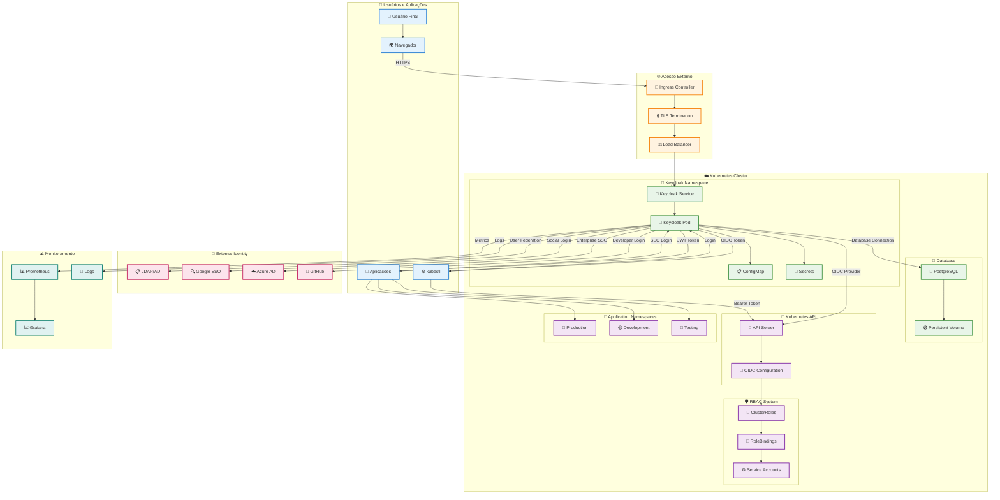
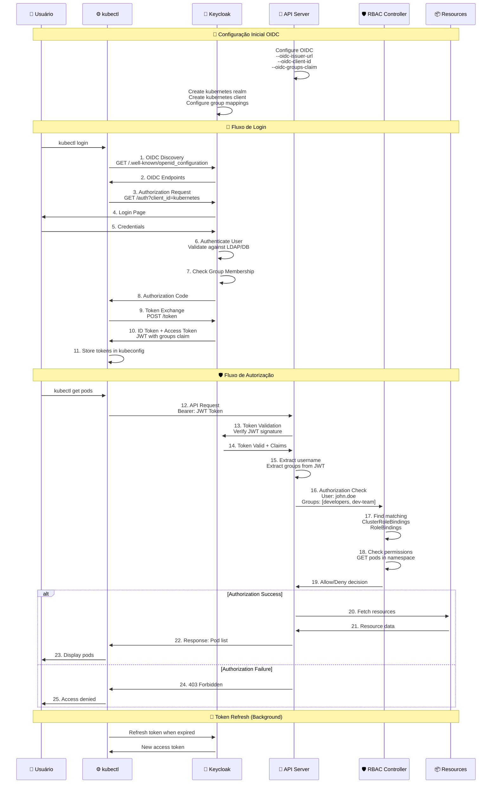

# Keycloak no Kubernetes: Instalação, Configuração e Gerenciamento

<div align="center">
  
  <br><br>
  <strong>Embracon Toolbox - DevOps & Cloud Solutions</strong>
</div>

Esta documentação abrange como instalar, configurar e gerenciar o **Keycloak** como provedor de identidade em clusters Kubernetes, incluindo integração com RBAC e gerenciamento centralizado de usuários.

## 📋 Índice

- [🚀 O que é Keycloak](#-o-que-é-keycloak)
- [🏗️ Instalação no Kubernetes](#️-instalação-no-kubernetes)
- [🔐 Configuração Inicial](#-configuração-inicial)
- [👥 Gerenciamento de Usuários](#-gerenciamento-de-usuários)
- [🔗 Integração com Kubernetes RBAC](#-integração-com-kubernetes-rbac)
- [🛡️ Configurações de Segurança](#️-configurações-de-segurança)
- [🔧 Troubleshooting](#-troubleshooting)

## 🚀 O que é Keycloak

**Keycloak** é uma solução open-source de gerenciamento de identidade e acesso que oferece:

### 🔑 **Principais Funcionalidades:**
- **Single Sign-On (SSO)** - Login único para múltiplas aplicações
- **Identity Brokering** - Integração com provedores externos (LDAP, Active Directory, Google, etc.)
- **User Federation** - Sincronização com sistemas existentes
- **Fine-grained Authorization** - Controle granular de permissões
- **Standard Protocols** - Suporte a OpenID Connect, OAuth 2.0, SAML 2.0
- **Multi-tenancy** - Múltiplos realms isolados

### 🎯 **Casos de Uso no Kubernetes:**
- **Autenticação centralizada** para cluster Kubernetes
- **SSO** para aplicações no cluster
- **Integração RBAC** com grupos e roles
- **API Gateway** authentication
- **Microservices** security

## 🏗️ Arquitetura da Solução Keycloak



### 🔍 Componentes da Arquitetura

#### **🔐 Camada de Identidade**
- **Keycloak Server**: Core do sistema de autenticação
- **PostgreSQL**: Armazenamento persistente de dados
- **Realms**: Isolamento multi-tenant

#### **🌐 Camada de Integração**
- **OIDC Provider**: Integração com Kubernetes API
- **Identity Federation**: Conexão com sistemas externos
- **Token Management**: JWT e refresh tokens

#### **🛡️ Camada de Autorização**
- **RBAC Integration**: Mapeamento grupos → roles
- **Service Accounts**: Contas para aplicações
- **Namespace Isolation**: Controle granular por ambiente

#### **📊 Camada de Observabilidade**
- **Metrics**: Prometheus integration
- **Logging**: Centralized log management
- **Monitoring**: Health checks e alertas

## 🏗️ Instalação no Kubernetes

### Método 1: Helm Chart (Recomendado)

```bash
# Adicionar repositório do Keycloak
helm repo add bitnami https://charts.bitnami.com/bitnami
helm repo update

# Criar namespace
kubectl create namespace keycloak

# Instalar Keycloak
helm install keycloak bitnami/keycloak \
  --namespace keycloak \
  --set auth.adminUser=admin \
  --set auth.adminPassword=admin123 \
  --set postgresql.auth.postgresPassword=postgres123 \
  --set service.type=ClusterIP \
  --set ingress.enabled=true \
  --set ingress.hostname=keycloak.local
```

### Método 2: Operator (Produção)

```bash
# Instalar Keycloak Operator
kubectl apply -f https://raw.githubusercontent.com/keycloak/keycloak-k8s-resources/main/kubernetes/keycloaks.k8s.keycloak.org-v1.yml
kubectl apply -f https://raw.githubusercontent.com/keycloak/keycloak-k8s-resources/main/kubernetes/keycloakrealmimports.k8s.keycloak.org-v1.yml

# Criar namespace
kubectl create namespace keycloak

# Deploy Keycloak via Operator
cat <<EOF | kubectl apply -f -
apiVersion: k8s.keycloak.org/v2alpha1
kind: Keycloak
metadata:
  name: keycloak
  namespace: keycloak
spec:
  instances: 1
  db:
    vendor: postgres
    host: postgres-service
    usernameSecret:
      name: keycloak-db-secret
      key: username
    passwordSecret:
      name: keycloak-db-secret
      key: password
  http:
    tlsSecret: keycloak-tls-secret
  hostname:
    hostname: keycloak.example.com
  ingress:
    enabled: true
EOF
```

### Método 3: Manifests Personalizados

```yaml
# keycloak-deployment.yaml
apiVersion: apps/v1
kind: Deployment
metadata:
  name: keycloak
  namespace: keycloak
  labels:
    app: keycloak
spec:
  replicas: 1
  selector:
    matchLabels:
      app: keycloak
  template:
    metadata:
      labels:
        app: keycloak
    spec:
      containers:
      - name: keycloak
        image: quay.io/keycloak/keycloak:23.0.3
        args: ["start-dev"]
        env:
        - name: KEYCLOAK_ADMIN
          value: "admin"
        - name: KEYCLOAK_ADMIN_PASSWORD
          value: "admin123"
        - name: KC_PROXY
          value: "edge"
        ports:
        - name: http
          containerPort: 8080
        readinessProbe:
          httpGet:
            path: /realms/master
            port: 8080
---
apiVersion: v1
kind: Service
metadata:
  name: keycloak
  namespace: keycloak
spec:
  selector:
    app: keycloak
  ports:
  - name: http
    port: 8080
    targetPort: 8080
  type: ClusterIP
---
apiVersion: networking.k8s.io/v1
kind: Ingress
metadata:
  name: keycloak
  namespace: keycloak
  annotations:
    nginx.ingress.kubernetes.io/proxy-buffer-size: "128k"
    nginx.ingress.kubernetes.io/proxy-buffers-number: "4"
spec:
  rules:
  - host: keycloak.local
    http:
      paths:
      - path: /
        pathType: Prefix
        backend:
          service:
            name: keycloak
            port:
              number: 8080
```

### Verificar Instalação

```bash
# Verificar pods
kubectl get pods -n keycloak

# Verificar serviços
kubectl get svc -n keycloak

# Verificar ingress
kubectl get ingress -n keycloak

# Logs do Keycloak
kubectl logs -n keycloak deployment/keycloak
```

## 🔐 Configuração Inicial

### 1. Acesso ao Admin Console

```bash
# Port-forward para acesso local
kubectl port-forward -n keycloak svc/keycloak 8080:8080

# Acessar: http://localhost:8080
# Login: admin / admin123
```

### 2. Criar Realm para Kubernetes

```bash
# Via Admin Console:
# 1. Master realm -> Dropdown -> Add Realm
# 2. Name: "kubernetes"
# 3. Enabled: ON
# 4. Create
```

### 3. Configurar Client para Kubernetes

```json
{
  "clientId": "kubernetes",
  "name": "Kubernetes Cluster",
  "protocol": "openid-connect",
  "clientAuthenticatorType": "client-secret",
  "secret": "kubernetes-client-secret",
  "redirectUris": [
    "http://localhost:8000",
    "https://kubernetes-dashboard.local/*"
  ],
  "webOrigins": [
    "https://kubernetes-dashboard.local"
  ],
  "publicClient": false,
  "bearerOnly": false,
  "consentRequired": false,
  "standardFlowEnabled": true,
  "implicitFlowEnabled": false,
  "directAccessGrantsEnabled": true,
  "serviceAccountsEnabled": false,
  "frontchannelLogout": true,
  "fullScopeAllowed": true,
  "attributes": {
    "saml.assertion.signature": "false",
    "saml.force.post.binding": "false",
    "saml.multivalued.roles": "false",
    "saml.encrypt": "false",
    "saml_force_name_id_format": "false",
    "saml.client.signature": "false",
    "tls.client.certificate.bound.access.tokens": "false",
    "saml.authnstatement": "false",
    "display.on.consent.screen": "false",
    "saml.onetimeuse.condition": "false"
  }
}
```

### 4. Configurar Mappers

```bash
# Criar Group Mapper
# Client -> kubernetes -> Mappers -> Create
# Name: "groups"
# Mapper Type: "Group Membership"
# Token Claim Name: "groups"
# Full group path: OFF
# Add to ID token: ON
# Add to access token: ON
```

## 👥 Gerenciamento de Usuários

### 1. Criar Grupos

```bash
# Via Admin Console:
# Realm: kubernetes -> Groups -> New

# Criar grupos hierárquicos:
# - admins
#   - cluster-admins
#   - namespace-admins
# - developers
#   - dev-team
#   - qa-team
# - viewers
#   - read-only
```

### 2. Criar Usuários

```json
{
  "username": "john.doe",
  "email": "john.doe@example.com",
  "firstName": "John",
  "lastName": "Doe",
  "enabled": true,
  "emailVerified": true,
  "credentials": [
    {
      "type": "password",
      "value": "password123",
      "temporary": false
    }
  ],
  "groups": [
    "/developers/dev-team"
  ],
  "attributes": {
    "department": ["engineering"],
    "location": ["sao-paulo"]
  }
}
```

### 3. Bulk Import via REST API

```bash
# Obter token admin
ADMIN_TOKEN=$(curl -s -X POST http://keycloak.local:8080/realms/master/protocol/openid-connect/token \
  -H "Content-Type: application/x-www-form-urlencoded" \
  -d "grant_type=password" \
  -d "client_id=admin-cli" \
  -d "username=admin" \
  -d "password=admin123" | jq -r '.access_token')

# Criar usuário via API
curl -X POST http://keycloak.local:8080/admin/realms/kubernetes/users \
  -H "Authorization: Bearer $ADMIN_TOKEN" \
  -H "Content-Type: application/json" \
  -d '{
    "username": "api-user",
    "email": "api-user@example.com",
    "enabled": true,
    "credentials": [
      {
        "type": "password",
        "value": "password123",
        "temporary": false
      }
    ]
  }'
```

### 4. Configurar User Federation

#### LDAP Integration

```json
{
  "providerId": "ldap",
  "providerType": "org.keycloak.storage.UserStorageProvider",
  "name": "ldap-provider",
  "config": {
    "connectionUrl": ["ldap://ldap.example.com:389"],
    "usersDn": ["ou=users,dc=example,dc=com"],
    "bindDn": ["cn=admin,dc=example,dc=com"],
    "bindCredential": ["admin-password"],
    "userObjectClasses": ["inetOrgPerson, organizationalPerson"],
    "usernameLDAPAttribute": ["uid"],
    "rdnLDAPAttribute": ["uid"],
    "uuidLDAPAttribute": ["entryUUID"],
    "userLDAPFilter": [""],
    "searchScope": ["1"],
    "validatePasswordPolicy": ["false"],
    "trustEmail": ["false"],
    "useTruststoreSpi": ["ldapsOnly"],
    "connectionPooling": ["true"],
    "pagination": ["true"],
    "allowKerberosAuthentication": ["false"],
    "debug": ["false"],
    "useKerberosForPasswordAuthentication": ["false"]
  }
}
```

## 🔗 Integração com Kubernetes RBAC

### 🔄 Fluxo de Autenticação OIDC com Keycloak



### 🔍 Componentes do Fluxo OIDC

| Componente | Função | Configuração |
|-----------|--------|-------------|
| **🔑 Keycloak** | Identity Provider | Realm, Client, Group Mappers |
| **🎯 API Server** | Resource Server | OIDC flags, CA certificates |
| **⚙️ kubectl** | OIDC Client | kubeconfig com OIDC provider |
| **🛡️ RBAC** | Authorization | ClusterRoles, RoleBindings |
| **🎫 JWT Token** | Identity Proof | Username + Groups claims |

### 1. Configurar OIDC no API Server

```yaml
# /etc/kubernetes/manifests/kube-apiserver.yaml
apiVersion: v1
kind: Pod
metadata:
  name: kube-apiserver
spec:
  containers:
  - command:
    - kube-apiserver
    - --oidc-issuer-url=http://keycloak.local:8080/realms/kubernetes
    - --oidc-client-id=kubernetes
    - --oidc-username-claim=preferred_username
    - --oidc-groups-claim=groups
    - --oidc-ca-file=/etc/ssl/certs/ca-certificates.crt
```

### 2. Criar RBAC Bindings

```yaml
# cluster-admin-binding.yaml
apiVersion: rbac.authorization.k8s.io/v1
kind: ClusterRoleBinding
metadata:
  name: keycloak-cluster-admins
roleRef:
  apiGroup: rbac.authorization.k8s.io
  kind: ClusterRole
  name: cluster-admin
subjects:
- kind: Group
  name: /admins/cluster-admins
  apiGroup: rbac.authorization.k8s.io
---
# namespace-admin-binding.yaml
apiVersion: rbac.authorization.k8s.io/v1
kind: RoleBinding
metadata:
  name: keycloak-namespace-admins
  namespace: development
roleRef:
  apiGroup: rbac.authorization.k8s.io
  kind: ClusterRole
  name: admin
subjects:
- kind: Group
  name: /admins/namespace-admins
  apiGroup: rbac.authorization.k8s.io
---
# developers-binding.yaml
apiVersion: rbac.authorization.k8s.io/v1
kind: ClusterRole
metadata:
  name: developer-role
rules:
- apiGroups: [""]
  resources: ["pods", "services", "configmaps", "secrets"]
  verbs: ["get", "list", "watch", "create", "update", "patch", "delete"]
- apiGroups: ["apps"]
  resources: ["deployments", "replicasets"]
  verbs: ["get", "list", "watch", "create", "update", "patch", "delete"]
---
apiVersion: rbac.authorization.k8s.io/v1
kind: RoleBinding
metadata:
  name: keycloak-developers
  namespace: development
roleRef:
  apiGroup: rbac.authorization.k8s.io
  kind: ClusterRole
  name: developer-role
subjects:
- kind: Group
  name: /developers
  apiGroup: rbac.authorization.k8s.io
```

### 🏗️ Estrutura de Grupos e Mapeamento RBAC

```mermaid
graph TB
    subgraph "🔑 Keycloak Groups (Hierarchical)"
        ROOT[📁 Root Groups]
        
        subgraph "👑 Administrators"
            ADMIN_ROOT[👑 /admins]
            CLUSTER_ADMIN[🌐 /admins/cluster-admins]
            NS_ADMIN[📁 /admins/namespace-admins]
            SECURITY_ADMIN[🛡️ /admins/security-admins]
        end

        subgraph "👨‍💻 Developers"
            DEV_ROOT[👨‍💻 /developers]
            SENIOR_DEV[⭐ /developers/senior-devs]
            JUNIOR_DEV[🌱 /developers/junior-devs]
            QA_TEAM[🧪 /developers/qa-team]
            DEVOPS_TEAM[🚀 /developers/devops-team]
        end

        subgraph "👀 Viewers"
            VIEWER_ROOT[👀 /viewers]
            READ_ONLY[📖 /viewers/read-only]
            MONITORING[📊 /viewers/monitoring]
            AUDIT[📋 /viewers/audit]
        end

        ROOT --> ADMIN_ROOT
        ROOT --> DEV_ROOT
        ROOT --> VIEWER_ROOT
        
        ADMIN_ROOT --> CLUSTER_ADMIN
        ADMIN_ROOT --> NS_ADMIN
        ADMIN_ROOT --> SECURITY_ADMIN
        
        DEV_ROOT --> SENIOR_DEV
        DEV_ROOT --> JUNIOR_DEV
        DEV_ROOT --> QA_TEAM
        DEV_ROOT --> DEVOPS_TEAM
        
        VIEWER_ROOT --> READ_ONLY
        VIEWER_ROOT --> MONITORING
        VIEWER_ROOT --> AUDIT
    end

    subgraph "🛡️ Kubernetes RBAC"
        subgraph "🌐 Cluster-Level Roles"
            CR_ADMIN[👑 cluster-admin]
            CR_VIEW[👀 view]
            CR_EDIT[✏️ edit]
            CR_CUSTOM[🔧 custom-developer-role]
            CR_SECURITY[🛡️ security-role]
        end

        subgraph "🔗 Cluster Bindings"
            CRB_ADMIN[🔗 cluster-admin-binding]
            CRB_DEV[🔗 developers-binding]
            CRB_VIEW[🔗 viewers-binding]
            CRB_SECURITY[🔗 security-binding]
        end

        subgraph "📁 Namespace-Level"
            subgraph "🔴 Production Namespace"
                R_PROD_ADMIN[👑 prod-admin-role]
                RB_PROD_ADMIN[🔗 prod-admin-binding]
                R_PROD_DEPLOY[🚀 prod-deployer-role]
                RB_PROD_DEPLOY[🔗 prod-deployer-binding]
            end

            subgraph "🟡 Development Namespace"
                R_DEV_FULL[👨‍💻 dev-full-access]
                RB_DEV_FULL[🔗 dev-full-binding]
                R_DEV_READONLY[📖 dev-readonly]
                RB_DEV_READONLY[🔗 dev-readonly-binding]
            end

            subgraph "🔵 Testing Namespace"
                R_TEST_QA[🧪 qa-role]
                RB_TEST_QA[🔗 qa-binding]
                R_TEST_VIEW[👀 test-viewer]
                RB_TEST_VIEW[🔗 test-viewer-binding]
            end
        end
    end

    %% Mapeamento Cluster-Level
    CLUSTER_ADMIN --> CRB_ADMIN
    CRB_ADMIN --> CR_ADMIN

    SENIOR_DEV --> CRB_DEV
    DEVOPS_TEAM --> CRB_DEV
    CRB_DEV --> CR_CUSTOM

    READ_ONLY --> CRB_VIEW
    MONITORING --> CRB_VIEW
    CRB_VIEW --> CR_VIEW

    SECURITY_ADMIN --> CRB_SECURITY
    CRB_SECURITY --> CR_SECURITY

    %% Mapeamento Production Namespace
    NS_ADMIN --> RB_PROD_ADMIN
    RB_PROD_ADMIN --> R_PROD_ADMIN
    
    DEVOPS_TEAM --> RB_PROD_DEPLOY
    RB_PROD_DEPLOY --> R_PROD_DEPLOY

    %% Mapeamento Development Namespace
    SENIOR_DEV --> RB_DEV_FULL
    JUNIOR_DEV --> RB_DEV_FULL
    RB_DEV_FULL --> R_DEV_FULL

    AUDIT --> RB_DEV_READONLY
    RB_DEV_READONLY --> R_DEV_READONLY

    %% Mapeamento Testing Namespace
    QA_TEAM --> RB_TEST_QA
    RB_TEST_QA --> R_TEST_QA

    MONITORING --> RB_TEST_VIEW
    RB_TEST_VIEW --> R_TEST_VIEW

    %% Estilos
    classDef keycloakStyle fill:#e8f5e8,stroke:#2e7d32,stroke-width:2px
    classDef adminStyle fill:#ffebee,stroke:#c62828,stroke-width:2px
    classDef devStyle fill:#e3f2fd,stroke:#1565c0,stroke-width:2px
    classDef viewerStyle fill:#fff3e0,stroke:#ef6c00,stroke-width:2px
    classDef k8sStyle fill:#f3e5f5,stroke:#6a1b9a,stroke-width:2px
    classDef namespaceStyle fill:#e0f2f1,stroke:#00695c,stroke-width:2px

    class ROOT,ADMIN_ROOT,DEV_ROOT,VIEWER_ROOT keycloakStyle
    class CLUSTER_ADMIN,NS_ADMIN,SECURITY_ADMIN,CR_ADMIN,CRB_ADMIN,CR_SECURITY,CRB_SECURITY adminStyle
    class SENIOR_DEV,JUNIOR_DEV,QA_TEAM,DEVOPS_TEAM,CR_EDIT,CR_CUSTOM,CRB_DEV devStyle
    class READ_ONLY,MONITORING,AUDIT,CR_VIEW,CRB_VIEW viewerStyle
    class R_PROD_ADMIN,RB_PROD_ADMIN,R_DEV_FULL,RB_DEV_FULL,R_TEST_QA,RB_TEST_QA k8sStyle
    class R_PROD_DEPLOY,RB_PROD_DEPLOY,R_DEV_READONLY,RB_DEV_READONLY,R_TEST_VIEW,RB_TEST_VIEW namespaceStyle
```



### 📊 Matriz de Permissões por Grupo

| Keycloak Group | Kubernetes Role | Scope | Permissões | Recursos |
|----------------|----------------|--------|------------|----------|
| 🌐 `/admins/cluster-admins` | cluster-admin | Cluster | Todas | Todos os recursos |
| 📁 `/admins/namespace-admins` | admin | Namespace específico | Gerenciar namespace | Todos exceto RBAC |
| 🛡️ `/admins/security-admins` | security-role | Cluster | Auditoria + RBAC | Secrets, RBAC, Policies |
| ⭐ `/developers/senior-devs` | developer-role | Multi-namespace | Deploy + Debug | Pods, Services, Deployments |
| 🌱 `/developers/junior-devs` | developer-role | Development | Desenvolvimento | Pods, ConfigMaps, Logs |
| 🧪 `/developers/qa-team` | qa-role | Testing | Teste + Validação | Pods, Services, Jobs |
| 🚀 `/developers/devops-team` | deployer-role | Production | Deploy produção | Deployments, Services |
| 📖 `/viewers/read-only` | view | Cluster | Apenas leitura | Visualização de recursos |
| 📊 `/viewers/monitoring` | monitoring-role | Cluster | Métricas + Logs | Metrics, Logs, Events |
| 📋 `/viewers/audit` | audit-role | Cluster | Auditoria | Logs, Events, RBAC |

### 3. Configurar kubectl para OIDC

```bash
# Instalar oidc-login plugin
kubectl krew install oidc-login

# Configurar kubeconfig
kubectl config set-credentials oidc \
  --exec-api-version=client.authentication.k8s.io/v1beta1 \
  --exec-command=kubectl \
  --exec-arg=oidc-login \
  --exec-arg=get-token \
  --exec-arg=--oidc-issuer-url=http://keycloak.local:8080/realms/kubernetes \
  --exec-arg=--oidc-client-id=kubernetes \
  --exec-arg=--oidc-client-secret=kubernetes-client-secret

# Usar contexto OIDC
kubectl config set-context oidc \
  --cluster=kubernetes \
  --user=oidc

kubectl config use-context oidc
```

## 🛡️ Configurações de Segurança

### 🔐 Arquitetura de Segurança e Monitoramento

```mermaid
graph TB
    subgraph "🌍 External Access"
        INTERNET[🌐 Internet]
        CDN[⚡ CDN/WAF]
        LB[⚖️ Load Balancer]
    end

    subgraph "🛡️ Security Perimeter"
        FIREWALL[🔥 Firewall]
        VPN[🔒 VPN Gateway]
        BASTION[🏰 Bastion Host]
    end

    subgraph "☁️ Kubernetes Cluster Security"
        subgraph "🚪 Ingress Security"
            INGRESS[🌐 Ingress Controller]
            TLS_TERM[🔒 TLS Termination]
            RATE_LIMIT[⏱️ Rate Limiting]
            WAF_RULES[🛡️ WAF Rules]
        end

        subgraph "🔑 Keycloak Security"
            KC_POD[🔑 Keycloak Pod]
            KC_CONFIG[📋 Security Config]
            KC_SECRETS[🔐 Secrets Management]
            KC_TLS[🔒 Internal TLS]
            
            subgraph "🛡️ Keycloak Security Features"
                MFA[🔢 Multi-Factor Auth]
                BRUTE_FORCE[🚫 Brute Force Protection]
                PASSWORD_POLICY[🔑 Password Policies]
                SESSION_MGT[⏰ Session Management]
                AUDIT_LOG[📝 Audit Logging]
            end
        end

        subgraph "💾 Database Security"
            POSTGRES[🐘 PostgreSQL]
            DB_ENCRYPTION[🔐 Data Encryption]
            DB_BACKUP[💿 Encrypted Backups]
            DB_SECRETS[🔑 DB Credentials]
        end

        subgraph "🎯 API Server Security"
            API_SERVER[🎯 Kubernetes API]
            OIDC_VALIDATION[✅ OIDC Token Validation]
            RBAC_ENGINE[🛡️ RBAC Engine]
            ADMISSION_CTRL[🚦 Admission Controllers]
        end

        subgraph "📊 Monitoring & Alerting"
            PROMETHEUS[📊 Prometheus]
            GRAFANA[📈 Grafana]
            ALERTMANAGER[🚨 AlertManager]
            LOG_AGGREGATOR[📝 Log Aggregation]
            SIEM[🔍 SIEM Integration]
        end

        subgraph "🔒 Secret Management"
            VAULT[🔐 HashiCorp Vault]
            SEALED_SECRETS[📦 Sealed Secrets]
            EXTERNAL_SECRETS[🔗 External Secrets]
        end

        subgraph "🌐 Network Security"
            NETWORK_POLICIES[🚧 Network Policies]
            SERVICE_MESH[🕸️ Service Mesh]
            MTLS[🔒 mTLS]
        end
    end

    subgraph "🔍 Security Monitoring"
        SECURITY_DASHBOARD[📊 Security Dashboard]
        COMPLIANCE_REPORTS[📋 Compliance Reports]
        THREAT_DETECTION[⚠️ Threat Detection]
        INCIDENT_RESPONSE[🚨 Incident Response]
    end

    %% External Access Flow
    INTERNET --> CDN
    CDN --> LB
    LB --> FIREWALL
    FIREWALL --> VPN
    VPN --> BASTION

    %% Ingress Security
    BASTION --> INGRESS
    INGRESS --> TLS_TERM
    TLS_TERM --> RATE_LIMIT
    RATE_LIMIT --> WAF_RULES

    %% Keycloak Security Flow
    WAF_RULES --> KC_POD
    KC_POD --> KC_CONFIG
    KC_POD --> KC_SECRETS
    KC_POD --> KC_TLS

    KC_POD --> MFA
    KC_POD --> BRUTE_FORCE
    KC_POD --> PASSWORD_POLICY
    KC_POD --> SESSION_MGT
    KC_POD --> AUDIT_LOG

    %% Database Security
    KC_POD --> POSTGRES
    POSTGRES --> DB_ENCRYPTION
    POSTGRES --> DB_BACKUP
    DB_SECRETS --> POSTGRES

    %% API Security
    KC_POD --> API_SERVER
    API_SERVER --> OIDC_VALIDATION
    API_SERVER --> RBAC_ENGINE
    API_SERVER --> ADMISSION_CTRL

    %% Secret Management
    KC_SECRETS --> VAULT
    DB_SECRETS --> SEALED_SECRETS
    VAULT --> EXTERNAL_SECRETS

    %% Network Security
    KC_POD --> NETWORK_POLICIES
    NETWORK_POLICIES --> SERVICE_MESH
    SERVICE_MESH --> MTLS

    %% Monitoring Flow
    KC_POD --> PROMETHEUS
    POSTGRES --> PROMETHEUS
    API_SERVER --> PROMETHEUS
    PROMETHEUS --> GRAFANA
    PROMETHEUS --> ALERTMANAGER
    AUDIT_LOG --> LOG_AGGREGATOR
    LOG_AGGREGATOR --> SIEM

    %% Security Analytics
    PROMETHEUS --> SECURITY_DASHBOARD
    GRAFANA --> SECURITY_DASHBOARD
    SIEM --> COMPLIANCE_REPORTS
    SIEM --> THREAT_DETECTION
    THREAT_DETECTION --> INCIDENT_RESPONSE

    %% Estilos
    classDef externalStyle fill:#ffebee,stroke:#c62828,stroke-width:2px
    classDef perimeterStyle fill:#fff3e0,stroke:#ef6c00,stroke-width:2px
    classDef ingressStyle fill:#e8f5e8,stroke:#2e7d32,stroke-width:2px
    classDef keycloakStyle fill:#e3f2fd,stroke:#1565c0,stroke-width:2px
    classDef dbStyle fill:#f3e5f5,stroke:#6a1b9a,stroke-width:2px
    classDef k8sStyle fill:#e0f2f1,stroke:#00695c,stroke-width:2px
    classDef monitoringStyle fill:#fce4ec,stroke:#ad1457,stroke-width:2px
    classDef secretStyle fill:#e1f5fe,stroke:#0277bd,stroke-width:2px
    classDef networkStyle fill:#f9fbe7,stroke:#689f38,stroke-width:2px
    classDef securityStyle fill:#fff8e1,stroke:#f57f17,stroke-width:2px

    class INTERNET,CDN,LB externalStyle
    class FIREWALL,VPN,BASTION perimeterStyle
    class INGRESS,TLS_TERM,RATE_LIMIT,WAF_RULES ingressStyle
    class KC_POD,KC_CONFIG,KC_SECRETS,KC_TLS,MFA,BRUTE_FORCE,PASSWORD_POLICY,SESSION_MGT,AUDIT_LOG keycloakStyle
    class POSTGRES,DB_ENCRYPTION,DB_BACKUP,DB_SECRETS dbStyle
    class API_SERVER,OIDC_VALIDATION,RBAC_ENGINE,ADMISSION_CTRL k8sStyle
    class PROMETHEUS,GRAFANA,ALERTMANAGER,LOG_AGGREGATOR,SIEM monitoringStyle
    class VAULT,SEALED_SECRETS,EXTERNAL_SECRETS secretStyle
    class NETWORK_POLICIES,SERVICE_MESH,MTLS networkStyle
    class SECURITY_DASHBOARD,COMPLIANCE_REPORTS,THREAT_DETECTION,INCIDENT_RESPONSE securityStyle
```



### 🛡️ Camadas de Segurança

| Camada | Componente | Proteção | Configuração |
|---------|------------|----------|-------------|
| **🌐 Perimeter** | Firewall + WAF | DDoS, SQL Injection | Rate limiting, Geo-blocking |
| **🚪 Ingress** | TLS + Authentication | MITM, Unauthorized access | Certificates, OIDC |
| **🔑 Identity** | Keycloak | Authentication, MFA | Password policies, Brute force protection |
| **🎯 Authorization** | Kubernetes RBAC | Privilege escalation | Least privilege, Group mapping |
| **💾 Data** | Encryption | Data breach | At-rest + in-transit encryption |
| **🌐 Network** | Network Policies | Lateral movement | Zero-trust networking |
| **📊 Monitoring** | Logs + Metrics | Security events | Real-time alerting, SIEM |

### 🚨 Security Checklist

#### **🔐 Keycloak Security**
- ✅ HTTPS obrigatório (TLS 1.2+)
- ✅ Políticas de senha robustas
- ✅ Multi-Factor Authentication habilitado
- ✅ Proteção contra brute force ativada
- ✅ Sessões com timeout configurado
- ✅ Logs de auditoria habilitados
- ✅ Backup do banco criptografado

#### **☁️ Kubernetes Security**
- ✅ RBAC configurado com princípio do menor privilégio
- ✅ Network Policies implementadas
- ✅ Pod Security Standards aplicadas
- ✅ Secrets criptografadas no etcd
- ✅ Admission Controllers configurados
- ✅ Regular security scans

#### **📊 Monitoring Security**
- ✅ Métricas de segurança coletadas
- ✅ Alertas para eventos suspeitos
- ✅ Logs centralizados e protegidos
- ✅ Dashboards de segurança configurados
- ✅ Integração com SIEM
- ✅ Incident response procedures

### 1. Configurar TLS

```yaml
# keycloak-tls-secret.yaml
apiVersion: v1
kind: Secret
metadata:
  name: keycloak-tls-secret
  namespace: keycloak
type: kubernetes.io/tls
data:
  tls.crt: LS0tLS1CRUdJTi...  # Base64 encoded certificate
  tls.key: LS0tLS1CRUdJTi...  # Base64 encoded private key
```

### 2. Configurar Políticas de Senha

```json
{
  "passwordPolicy": "length(8) and digits(1) and lowerCase(1) and upperCase(1) and specialChars(1) and notUsername",
  "attributes": {
    "bruteForceProtected": "true",
    "maxFailureWaitSeconds": "900",
    "minimumQuickLoginWaitSeconds": "60",
    "waitIncrementSeconds": "60",
    "quickLoginCheckMilliSeconds": "1000",
    "maxDeltaTimeSeconds": "43200",
    "failureFactor": "30"
  }
}
```

### 3. Configurar Autenticação Multi-Fator

```bash
# Habilitar OTP
# Realm Settings -> Authentication -> Flows -> Browser
# Add OTP Form execution
# Set to REQUIRED
```

### 4. Configurar Auditoria

```json
{
  "eventsEnabled": true,
  "eventsExpiration": 604800,
  "eventsListeners": ["jboss-logging"],
  "enabledEventTypes": [
    "LOGIN",
    "LOGIN_ERROR",
    "LOGOUT",
    "USER_INFO_REQUEST",
    "PERMISSION_TOKEN",
    "CODE_TO_TOKEN",
    "REFRESH_TOKEN"
  ],
  "adminEventsEnabled": true,
  "adminEventsDetailsEnabled": true
}
```

## 🔧 Troubleshooting

### 1. Keycloak não inicia

```bash
# Verificar logs
kubectl logs -n keycloak deployment/keycloak

# Problemas comuns:
# - Banco de dados não acessível
# - Configuração de proxy incorreta
# - Recursos insuficientes

# Verificar recursos
kubectl describe pod -n keycloak -l app=keycloak
```

### 2. Autenticação OIDC falha

```bash
# Verificar configuração do API server
kubectl describe pod -n kube-system kube-apiserver

# Testar conectividade do Keycloak
curl -k http://keycloak.local:8080/realms/kubernetes/.well-known/openid_configuration

# Verificar certificados
openssl s_client -connect keycloak.local:443 -showcerts
```

### 3. Usuários não conseguem autenticar

```bash
# Verificar grupos no token
# Admin Console -> Realm Settings -> Keys -> RS256 -> Certificate
# Usar jwt.io para decodificar token

# Verificar RBAC bindings
kubectl get clusterrolebinding,rolebinding --all-namespaces | grep keycloak

# Testar permissões
kubectl auth can-i get pods --as=system:user:john.doe --as-group=/developers/dev-team
```

### 4. Performance Issues

```bash
# Verificar métricas
kubectl top pod -n keycloak

# Configurar recursos adequados
kubectl patch deployment keycloak -n keycloak -p '{
  "spec": {
    "template": {
      "spec": {
        "containers": [
          {
            "name": "keycloak",
            "resources": {
              "requests": {"memory": "1Gi", "cpu": "500m"},
              "limits": {"memory": "2Gi", "cpu": "1000m"}
            }
          }
        ]
      }
    }
  }
}'
```

### 5. Backup e Restore

```bash
# Backup do banco de dados
kubectl exec -n keycloak deployment/postgres -- pg_dump -U keycloak keycloak > keycloak-backup.sql

# Export de realm
curl -X GET "http://keycloak.local:8080/admin/realms/kubernetes" \
  -H "Authorization: Bearer $ADMIN_TOKEN" > kubernetes-realm-export.json

# Import de realm
curl -X POST "http://keycloak.local:8080/admin/realms" \
  -H "Authorization: Bearer $ADMIN_TOKEN" \
  -H "Content-Type: application/json" \
  -d @kubernetes-realm-export.json
```

## 📊 Monitoramento e Métricas

### 1. Configurar Prometheus Metrics

```yaml
# keycloak-servicemonitor.yaml
apiVersion: monitoring.coreos.com/v1
kind: ServiceMonitor
metadata:
  name: keycloak
  namespace: keycloak
spec:
  selector:
    matchLabels:
      app: keycloak
  endpoints:
  - port: http
    path: /metrics
```

### 2. Dashboard Grafana

```json
{
  "dashboard": {
    "title": "Keycloak Metrics",
    "panels": [
      {
        "title": "Active Sessions",
        "type": "stat",
        "targets": [
          {
            "expr": "keycloak_user_sessions_total"
          }
        ]
      },
      {
        "title": "Login Rate",
        "type": "graph",
        "targets": [
          {
            "expr": "rate(keycloak_logins_total[5m])"
          }
        ]
      }
    ]
  }
}
```

## 🧪 Testes e Validação

### 🌐 Topologia de Rede e Conectividade

```mermaid
graph TB
    subgraph "🌍 Internet Zone"
        USER[👤 End User]
        ADMIN[👨‍💼 Administrator]
        DEVELOPER[👨‍💻 Developer]
    end

    subgraph "🛡️ DMZ (Perimeter Network)"
        LB[⚖️ Load Balancer<br/>Public IP]
        WAF[🛡️ Web Application Firewall<br/>Security Rules]
        VPN_GW[🔒 VPN Gateway<br/>Admin Access]
    end

    subgraph "☁️ Kubernetes Cluster Network"
        subgraph "🚪 Ingress Tier (10.0.1.0/24)"
            NGINX_INGRESS[🌐 NGINX Ingress<br/>443/tcp, 80/tcp]
            CERT_MANAGER[📜 Cert Manager<br/>Let's Encrypt]
        end

        subgraph "🔑 Identity Tier (10.0.2.0/24)"
            KC_SVC[🔑 Keycloak Service<br/>ClusterIP: 8080]
            KC_POD_1[🔑 Keycloak Pod 1<br/>10.0.2.10:8080]
            KC_POD_2[🔑 Keycloak Pod 2<br/>10.0.2.11:8080]
            KC_POD_3[🔑 Keycloak Pod 3<br/>10.0.2.12:8080]
        end

        subgraph "💾 Data Tier (10.0.3.0/24)"
            POSTGRES_SVC[🐘 PostgreSQL Service<br/>ClusterIP: 5432]
            POSTGRES_MASTER[🐘 PostgreSQL Master<br/>10.0.3.10:5432]
            POSTGRES_REPLICA[🐘 PostgreSQL Replica<br/>10.0.3.11:5432]
            PVC_STORAGE[💾 Persistent Storage<br/>Encrypted]
        end

        subgraph "🎯 Control Plane (10.0.0.0/24)"
            API_SERVER[🎯 Kubernetes API<br/>6443/tcp]
            ETCD[🗄️ etcd Cluster<br/>2379/tcp]
            SCHEDULER[⚙️ Scheduler]
            CONTROLLER[🎛️ Controller Manager]
        end

        subgraph "📊 Monitoring Tier (10.0.4.0/24)"
            PROMETHEUS[📊 Prometheus<br/>9090/tcp]
            GRAFANA_SVC[📈 Grafana Service<br/>3000/tcp]
            ALERTMANAGER[🚨 AlertManager<br/>9093/tcp]
            LOKI[📝 Loki Logs<br/>3100/tcp]
        end

        subgraph "🔒 Secret Management (10.0.5.0/24)"
            VAULT_SVC[🔐 HashiCorp Vault<br/>8200/tcp]
            SEALED_SECRET_CTRL[📦 Sealed Secrets<br/>Controller]
            EXTERNAL_SECRET_OP[🔗 External Secrets<br/>Operator]
        end
    end

    subgraph "🏢 Corporate Network (Private)"
        LDAP_SERVER[📁 LDAP/AD Server<br/>389/636/tcp]
        SIEM_SYSTEM[🔍 SIEM System<br/>Security Analytics]
        BACKUP_SYSTEM[💿 Backup Server<br/>Encrypted Backups]
    end

    %% User Access Flows
    USER --> LB
    ADMIN --> VPN_GW
    DEVELOPER --> VPN_GW

    %% DMZ to Cluster
    LB --> WAF
    WAF --> NGINX_INGRESS
    VPN_GW --> API_SERVER

    %% Ingress to Services
    NGINX_INGRESS --> KC_SVC
    NGINX_INGRESS --> GRAFANA_SVC
    CERT_MANAGER --> NGINX_INGRESS

    %% Service Discovery
    KC_SVC --> KC_POD_1
    KC_SVC --> KC_POD_2
    KC_SVC --> KC_POD_3

    %% Database Connectivity
    KC_POD_1 --> POSTGRES_SVC
    KC_POD_2 --> POSTGRES_SVC
    KC_POD_3 --> POSTGRES_SVC
    POSTGRES_SVC --> POSTGRES_MASTER
    POSTGRES_MASTER --> POSTGRES_REPLICA
    POSTGRES_MASTER --> PVC_STORAGE

    %% Control Plane
    KC_POD_1 --> API_SERVER
    KC_POD_2 --> API_SERVER
    KC_POD_3 --> API_SERVER
    API_SERVER --> ETCD
    API_SERVER --> SCHEDULER
    API_SERVER --> CONTROLLER

    %% Monitoring Flows
    KC_POD_1 --> PROMETHEUS
    KC_POD_2 --> PROMETHEUS
    KC_POD_3 --> PROMETHEUS
    POSTGRES_MASTER --> PROMETHEUS
    PROMETHEUS --> GRAFANA_SVC
    PROMETHEUS --> ALERTMANAGER

    %% Secret Management
    KC_POD_1 --> VAULT_SVC
    KC_POD_2 --> VAULT_SVC
    KC_POD_3 --> VAULT_SVC
    VAULT_SVC --> SEALED_SECRET_CTRL
    SEALED_SECRET_CTRL --> EXTERNAL_SECRET_OP

    %% External Integrations
    KC_POD_1 --> LDAP_SERVER
    KC_POD_2 --> LDAP_SERVER
    KC_POD_3 --> LDAP_SERVER
    PROMETHEUS --> SIEM_SYSTEM
    LOKI --> SIEM_SYSTEM
    POSTGRES_MASTER --> BACKUP_SYSTEM

    %% Network Policies (Security Boundaries)
    NGINX_INGRESS -.->|🚧 Network Policy| KC_SVC
    KC_SVC -.->|🚧 Network Policy| POSTGRES_SVC
    KC_SVC -.->|🚧 Network Policy| VAULT_SVC
    PROMETHEUS -.->|🚧 Network Policy| KC_SVC

    %% Port and Protocol Labels
    LB -.->|"🔌 HTTPS:443<br/>HTTP:80"| WAF
    NGINX_INGRESS -.->|"🔌 HTTP:8080"| KC_SVC
    KC_SVC -.->|"🔌 PostgreSQL:5432"| POSTGRES_SVC
    KC_SVC -.->|"🔌 HTTPS:8200"| VAULT_SVC
    PROMETHEUS -.->|"🔌 HTTP:8080/metrics"| KC_SVC

    %% Network Zones
    classDef internetZone fill:#ffebee,stroke:#c62828,stroke-width:2px
    classDef dmzZone fill:#fff3e0,stroke:#ef6c00,stroke-width:2px
    classDef ingressZone fill:#e8f5e8,stroke:#2e7d32,stroke-width:2px
    classDef identityZone fill:#e3f2fd,stroke:#1565c0,stroke-width:2px
    classDef dataZone fill:#f3e5f5,stroke:#6a1b9a,stroke-width:2px
    classDef controlZone fill:#e0f2f1,stroke:#00695c,stroke-width:2px
    classDef monitoringZone fill:#fce4ec,stroke:#ad1457,stroke-width:2px
    classDef secretZone fill:#e1f5fe,stroke:#0277bd,stroke-width:2px
    classDef corporateZone fill:#f9fbe7,stroke:#689f38,stroke-width:2px

    class USER,ADMIN,DEVELOPER internetZone
    class LB,WAF,VPN_GW dmzZone
    class NGINX_INGRESS,CERT_MANAGER ingressZone
    class KC_SVC,KC_POD_1,KC_POD_2,KC_POD_3 identityZone
    class POSTGRES_SVC,POSTGRES_MASTER,POSTGRES_REPLICA,PVC_STORAGE dataZone
    class API_SERVER,ETCD,SCHEDULER,CONTROLLER controlZone
    class PROMETHEUS,GRAFANA_SVC,ALERTMANAGER,LOKI monitoringZone
    class VAULT_SVC,SEALED_SECRET_CTRL,EXTERNAL_SECRET_OP secretZone
    class LDAP_SERVER,SIEM_SYSTEM,BACKUP_SYSTEM corporateZone
```



### 🔬 Matriz de Conectividade

| Origem | Destino | Porto | Protocolo | Política | Descrição |
|--------|---------|-------|-----------|----------|-----------|
| **Internet** | Load Balancer | 443/80 | HTTPS/HTTP | ✅ Allow | Acesso público |
| **Admin VPN** | Kubernetes API | 6443 | HTTPS | ✅ Allow | Administração |
| **Ingress** | Keycloak Service | 8080 | HTTP | ✅ Allow | Aplicação |
| **Keycloak** | PostgreSQL | 5432 | TCP | ✅ Allow | Banco de dados |
| **Keycloak** | LDAP Server | 636 | LDAPS | ✅ Allow | Identity Federation |
| **Keycloak** | Vault | 8200 | HTTPS | ✅ Allow | Secret Management |
| **Prometheus** | Keycloak | 8080 | HTTP | ✅ Allow | Métricas |
| **Keycloak** → **Keycloak** | - | - | - | 🚫 Deny | Isolamento lateral |
| **External** → **PostgreSQL** | 5432 | TCP | - | 🚫 Deny | Acesso direto negado |
| **Internet** → **Kubernetes API** | 6443 | HTTPS | - | 🚫 Deny | Apenas VPN |

### 🧪 Cenários de Teste

#### **🔐 Teste de Autenticação**
```bash
# 1. Testar login via OIDC
curl -X POST "https://keycloak.example.com/realms/kubernetes/protocol/openid-connect/token" \
  -H "Content-Type: application/x-www-form-urlencoded" \
  -d "grant_type=password" \
  -d "client_id=kubernetes" \
  -d "username=testuser" \
  -d "password=testpass"

# 2. Validar token JWT
kubectl auth can-i --list --token=$TOKEN
```

#### **🚫 Teste de Network Policies**
```bash
# 1. Verificar isolamento entre pods
kubectl exec -it keycloak-0 -- nc -zv keycloak-1 8080
# Esperado: Connection refused (devido ao isolamento)

# 2. Verificar acesso ao banco
kubectl exec -it keycloak-0 -- nc -zv postgresql-service 5432
# Esperado: Connection successful
```

#### **🔒 Teste de RBAC**
```bash
# 1. Testar permissões de cluster-admin
kubectl --token=$ADMIN_TOKEN get nodes

# 2. Testar permissões de developer
kubectl --token=$DEV_TOKEN get pods -n development
kubectl --token=$DEV_TOKEN get pods -n production
# Esperado: Acesso negado para production
```

### ✅ Checklist de Validação

#### **🔧 Infraestrutura**
- [ ] Keycloak pods em estado "Running"
- [ ] PostgreSQL cluster saudável
- [ ] Persistent volumes montados
- [ ] Services com endpoints válidos
- [ ] Ingress com certificado SSL válido

#### **🔐 Segurança**
- [ ] HTTPS obrigatório habilitado
- [ ] Certificados TLS válidos e não expirados
- [ ] Network policies aplicadas
- [ ] Secrets criptografadas
- [ ] Logs de auditoria funcionando

#### **🎯 Funcionalidade**
- [ ] Login OIDC funcionando
- [ ] Group mapping correto
- [ ] RBAC policies aplicadas
- [ ] Token JWT válido
- [ ] Logout funcionando

#### **📊 Monitoramento**
- [ ] Métricas sendo coletadas
- [ ] Dashboards funcionando
- [ ] Alertas configurados
- [ ] Logs centralizados
- [ ] Health checks passando

#### **🔄 Alta Disponibilidade**
- [ ] Múltiplas replicas do Keycloak
- [ ] PostgreSQL com replica
- [ ] Load balancing funcionando
- [ ] Failover automático testado
- [ ] Backup/restore validado

### 🚨 Troubleshooting

#### **🔍 Comandos de Diagnóstico**
```bash
# Verificar status dos pods
kubectl get pods -n keycloak-system -o wide

# Verificar logs do Keycloak
kubectl logs -f keycloak-0 -n keycloak-system

# Verificar configuração do OIDC
kubectl get configmap keycloak-config -o yaml

# Testar conectividade de rede
kubectl exec -it keycloak-0 -- nslookup postgresql-service

# Verificar certificados
kubectl get certificates -n keycloak-system
```

#### **🐛 Problemas Comuns**

| Problema | Causa Provável | Solução |
|----------|----------------|---------|
| **Login falha** | Token expirado | Renovar certificados |
| **RBAC negado** | Group mapping incorreto | Verificar mappers no Keycloak |
| **Pod CrashLoop** | Database indisponível | Verificar PostgreSQL |
| **SSL erro** | Certificado inválido | Renovar com cert-manager |
| **Performance lenta** | Recursos insuficientes | Aumentar CPU/Memory |

## 📚 Referências

- [Documentação Oficial do Keycloak](https://www.keycloak.org/documentation)
- [Keycloak Kubernetes Examples](https://github.com/keycloak/keycloak-quickstarts)
- [Kubernetes OIDC Authentication](https://kubernetes.io/docs/reference/access-authn-authz/authentication/#openid-connect-tokens)
- [Keycloak REST API](https://www.keycloak.org/docs-api/latest/rest-api/index.html)
- [Keycloak Helm Chart](https://github.com/bitnami/charts/tree/master/bitnami/keycloak)

## 🏷️ Tags

`keycloak` `kubernetes` `oidc` `sso` `identity-management` `rbac` `authentication`

---

<div align="center">
  
## 📞 Suporte e Contato

**Embracon Toolbox Team**  
🌐 [toolbox-tech.embracon.com](https://toolbox-tech.embracon.com)  
📧 toolbox@embracon.com.br  
🔗 [GitHub](https://github.com/toolbox-tech) | [LinkedIn](https://linkedin.com/company/embracon)

---

### 🛠️ Desenvolvido com ❤️ pela Embracon Toolbox

<p align="center">
  <strong>🔐 Keycloak Identity & Access Management 🚀</strong><br>
  <em>🔑 SSO • OIDC • RBAC Integration</em>
</p>


**© 2025 Embracon Toolbox. Todos os direitos reservados.**

</div>
