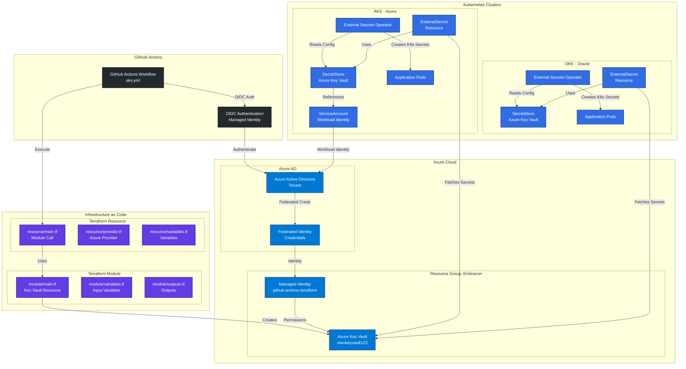
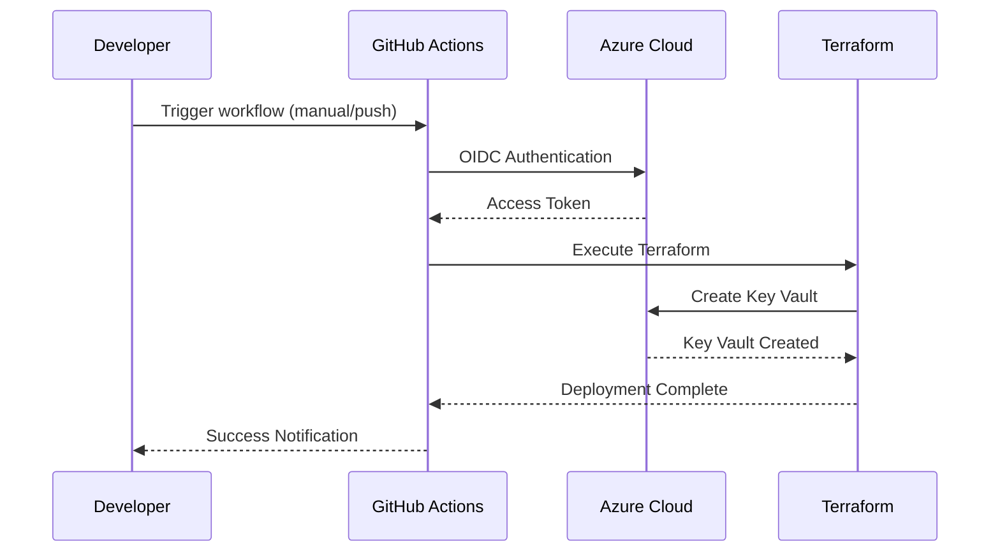
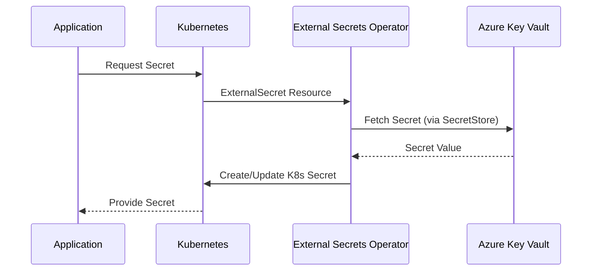

# Diagrama da Solução - Secret Management

## 🏗️ Arquitetura da Solução de Gerenciamento de Segredos

## 🔄 Fluxo de Implementação

### 1. **Provisionamento da Infraestrutura** (GitHub Actions + Terraform)

### 2. **Integração com Kubernetes** (External Secrets Operator)

## 📋 Componentes da Solução

### **Azure Components**
| Component | Purpose | Configuration |
|-----------|---------|---------------|
| **Azure Key Vault** | Central secret store | `meukeyvault123.vault.azure.net` |
| **Managed Identity** | OIDC authentication | `github-actions-terraform` |
| **Federated Credentials** | GitHub trust relationship | Repository-specific subjects |
| **RBAC Roles** | Permission management | Contributor + User Access Admin |

### **Terraform Components**
| Component | Location | Purpose |
|-----------|----------|---------|
| **Module** | `infra-secrets/module/` | Reusable Key Vault module |
| **Resource** | `infra-secrets/resource/` | Module instantiation |
| **Provider** | `provider.tf` | Azure provider configuration |
| **Variables** | `variables.tf` | Input parameters |

### **Kubernetes Integration**
| Component | Purpose | Supports |
|-----------|---------|----------|
| **External Secrets Operator** | Secret synchronization | AKS, OKE, Generic K8s |
| **SecretStore** | Key Vault connection config | Workload Identity (AKS), Service Principal (OKE) |
| **ExternalSecret** | Secret mapping definition | Multiple secret types |
| **ServiceAccount** | Authentication mechanism | Azure Workload Identity |

### **GitHub Actions**
| Component | Purpose | Configuration |
|-----------|---------|---------------|
| **Workflow** | Automated deployment | `.github/workflows/akv.yml` |
| **OIDC** | Secure authentication | No long-lived secrets |
| **Secrets** | Authentication credentials | Client ID, Tenant ID |
| **Variables** | Configuration values | Subscription ID |

## 🔐 Security Architecture

### **Authentication Flow**
1. **GitHub Actions** → OIDC Token → **Azure AD**
2. **Federated Credentials** → **Managed Identity**
3. **RBAC Permissions** → **Azure Key Vault**

### **Kubernetes Access Patterns**

#### **AKS (Azure Kubernetes Service)**
- **Workload Identity**: Native Azure integration
- **Pod Identity**: Direct AAD authentication
- **No secrets required**: Automatic token injection

#### **OKE (Oracle Kubernetes Engine)**
- **Service Principal**: Traditional authentication
- **Client Secret**: Stored as K8s secret
- **Cross-cloud access**: Azure resources from Oracle

## 🎯 Benefits of This Architecture

### **Security**
✅ **Zero long-lived secrets** in GitHub
✅ **Centralized secret management** in Azure Key Vault
✅ **Fine-grained RBAC** permissions
✅ **Audit trails** across all components

### **Scalability**
✅ **Multi-cloud support** (Azure AKS + Oracle OKE)
✅ **Reusable Terraform modules**
✅ **Automated deployment** pipeline
✅ **Secret rotation** capabilities

### **Operational Excellence**
✅ **Infrastructure as Code** with Terraform
✅ **GitOps workflow** with GitHub Actions
✅ **Standardized secret access** across environments
✅ **Comprehensive monitoring** and logging

## 🔄 Deployment Flow

1. **Developer** pushes code to repository
2. **GitHub Actions** triggers on workflow_dispatch
3. **OIDC authentication** establishes trust with Azure
4. **Terraform** provisions/updates Key Vault infrastructure
5. **External Secrets Operator** synchronizes secrets to Kubernetes
6. **Applications** consume secrets via standard K8s mechanisms

This architecture provides a robust, secure, and scalable solution for managing secrets across multi-cloud Kubernetes environments with centralized storage in Azure Key Vault.
