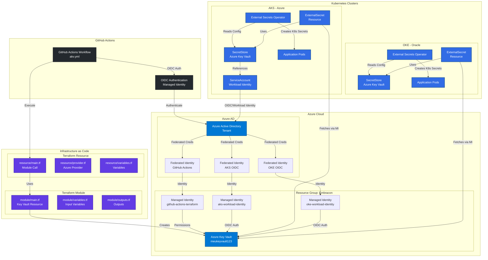
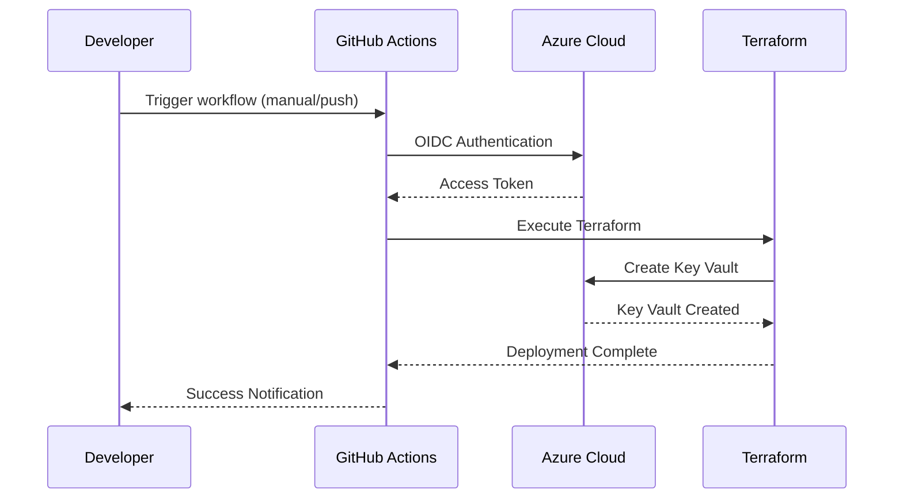
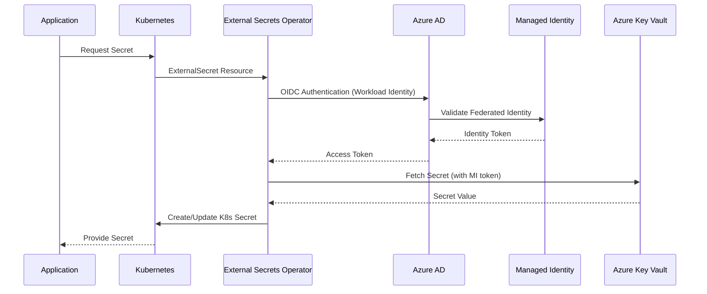

# Diagrama da Solução - Secret Management

## 🏗️ Arquitetura da Solução de Gerenciamento de Segredos



## 🔄 Fluxo de Implementação

### 1. **Provisionamento da Infraestrutura** (GitHub Actions + Terraform)


### 2. **Integração com Kubernetes** (External Secrets Operator)


## 📋 Componentes da Solução

### **Azure Components**
| Component | Purpose | Configuration |
|-----------|---------|---------------|
| **Azure Key Vault** | Central secret store | `meukeyvault123.vault.azure.net` |
| **Managed Identity (GitHub)** | GitHub Actions authentication | `github-actions-terraform` |
| **Managed Identity (AKS)** | AKS workload authentication | `aks-workload-identity` |
| **Managed Identity (OKE)** | OKE workload authentication | `oke-workload-identity` |
| **Federated Credentials** | OIDC trust relationships | Repository/cluster-specific subjects |
| **RBAC Roles (Vault-level)** | Full vault permissions | Key Vault Administrator, Key Vault Secrets Officer |
| **RBAC Roles (Secret-level)** | Granular secret permissions | Key Vault Secrets User, Custom roles |

### **Terraform Components**
| Component | Location | Purpose |
|-----------|----------|---------|
| **Module** | `infra-secrets/module/` | Reusable Key Vault module |
| **Resource** | `infra-secrets/resource/` | Module instantiation |
| **Provider** | `provider.tf` | Azure provider configuration |
| **Variables** | `variables.tf` | Input parameters |

### **Kubernetes Integration**
| Component | Purpose | Supports |
|-----------|---------|----------|
| **External Secrets Operator** | Secret synchronization | AKS (Managed Identity + OIDC), OKE (Managed Identity + OIDC) |
| **SecretStore** | Key Vault connection config | Managed Identity authentication via OIDC |
| **ExternalSecret** | Secret mapping definition | Individual secret access control via RBAC |
| **ServiceAccount** | Authentication mechanism | Workload Identity with Managed Identity |
| **RBAC Scope** | Access control granularity | Vault-level or Secret-level permissions |

### **GitHub Actions**
| Component | Purpose | Configuration |
|-----------|---------|---------------|
| **Workflow** | Automated deployment | `.github/workflows/akv.yml` |
| **OIDC** | Secure authentication | No long-lived secrets |
| **Secrets** | Authentication credentials | Client ID, Tenant ID |
| **Variables** | Configuration values | Subscription ID |

## 🔐 Security Architecture

### **Authentication Flow**
1. **GitHub Actions** → OIDC Token → **Azure AD** → **Managed Identity (GitHub)**
2. **AKS Workloads** → OIDC Token → **Azure AD** → **Managed Identity (AKS)**
3. **OKE Workloads** → OIDC Token → **Azure AD** → **Managed Identity (OKE)**
4. **All Managed Identities** → **RBAC Permissions** → **Azure Key Vault**

### **RBAC Access Control Models**

#### **Vault-Level Access (Broad Permissions)**
```bash
# Full vault access - for administrative operations
az role assignment create \
  --assignee $PRINCIPAL_ID \
  --role "Key Vault Administrator" \
  --scope "/subscriptions/$SUBSCRIPTION_ID/resourceGroups/$RG_NAME/providers/Microsoft.KeyVault/vaults/$VAULT_NAME"

# Secrets management across entire vault
az role assignment create \
  --assignee $PRINCIPAL_ID \
  --role "Key Vault Secrets Officer" \
  --scope "/subscriptions/$SUBSCRIPTION_ID/resourceGroups/$RG_NAME/providers/Microsoft.KeyVault/vaults/$VAULT_NAME"
```

#### **Secret-Level Access (Granular Permissions)**
```bash
# Read-only access to specific secret
az role assignment create \
  --assignee $PRINCIPAL_ID \
  --role "Key Vault Secrets User" \
  --scope "/subscriptions/$SUBSCRIPTION_ID/resourceGroups/$RG_NAME/providers/Microsoft.KeyVault/vaults/$VAULT_NAME/secrets/database-password"

# Custom role for specific secret operations
az role assignment create \
  --assignee $PRINCIPAL_ID \
  --role "Custom Secret Reader" \
  --scope "/subscriptions/$SUBSCRIPTION_ID/resourceGroups/$RG_NAME/providers/Microsoft.KeyVault/vaults/$VAULT_NAME/secrets/api-key"
```

### **Access Control Patterns by Workload**

| Workload | Access Level | RBAC Role | Scope | Use Case |
|----------|--------------|-----------|-------|----------|
| **GitHub Actions** | Vault-level | Key Vault Administrator | Entire vault | Infrastructure management |
| **Production AKS** | Secret-level | Key Vault Secrets User | Specific secrets | Application secrets |
| **Staging AKS** | Vault-level | Key Vault Secrets Officer | Staging secrets only | Development/testing |
| **OKE Production** | Secret-level | Custom Secret Reader | Cross-cloud secrets | Specific app access |
| **OKE Development** | Vault-level | Key Vault Secrets User | Dev vault | Development secrets |

### **Kubernetes Access Patterns**

#### **AKS (Azure Kubernetes Service)**
- **Managed Identity + OIDC**: Native Azure integration
- **Workload Identity**: Pod-level authentication via Azure AD
- **Federated Identity Credentials**: Direct trust relationship with AKS OIDC issuer
- **No secrets required**: Automatic OIDC token injection
- **Enhanced Security**: Short-lived tokens managed by Azure

#### **OKE (Oracle Kubernetes Engine)**
- **Managed Identity + OIDC**: Cross-cloud integration with Azure
- **Workload Identity**: External OIDC provider configuration
- **Federated Identity Credentials**: Trust relationship with OKE OIDC issuer
- **Cross-cloud access**: Azure resources from Oracle Cloud
- **Consistent Security Model**: Same Managed Identity + OIDC approach as AKS

## 🎯 Benefits of This Architecture

### **Security**
✅ **Zero long-lived secrets** anywhere in the system
✅ **Centralized secret management** in Azure Key Vault
✅ **Fine-grained RBAC** permissions per workload and per secret
✅ **Audit trails** across all components
✅ **Managed Identity + OIDC everywhere**: Consistent authentication model
✅ **Multi-cloud security**: Same security model across AKS and OKE
✅ **Flexible access control**: Vault-level or secret-level permissions
✅ **Principle of least privilege**: Granular RBAC assignments

### **Scalability**
✅ **Multi-cloud support** (Azure AKS + Oracle OKE)
✅ **Reusable Terraform modules**
✅ **Automated deployment** pipeline
✅ **Secret rotation** capabilities
✅ **Unified Managed Identity + OIDC** authentication across platforms
✅ **Independent workload identities** for fine-grained access control

### **Operational Excellence**
✅ **Infrastructure as Code** with Terraform
✅ **GitOps workflow** with GitHub Actions
✅ **Standardized secret access** across environments
✅ **Comprehensive monitoring** and logging
✅ **Consistent Managed Identity + OIDC security model** across all components
✅ **Centralized identity management** via Azure AD

## 🔄 Deployment Flow

1. **Developer** pushes code to repository
2. **GitHub Actions** triggers on workflow_dispatch
3. **OIDC authentication** establishes trust with Azure via **Managed Identity (GitHub)**
4. **Terraform** provisions/updates Key Vault infrastructure
5. **External Secrets Operator** in **AKS** authenticates via **Managed Identity (AKS) + OIDC**
6. **External Secrets Operator** in **OKE** authenticates via **Managed Identity (OKE) + OIDC**
7. **Applications** consume secrets via standard K8s mechanisms

This architecture provides a robust, secure, and scalable solution for managing secrets across multi-cloud Kubernetes environments with centralized storage in Azure Key Vault. **All authentication is based on Managed Identity + OIDC**, providing the highest level of security with no long-lived secrets anywhere in the system.

## 🔒 RBAC Access Control Models

### **1. Vault-Level Control (Coarse-Grained)**

#### **Advantages:**
✅ **Simplified management**: Single permission assignment
✅ **Broad access**: Suitable for administrative operations
✅ **Environment-based**: Easy to separate dev/staging/prod vaults
✅ **Operational efficiency**: Fewer role assignments to manage

#### **Use Cases:**
- **Infrastructure teams**: Full vault management
- **CI/CD pipelines**: Deployment automation
- **Development environments**: Broad access for testing
- **Administrative operations**: Vault configuration and management

#### **Example Configuration:**
```yaml
# SecretStore with vault-level access
apiVersion: external-secrets.io/v1
kind: SecretStore
metadata:
  name: vault-level-store
spec:
  provider:
    azurekv:
      authType: WorkloadIdentity
      vaultUrl: "https://meukeyvault123.vault.azure.net/"
      serviceAccountRef:
        name: vault-admin-sa  # Has Key Vault Administrator role
```

### **2. Secret-Level Control (Fine-Grained)**

#### **Advantages:**
✅ **Principle of least privilege**: Access only to required secrets
✅ **Enhanced security**: Minimal attack surface
✅ **Compliance**: Meet strict regulatory requirements
✅ **Audit granularity**: Detailed access tracking per secret

#### **Use Cases:**
- **Production applications**: Access only to specific secrets
- **Third-party integrations**: Limited scope access
- **Compliance requirements**: Strict access control
- **Multi-tenant environments**: Isolation between tenants

#### **Example Configuration:**
```yaml
# SecretStore with secret-level access
apiVersion: external-secrets.io/v1
kind: SecretStore
metadata:
  name: secret-level-store
spec:
  provider:
    azurekv:
      authType: WorkloadIdentity
      vaultUrl: "https://meukeyvault123.vault.azure.net/"
      serviceAccountRef:
        name: app-specific-sa  # Has access only to specific secrets
---
# ExternalSecret with specific secret access
apiVersion: external-secrets.io/v1
kind: ExternalSecret
metadata:
  name: database-secret
spec:
  secretStoreRef:
    name: secret-level-store
    kind: SecretStore
  target:
    name: db-credentials
  data:
    - secretKey: password
      remoteRef:
        key: database-password  # Only this secret is accessible
```

### **3. Hybrid Control Model**

#### **Environment-Based Segregation:**
```bash
# Production: Secret-level access
az role assignment create \
  --assignee $PROD_AKS_IDENTITY \
  --role "Key Vault Secrets User" \
  --scope "/subscriptions/$SUB_ID/resourceGroups/$RG/providers/Microsoft.KeyVault/vaults/$VAULT/secrets/prod-db-password"

# Staging: Vault-level access (staging vault only)
az role assignment create \
  --assignee $STAGING_AKS_IDENTITY \
  --role "Key Vault Secrets Officer" \
  --scope "/subscriptions/$SUB_ID/resourceGroups/$RG/providers/Microsoft.KeyVault/vaults/staging-vault"

# Development: Vault-level access (dev vault only)
az role assignment create \
  --assignee $DEV_AKS_IDENTITY \
  --role "Key Vault Administrator" \
  --scope "/subscriptions/$SUB_ID/resourceGroups/$RG/providers/Microsoft.KeyVault/vaults/dev-vault"
```

### **4. RBAC Roles Reference**

| Role | Permissions | Scope | Best For |
|------|-------------|-------|----------|
| **Key Vault Administrator** | Full vault management | Vault-level | Infrastructure teams |
| **Key Vault Secrets Officer** | Manage all secrets | Vault-level | DevOps teams |
| **Key Vault Secrets User** | Read secrets | Vault or Secret-level | Applications |
| **Key Vault Reader** | Read metadata only | Vault-level | Monitoring tools |
| **Custom Roles** | Specific permissions | Flexible | Specialized use cases |

### **5. Implementation Strategy**

#### **Step 1: Environment Segregation**
```bash
# Create separate vaults for each environment
az keyvault create --name "prod-vault" --resource-group "prod-rg"
az keyvault create --name "staging-vault" --resource-group "staging-rg"
az keyvault create --name "dev-vault" --resource-group "dev-rg"
```

#### **Step 2: Identity Assignment**
```bash
# Production: Fine-grained access
az role assignment create \
  --assignee $PROD_IDENTITY \
  --role "Key Vault Secrets User" \
  --scope "/subscriptions/$SUB/resourceGroups/prod-rg/providers/Microsoft.KeyVault/vaults/prod-vault/secrets/app-secret"

# Development: Broad access
az role assignment create \
  --assignee $DEV_IDENTITY \
  --role "Key Vault Administrator" \
  --scope "/subscriptions/$SUB/resourceGroups/dev-rg/providers/Microsoft.KeyVault/vaults/dev-vault"
```

#### **Step 3: Monitoring and Auditing**
```bash
# Enable audit logging
az monitor diagnostic-settings create \
  --resource "/subscriptions/$SUB/resourceGroups/$RG/providers/Microsoft.KeyVault/vaults/$VAULT" \
  --name "KeyVaultAuditLogs" \
  --logs '[{"category":"AuditEvent","enabled":true}]' \
  --workspace $LOG_ANALYTICS_WORKSPACE
```
