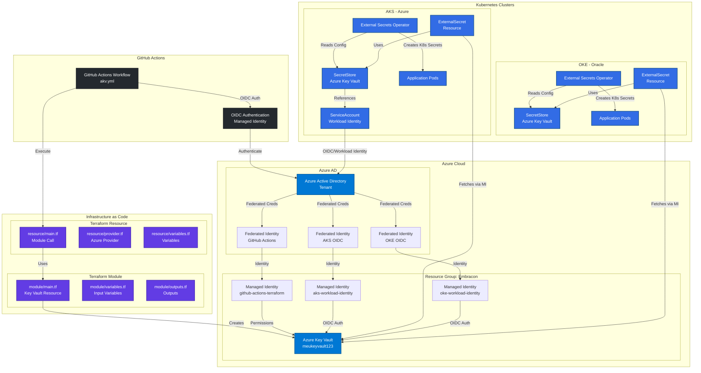
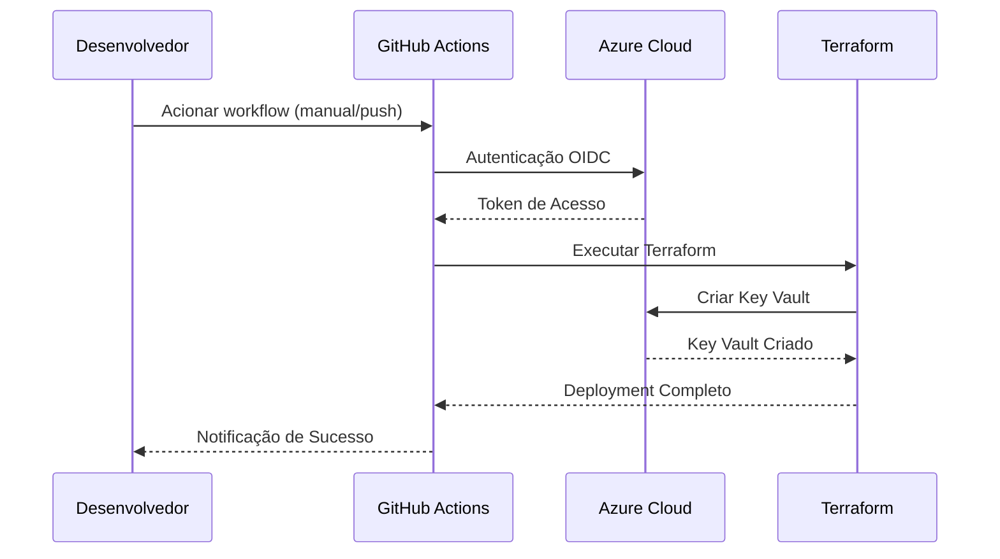
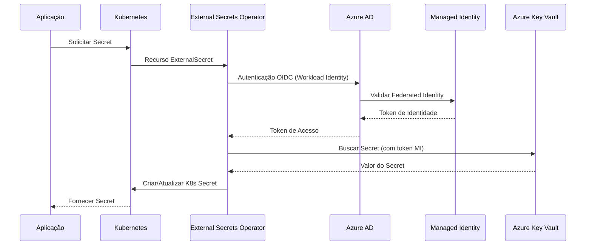

# Diagrama da Solução - Gerenciamento de Segredos

## 🏗️ Arquitetura da Solução de Gerenciamento de Segredos



## 🔄 Fluxo de Implementação

### 1. **Provisionamento da Infraestrutura** (GitHub Actions + Terraform)


### 2. **Integração com Kubernetes** (External Secrets Operator)


## 📋 Componentes da Solução

### **Componentes Azure**
| Componente | Propósito | Configuração |
|-----------|---------|---------------|
| **Azure Key Vault** | Armazenamento central de segredos | `meukeyvault123.vault.azure.net` |
| **Managed Identity (GitHub)** | Autenticação do GitHub Actions | `github-actions-terraform` |
| **Managed Identity (AKS)** | Autenticação de workloads AKS | `aks-workload-identity` |
| **Managed Identity (OKE)** | Autenticação de workloads OKE | `oke-workload-identity` |
| **Federated Credentials** | Relacionamentos de confiança OIDC | Subjects específicos por repositório/cluster |
| **RBAC Roles (Nível Cofre)** | Permissões completas do cofre | Key Vault Administrator, Key Vault Secrets Officer |
| **RBAC Roles (Nível Secret)** | Permissões granulares por segredo | Key Vault Secrets User, Custom roles |

### **Componentes Terraform**
| Componente | Localização | Propósito |
|-----------|----------|---------|
| **Module** | `infra-secrets/module/` | Módulo reutilizável do Key Vault |
| **Resource** | `infra-secrets/resource/` | Instanciação do módulo |
| **Provider** | `provider.tf` | Configuração do provider Azure |
| **Variables** | `variables.tf` | Parâmetros de entrada |

### **Integração Kubernetes**
| Componente | Propósito | Suporte |
|-----------|---------|----------|
| **External Secrets Operator** | Sincronização de segredos | AKS (Managed Identity + OIDC), OKE (Managed Identity + OIDC) |
| **SecretStore** | Configuração de conexão com Key Vault | Autenticação via Managed Identity com OIDC |
| **ExternalSecret** | Definição de mapeamento de segredos | Controle de acesso individual por segredo via RBAC |
| **ServiceAccount** | Mecanismo de autenticação | Workload Identity com Managed Identity |
| **RBAC Scope** | Granularidade do controle de acesso | Permissões por cofre ou por segredo |

### **GitHub Actions**
| Componente | Propósito | Configuração |
|-----------|---------|---------------|
| **Workflow** | Deployment automatizado | `.github/workflows/akv.yml` |
| **OIDC** | Autenticação segura | Sem segredos de longa duração |
| **Secrets** | Credenciais de autenticação | Client ID, Tenant ID |
| **Variables** | Valores de configuração | Subscription ID |

## 🔐 Arquitetura de Segurança

### **Fluxo de Autenticação**
1. **GitHub Actions** → Token OIDC → **Azure AD** → **Managed Identity (GitHub)**
2. **Workloads AKS** → Token OIDC → **Azure AD** → **Managed Identity (AKS)**
3. **Workloads OKE** → Token OIDC → **Azure AD** → **Managed Identity (OKE)**
4. **Todas as Managed Identities** → **Permissões RBAC** → **Azure Key Vault**

### **Modelos de Controle de Acesso RBAC**

#### **Acesso por Cofre (Permissões Amplas)**
```bash
# Acesso completo ao cofre - para operações administrativas
az role assignment create \
  --assignee $PRINCIPAL_ID \
  --role "Key Vault Administrator" \
  --scope "/subscriptions/$SUBSCRIPTION_ID/resourceGroups/$RG_NAME/providers/Microsoft.KeyVault/vaults/$VAULT_NAME"

# Gerenciamento de segredos em todo o cofre
az role assignment create \
  --assignee $PRINCIPAL_ID \
  --role "Key Vault Secrets Officer" \
  --scope "/subscriptions/$SUBSCRIPTION_ID/resourceGroups/$RG_NAME/providers/Microsoft.KeyVault/vaults/$VAULT_NAME"
```

#### **Acesso por Segredo (Permissões Granulares)**
```bash
# Acesso somente leitura a segredo específico
az role assignment create \
  --assignee $PRINCIPAL_ID \
  --role "Key Vault Secrets User" \
  --scope "/subscriptions/$SUBSCRIPTION_ID/resourceGroups/$RG_NAME/providers/Microsoft.KeyVault/vaults/$VAULT_NAME/secrets/database-password"

# Role customizada para operações específicas em segredo
az role assignment create \
  --assignee $PRINCIPAL_ID \
  --role "Custom Secret Reader" \
  --scope "/subscriptions/$SUBSCRIPTION_ID/resourceGroups/$RG_NAME/providers/Microsoft.KeyVault/vaults/$VAULT_NAME/secrets/api-key"
```

### **Padrões de Controle de Acesso por Workload**

| Workload | Nível de Acesso | Role RBAC | Escopo | Caso de Uso |
|----------|--------------|-----------|-------|----------|
| **GitHub Actions** | Nível cofre | Key Vault Administrator | Cofre inteiro | Gerenciamento de infraestrutura |
| **AKS Produção** | Nível segredo | Key Vault Secrets User | Segredos específicos | Segredos de aplicação |
| **AKS Staging** | Nível cofre | Key Vault Secrets Officer | Apenas segredos staging | Desenvolvimento/testes |
| **OKE Produção** | Nível segredo | Custom Secret Reader | Segredos cross-cloud | Acesso específico de app |
| **OKE Desenvolvimento** | Nível cofre | Key Vault Secrets User | Cofre dev | Segredos de desenvolvimento |

### **Padrões de Acesso Kubernetes**

#### **AKS (Azure Kubernetes Service)**
- **Managed Identity + OIDC**: Integração nativa com Azure
- **Workload Identity**: Autenticação no nível do pod via Azure AD
- **Federated Identity Credentials**: Relacionamento direto de confiança com OIDC issuer do AKS
- **Sem segredos necessários**: Injeção automática de token OIDC
- **Segurança aprimorada**: Tokens de curta duração gerenciados pelo Azure

#### **OKE (Oracle Kubernetes Engine)**
- **Managed Identity + OIDC**: Integração cross-cloud com Azure
- **Workload Identity**: Configuração de provedor OIDC externo
- **Federated Identity Credentials**: Relacionamento de confiança com OIDC issuer do OKE
- **Acesso cross-cloud**: Recursos Azure a partir da Oracle Cloud
- **Modelo de segurança consistente**: Mesma abordagem Managed Identity + OIDC do AKS

## 🎯 Benefícios desta Arquitetura

### **Segurança**
✅ **Zero segredos de longa duração** em qualquer lugar do sistema
✅ **Gerenciamento centralizado de segredos** no Azure Key Vault
✅ **Permissões RBAC granulares** por workload e por segredo
✅ **Trilhas de auditoria** em todos os componentes
✅ **Managed Identity + OIDC em todos os lugares**: Modelo de autenticação consistente
✅ **Segurança multi-cloud**: Mesmo modelo de segurança em AKS e OKE
✅ **Controle de acesso flexível**: Permissões por cofre ou por segredo
✅ **Princípio do menor privilégio**: Atribuições RBAC granulares

### **Escalabilidade**
✅ **Suporte multi-cloud** (Azure AKS + Oracle OKE)
✅ **Módulos Terraform reutilizáveis**
✅ **Pipeline de deployment automatizado**
✅ **Capacidades de rotação de segredos**
✅ **Autenticação Managed Identity + OIDC unificada** entre plataformas
✅ **Identidades de workload independentes** para controle de acesso granular

### **Excelência Operacional**
✅ **Infrastructure as Code** com Terraform
✅ **Fluxo GitOps** com GitHub Actions
✅ **Acesso padronizado a segredos** entre ambientes
✅ **Monitoramento e logging abrangentes**
✅ **Modelo de segurança Managed Identity + OIDC consistente** em todos os componentes
✅ **Gerenciamento centralizado de identidades** via Azure AD

## 🔄 Fluxo de Deployment

1. **Desenvolvedor** faz push do código para o repositório
2. **GitHub Actions** dispara no workflow_dispatch
3. **Autenticação OIDC** estabelece confiança com Azure via **Managed Identity (GitHub)**
4. **Terraform** provisiona/atualiza infraestrutura do Key Vault
5. **External Secrets Operator** no **AKS** autentica via **Managed Identity (AKS) + OIDC**
6. **External Secrets Operator** no **OKE** autentica via **Managed Identity (OKE) + OIDC**
7. **Aplicações** consomem segredos via mecanismos padrão do K8s

Esta arquitetura fornece uma solução robusta, segura e escalável para gerenciar segredos em ambientes Kubernetes multi-cloud com armazenamento centralizado no Azure Key Vault. **Toda autenticação é baseada em Managed Identity + OIDC**, proporcionando o mais alto nível de segurança sem segredos de longa duração em qualquer lugar do sistema.

## 🔒 Modelos de Controle de Acesso RBAC

### **1. Controle por Cofre (Granularidade Ampla)**

#### **Vantagens:**
✅ **Gerenciamento simplificado**: Atribuição única de permissão
✅ **Acesso amplo**: Adequado para operações administrativas
✅ **Baseado em ambiente**: Fácil separação de cofres dev/staging/prod
✅ **Eficiência operacional**: Menos atribuições de roles para gerenciar

#### **Casos de Uso:**
- **Equipes de infraestrutura**: Gerenciamento completo do cofre
- **Pipelines CI/CD**: Automação de deployment
- **Ambientes de desenvolvimento**: Acesso amplo para testes
- **Operações administrativas**: Configuração e gerenciamento do cofre

#### **Exemplo de Configuração:**
```yaml
# SecretStore com acesso por cofre
apiVersion: external-secrets.io/v1
kind: SecretStore
metadata:
  name: vault-level-store
spec:
  provider:
    azurekv:
      authType: WorkloadIdentity
      vaultUrl: "https://meukeyvault123.vault.azure.net/"
      serviceAccountRef:
        name: vault-admin-sa  # Possui role Key Vault Administrator
```

### **2. Controle por Segredo (Granularidade Fina)**

#### **Vantagens:**
✅ **Princípio do menor privilégio**: Acesso apenas aos segredos necessários
✅ **Segurança aprimorada**: Superfície de ataque mínima
✅ **Compliance**: Atende requisitos regulatórios rigorosos
✅ **Granularidade de auditoria**: Rastreamento detalhado de acesso por segredo

#### **Casos de Uso:**
- **Aplicações de produção**: Acesso apenas a segredos específicos
- **Integrações terceirizadas**: Acesso de escopo limitado
- **Requisitos de compliance**: Controle rigoroso de acesso
- **Ambientes multi-tenant**: Isolamento entre tenants

#### **Exemplo de Configuração:**
```yaml
# SecretStore com acesso por segredo
apiVersion: external-secrets.io/v1
kind: SecretStore
metadata:
  name: secret-level-store
spec:
  provider:
    azurekv:
      authType: WorkloadIdentity
      vaultUrl: "https://meukeyvault123.vault.azure.net/"
      serviceAccountRef:
        name: app-specific-sa  # Possui acesso apenas a segredos específicos
---
# ExternalSecret com acesso a segredo específico
apiVersion: external-secrets.io/v1
kind: ExternalSecret
metadata:
  name: database-secret
spec:
  secretStoreRef:
    name: secret-level-store
    kind: SecretStore
  target:
    name: db-credentials
  data:
    - secretKey: password
      remoteRef:
        key: database-password  # Apenas este segredo é acessível
```

### **3. Modelo de Controle Híbrido**

#### **Segregação Baseada em Ambiente:**
```bash
# Produção: Acesso por segredo
az role assignment create \
  --assignee $PROD_AKS_IDENTITY \
  --role "Key Vault Secrets User" \
  --scope "/subscriptions/$SUB_ID/resourceGroups/$RG/providers/Microsoft.KeyVault/vaults/$VAULT/secrets/prod-db-password"

# Staging: Acesso por cofre (apenas cofre staging)
az role assignment create \
  --assignee $STAGING_AKS_IDENTITY \
  --role "Key Vault Secrets Officer" \
  --scope "/subscriptions/$SUB_ID/resourceGroups/$RG/providers/Microsoft.KeyVault/vaults/staging-vault"

# Desenvolvimento: Acesso por cofre (apenas cofre dev)
az role assignment create \
  --assignee $DEV_AKS_IDENTITY \
  --role "Key Vault Administrator" \
  --scope "/subscriptions/$SUB_ID/resourceGroups/$RG/providers/Microsoft.KeyVault/vaults/dev-vault"
```

### **4. Referência de Roles RBAC**

| Role | Permissões | Escopo | Melhor Para |
|------|-------------|-------|----------|
| **Key Vault Administrator** | Gerenciamento completo do cofre | Nível cofre | Equipes de infraestrutura |
| **Key Vault Secrets Officer** | Gerenciar todos os segredos | Nível cofre | Equipes DevOps |
| **Key Vault Secrets User** | Ler segredos | Nível cofre ou segredo | Aplicações |
| **Key Vault Reader** | Ler apenas metadados | Nível cofre | Ferramentas de monitoramento |
| **Custom Roles** | Permissões específicas | Flexível | Casos de uso especializados |

### **5. Estratégia de Implementação**

#### **Passo 1: Segregação de Ambiente**
```bash
# Criar cofres separados para cada ambiente
az keyvault create --name "prod-vault" --resource-group "prod-rg"
az keyvault create --name "staging-vault" --resource-group "staging-rg"
az keyvault create --name "dev-vault" --resource-group "dev-rg"
```

#### **Passo 2: Atribuição de Identidade**
```bash
# Produção: Acesso granular
az role assignment create \
  --assignee $PROD_IDENTITY \
  --role "Key Vault Secrets User" \
  --scope "/subscriptions/$SUB/resourceGroups/prod-rg/providers/Microsoft.KeyVault/vaults/prod-vault/secrets/app-secret"

# Desenvolvimento: Acesso amplo
az role assignment create \
  --assignee $DEV_IDENTITY \
  --role "Key Vault Administrator" \
  --scope "/subscriptions/$SUB/resourceGroups/dev-rg/providers/Microsoft.KeyVault/vaults/dev-vault"
```

#### **Passo 3: Monitoramento e Auditoria**
```bash
# Habilitar logging de auditoria
az monitor diagnostic-settings create \
  --resource "/subscriptions/$SUB/resourceGroups/$RG/providers/Microsoft.KeyVault/vaults/$VAULT" \
  --name "KeyVaultAuditLogs" \
  --logs '[{"category":"AuditEvent","enabled":true}]' \
  --workspace $LOG_ANALYTICS_WORKSPACE
```
