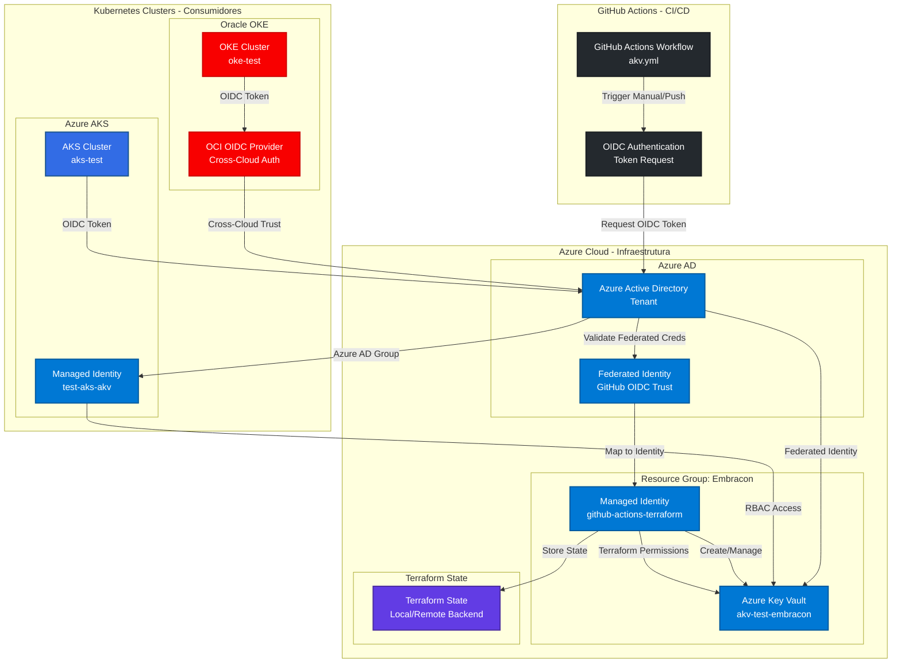
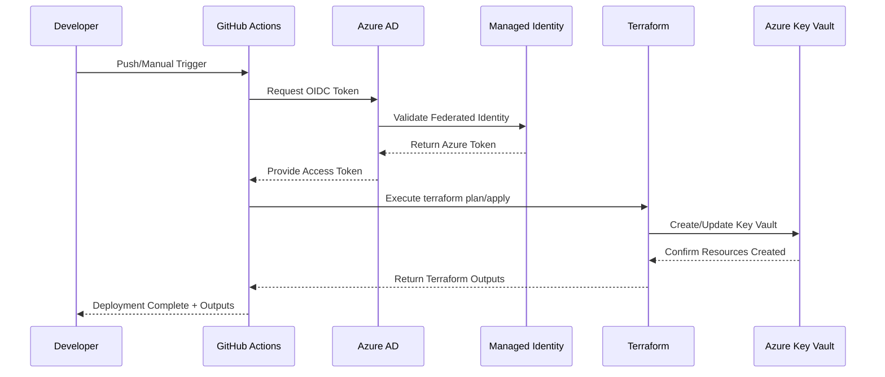

<p align="center">
  
</p>

# 🏗️ Infraestrutura Terraform: Azure Key Vault (AKV)

Este diretório contém a infraestrutura como código (IaC) para criação e gerenciamento do **Azure Key Vault** usando Terraform, com integração para OIDC e GitHub Actions, permitindo acesso seguro de aplicações Kubernetes (AKS/OKE) aos segredos armazenados.

## 🏛️ Diagrama da Solução - Infraestrutura Azure Key Vault



## 🔄 Fluxo de Deployment com GitHub Actions



## 🎯 Funcionalidades da Infraestrutura

### **Criação Automatizada de Recursos Azure:**
✅ **Azure Key Vault** com configurações otimizadas para Kubernetes
✅ **Managed Identity** para autenticação GitHub Actions
✅ **Federated Identity Credentials** para OIDC trust
✅ **RBAC Permissions** granulares para acesso seguro
✅ **Resource Group** com padronização de nomenclatura

### **Integração CI/CD:**
✅ **GitHub Actions Workflow** automatizado
✅ **OIDC Authentication** sem secrets estáticos
✅ **Terraform State Management** local/remoto
✅ **Multi-Environment Support** (dev/staging/prod)
✅ **Validation e Testing** integrados

### **Segurança e Compliance:**
✅ **Zero Static Secrets** - Apenas tokens temporários
✅ **Principle of Least Privilege** - Permissões mínimas necessárias
✅ **Cross-Cloud Authentication** - Suporte AKS e OKE
✅ **Audit Logging** - Rastreabilidade completa
✅ **RBAC Granular** - Controle por secret/vault

## 📁 Estrutura do Diretório

```
infra-secrets/
├── README.md                          # Este arquivo - Documentação geral
├── module/                             # Módulo Terraform reutilizável
│   ├── README.md                       # Documentação específica do módulo
│   ├── main.tf                         # Recursos principais do Azure Key Vault
│   ├── variables.tf                    # Variáveis de entrada do módulo
│   └── outputs.tf                      # Outputs do módulo (URIs, IDs, etc.)
└── resource/                           # Implementação de exemplo
    ├── main.tf                         # Uso do módulo para ambiente específico
    ├── provider.tf                     # Configuração do provider Azure
    └── variables.tf                    # Variáveis do ambiente
```

## 🚀 Quick Start

### **1. Pré-requisitos**
- ✅ [Azure CLI](https://docs.microsoft.com/pt-br/cli/azure/install-azure-cli) instalado e autenticado
- ✅ [Terraform](https://www.terraform.io/downloads.html) versão ≥ 1.5.0
- ✅ Conta Azure com permissões para criar recursos
- ✅ Subscription ID da TBX-Sandbox disponível

### **2. Configuração Rápida**

#### **Linux/macOS:**
```bash
# Configurar subscription
export TF_VAR_subscription_id=$(az account list --query "[?name=='TBX-Sandbox'].id" --output tsv)

# Navegar para o diretório de exemplo
cd "Secret Management/infra-secrets/resource"

# Inicializar e aplicar
terraform init
terraform plan
terraform apply
```

#### **Windows PowerShell:**
```powershell
# Configurar subscription
$env:TF_VAR_subscription_id = (az account list --query "[?name=='TBX-Sandbox'].id" --output tsv)

# Navegar para o diretório de exemplo
cd "Secret Management/infra-secrets/resource"

# Inicializar e aplicar
terraform init
terraform plan
terraform apply
```

### **3. Usando o Módulo em Seus Projetos**

```hcl
module "key_vault" {
    source              = "../module"
    resource_group_name = "meu-rg"
    location            = "brazilsouth"
    key_vault_name      = "meukeyvault123"
}

output "key_vault_id" {
    value = module.key_vault.key_vault_id
}

output "key_vault_uri" {
    value = module.key_vault.key_vault_uri
}
```

## 📋 Variáveis e Outputs do Módulo

### **Variáveis de Entrada**
| Nome | Descrição | Tipo | Obrigatório | Padrão |
|------|-----------|------|-------------|--------|
| `name` | Nome do Key Vault | `string` | ✅ Sim | - |
| `location` | Região Azure do recurso | `string` | ✅ Sim | - |
| `resource_group_name` | Nome do Resource Group | `string` | ✅ Sim | - |

### **Outputs Disponíveis**
| Nome | Descrição | Uso |
|------|-----------|-----|
| `vault_uri` | URI completa do Key Vault | Configuração de aplicações |
| `vault_id` | Resource ID do Key Vault | Referências e RBAC |
| `vault_name` | Nome do Key Vault criado | Scripts e automação |

## 🔐 Configuração OIDC para GitHub Actions

### **Visão Geral da Configuração OIDC**
Esta seção configura autenticação **sem secrets estáticos** entre GitHub Actions e Azure, utilizando:
- **Managed Identity** para identidade Azure
- **Federated Identity Credentials** para trust OIDC
- **RBAC Permissions** para controle granular de acesso

### **🎯 Benefícios vs App Registration**

| Aspecto | App Registration | Managed Identity |
|---------|------------------|------------------|
| **Segurança** | ⚠️ Secrets estáticos | ✅ Tokens temporários |
| **Gerenciamento** | 🔄 Manual | 🤖 Automático |
| **Integração Azure** | 📋 Boa | 🚀 Nativa |
| **Complexidade** | 📈 Alta | 📉 Baixa |
| **Auditoria** | 📊 Complexa | 📋 Simples |
| **Manutenção** | ⏰ Alta | ✅ Mínima |


### **1️⃣ Criar User-Assigned Managed Identity**

#### **Verificar e Criar Resource Group:**
```bash
# Verificar se o Resource Group existe
az group show --name "Embracon" --output table

# Se não existir, criar:
az group create --name "Embracon" --location "brazilsouth"
```

#### **Criar Managed Identity:**
```bash
# Criar User-Assigned Managed Identity
az identity create \
  --name "github-actions-terraform" \
  --resource-group "Embracon" \
  --location "brazilsouth"

# Obter informações importantes
CLIENT_ID=$(az identity show \
  --name "github-actions-terraform" \
  --resource-group "Embracon" \
  --query clientId -o tsv)

PRINCIPAL_ID=$(az identity show \
  --name "github-actions-terraform" \
  --resource-group "Embracon" \
  --query principalId -o tsv)

echo "✅ AZURE_CLIENT_ID: $CLIENT_ID"
echo "✅ Principal ID: $PRINCIPAL_ID"
```

### **2️⃣ Configurar Federated Identity Credentials**

#### **Para branch feature/akv-terraform:**
```bash
az identity federated-credential create \
  --name "github-feature-akv-terraform" \
  --identity-name "github-actions-terraform" \
  --resource-group "Embracon" \
  --issuer "https://token.actions.githubusercontent.com" \
  --subject "repo:toolbox-tech/embracon:ref:refs/heads/feature/akv-terraform" \
  --audiences "api://AzureADTokenExchange"
```

#### **Para branch main (opcional):**
```bash
az identity federated-credential create \
  --name "github-main-branch" \
  --identity-name "github-actions-terraform" \
  --resource-group "Embracon" \
  --issuer "https://token.actions.githubusercontent.com" \
  --subject "repo:toolbox-tech/embracon:ref:refs/heads/main" \
  --audiences "api://AzureADTokenExchange"
```

### **3️⃣ Atribuir Permissões Azure RBAC**

#### **Obter Subscription ID:**
```bash
SUBSCRIPTION_ID=$(az account list --query "[?name=='TBX-Sandbox'].id" --output tsv)
echo "✅ AZURE_SUBSCRIPTION_ID: $SUBSCRIPTION_ID"
```

#### **Atribuir Roles Necessárias:**
```bash
# Role Contributor - Para criar/gerenciar recursos
az role assignment create \
  --assignee $PRINCIPAL_ID \
  --role "Contributor" \
  --scope "/subscriptions/$SUBSCRIPTION_ID"

# Role User Access Administrator - Para gerenciar RBAC do Key Vault
az role assignment create \
  --assignee $PRINCIPAL_ID \
  --role "User Access Administrator" \
  --scope "/subscriptions/$SUBSCRIPTION_ID"

# Role Key Vault Administrator - Para gestão completa do Key Vault
az role assignment create \
  --assignee $PRINCIPAL_ID \
  --role "Key Vault Administrator" \
  --scope "/subscriptions/$SUBSCRIPTION_ID"

echo "✅ Permissões RBAC configuradas com sucesso!"
```

### **4️⃣ Configurar GitHub Repository**

#### **GitHub Secrets** (Repository Settings > Secrets and variables > Actions > Secrets):
```bash
# Obter valores para configurar no GitHub
echo "📋 Configure estes SECRETS no GitHub:"
echo "AZURE_CLIENT_ID = $CLIENT_ID"
echo "AZURE_TENANT_ID = $(az account show --query tenantId -o tsv)"
```

#### **GitHub Variables** (Repository Settings > Secrets and variables > Actions > Variables):
```bash
echo "📋 Configure esta VARIABLE no GitHub:"
echo "AZURE_SUBSCRIPTION_ID = $SUBSCRIPTION_ID"
```

### **5️⃣ Comandos de Verificação**

#### **Verificar Managed Identity:**
```bash
# Listar todas as Managed Identities
az identity list --resource-group "Embracon" --output table

# Verificar Federated Credentials configurados
az identity federated-credential list \
  --identity-name "github-actions-terraform" \
  --resource-group "Embracon" \
  --output table
```

#### **Verificar Permissões RBAC:**
```bash
# Verificar todas as role assignments da Managed Identity
az role assignment list \
  --assignee $PRINCIPAL_ID \
  --output table \
  --include-inherited
```

#### **Teste de Conectividade:**
```bash
# Validar subscription access
az account show --subscription $SUBSCRIPTION_ID

# Validar Resource Group access
az group show --name "Embracon" --subscription $SUBSCRIPTION_ID
```

## � GitHub Actions Workflow - akv.yml

### **📁 Localização:**
```
.github/workflows/akv.yml
```

### **🎯 Funcionalidades do Workflow:**

#### **Triggers Configurados:**
- ✅ **Manual Trigger**: `workflow_dispatch` - Execução sob demanda
- ⚙️ **Working Directory**: `./Secret Management/infra-secrets/resource`
- 🔒 **Permissions**: `id-token: write` + `contents: read`

#### **Steps de Execução:**
1. **📥 Checkout Repository** - Download do código fonte
2. **🔧 Setup Terraform** - Instalação do Terraform 1.5.0
3. **🔐 Azure Login with OIDC** - Autenticação sem secrets
4. **⚙️ Set Terraform Variables** - Configuração de variáveis de ambiente
5. **🚀 Terraform Init** - Inicialização do backend
6. **✅ Terraform Validate** - Validação da configuração
7. **📋 Terraform Plan** - Criação do plano de execução
8. **🚁 Terraform Apply** - Aplicação das mudanças (apenas em feature/akv-terraform)

### **🎮 Como Executar o Workflow:**

#### **Execução Manual:**
1. Acesse: `https://github.com/toolbox-tech/embracon`
2. Navegue para: **Actions** > **Azure Key Vault Terraform Deployment**
3. Clique em: **Run workflow**
4. Selecione a branch: `feature/akv-terraform`
5. Confirme: **Run workflow**

### **📊 Monitoramento e Logs:**

#### **Status Indicators:**
- ✅ **Verde**: Execução bem-sucedida
- ❌ **Vermelho**: Falha na execução  
- 🟡 **Amarelo**: Em progresso
- ⏸️ **Cinza**: Aguardando ou cancelado

#### **Análise de Logs:**
```bash
# Logs esperados em execução bem-sucedida:
✅ Checkout repository
✅ Setup Terraform (1.5.0)
✅ Azure Login with OIDC
✅ Set Terraform Variables  
✅ Terraform Init
✅ Terraform Validate
✅ Terraform Plan (X to add, Y to change, Z to destroy)
✅ Terraform Apply (Apply complete! Resources: X added, Y changed, Z destroyed)
```

## 🚨 Troubleshooting

### **🔧 Problemas Comuns e Soluções**

#### **❌ "AADSTS70021: No matching federated identity record found"**
```bash
# Verificar e corrigir Federated Credentials
az identity federated-credential list \
  --identity-name "github-actions-terraform" \
  --resource-group "Embracon" \
  --output table

# Recriar se necessário (verificar nome da branch!)
az identity federated-credential create \
  --name "github-feature-akv-terraform" \
  --identity-name "github-actions-terraform" \
  --resource-group "Embracon" \
  --issuer "https://token.actions.githubusercontent.com" \
  --subject "repo:toolbox-tech/embracon:ref:refs/heads/feature/akv-terraform" \
  --audiences "api://AzureADTokenExchange"
```

#### **❌ "Insufficient privileges to complete the operation"**
```bash
# Verificar e reaplicar permissões RBAC
PRINCIPAL_ID=$(az identity show \
  --name "github-actions-terraform" \
  --resource-group "Embracon" \
  --query principalId -o tsv)

SUBSCRIPTION_ID=$(az account list --query "[?name=='TBX-Sandbox'].id" --output tsv)

# Reaplicar roles necessárias
az role assignment create \
  --assignee $PRINCIPAL_ID \
  --role "Contributor" \
  --scope "/subscriptions/$SUBSCRIPTION_ID"

az role assignment create \
  --assignee $PRINCIPAL_ID \
  --role "User Access Administrator" \
  --scope "/subscriptions/$SUBSCRIPTION_ID"
```

#### **❌ "Context access might be invalid: AZURE_SUBSCRIPTION_ID"**
```bash
# Verificar configuração no GitHub
echo "Verifique se esta VARIABLE está configurada no GitHub:"
echo "AZURE_SUBSCRIPTION_ID = $(az account list --query "[?name=='TBX-Sandbox'].id" --output tsv)"
```

#### **❌ "Error: building AzureRM Client: authenticate to Azure CLI"**
```bash
# Verificar secrets no GitHub
echo "Verifique se estes SECRETS estão configurados no GitHub:"
echo "AZURE_CLIENT_ID = $(az identity show --name "github-actions-terraform" --resource-group "Embracon" --query clientId -o tsv)"
echo "AZURE_TENANT_ID = $(az account show --query tenantId -o tsv)"
```

### **⏱️ Aguardar Propagação**
Algumas mudanças podem levar **até 10 minutos** para propagar:
- Criação de Managed Identity
- Atribuição de RBAC roles  
- Federated Identity Credentials

## 🧹 Limpeza de Recursos (Se Necessário)

### **Remover Infraestrutura Terraform:**
```bash
cd "Secret Management/infra-secrets/resource"
terraform destroy
```

### **Remover Managed Identity e Permissões:**
```bash
# Obter IDs necessários
PRINCIPAL_ID=$(az identity show \
  --name "github-actions-terraform" \
  --resource-group "Embracon" \
  --query principalId -o tsv)

SUBSCRIPTION_ID=$(az account list --query "[?name=='TBX-Sandbox'].id" --output tsv)

# Remover role assignments
az role assignment delete \
  --assignee $PRINCIPAL_ID \
  --role "Contributor" \
  --scope "/subscriptions/$SUBSCRIPTION_ID"

az role assignment delete \
  --assignee $PRINCIPAL_ID \
  --role "User Access Administrator" \
  --scope "/subscriptions/$SUBSCRIPTION_ID"

az role assignment delete \
  --assignee $PRINCIPAL_ID \
  --role "Key Vault Administrator" \
  --scope "/subscriptions/$SUBSCRIPTION_ID"

# Remover Managed Identity
az identity delete \
  --name "github-actions-terraform" \
  --resource-group "Embracon"
```

## 📊 Resumo da Configuração

### **📋 Checklist de Configuração:**

#### **Azure Resources:**
- [ ] ✅ Resource Group "Embracon" existe
- [ ] ✅ Managed Identity "github-actions-terraform" criada
- [ ] ✅ Federated Credentials configurados para branch correta
- [ ] ✅ RBAC roles atribuídas (Contributor + User Access Administrator + Key Vault Administrator)

#### **GitHub Configuration:**
- [ ] ✅ Secret `AZURE_CLIENT_ID` configurado
- [ ] ✅ Secret `AZURE_TENANT_ID` configurado  
- [ ] ✅ Variable `AZURE_SUBSCRIPTION_ID` configurada

#### **Terraform Files:**
- [ ] ✅ Módulo em `module/` está funcional
- [ ] ✅ Exemplo em `resource/` está configurado
- [ ] ✅ Provider Azure configurado corretamente

### **🎯 Valores de Configuração:**

| Tipo | Nome | Valor | Local |
|------|------|-------|-------|
| **Secret** | `AZURE_CLIENT_ID` | Managed Identity Client ID | GitHub Secrets |
| **Secret** | `AZURE_TENANT_ID` | Azure AD Tenant ID | GitHub Secrets |
| **Variable** | `AZURE_SUBSCRIPTION_ID` | TBX-Sandbox Subscription ID | GitHub Variables |

## 🔗 Próximos Passos

### **1️⃣ Após Setup Completo:**
```bash
# Executar workflow manualmente via GitHub Actions
# Verificar logs de execução
# Confirmar criação do Azure Key Vault
```

### **2️⃣ Validar Recursos Criados:**
```bash
# Listar Key Vaults criados
az keyvault list --resource-group "Embracon" --output table

# Testar acesso ao Key Vault
az keyvault secret set --vault-name "meukeyvault123" --name "test-secret" --value "test-value"
az keyvault secret show --vault-name "meukeyvault123" --name "test-secret"
```

### **3️⃣ Integração com Kubernetes:**
- 📖 Consulte [`../AKS/README.md`](../AKS/README.md) para integração com Azure Kubernetes Service
- 📖 Consulte [`../OKE/README.md`](../OKE/README.md) para integração com Oracle Kubernetes Engine

### **4️⃣ Monitoramento e Manutenção:**
```bash
# Monitorar custos no Azure Portal
# Configurar alertas de billing
# Revisar logs de acesso do Key Vault
# Acompanhar execuções do workflow GitHub Actions
```

## 📚 Recursos Relacionados

- 🏗️ [**Módulo Terraform**](module/README.md) - Documentação detalhada do módulo
- ⚙️ [**GitHub Actions Workflow**](../../.github/workflows/akv.yml) - Workflow de deployment
- 🔐 [**Documentação oficial Azure Workload Identity**](https://azure.github.io/azure-workload-identity/)
- 📖 [**Terraform AzureRM Provider**](https://registry.terraform.io/providers/hashicorp/azurerm/latest/docs)
- 🛡️ [**Azure Key Vault RBAC Guide**](https://docs.microsoft.com/en-us/azure/key-vault/general/rbac-guide)

---

<p align="center">
  <strong>🚀 Infraestrutura como Código com Segurança Zero-Trust 🔐</strong><br>
  <em>Azure Key Vault + Terraform + GitHub Actions + OIDC</em>
</p>