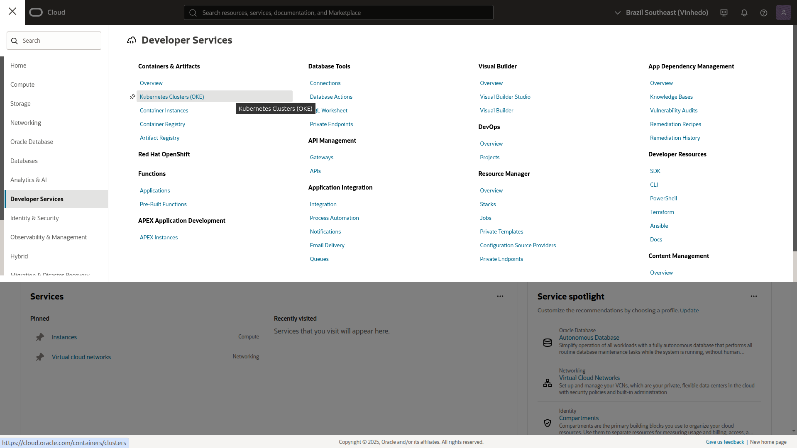
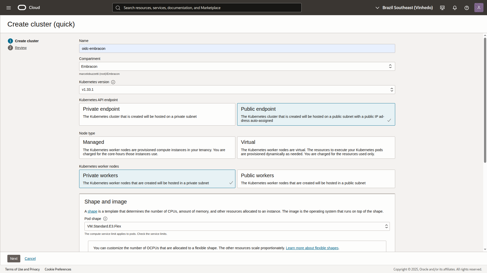
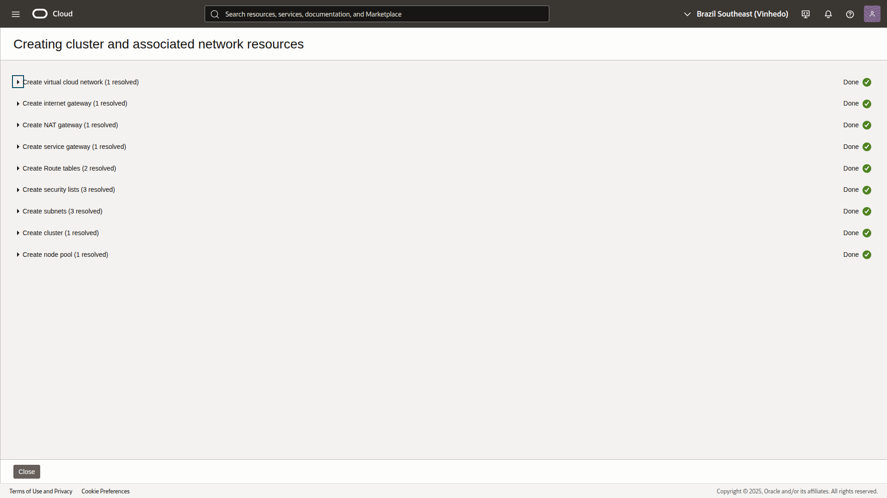
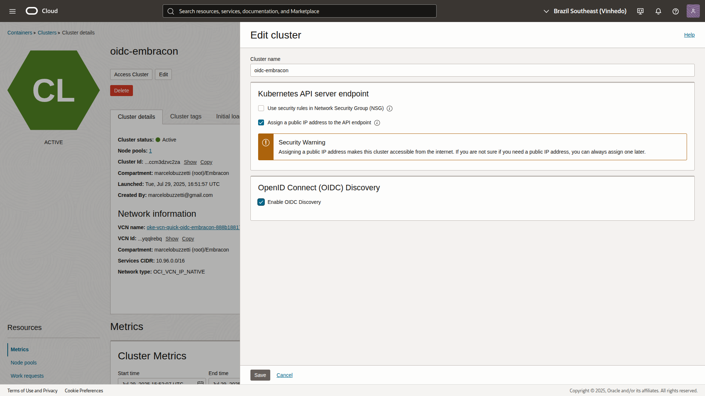

# OIDC no Oracle Cloud (OKE)

No Oracle Kubernetes Engine (OKE), o processo de configuração do OIDC é diferente do AKS, pois o OKE não expõe um endpoint OIDC por padrão para autenticação de workloads. 

Para a utilização do OIDC é necessário que o cluster seja do tipo `ENHANCED_CLUSTER` e deve-se ativar o `Open Id Connect Discovery`.

## Requisitos principais antes de habilitar o OIDC no OKE

- Disponível apenas em clusters com Kubernetes versão 1.21 ou superior.
- Compatível exclusivamente com clusters nativos de VCN, ou seja, clusters cujos endpoints da API Kubernetes estão em uma sub-rede do seu próprio VCN. Consulte a [documentação de migração para clusters nativos de VCN](https://docs.oracle.com/en-us/iaas/Content/ContEng/Tasks/contengmovingvcnnative.htm).
- Suportado em nós gerenciados, nós virtuais e nós autogerenciados.
- Permitido somente em clusters do tipo *enhanced* (não disponível para clusters do tipo *basic*).

## Como fazer login usando o OCI CLI

Para autenticar-se e usar o OCI CLI, siga os passos abaixo:

1. **Instale o OCI CLI**  
    Siga as instruções oficiais:  
    https://docs.oracle.com/en-us/iaas/Content/API/SDKDocs/cliinstall.htm

2. **Configure o CLI**  
    Execute o comando abaixo e siga o assistente interativo:
    ```sh
    oci setup config
    ```
    Você precisará informar:
    - OCID do usuário
    - OCID do tenancy
    - Região
    - Caminho para a chave privada

3. **Faça login**  
    O OCI CLI utiliza as credenciais configuradas no arquivo `~/.oci/config`. Após configurar, você já estará autenticado para executar comandos.

4. **Teste a autenticação**  
    Por exemplo, para listar os compartimentos:
    ```sh
    oci iam compartment list --all
    ```
    

> **Nota:** O login via OIDC é utilizado para workloads no cluster OKE, enquanto o OCI CLI usa autenticação baseada em chave.

## Como criar um cluster OKE via Console

### Abra o menu de navegação e selecione **Developer Services**. Em **Containers & Artifacts**, clique em **Kubernetes Clusters (OKE)**.



### Clique em `Create Cluster`


### Escolha em `Quick create`


> Nota
>
> O Quick create irá criar automaticamente:
> - Virtual Cloud Network (VCN)
> - Internet Gateway (IG)
> - NAT Gateway (NAT)
> - Service Gateway (SGW)
> - Kubernetes cluster
> - Kubernetes worker node(s) e node pool  
> Esses recursos são provisionados para facilitar a criação rápida do cluster OKE.

### Coloque o nome e escolha as definições necessárias




### Clique em `Next`


### Verifique e clique em `Create cluster`


### Aguarde o provisionamento e clique em `Close`



### Aguarde o `Cluster status` virar `Active`


> Nota
>
> Observer que o OIDC Discovery está como `Not enabled`

### Anote o OCID do cluster.

## Atualizando um cluster para o tipo `ENHANCED_CLUSTER`

### Via Cli

```bash
oci ce cluster update --cluster-id <cluster-ocid> --type ENHANCED_CLUSTER
```


### Via Console

1. Abra o menu de navegação e selecione **Developer Services**. Em **Containers & Artifacts**, clique em **Kubernetes Clusters (OKE)**.
2. Selecione o compartimento que contém o cluster desejado.
3. Na página de clusters, clique no nome do cluster do tipo *Basic* que você deseja atualizar para *Enhanced*.
4. Na página de detalhes do cluster, verifique que o tipo está como **Cluster type: Basic**.
5. Clique em **Upgrade to Enhanced Cluster**.
6. Confirme a opção **Upgrade to Enhanced Cluster** para prosseguir com a atualização.  
  > **Atenção:** Após a atualização, não é possível reverter o cluster para o tipo *Basic*.
7. Clique em **Upgrade** para iniciar o processo.
8. Após a conclusão, a página de detalhes do cluster exibirá **Cluster type: Enhanced**.


## Como ativar o Open Id Connect Discovery via Console

### Clique em editar




## Como ativar o Open Id Connect Discovery via CLI

1. Crie o arquivo [cluster-enable-oidc.json](cluster-enable-oidc.json) e coloque o seguinte conteúdo:

```json
{
  "options": {
    "openIdConnectDiscovery": {
      "isOpenIdConnectDiscoveryEnabled": true
    }
  }
}
```

2. Para atualizar o cluster, execute o seguinte comando :
```bash
oci ce cluster update --cluster-id <CLUSTER_OCID> --from-json file://cluster-enable-oidc.json
```


>Nota
>
> Substitua o <CLUSTER_OCID> pelo OCDI do Cluster
> Caso apareça `WARNING: Updates to options and freeform-tags and defined-tags and image-policy-config will replace any existing values. Are you sure you want to continue? [y/N]:` digite y

3. Pegue o `open-id-connect-discovery-endpoint` com o comando:
```bash
oci ce cluster get --cluster-id <CLUSTER_OCID> | grep -B1 'open-id-connect-discovery'
```


>Nota
>
> Substitua o <CLUSTER_OCID> pelo OCDI do Cluster

## Exemplo de uso do issuer OIDC do OKE no Azure

```sh
az identity federated-credential create \
  --name "oke-federated-credential" \
  --identity-name "<NOME_DA_MANAGED_IDENTITY>" \
  --resource-group "<RESOURCE_GROUP>" \
  --issuer "<open-id-connect-discovery-endpoint>" \
  --subject "system:serviceaccount:<NAMESPACE>:<SERVICE_ACCOUNT_NAME>"
```

---

## Resumo

- No OKE, o OIDC já está disponível por padrão.
- Basta obter o issuer URL pelo painel do cluster e usá-lo normalmente para federação de identidade.
- Não é necessário habilitar o OIDC manualmente.
