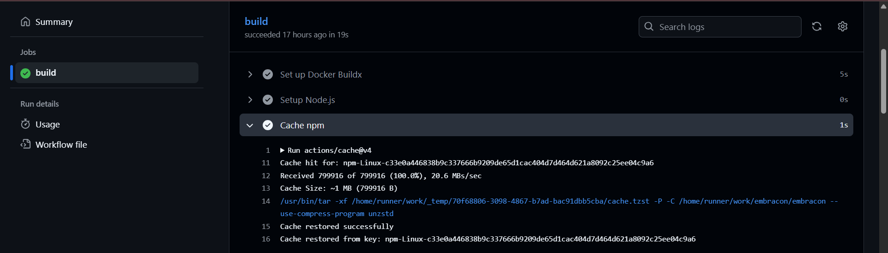
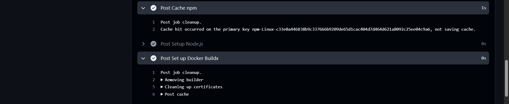
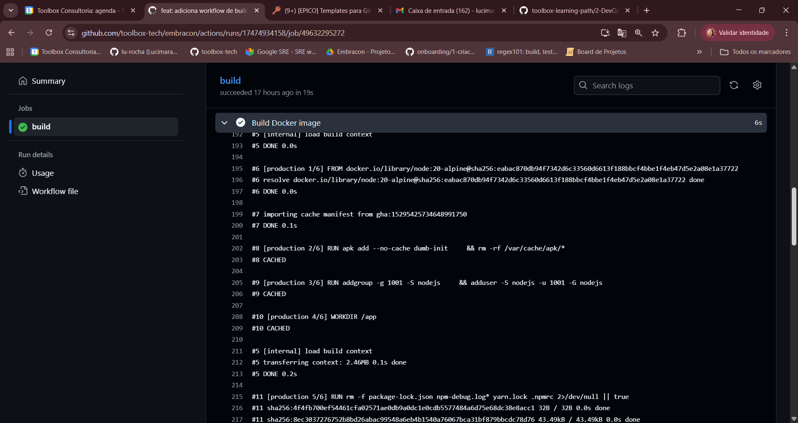

# Workflow de Build com Cache (Docker)

## 📌 Descrição

Este repositório contém um exemplo de **workflow GitHub Actions** que realiza o **build da imagem Docker** com **cache habilitado**, reduzindo o tempo das builds em Pull Requests.

## ⚙️ Workflow

- **Trigger**: Pull Requests para a branch `main`
- **Ações principais**:
  - Setup do ambiente
  - Build da imagem com cache
  - (Opcional) Publicação da imagem em registry

## 🧩 Cache

O cache é salvo/restaurado para otimizar o build:
- **Cache Hit** → etapas reutilizam camadas anteriores.
- **Cache Miss** → nova build, cache atualizado.

## 📸 Evidências

####  ✅ Workflow executado 

- Print do npm sendo restaurado:

- Print do build do Docker com cache:

- Print do cache sendo exportado:

   
- Print da finalização do cache:

## 🐞 Troubleshooting

- **Forks:** PRs de forks podem não ter permissão para usar secrets → evite push para registry nesse caso; mantenha `type=gha`.
- **Cache miss constante:** verifique se `cache-from` e `cache-to` usam o mesmo tipo e escopo; cheque se o Dockerfile invalida camadas cedo (ordem das instruções!).
- **Limite de cache do GHA:** o GitHub lida com expiração/GC; `mode=max` aumenta deduplicação, mas pode crescer. Monitore tempos.
- **Dependências dentro do container:** se você instala tudo **dentro** do Docker (sem `actions/cache`), o ganho virá só do cache de layers do buildx – tá ok, mas pode somar os dois.
- **BuildKit features não cacheáveis:** mounts/secret `-mount=type=secret` não são cacheados por design.
