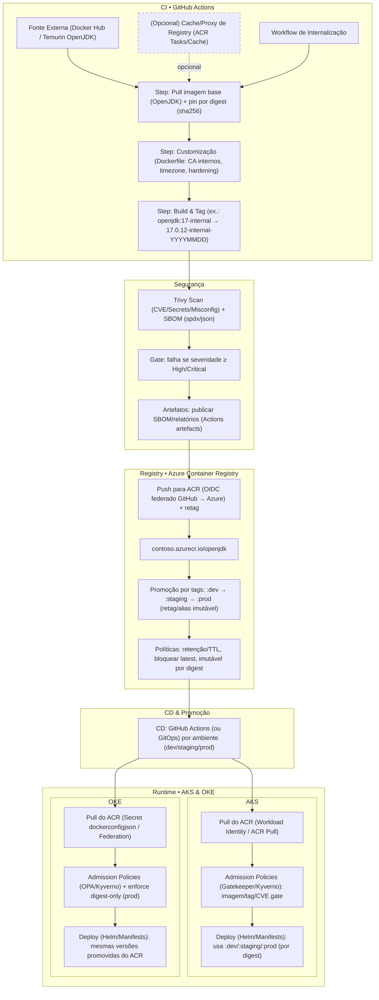

<p align="center">
  
</p>

# 🐳 Internalização de Imagens Docker

## 🎯 Sobre o Módulo

Este módulo contém instruções detalhadas para configuração do Azure Container Registry e recomendações para internalização de imagens Docker do Docker Hub. Seguindo estas diretrizes, você poderá:

- 🛡️ Reduzir dependências externas do Docker Hub
- 🚫 Evitar problemas com limites de rate limiting
- 🔒 Melhorar a segurança com escaneamento de vulnerabilidades
- ⚡ Acelerar o tempo de deploy dos seus containers

## 📑 Índice

- [🎯 Sobre o Módulo](#-sobre-o-módulo)
- [🚀 Proposta](#proposta)
- [🚀 Início Rápido](#-início-rápido)
- [🛠️ Criação e Configuração do ACR](#-criação-e-configuração-do-acr)
  - [Criando um novo Azure Container Registry](#1-criando-um-novo-azure-container-registry)
  - [Habilitando recursos avançados](#2-habilitando-recursos-avançados)
  - [Configurando geo-replicação para alta disponibilidade](#3-configurando-geo-replicação-para-alta-disponibilidade)
- [🔒 Segurança do ACR](#-segurança-do-acr)
  - [Autenticação com Azure AD](#1-autenticação-com-azure-ad)
- [📥 Importando Imagens do Docker Hub](#-importando-imagens-do-docker-hub)
  - [Importação básica de imagens](#1-importação-básica-de-imagens)
  - [Importação com namespace personalizado](#2-importação-com-namespace-personalizado)
  - [Importação com autenticação para registros privados](#3-importação-com-autenticação-para-registros-privados)
  - [Importação em massa de várias tags de uma imagem](#4-importação-em-massa-de-várias-tags-de-uma-imagem)
  - [Boas práticas para importação](#5-boas-práticas-para-importação)
  - [Automação com Azure Logic Apps](#6-automação-com-azure-logic-apps)
- [🔄 Workflows GitHub Actions para Espelhamento](#-workflows-github-actions-para-espelhamento)
  - [Workflow para Imagens Públicas](#workflow-para-imagens-públicas)
  - [Workflow para Imagens Privadas](#workflow-para-imagens-privadas)
- [🔄 Integração com Azure Kubernetes Service (AKS)](#-integração-com-azure-kubernetes-service-aks)
- [🧹 Políticas de Retenção e Limpeza](#-políticas-de-retenção-e-limpeza)
- [📊 Monitoramento e Alertas](#-monitoramento-e-alertas)

## Proposta



## 🚀 Início Rápido

Para começar rapidamente com a internalização de imagens Docker:

1. Crie um Azure Container Registry Premium: `az acr create --resource-group embracon-infra --name embraconacr --sku Premium`
2. Configure políticas de retenção: `az acr config retention update --registry embraconacr --status enabled --days 7 --type UntaggedManifests`
3. Importe imagens do Docker Hub: `az acr import --name embraconacr --source docker.io/library/nginx:latest --image nginx:latest`

## 🛠️ Criação e Configuração do ACR

### 1. Criando um novo Azure Container Registry

```powershell
# Definir variáveis
$resourceGroupName = "embracon-infra"
$acrName = "embraconacr"
$location = "brazilsouth"
$sku = "Premium"  # Premium é necessário para recursos avançados como geo-replicação e zonas de disponibilidade

# Criar o grupo de recursos (se ainda não existir)
az group create --name $resourceGroupName --location $location

# Criar o Azure Container Registry
az acr create --resource-group $resourceGroupName --name $acrName --sku $sku --admin-enabled false
```

### 2. Habilitando recursos avançados

```powershell
# Configurar retenção de imagens (manter por apenas 7 dias imagens não utilizadas)
az acr config retention update --registry $acrName --resource-group $resourceGroupName --status enabled --days 7 --type UntaggedManifests
```

### 3. Configurando geo-replicação para alta disponibilidade

```powershell
# Adicionar replicação para outra região
az acr replication create --registry $acrName --resource-group $resourceGroupName --location eastus
```

## 🔒 Segurança do ACR

### 1. Autenticação com Azure AD

```powershell
# Criar uma identidade gerenciada para aplicações
$identityName = "app-identity"
az identity create --name $identityName --resource-group $resourceGroupName

# Obter o ID da identidade
$identityPrincipalId = az identity show --name $identityName --resource-group $resourceGroupName --query principalId --output tsv

# Criar um grupo do Azure AD para usuários do ACR
$groupName = "ACR-Users"
$groupDescription = "Grupo para usuários com acesso total ao Azure Container Registry"

# Criar o grupo
az ad group create --display-name $groupName --mail-nickname "acr-users" --description $groupDescription

# Obter o ID do grupo criado
$groupId = az ad group show --group $groupName --query id --output tsv

# Adicionar usuário criado ao grupo
az ad group member add --group $groupName --member-id $identityPrincipalId

# Obter o ID do ACR
$acrId = az acr show --name $acrName --resource-group $resourceGroupName --query id --output tsv

# Alternativamente, conceder permissões específicas do ACR
az role assignment create --assignee $groupId --scope $acrId --role "Container Registry Data Importer and Data Reader"
az role assignment create --assignee $groupId --scope $acrId --role AcrPush
az role assignment create --assignee $groupId --scope $acrId --role AcrPull
az role assignment create --assignee $groupId --scope $acrId --role AcrDelete
az role assignment create --assignee $groupId --scope $acrId --role AcrRead

# Verificar as permissões atribuídas
az role assignment list --scope $acrId --output table
```

```powershell
# Para adicionar mais usuários ao grupo posteriormente
$novoUsuario = "novo.usuario@embracon.com.br"
az ad group member add --group $groupName --member-id $(az ad user show --id $novoUsuario --query id --output tsv)

# Listar membros do grupo
az ad group member list --group $groupName --query "[].{Name:displayName, Email:userPrincipalName}" --output table
# Conceder acesso de AcrPull à identidade
$acrId = az acr show --name $acrName --resource-group $resourceGroupName --query id --output tsv
az role assignment create --assignee $identityPrincipalId --scope $acrId --role AcrPull

# Conceder acesso de push
az role assignment create --assignee $identityPrincipalId --scope $acrId --role AcrPush
```

## 📥 Importando Imagens do Docker Hub

A Azure oferece uma maneira simplificada de importar imagens diretamente do Docker Hub (ou de outros registros) para o ACR sem precisar baixar e fazer upload manualmente.

### 1. Importação básica de imagens

```powershell
# Importar uma imagem do Docker Hub para o ACR
az acr import `
  --name $acrName `
  --source docker.io/library/nginx:latest `
  --image nginx:latest
```

### 2. Importação com namespace personalizado

```powershell
# Importar com namespace personalizado
az acr import `
  --name $acrName `
  --source docker.io/library/redis:6-alpine `
  --image cache/redis:6-alpine
```

### 3. Importação com autenticação para registros privados

```powershell
# Importar de um registro que requer autenticação
az acr import `
  --name $acrName `
  --source docker.io/privateuser/privateimage:tag `
  --image privateimages/privateimage:tag `
  --username <username> `
  --password <password>
```

### 4. Importação em massa de várias tags de uma imagem

#### Via CLI

```powershell
# Definir as tags a serem importadas
$imageTags = @("18-alpine", "18.12-alpine", "18.13-alpine", "20-alpine")
$sourceRepo = "docker.io/library/node"
$targetRepo = "devops/node"

# Importar cada tag
foreach ($tag in $imageTags) {
    Write-Host "Importando ${sourceRepo}:${tag} para ${targetRepo}:${tag}..."
    az acr import `
      --name $acrName `
      --source "${sourceRepo}:${tag}" `
      --image "${targetRepo}:${tag}"
}
```
#### JSON
```powershell
# Definir as tags a serem importadas a partir do arquivo JSON
$jsonFile = "internalization-docker-images/docker-public-images.json"
$imagesData = Get-Content $jsonFile | ConvertFrom-Json

# Importar cada imagem definida no arquivo JSON
foreach ($imageInfo in $imagesData.images) {
  $sourceRepo = "docker.io/library/$($imageInfo.repository)"
  $targetRepo = $imageInfo.targetRepository
  $tag = $imageInfo.tag
  
  Write-Host "Importando ${sourceRepo}:${tag} para ${targetRepo}:${tag}..."
  az acr import `
    --name $acrName `
    --source "${sourceRepo}:${tag}" `
    --image "${targetRepo}:${tag}"
}
```


### 5. Boas práticas para importação

1. **Use prefixos organizacionais**: Organize suas imagens com prefixos como `prod/`, `dev/`, `mirrors/`
2. **Importe versões específicas**: Evite usar a tag `latest` e prefira versões específicas
3. **Verifique os digests das imagens**: Compare os digests antes de importar para garantir que o conteúdo foi realmente alterado
4. **Documente as imagens importadas**: Mantenha um registro de quais imagens foram importadas e quando
5. **Configure importação automática**: Use tarefas agendadas para manter imagens atualizadas
6. **Economize largura de banda**: Implemente verificação por tag e digest para evitar downloads desnecessários

## 🔄 Workflows GitHub Actions para Espelhamento

Implementamos dois workflows GitHub Actions para espelhamento de imagens Docker para o ACR usando autenticação OIDC com o Azure:

1. Workflow para imagens públicas (Docker Hub)
2. Workflow para imagens privadas (registros privados)

Os workflows incluem as seguintes funcionalidades:

- ✅ Autenticação no Docker Hub para evitar problemas de rate limiting
- ✅ Autenticação federada com Azure (OIDC)
- ✅ Verificação de existência da imagem no ACR antes de baixar (evita tráfego desnecessário)
- ✅ Verificação por digest para garantir a integridade do conteúdo das imagens
- ✅ Suporte a duas abordagens: Docker pull/push e az acr import
- ✅ Tratamento de erros e limpeza de imagens locais

#### Verificação por Digest

A verificação por digest é uma funcionalidade importante que foi implementada nos workflows para garantir que as imagens sejam atualizadas somente quando seu conteúdo for realmente alterado, mesmo que a tag permaneça a mesma. O processo funciona da seguinte forma:

1. **Verificação inicial por tag**: O workflow verifica primeiro se a tag da imagem já existe no ACR
2. **Obtenção do digest da origem**: Se a tag existir, o workflow obtém o digest da imagem de origem (Docker Hub ou registro privado)
3. **Obtenção do digest no ACR**: Em seguida, obtém o digest da imagem já existente no ACR
4. **Comparação**: Compara os dois digests para verificar se o conteúdo é idêntico
5. **Decisão**: Se os digests forem iguais, a imagem é ignorada (economizando largura de banda e processamento). Se forem diferentes, a imagem é atualizada.

Esta abordagem é mais robusta do que apenas verificar por tags, pois protege contra:
- Imagens que foram atualizadas sem mudar a tag (prática comum em tags como "latest")
- Garantia de integridade do conteúdo
- Redução significativa no consumo de largura de banda e custo de transferência

### Workflow para Imagens Públicas

Este workflow espelha imagens públicas do Docker Hub definidas no arquivo `docker-public-images.json`:

```yaml
name: Mirror Public Docker Images to ACR

on:
  # Executa diariamente à meia-noite
  schedule:
    - cron: '0 0 * * *'
  # Permite execução manual pelo GitHub UI
  workflow_dispatch:
  # Executa quando o arquivo docker-public-images.json é modificado
  push:
    branches:
      - main
    paths:
      - 'internalization-docker-images/docker-public-images.json'

jobs:
  mirror-public-images:
    name: Mirror Public Docker Images to ACR
    runs-on: ubuntu-latest
    
    # Permissões necessárias para autenticação OIDC
    permissions:
      id-token: write
      contents: read
    
    steps:
      - name: Checkout Repository
        uses: actions/checkout@v4
      
      - name: Login to Docker Hub
        uses: docker/login-action@v3
        with:
          username: ${{ vars.DOCKERHUB_USERNAME }}
          password: ${{ secrets.DOCKERHUB_TOKEN }}
      
      - name: Azure Login via OIDC
        uses: azure/login@v2
        with:
          client-id: ${{ secrets.AZURE_CLIENT_ID }}
          tenant-id: ${{ secrets.AZURE_TENANT_ID }}
          subscription-id: ${{ secrets.AZURE_SUBSCRIPTION_ID }}

      - name: Log in to Azure Container Registry
        run: az acr login -n ${{ vars.ACR_NAME }}

      - name: Mirror Public Docker Images
        run: |
          ACR_NAME="${{ vars.ACR_NAME }}"
          RESOURCE_GROUP="${{ vars.RESOURCE_GROUP }}"
          PREFIX="embracon-"
          
          # Ler imagens do arquivo JSON
          IMAGES=$(cat "internalization-docker-images/docker-public-images.json" | jq -c '.images')
          
          echo "$IMAGES" | jq -c '.[]' | while read -r image; do
            REPO=$(echo "$image" | jq -r '.repository')
            TAG=$(echo "$image" | jq -r '.tag')
            TARGET_REPO=$(echo "$image" | jq -r '.targetRepository')
            
            # Verificar se a imagem já existe no ACR
            TARGET_IMAGE="$PREFIX$TARGET_REPO:$TAG"
            echo "Verificando se a imagem $TARGET_IMAGE já existe no ACR..."
            
            # Verificar primeiro pela tag
            TAG_EXISTS=false
            if az acr repository show-tags --name "$ACR_NAME" --repository "$PREFIX$TARGET_REPO" --output tsv 2>/dev/null | grep -q "^$TAG$"; then
              TAG_EXISTS=true
              echo "Tag $TAG encontrada no repositório $PREFIX$TARGET_REPO. Verificando digest..."
              
              # Obter o digest da imagem de origem
              echo "Obtendo digest da imagem de origem docker.io/library/$REPO:$TAG"
              SOURCE_DIGEST=$(docker pull docker.io/library/$REPO:$TAG -q 2>/dev/null && docker inspect --format='{{index .RepoDigests 0}}' docker.io/library/$REPO:$TAG | cut -d'@' -f2)
              
              if [ -n "$SOURCE_DIGEST" ]; then
                # Obter o digest da imagem no ACR
                ACR_DIGEST=$(az acr repository show --name "$ACR_NAME" --image "$PREFIX$TARGET_REPO:$TAG" --query "digest" -o tsv 2>/dev/null)
                
                if [ "$SOURCE_DIGEST" = "$ACR_DIGEST" ]; then
                  echo "A imagem $TARGET_IMAGE já existe no ACR e tem o mesmo digest ($SOURCE_DIGEST). Pulando importação."
                  continue
                else
                  echo "A imagem $TARGET_IMAGE existe, mas o digest é diferente. Source: $SOURCE_DIGEST, ACR: $ACR_DIGEST. Atualizando..."
                fi
              else
                echo "Não foi possível obter o digest da imagem de origem. Prosseguindo com verificação por tag."
                continue
              fi
            fi
    runs-on: ubuntu-latest
    
    # Permissões necessárias para autenticação OIDC
    permissions:
      id-token: write
      contents: read
    
    steps:
      - name: Checkout Repository
        uses: actions/checkout@v4

      - name: Login to Docker Hub
        uses: docker/login-action@v3
        with:
          username: ${{ vars.DOCKERHUB_USERNAME }}
          password: ${{ secrets.DOCKERHUB_TOKEN }}
      
      - name: Azure Login via OIDC
        uses: azure/login@v2
        with:
          client-id: ${{ secrets.AZURE_CLIENT_ID }}
          tenant-id: ${{ secrets.AZURE_TENANT_ID }}
          subscription-id: ${{ secrets.AZURE_SUBSCRIPTION_ID }}

      - name: Log in to Azure Container Registry
        run: az acr login -n ${{ vars.ACR_NAME }}

      - name: Mirror Public Docker Images
        run: |
          ACR_NAME="${{ vars.ACR_NAME }}"
          RESOURCE_GROUP="${{ vars.RESOURCE_GROUP }}"
          PREFIX="embracon-"
          
          echo "Using ACR: $ACR_NAME in resource group: $RESOURCE_GROUP"
          
          # Ler imagens do arquivo JSON
          IMAGES=$(cat "internalization-docker-images/docker-public-images.json" | jq -c '.images')
          
            echo "$IMAGES" | jq -c '.[]' | while read -r image; do
            REPO=$(echo "$image" | jq -r '.repository')
            TAG=$(echo "$image" | jq -r '.tag')
            TARGET_REPO=$(echo "$image" | jq -r '.targetRepository')
            
            echo "Processing $REPO:$TAG to $PREFIX$TARGET_REPO:$TAG"
            
            # Pull da imagem do Docker Hub
            echo "Pulling image from Docker Hub: docker.io/library/$REPO:$TAG"
            if ! docker pull docker.io/library/$REPO:$TAG; then
              echo "Error: Failed to pull docker.io/library/$REPO:$TAG"
              continue
            fi
            
            # Tag para o ACR
            echo "Tagging for ACR: $ACR_NAME.azurecr.io/$PREFIX$TARGET_REPO:$TAG"
            if ! docker tag docker.io/library/$REPO:$TAG $ACR_NAME.azurecr.io/$PREFIX$TARGET_REPO:$TAG; then
              echo "Error: Failed to tag $ACR_NAME.azurecr.io/$PREFIX$TARGET_REPO:$TAG"
              continue
            fi
            
            # Push para o ACR
            echo "Pushing to ACR: $ACR_NAME.azurecr.io/$PREFIX$TARGET_REPO:$TAG"
            if ! docker push $ACR_NAME.azurecr.io/$PREFIX$TARGET_REPO:$TAG; then
              echo "Error: Failed to push $ACR_NAME.azurecr.io/$PREFIX$TARGET_REPO:$TAG"
            fi
            
            # Limpar imagens locais para economizar espaço
            echo "Cleaning up local images"
            docker rmi docker.io/library/$REPO:$TAG $ACR_NAME.azurecr.io/$PREFIX$TARGET_REPO:$TAG || true
            done
  mirror-public-images-with-az-acr-import:
    name: Mirror Public Docker Images to ACR (using az acr import)
    runs-on: ubuntu-latest
    permissions:
      id-token: write
      contents: read
    
    steps:
      - name: Checkout Repository
        uses: actions/checkout@v4
      
      - name: Azure Login via OIDC
        uses: azure/login@v2
        with:
          client-id: ${{ secrets.AZURE_CLIENT_ID }}
          tenant-id: ${{ secrets.AZURE_TENANT_ID }}
          subscription-id: ${{ secrets.AZURE_SUBSCRIPTION_ID }}

      - name: Log in to Azure Container Registry
        run: az acr login -n ${{ vars.ACR_NAME }}
      - name: Mirror Public Docker Images
        run: |
          ACR_NAME="${{ vars.ACR_NAME }}"
          RESOURCE_GROUP="${{ vars.RESOURCE_GROUP }}"
          PREFIX="embracon-"
          
          echo "Using ACR: $ACR_NAME in resource group: $RESOURCE_GROUP"
          
          # Ler imagens do arquivo JSON
          IMAGES=$(cat "internalization-docker-images/docker-public-images.json" | jq -c '.images')
          
          echo "$IMAGES" | jq -c '.[]' | while read -r image; do
            REPO=$(echo "$image" | jq -r '.repository')
            TAG=$(echo "$image" | jq -r '.tag')
            TARGET_REPO=$(echo "$image" | jq -r '.targetRepository')
            
            echo "Importing $REPO:$TAG to $PREFIX$TARGET_REPO:$TAG"
            
            if ! az acr import \
              --name "$ACR_NAME" \
              --resource-group "$RESOURCE_GROUP" \
              --source "docker.io/library/$REPO:$TAG" \
              --image "$PREFIX$TARGET_REPO:$TAG" \
              --username ${{ vars.DOCKERHUB_USERNAME }} \
              --password ${{ secrets.DOCKERHUB_TOKEN }} \
              --force; then
              echo "Error: Failed to import $REPO:$TAG to $PREFIX$TARGET_REPO:$TAG"
            fi
          done
```

### Workflow para Imagens Privadas

Este workflow espelha imagens de registros Docker privados definidas no arquivo `docker-private-images.json`:

```yaml
name: Mirror Private Docker Images to ACR

on:
  # Executa diariamente às 2 da manhã
  schedule:
    - cron: '0 2 * * *'
  # Permite execução manual pelo GitHub UI
  workflow_dispatch:
  # Executa quando o arquivo docker-private-images.json é modificado
  push:
    branches:
      - main
    paths:
      - 'internalization-docker-images/docker-private-images.json'

jobs:
  mirror-private-images:
    name: Mirror Private Docker Images to ACR
    runs-on: ubuntu-latest
    
    # Permissões necessárias para autenticação OIDC
    permissions:
      id-token: write
      contents: read
    
    steps:
      - name: Checkout Repository
        uses: actions/checkout@v4
      
      - name: Login to Docker Hub
        uses: docker/login-action@v3
        with:
          username: ${{ vars.DOCKERHUB_USERNAME }}
          password: ${{ secrets.DOCKERHUB_TOKEN }}
      
      - name: Azure Login via OIDC
        uses: azure/login@v2
        with:
          client-id: ${{ secrets.AZURE_CLIENT_ID }}
          tenant-id: ${{ secrets.AZURE_TENANT_ID }}
          subscription-id: ${{ secrets.AZURE_SUBSCRIPTION_ID }}

      - name: Log in to Azure Container Registry
        run: az acr login -n ${{ vars.ACR_NAME }}

      - name: Mirror Private Docker Images
        run: |
          ACR_NAME="${{ vars.ACR_NAME }}"
          RESOURCE_GROUP="${{ vars.RESOURCE_GROUP }}"
          PREFIX="embracon-"
          
          # Ler imagens do arquivo JSON
          IMAGES=$(cat "internalization-docker-images/docker-private-images.json" | jq -c '.images')
          
          echo "$IMAGES" | jq -c '.[]' | while read -r image; do
            REPO=$(echo "$image" | jq -r '.repository')
            TAG=$(echo "$image" | jq -r '.tag')
            TARGET_REPO=$(echo "$image" | jq -r '.targetRepository')
            REGISTRY=$(echo "$image" | jq -r '.registry')
            
            # Verificar se a imagem já existe no ACR
            TARGET_IMAGE="$PREFIX$TARGET_REPO:$TAG"
            echo "Verificando se a imagem $TARGET_IMAGE já existe no ACR..."
            
            # Verificar primeiro pela tag
            TAG_EXISTS=false
            if az acr repository show-tags --name "$ACR_NAME" --repository "$PREFIX$TARGET_REPO" --output tsv 2>/dev/null | grep -q "^$TAG$"; then
              TAG_EXISTS=true
              echo "Tag $TAG encontrada no repositório $PREFIX$TARGET_REPO. Verificando digest..."
              
              # Obter o digest da imagem de origem
              echo "Obtendo digest da imagem de origem $REGISTRY/$REPO:$TAG"
              SOURCE_DIGEST=$(docker pull $REGISTRY/$REPO:$TAG -q 2>/dev/null && docker inspect --format='{{index .RepoDigests 0}}' $REGISTRY/$REPO:$TAG | cut -d'@' -f2)
              
              if [ -n "$SOURCE_DIGEST" ]; then
                # Obter o digest da imagem no ACR
                ACR_DIGEST=$(az acr repository show --name "$ACR_NAME" --image "$PREFIX$TARGET_REPO:$TAG" --query "digest" -o tsv 2>/dev/null)
                
                if [ "$SOURCE_DIGEST" = "$ACR_DIGEST" ]; then
                  echo "A imagem $TARGET_IMAGE já existe no ACR e tem o mesmo digest ($SOURCE_DIGEST). Pulando importação."
                  continue
                else
                  echo "A imagem $TARGET_IMAGE existe, mas o digest é diferente. Source: $SOURCE_DIGEST, ACR: $ACR_DIGEST. Atualizando..."
                fi
              else
                echo "Não foi possível obter o digest da imagem de origem. Prosseguindo com verificação por tag."
                continue
              fi
            fi
  schedule:
    - cron: '0 2 * * *'
  # Permite execução manual pelo GitHub UI
  workflow_dispatch:
  # Executa quando o arquivo docker-private-images.json é modificado
  push:
    branches:
      - main
    paths:
      - 'internalization-docker-images/docker-private-images.json'

jobs:
  mirror-private-images:
    name: Mirror Private Docker Images to ACR
    runs-on: ubuntu-latest
    
    # Permissões necessárias para autenticação OIDC
    permissions:
      id-token: write
      contents: read
    
    steps:
      - name: Checkout Repository
        uses: actions/checkout@v4
      
      - name: Login to Docker Hub
        uses: docker/login-action@v3
        with:
          username: ${{ vars.DOCKERHUB_USERNAME }}
          password: ${{ secrets.DOCKERHUB_TOKEN }}
      
      - name: Azure Login via OIDC
        uses: azure/login@v2
        with:
          client-id: ${{ secrets.AZURE_CLIENT_ID }}
          tenant-id: ${{ secrets.AZURE_TENANT_ID }}
          subscription-id: ${{ secrets.AZURE_SUBSCRIPTION_ID }}

      - name: Log in to Azure Container Registry
        run: az acr login -n ${{ vars.ACR_NAME }}

      - name: Mirror Private Docker Images
        run: |
          ACR_NAME="${{ vars.ACR_NAME }}"
          RESOURCE_GROUP="${{ vars.RESOURCE_GROUP }}"
          PREFIX="embracon-"
          
          echo "Using ACR: $ACR_NAME in resource group: $RESOURCE_GROUP"
          
          # Verificar se o arquivo existe
          if [ ! -f "internalization-docker-images/docker-private-images.json" ]; then
            echo "Arquivo de imagens privadas não encontrado. Pulando importação."
            exit 0
          fi
          
          # Ler imagens do arquivo JSON
          IMAGES=$(cat "internalization-docker-images/docker-private-images.json" | jq -c '.images')
          
          echo "$IMAGES" | jq -c '.[]' | while read -r image; do
            REPO=$(echo "$image" | jq -r '.repository')
            TAG=$(echo "$image" | jq -r '.tag')
            TARGET_REPO=$(echo "$image" | jq -r '.targetRepository')
            REGISTRY=$(echo "$image" | jq -r '.registry')
            
            echo "Processing $REPO:$TAG to $PREFIX$TARGET_REPO:$TAG"
            
            # Pull da imagem do registro privado
            echo "Pulling image from registry: $REGISTRY/$REPO:$TAG"
            if ! docker pull $REGISTRY/$REPO:$TAG; then
              echo "Error: Failed to pull $REGISTRY/$REPO:$TAG"
              continue
            fi
            
            # Tag para o ACR
            echo "Tagging for ACR: $ACR_NAME.azurecr.io/$PREFIX$TARGET_REPO:$TAG"
            if ! docker tag $REGISTRY/$REPO:$TAG $ACR_NAME.azurecr.io/$PREFIX$TARGET_REPO:$TAG; then
              echo "Error: Failed to tag $ACR_NAME.azurecr.io/$PREFIX$TARGET_REPO:$TAG"
              continue
            fi
            
            # Push para o ACR
            echo "Pushing to ACR: $ACR_NAME.azurecr.io/$PREFIX$TARGET_REPO:$TAG"
            if ! docker push $ACR_NAME.azurecr.io/$PREFIX$TARGET_REPO:$TAG; then
              echo "Error: Failed to push $ACR_NAME.azurecr.io/$PREFIX$TARGET_REPO:$TAG"
            fi
            
            # Limpar imagens locais para economizar espaço
            echo "Cleaning up local images"
            docker rmi $REGISTRY/$REPO:$TAG $ACR_NAME.azurecr.io/$PREFIX$TARGET_REPO:$TAG || true
          done
  
  mirror-private-images-with-az-acr-import:
    name: Mirror Private Docker Images to ACR (using az acr import)
    runs-on: ubuntu-latest
    permissions:
      id-token: write
      contents: read
    
    steps:
      - name: Checkout Repository
        uses: actions/checkout@v4
      
      - name: Azure Login via OIDC
        uses: azure/login@v2
        with:
          client-id: ${{ secrets.AZURE_CLIENT_ID }}
          tenant-id: ${{ secrets.AZURE_TENANT_ID }}
          subscription-id: ${{ secrets.AZURE_SUBSCRIPTION_ID }}

      - name: Log in to Azure Container Registry
        run: az acr login -n ${{ vars.ACR_NAME }}
        
      - name: Mirror Private Docker Images
        run: |
          ACR_NAME="${{ vars.ACR_NAME }}"
          RESOURCE_GROUP="${{ vars.RESOURCE_GROUP }}"
          PREFIX="embracon-"
          
          echo "Using ACR: $ACR_NAME in resource group: $RESOURCE_GROUP"
          
          # Verificar se o arquivo existe
          if [ ! -f "internalization-docker-images/docker-private-images.json" ]; then
            echo "Arquivo de imagens privadas não encontrado. Pulando importação."
            exit 0
          fi
          
          # Ler imagens do arquivo JSON
          IMAGES=$(cat "internalization-docker-images/docker-private-images.json" | jq -c '.images')
          
          echo "$IMAGES" | jq -c '.[]' | while read -r image; do
            REPO=$(echo "$image" | jq -r '.repository')
            TAG=$(echo "$image" | jq -r '.tag')
            TARGET_REPO=$(echo "$image" | jq -r '.targetRepository')
            REGISTRY=$(echo "$image" | jq -r '.registry')
            
            echo "Importing $REPO:$TAG to $PREFIX$TARGET_REPO:$TAG"
            
            if ! az acr import \
              --name "$ACR_NAME" \
              --resource-group "$RESOURCE_GROUP" \
              --source "$REGISTRY/$REPO:$TAG" \
              --image "$PREFIX$TARGET_REPO:$TAG" \
              --username ${{ vars.DOCKERHUB_USERNAME }} \
              --password ${{ secrets.DOCKERHUB_TOKEN }} \
              --force; then
              echo "Error: Failed to import $REPO:$TAG to $PREFIX$TARGET_REPO:$TAG"
            fi
          done
```

Para configurar estes workflows, consulte o documento [WORKFLOW-SETUP.md](WORKFLOW-SETUP.md) com instruções detalhadas.

## 🔄 Integração com Azure Kubernetes Service (AKS)

### 1. Configurar AKS para usar o ACR

```powershell
$aksName = "embracon-aks"

# Conceder ao AKS acesso ao ACR
az aks update --name $aksName --resource-group $resourceGroupName --attach-acr $acrName

# Ou usando identidade atribuída pelo usuário
$aksIdentityId = az aks show --name $aksName --resource-group $resourceGroupName --query identityProfile.kubeletidentity.objectId -o tsv
az role assignment create --assignee $aksIdentityId --scope $acrId --role AcrPull
```

### 2. Configurando Pull Secrets (caso necessário)

```powershell
# Obter credenciais do ACR (se autenticação de admin estiver habilitada)
$acrUsername = az acr credential show --name $acrName --query username -o tsv
$acrPassword = az acr credential show --name $acrName --query passwords[0].value -o tsv

# Criar secret no Kubernetes
kubectl create secret docker-registry acr-auth \
    --docker-server="$acrName.azurecr.io" \
    --docker-username="$acrUsername" \
    --docker-password="$acrPassword" \
    --docker-email="admin@embracon.com.br"
```

## 🧹 Políticas de Retenção e Limpeza

### 1. Configurando políticas de limpeza

```powershell
# Configurar retenção para remover imagens não utilizadas após 90 dias
az acr config retention update \
    --registry $acrName \
    --resource-group $resourceGroupName \
    --status enabled \
    --days 90 \
    --type UntaggedManifests

# Criar tarefa para limpeza periódica
az acr task create \
    --name "acrPurgeTask" \
    --registry $acrName \
    --resource-group $resourceGroupName \
    --cmd "acr purge --filter 'mirrors/maven:.*' --ago 90d --untagged" \
    --schedule "0 1 * * Sun" \
    --context /dev/null
```

### 2. Implementando tagging semântico

Diretrizes para uso de tags:
- Use versionamento semântico: `major.minor.patch`
- Adicione data para builds: `v1.2.3-20231115`
- Marque imagens estáveis como: `stable`, `production`
- Nunca sobrescreva tags (sempre adicione novas)

```powershell
# Exemplo de aplicação de múltiplas tags
az acr import \
    --name $acrName \
    --source docker.io/library/node:18-alpine \
    --image mirrors/node:18-alpine \
    --image mirrors/node:18 \
    --image mirrors/node:stable
```

## � Otimização e Economia de Recursos

A implementação de verificação por digest nos workflows de espelhamento de imagens oferece diversos benefícios:

### 1. Economia de largura de banda

Ao verificar tanto as tags quanto os digests das imagens, os workflows evitam o download desnecessário de imagens que não mudaram. Isso pode representar economia significativa de largura de banda, especialmente para imagens grandes como as baseadas em JDK.

### 2. Redução de custos

Menos transferência de dados entre registros significa:
- Menor custo de rede (entrada/saída)
- Menor utilização de recursos computacionais
- Menor tempo de execução dos workflows

### 3. Métricas de economia

Para avaliar os benefícios da verificação por digest, você pode acompanhar:

```powershell
# Script para calcular economia com base nos logs
$startDate = (Get-Date).AddDays(-30)
$endDate = Get-Date
$logs = az monitor log-analytics query --workspace $workspaceId --query-string "ContainerRegistryRepositoryEvents | where TimeGenerated between (datetime($startDate) .. datetime($endDate)) | where Message contains 'mesmo digest' | summarize EconomiaBytes=sum(tolong(SizeInBytes)) by bin(TimeGenerated, 1d)" -o tsv

# Converter bytes para MB/GB para melhor visualização
$totalEconomia = $logs | Measure-Object -Property EconomiaBytes -Sum
Write-Output "Economia total no último mês: $($totalEconomia.Sum / 1GB) GB"
```

## �📊 Monitoramento e Alertas

### 1. Configurando métricas e logs

```powershell
# Habilitar diagnóstico de logs
$logAnalyticsId = az monitor log-analytics workspace show --resource-group $resourceGroupName --workspace-name "embracon-logs" --query id -o tsv

az monitor diagnostic-settings create \
    --name "acrDiagnostics" \
    --resource $acrId \
    --workspace $logAnalyticsId \
    --logs '[{"category": "ContainerRegistryRepositoryEvents", "enabled": true}, {"category": "ContainerRegistryLoginEvents", "enabled": true}]' \
    --metrics '[{"category": "AllMetrics", "enabled": true}]'
```

### 2. Configurando alertas

```powershell
# Criar alerta para falhas de autenticação
az monitor alert create \
    --name "ACRAuthFailure" \
    --resource-group $resourceGroupName \
    --scopes $acrId \
    --condition "count 'ContainerRegistryLoginEvents' where OperationName == 'Authenticate' and ResultType == 'Failure' > 5" \
    --description "Alerta para múltiplas falhas de autenticação no ACR" \
    --action-group "/subscriptions/{subscriptionId}/resourceGroups/{resourceGroupName}/providers/microsoft.insights/actionGroups/{actionGroupName}"
```

## 📚 Recursos Adicionais

- [Documentação oficial do Azure Container Registry](https://docs.microsoft.com/pt-br/azure/container-registry/)
- [Melhores práticas para ACR](https://docs.microsoft.com/pt-br/azure/container-registry/container-registry-best-practices)
- [Integração de ACR com AKS](https://docs.microsoft.com/pt-br/azure/aks/cluster-container-registry-integration)
- [Azure Policy para ACR](https://docs.microsoft.com/pt-br/azure/governance/policy/samples/built-in-policies#container-registries)
- [Visão geral das permissões e atribuições de função do Registro de Contêiner do Azure Entra](https://learn.microsoft.com/pt-br/azure/container-registry/container-registry-rbac-built-in-roles-overview?tabs=registries-configured-with-rbac-registry-permissions)
- [Limites de rate limiting do Docker Hub](https://docs.docker.com/docker-hub/download-rate-limit/)
- [Trivy - Scanner de Vulnerabilidades para Containers](https://github.com/aquasecurity/trivy)

---

## 📝 Histórico de Alterações

| Data | Versão | Descrição | Autor |
|------|--------|-----------|-------|
| 04/09/2025 | 1.0.0 | Criação do documento com instruções para ACR | Equipe DevOps |
| 04/09/2025 | 1.0.1 | Correção de sintaxe em scripts PowerShell | Equipe DevOps |
| 04/09/2025 | 1.1.0 | Adição de seção de importação em massa de imagens | Equipe DevOps |

## 📞 Suporte e Contribuição

### **Para Dúvidas e Suporte:**
- 📧 Entre em contato com a equipe de DevOps
- 📖 Consulte a documentação específica de cada módulo
- 🔍 Verifique os guias de troubleshooting

### **Para Contribuições:**
- 🍴 Fork o repositório
- 🌿 Crie uma branch para sua feature
- 📝 Siga as boas práticas de commit
- 📤 Abra um Pull Request

## ⚠️ Aviso Legal

As informações contidas neste documento são apenas para fins educacionais e de orientação. Cada implementação deve ser avaliada de acordo com os requisitos específicos de segurança e conformidade da organização.

---

<p align="center">
  <strong>🚀 Embracon - DevOps e Infraestrutura 🛡️</strong><br>
    <em>🏢 Toolbox Tech - Soluções Padronizadas</em>
</p>
