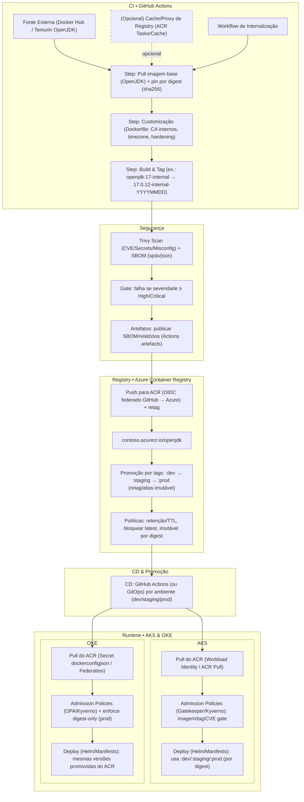

<p align="center">
  
</p>
  
## 📑 Índice

- [🎯 Sobre o Módulo](#-sobre-o-módulo)
- [🏗️ Boas Práticas de Infraestrutura](#-boas-práticas-de-infraestrutura)
- [🚀 Otimização e Economia de Recursos](#-otimização-e-economia-de-recursos)
- [🛠️ Criação e Configuração do ACR](#-criação-e-configuração-do-acr)
- [🔒 Segurança do ACR](#-segurança-do-acr)
- [📥 Importando Imagens do Docker Hub](#-importando-imagens-do-docker-hub)
- [🔄 Workflow GitHub Actions para Espelhamento](#-workflow-github-actions-para-espelhamento)
- [🔄 Integração com Kubernetes](#-integração-com-kubernetes)
  - [Configuração com AKS](#1-configuração-com-azure-kubernetes-service-aks)
  - [Configuração com OKE](#2-configuração-com-oracle-kubernetes-engine-oke)
- [🧹 Políticas de Retenção e Limpeza](#-políticas-de-retenção-e-limpeza)
- [📊 Monitoramento e Alertas](#-monitoramento-e-alertas)
- [📚 Recursos Adicionais](#-recursos-adicionais)

# 🐳 Internalização de Imagens Docker

## 🎯 Sobre o Módulo

Este módulo contém instruções detalhadas para configuração do Azure Container Registry e recomendações para internalização de imagens Docker do Docker Hub. Seguindo estas diretrizes, você poderá:

- 🛡️ Reduzir dependências externas do Docker Hub
- 🚫 Evitar problemas com limites de rate limiting
- 🔒 Melhorar a segurança com escaneamento de vulnerabilidades
- ⚡ Acelerar o tempo de deploy dos seus containers

## 🏗️ Boas Práticas de Infraestrutura

### Segregação de Registros de Containers

É **fortemente recomendado** criar um Azure Container Registry (ACR) dedicado exclusivamente para as imagens internalizadas, mantendo-o separado das imagens que são geradas internamente pela empresa. Esta separação proporciona diversos benefícios:

1. **Segurança aprimorada**: 
   - Separação clara entre imagens externas e imagens proprietárias
   - Políticas de acesso específicas para cada registro
   - Escopo de confiança reduzido para imagens de terceiros

2. **Gerenciamento simplificado**:
   - Ciclo de vida independente para imagens internalizadas
   - Políticas de retenção personalizadas para cada tipo de imagem
   - Clareza sobre origem e propriedade das imagens

3. **Governança e conformidade**:
   - Aplicação de políticas específicas para imagens externas
   - Rastreabilidade clara sobre origem das imagens
   - Auditoria e logging separados por origem

4. **Otimização de custos**:
   - Faturamento separado para cada registro
   - Opções de SKU diferentes baseadas em necessidades específicas
   - Visibilidade clara do custo de armazenamento das imagens externas

A implementação de um ACR dedicado para internalização estabelece uma fronteira clara entre as dependências externas e os artefatos internos da organização.

## 🚀 Otimização e Economia de Recursos

A implementação de verificação por digest nos workflows de espelhamento de imagens oferece diversos benefícios:

### 1. Sincronização completa com arquivo JSON

O processo agora gerencia o ciclo de vida completo das imagens no ACR:
- **Importação** de imagens definidas no arquivo JSON
- **Verificação de digest** para evitar transferências desnecessárias
- **Remoção automática** de imagens que não estão mais no JSON
- **Limpeza total** de repositórios que não estão no JSON

Isso garante que apenas as imagens oficialmente aprovadas e documentadas no JSON permaneçam no registro, mantendo-o limpo e atualizado. A eliminação completa de repositórios não referenciados também evita o acúmulo de recursos não utilizados.

### 2. Economia de largura de banda

Ao verificar tanto as tags quanto os digests das imagens, os workflows evitam o download desnecessário de imagens que não mudaram. Isso pode representar economia significativa de largura de banda, especialmente para imagens grandes como as baseadas em JDK.

### 3. Redução de custos

Menos transferência de dados entre registros significa:
- Menor custo de rede (entrada/saída)
- Menor utilização de recursos computacionais
- Menor tempo de execução dos workflows
- Menos armazenamento usado no ACR (remoção automática de imagens obsoletas)

### 4. Importação Otimizada com az acr import

A utilização do comando `az acr import` representa uma evolução significativa no processo de importação:

```bash
# Importação direta do Docker Hub para o ACR
az acr import --name myacr --source docker.io/library/maven:3.8.1-jdk-11-slim --image maven:3.8.1-jdk-11-slim
```

Benefícios desta abordagem:
- **Transferência direta**: A imagem é transferida diretamente do Docker Hub para o ACR
- **Autenticação simplificada**: Gerencia as credenciais para ambos os registros
- **Verificação integrada**: Verifica automaticamente se é necessário atualizar
- **Menor pressão nos runners**: Os runners do GitHub Actions não precisam baixar ou armazenar as imagens

A utilização do comando `az acr import` representa uma evolução significativa no processo de importação:

```bash
# Importação direta do Docker Hub para o ACR
az acr import --name myacr --source docker.io/library/maven:3.8.1-jdk-11-slim --image maven:3.8.1-jdk-11-slim
```

Benefícios desta abordagem:
- **Transferência direta**: A imagem é transferida diretamente do Docker Hub para o ACR
- **Autenticação simplificada**: Gerencia as credenciais para ambos os registros
- **Verificação integrada**: Verifica automaticamente se é necessário atualizar
- **Menor pressão nos runners**: Os runners do GitHub Actions não precisam baixar ou armazenar as imagens

### 5. Economia de largura de banda e custos

Ao verificar os digests das imagens através de manifests, os workflows evitam o download desnecessário de imagens que não mudaram. Isso resulta em:
- Menor custo de rede (entrada/saída)
- Menor utilização de recursos computacionais
- Menor tempo de execução dos workflows
- Economia significativa de largura de banda, especialmente para imagens grandes

## 🛠️ Criação e Configuração do ACR

### Diagrama de Fluxo de Internalização de Imagens



## 🚀 Início Rápido

Para começar rapidamente com a internalização de imagens Docker:

1. Crie um Azure Container Registry Premium: `az acr create --resource-group embracon-infra --name embraconacr --sku Premium`
2. Configure políticas de retenção: `az acr config retention update --registry embraconacr --status enabled --days 7 --type UntaggedManifests`
3. Importe imagens do Docker Hub: `az acr import --name embraconacr --source docker.io/library/nginx:latest --image nginx:latest`

### 1. Criando um novo Azure Container Registry

```powershell
# Definir variáveis
$resourceGroupName = "embracon-infra"
$acrName = "embraconacr"
$location = "brazilsouth"
$sku = "Premium"  # Premium é necessário para recursos avançados como geo-replicação e zonas de disponibilidade

# Criar o grupo de recursos (se ainda não existir)
az group create --name $resourceGroupName --location $location

# Criar o Azure Container Registry
az acr create --resource-group $resourceGroupName --name $acrName --sku $sku --admin-enabled false
```

### 2. Habilitando recursos avançados

```powershell
# Configurar retenção de imagens (manter por apenas 7 dias imagens não utilizadas)
az acr config retention update --registry $acrName --resource-group $resourceGroupName --status enabled --days 7 --type UntaggedManifests
```

### 3. Configurando geo-replicação para alta disponibilidade

```powershell
# Adicionar replicação para outra região
az acr replication create --registry $acrName --resource-group $resourceGroupName --location eastus
```

## 🔒 Segurança do ACR

### 1. Autenticação com Azure AD

```powershell
# Criar uma identidade gerenciada para aplicações
$identityName = "app-identity"
az identity create --name $identityName --resource-group $resourceGroupName

# Obter o ID da identidade
$identityPrincipalId = az identity show --name $identityName --resource-group $resourceGroupName --query principalId --output tsv

# Criar um grupo do Azure AD para usuários do ACR
$groupName = "ACR-Users"
$groupDescription = "Grupo para usuários com acesso total ao Azure Container Registry"

# Criar o grupo
az ad group create --display-name $groupName --mail-nickname "acr-users" --description $groupDescription

# Obter o ID do grupo criado
$groupId = az ad group show --group $groupName --query id --output tsv

# Adicionar usuário criado ao grupo
az ad group member add --group $groupName --member-id $identityPrincipalId

# Obter o ID do ACR
$acrId = az acr show --name $acrName --resource-group $resourceGroupName --query id --output tsv

# Alternativamente, conceder permissões específicas do ACR
az role assignment create --assignee $groupId --scope $acrId --role "Container Registry Data Importer and Data Reader"
az role assignment create --assignee $groupId --scope $acrId --role AcrPush
az role assignment create --assignee $groupId --scope $acrId --role AcrPull
az role assignment create --assignee $groupId --scope $acrId --role AcrDelete
az role assignment create --assignee $groupId --scope $acrId --role AcrRead

# Verificar as permissões atribuídas
az role assignment list --scope $acrId --output table
```

```powershell
# Para adicionar mais usuários ao grupo posteriormente
$novoUsuario = "novo.usuario@embracon.com.br"
az ad group member add --group $groupName --member-id $(az ad user show --id $novoUsuario --query id --output tsv)

# Listar membros do grupo
az ad group member list --group $groupName --query "[].{Name:displayName, Email:userPrincipalName}" --output table
# Conceder acesso de AcrPull à identidade
$acrId = az acr show --name $acrName --resource-group $resourceGroupName --query id --output tsv
az role assignment create --assignee $identityPrincipalId --scope $acrId --role AcrPull

# Conceder acesso de push
az role assignment create --assignee $identityPrincipalId --scope $acrId --role AcrPush
```

## 📥 Importando Imagens do Docker Hub

A Azure oferece uma maneira simplificada de importar imagens diretamente do Docker Hub (ou de outros registros) para o ACR sem precisar baixar e fazer upload manualmente.

### 1. Importação básica de imagens

```powershell
# Importar uma imagem do Docker Hub para o ACR
az acr import `
  --name $acrName `
  --source docker.io/library/nginx:latest `
  --image nginx:latest
```

### 2. Importação com namespace personalizado

```powershell
# Importar com namespace personalizado
az acr import `
  --name $acrName `
  --source docker.io/library/redis:6-alpine `
  --image cache/redis:6-alpine
```

### 3. Importação com autenticação (quando necessário)

```powershell
# Importar com autenticação (quando necessário)
az acr import `
  --name $acrName `
  --source docker.io/library/image:tag `
  --image mirrors/image:tag `
  --username <username> `
  --password <password>
```

### 4. Importação em massa de várias tags de uma imagem

#### Via CLI

```powershell
# Definir as tags a serem importadas
$imageTags = @("18-alpine", "18.12-alpine", "18.13-alpine", "20-alpine")
$sourceRepo = "docker.io/library/node"
$targetRepo = "devops/node"

# Importar cada tag
foreach ($tag in $imageTags) {
    Write-Host "Importando ${sourceRepo}:${tag} para ${targetRepo}:${tag}..."
    az acr import `
      --name $acrName `
      --source "${sourceRepo}:${tag}" `
      --image "${targetRepo}:${tag}"
}
```
#### JSON
```powershell
# Definir as tags a serem importadas a partir do arquivo JSON
$jsonFile = "internalization-docker-images/docker-public-images.json"
$imagesData = Get-Content $jsonFile | ConvertFrom-Json

# Importar cada imagem definida no arquivo JSON
foreach ($imageInfo in $imagesData.images) {
  $sourceRepo = "docker.io/library/$($imageInfo.repository)"
  $targetRepo = $imageInfo.targetRepository
  $tag = $imageInfo.tag
  
  Write-Host "Importando ${sourceRepo}:${tag} para ${targetRepo}:${tag}..."
  az acr import `
    --name $acrName `
    --source "${sourceRepo}:${tag}" `
    --image "${targetRepo}:${tag}"
}
```


### 5. Boas práticas para importação

1. **Use prefixos organizacionais**: Organize suas imagens com prefixos como `prod/`, `dev/`, `mirrors/`
2. **Importe versões específicas**: Evite usar a tag `latest` e prefira versões específicas
3. **Verifique os digests das imagens**: Use `docker manifest inspect` para verificar digests de forma eficiente sem downloads completos
4. **Documente as imagens importadas**: Mantenha um registro de quais imagens foram importadas e quando
5. **Configure importação automática**: Use tarefas agendadas para manter imagens atualizadas
6. **Economize largura de banda**: Implemente verificação por tag e digest para evitar downloads desnecessários

## 🔄 Workflow GitHub Actions para Espelhamento

Implementamos um workflow GitHub Actions para espelhamento de imagens Docker públicas para o ACR usando autenticação OIDC com o Azure.

O workflow inclui as seguintes funcionalidades:

- ✅ Autenticação no Docker Hub para evitar problemas de rate limiting
- ✅ Autenticação federada com Azure (OIDC)
- ✅ Importação eficiente de imagens usando `az acr import`
- ✅ Verificação por index digest para garantir a integridade do conteúdo das imagens
- ✅ Tratamento de erros e opção para forçar atualização de imagens

#### Atualização Eficiente de Imagens

O uso do comando `az acr import` oferece uma forma eficiente de internalizar imagens do Docker Hub para o ACR:

1. **Transferência direta**: As imagens são transferidas diretamente do Docker Hub para o ACR sem precisar baixá-las para o runner do GitHub Actions
2. **Verificação implícita**: O ACR automaticamente verifica se a imagem já existe e se o conteúdo mudou
3. **Parâmetro force**: O uso da flag `--force` permite atualizar imagens mesmo quando a tag já existe

Esta abordagem traz múltiplos benefícios:
- **Simplicidade**: Código mais conciso e fácil de manter
- **Eficiência de recursos**: Menor consumo de recursos no runner do GitHub Actions
- **Autenticação integrada**: Gerencia automaticamente as autenticações entre registros
- **Economia significativa**: Redução no consumo de largura de banda e custo de transferência
- **Execução mais rápida**: Workflows completam em menos tempo devido ao processo otimizado

### Workflow para Imagens Públicas

Este workflow espelha imagens públicas do Docker Hub definidas no arquivo `docker-public-images.json` e remove as que estão no acr e não constam no arquivo:

```yaml
name: Mirror Public Docker Images to ACR

on:
  # Executa diariamente à meia-noite
  schedule:
    - cron: '0 0 * * *'
  # Permite execução manual pelo GitHub UI
  workflow_dispatch:
  # Executa quando o arquivo docker-public-images-test.json é modificado
  push:
    branches:
      - main
    paths:
      - 'internalization-docker-images/docker-public-images-test.json'

env:
  ACR_NAME: ${{ vars.ACR_NAME }}
  RESOURCE_GROUP: ${{ vars.RESOURCE_GROUP }}
  PREFIX: "embracon-"
  DOCKERHUB_USERNAME: ${{ vars.DOCKERHUB_USERNAME }}
  # As variáveis sensíveis (tokens, secrets) devem ser referenciadas diretamente onde são usadas

jobs:
  mirror-public-images-with-az-acr-import:
    name: Mirror Public Docker Images to ACR (using az acr import)
    runs-on: ubuntu-latest
    permissions:
      id-token: write
      contents: read
    
    steps:
      - name: Checkout Repository
        uses: actions/checkout@v4
      
      - name: Azure Login via OIDC
        uses: azure/login@v2
        with:
          client-id: ${{ secrets.AZURE_CLIENT_ID }}
          tenant-id: ${{ secrets.AZURE_TENANT_ID }}
          subscription-id: ${{ secrets.AZURE_SUBSCRIPTION_ID }}

      - name: Log in to Azure Container Registry
        run: az acr login -n $ACR_NAME
      
      - name: Set up Docker Buildx
        uses: docker/setup-buildx-action@v3
      
      - name: Login to Docker Hub
        uses: docker/login-action@v3
        with:
          username: ${{ env.DOCKERHUB_USERNAME }}
          password: ${{ secrets.DOCKERHUB_TOKEN }}
      #     docker version
          
      - name: Mirror Public Docker Images
        run: |
          echo "Using ACR: $ACR_NAME in resource group: $RESOURCE_GROUP with prefix: $PREFIX"
          
          # Ler imagens do arquivo JSON
          IMAGES=$(cat "internalization-docker-images/docker-public-images-test.json" | jq -c '.images')
          
          echo "$IMAGES" | jq -c '.[]' | while read -r image; do
            REPO=$(echo "$image" | jq -r '.repository')
            TAG=$(echo "$image" | jq -r '.tag')
            # Usar o mesmo nome do repositório de origem
            TARGET_REPO=$(echo "$image" | jq -r '.repository')
            
            # Configurar nome da imagem de destino no ACR
            TARGET_IMAGE="$PREFIX$TARGET_REPO:$TAG"
            echo "Processando imagem: $TARGET_IMAGE"
            
            # Verificar se a imagem existe no ACR
            TAG_EXISTS=false
            if az acr repository show-tags --name "$ACR_NAME" --repository "$PREFIX$TARGET_REPO" --output tsv 2>/dev/null | grep -q "^$TAG$"; then
              TAG_EXISTS=true
              echo "Tag $TAG encontrada no repositório $PREFIX$TARGET_REPO do ACR. Verificando digest..."
              
              # Obter o digest da imagem no ACR usando az CLI
              echo "Obtendo digest da imagem no ACR..."
              ACR_DIGEST=$(az acr repository show --name "$ACR_NAME" --image "$PREFIX$TARGET_REPO:$TAG"  --output json | jq -r '.digest' 2>/dev/null || echo "")
              echo "ACR Digest: $ACR_DIGEST"
              
              # Obter o digest da imagem no Docker Hub usando docker buildx
              echo "Obtendo digest da imagem no Docker Hub..."
              DOCKERHUB_DIGEST=$(docker buildx imagetools inspect "docker.io/library/$REPO:$TAG" --format "{{json .Manifest}}" | jq -r '.digest' 2>/dev/null || echo "")
              echo "Docker Hub Digest: $DOCKERHUB_DIGEST"

              # Comparar os digests
              if [ -n "$ACR_DIGEST" ] && [ -n "$DOCKERHUB_DIGEST" ] && [ "$ACR_DIGEST" = "$DOCKERHUB_DIGEST" ]; then
                echo "Os digests são idênticos ($ACR_DIGEST). Não é necessário atualizar a imagem."
                continue
              else
                echo "Os digests são diferentes ou não foi possível obter um deles:"
                echo "ACR Digest: $ACR_DIGEST"
                echo "Docker Hub Digest: $DOCKERHUB_DIGEST"
                echo "Prosseguindo com a importação..."
              fi
            else
              echo "Tag $TAG não encontrada no ACR. Importando a imagem..."
            fi
            
            echo "Importando imagem $REPO:$TAG para $PREFIX$TARGET_REPO:$TAG"
            
            if ! az acr import \
              --name "$ACR_NAME" \
              --resource-group "$RESOURCE_GROUP" \
              --source "docker.io/library/$REPO:$TAG" \
              --image "$PREFIX$TARGET_REPO:$TAG" \
              --username "$DOCKERHUB_USERNAME" \
              --password "${{ secrets.DOCKERHUB_TOKEN }}" \
              --force; then
              echo "Error: Failed to import $REPO:$TAG to $PREFIX$TARGET_REPO:$TAG"
            else
              echo "Imagem $REPO:$TAG importada com sucesso para $PREFIX$TARGET_REPO:$TAG"
            fi
          done
  cleanup-images-not-in-json:
    name: Cleanup Images Not in JSON
    runs-on: ubuntu-latest
    permissions:
      id-token: write
      contents: read
    
    steps:
      - name: Checkout Repository
        uses: actions/checkout@v4
      
      - name: Azure Login via OIDC
        uses: azure/login@v2
        with:
          client-id: ${{ secrets.AZURE_CLIENT_ID }}
          tenant-id: ${{ secrets.AZURE_TENANT_ID }}
          subscription-id: ${{ secrets.AZURE_SUBSCRIPTION_ID }}

      - name: Log in to Azure Container Registry
        run: az acr login -n $ACR_NAME
      - name: Remove Images Not in JSON
        run: |
          echo "Using ACR: $ACR_NAME in resource group: $RESOURCE_GROUP with prefix: $PREFIX"
          
          # Remover imagens que não estão no JSON
          echo "Verificando e removendo imagens que não estão no arquivo JSON..."
          
          # Cria arquivos temporários com as imagens e repositórios válidos listados no JSON
          echo "Criando listas de imagens e repositórios válidos..."
          jq -r '.images[] | "\(.repository):\(.tag)"' internalization-docker-images/docker-public-images-test.json > /tmp/valid_images.txt
          jq -r '.images[] | .repository' internalization-docker-images/docker-public-images-test.json | sort -u > /tmp/valid_repos.txt
          
          # Listar todos os repositórios no ACR
          echo "Listando repositórios no ACR..."
          az acr repository list --name $ACR_NAME -o tsv | grep "^$PREFIX" | while read -r repo; do
            # Remove o prefixo para comparar com o repository do JSON
            BASE_REPO=$(echo $repo | sed "s/^$PREFIX//")
            
            # Verifica se o repositório está na lista de repositórios válidos
            if ! grep -q "^$BASE_REPO$" /tmp/valid_repos.txt; then
              echo "O repositório $repo não está no arquivo JSON. Removendo o repositório inteiro..."
              
              # Remover o repositório completo
              if ! az acr repository delete --name $ACR_NAME --repository $repo --yes; then
                echo "Erro: Falha ao remover o repositório $repo"
                echo "Continuando com o próximo item..."
              fi
              
              # Pula para o próximo repositório
              continue
            fi
            
            echo "Verificando imagens no repositório $repo..."
            
            # Listar todas as tags neste repositório
            az acr repository show-tags --name $ACR_NAME --repository $repo -o tsv | while read -r tag; do
              # Verifica se a combinação repositório:tag está na lista de imagens válidas
                if ! grep -q "^$BASE_REPO:$tag$" /tmp/valid_images.txt; then
                echo "A imagem $repo:$tag não está no arquivo JSON. Removendo..."
                
                # Remover a imagem
                if ! az acr repository delete --name $ACR_NAME --image "$repo:$tag" --yes; then
                  echo "Erro: Falha ao remover $repo:$tag"
                  echo "Continuando com o próximo item..."
                fi
              else
                echo "A imagem $repo:$tag está na lista de imagens válidas. Mantendo."
              fi
            done
          done
          
          echo "Processo de sincronização concluído."
```

Para configurar este workflow, consulte o documento [WORKFLOW-SETUP.md](WORKFLOW-SETUP.md) com instruções detalhadas.

## 🔄 Integração com Kubernetes

### 1. Configuração com Azure Kubernetes Service (AKS)

```powershell
$aksName = "embracon-aks"
$acrName = "embraconacr"
$resourceGroupName = "embracon-infra"

# Criar um grupo para controle de acesso ao ACR
$groupName = "aks-acr-pull"
$groupDescription = "Grupo para clusters AKS com permissão de AcrPull no ACR"

# Criar o grupo
az ad group create --display-name $groupName --mail-nickname "aks-acr-pull" --description $groupDescription

# Obter o ID do grupo criado
$groupId = az ad group show --group $groupName --query id --output tsv

# Obter o ID da identidade do kubelet do cluster AKS
$aksIdentityId = az aks show --name $aksName --resource-group $resourceGroupName --query identityProfile.kubeletidentity.objectId -o tsv

# Adicionar a identidade do cluster AKS ao grupo
az ad group member add --group $groupName --member-id $aksIdentityId

# Obter o ID do ACR
$acrId = az acr show --name $acrName --resource-group $resourceGroupName --query id --output tsv

# Atribuir permissão AcrPull ao grupo
az role assignment create --assignee $groupId --scope $acrId --role AcrPull

# Verificar as permissões atribuídas
az role assignment list --assignee $groupId --output table
```

> **Benefícios desta abordagem**: Ao usar grupos para gerenciar permissões, você pode facilmente adicionar múltiplos clusters AKS ao mesmo grupo, simplificando o gerenciamento de acesso ao ACR. Esta prática também facilita a auditoria e a revogação de permissões quando necessário.

### 2. Configuração com Oracle Kubernetes Engine (OKE)

O Oracle Kubernetes Engine (OKE) também pode acessar o ACR usando autenticação federada (OIDC) e aproveitar o mesmo grupo "aks-acr-pull" que criamos anteriormente para gerenciar permissões.

```powershell
# Variáveis para configuração
$acrName = "embraconacr"
$resourceGroupName = "embracon-infra"
$managedIdentityName = "oke-workload-identity"
$okeNamespace = "default"
$okeServiceAccount = "workload-identity-sa"
$groupName = "aks-acr-pull"

# 1. Criar uma Managed Identity para o OKE
az identity create --name $managedIdentityName --resource-group $resourceGroupName
$identityClientId = az identity show --name $managedIdentityName --resource-group $resourceGroupName --query clientId --output tsv
$identityPrincipalId = az identity show --name $managedIdentityName --resource-group $resourceGroupName --query principalId --output tsv
$tenantId = az account show --query tenantId --output tsv

# 2. Adicionar a Managed Identity ao grupo aks-acr-pull
az ad group member add --group $groupName --member-id $identityPrincipalId

# 3. Verificar que o grupo tem permissão AcrPull no ACR
$acrId = az acr show --name $acrName --resource-group $resourceGroupName --query id --output tsv
az role assignment list --scope $acrId --assignee-object-id $(az ad group show --group $groupName --query id --output tsv) --output table
```

#### Criar Federated Credential para OKE

```powershell
# Obter o Issuer URL do OKE (deve ser fornecido pelo administrador do OKE)
$okeIssuerUrl = "<open-id-connect-discovery-endpoint>"

# Criar Federated Credential
az identity federated-credential create \
  --name "oke-federated-credential" \
  --identity-name $managedIdentityName \
  --resource-group $resourceGroupName \
  --issuer $okeIssuerUrl \
  --subject "system:serviceaccount:$okeNamespace:$okeServiceAccount"
```

#### Configurar o OKE

Conecte-se ao cluster OKE usando o CLI da Oracle:

```bash
oci ce cluster create-kubeconfig --cluster-id "$CLUSTER_OCID" --file $HOME/.kube/config --region "$REGION" --token-version 2.0.0 --kube-endpoint PUBLIC_ENDPOINT
```

#### Criar a ServiceAccount no OKE

Crie um arquivo `service-account.yaml`:

```yaml
apiVersion: v1
kind: ServiceAccount
metadata:
  name: workload-identity-sa
  namespace: default
  annotations:
    azure.workload.identity/client-id: "$identityClientId"
    azure.workload.identity/tenant-id: "$tenantId"
```

Aplique o arquivo:

```bash
kubectl apply -f service-account.yaml
```

#### Criar um pod de teste para acesso ao ACR

```yaml
apiVersion: v1
kind: Pod
metadata:
  name: acr-test
  namespace: default
spec:
  serviceAccountName: workload-identity-sa
  containers:
  - name: acr-test
    image: embraconacr.azurecr.io/embracon-hello-world:latest
    imagePullPolicy: Always
  nodeSelector:
    kubernetes.io/os: linux
```

> **Nota:** Esta abordagem integrada permite que ambos os ambientes Kubernetes (AKS e OKE) compartilhem o mesmo controle de acesso ao ACR através do grupo "aks-acr-pull", simplificando a gestão de permissões em ambientes híbridos.


### 3. Configurando Pull Secrets (caso necessário)

```powershell
# Obter credenciais do ACR (se autenticação de admin estiver habilitada)
$acrUsername = az acr credential show --name $acrName --query username -o tsv
$acrPassword = az acr credential show --name $acrName --query passwords[0].value -o tsv

# Criar secret no Kubernetes
kubectl create secret docker-registry acr-auth \
    --docker-server="$acrName.azurecr.io" \
    --docker-username="$acrUsername" \
    --docker-password="$acrPassword" \
    --docker-email="admin@embracon.com.br"
```

## 🧹 Políticas de Retenção e Limpeza

### 1. Configurando políticas de limpeza

```powershell
# Configurar retenção para remover imagens não utilizadas após 90 dias
az acr config retention update \
    --registry $acrName \
    --resource-group $resourceGroupName \
    --status enabled \
    --days 90 \
    --type UntaggedManifests

# Criar tarefa para limpeza periódica
az acr task create \
    --name "acrPurgeTask" \
    --registry $acrName \
    --resource-group $resourceGroupName \
    --cmd "acr purge --filter 'mirrors/maven:.*' --ago 90d --untagged" \
    --schedule "0 1 * * Sun" \
    --context /dev/null
```

### 2. Implementando tagging semântico

Diretrizes para uso de tags:
- Use versionamento semântico: `major.minor.patch`
- Adicione data para builds: `v1.2.3-20231115`
- Marque imagens estáveis como: `stable`, `production`
- Nunca sobrescreva tags (sempre adicione novas)

```powershell
# Exemplo de aplicação de múltiplas tags
az acr import \
    --name $acrName \
    --source docker.io/library/node:18-alpine \
    --image mirrors/node:18-alpine \
    --image mirrors/node:18 \
    --image mirrors/node:stable
```

## � Otimização e Economia de Recursos

A implementação de verificação por digest nos workflows de espelhamento de imagens oferece diversos benefícios:

### 1. Economia de largura de banda

Ao verificar tanto as tags quanto os digests das imagens, os workflows evitam o download desnecessário de imagens que não mudaram. Isso pode representar economia significativa de largura de banda, especialmente para imagens grandes como as baseadas em JDK.

### 2. Redução de custos

Menos transferência de dados entre registros significa:
- Menor custo de rede (entrada/saída)
- Menor utilização de recursos computacionais
- Menor tempo de execução dos workflows

### 3. Métricas de economia

Para avaliar os benefícios da verificação por digest, você pode acompanhar:

```powershell
# Script para calcular economia com base nos logs
$startDate = (Get-Date).AddDays(-30)
$endDate = Get-Date
$logs = az monitor log-analytics query --workspace $workspaceId --query-string "ContainerRegistryRepositoryEvents | where TimeGenerated between (datetime($startDate) .. datetime($endDate)) | where Message contains 'mesmo digest' | summarize EconomiaBytes=sum(tolong(SizeInBytes)) by bin(TimeGenerated, 1d)" -o tsv

# Converter bytes para MB/GB para melhor visualização
$totalEconomia = $logs | Measure-Object -Property EconomiaBytes -Sum
Write-Output "Economia total no último mês: $($totalEconomia.Sum / 1GB) GB"
```

## �📊 Monitoramento e Alertas

### 1. Configurando métricas e logs

```powershell
# Habilitar diagnóstico de logs
$logAnalyticsId = az monitor log-analytics workspace show --resource-group $resourceGroupName --workspace-name "embracon-logs" --query id -o tsv

az monitor diagnostic-settings create \
    --name "acrDiagnostics" \
    --resource $acrId \
    --workspace $logAnalyticsId \
    --logs '[{"category": "ContainerRegistryRepositoryEvents", "enabled": true}, {"category": "ContainerRegistryLoginEvents", "enabled": true}]' \
    --metrics '[{"category": "AllMetrics", "enabled": true}]'
```

### 2. Configurando alertas

```powershell
# Criar alerta para falhas de autenticação
az monitor alert create \
    --name "ACRAuthFailure" \
    --resource-group $resourceGroupName \
    --scopes $acrId \
    --condition "count 'ContainerRegistryLoginEvents' where OperationName == 'Authenticate' and ResultType == 'Failure' > 5" \
    --description "Alerta para múltiplas falhas de autenticação no ACR" \
    --action-group "/subscriptions/{subscriptionId}/resourceGroups/{resourceGroupName}/providers/microsoft.insights/actionGroups/{actionGroupName}"
```

## 📚 Recursos Adicionais

- [Documentação oficial do Azure Container Registry](https://docs.microsoft.com/pt-br/azure/container-registry/)
- [Melhores práticas para ACR](https://docs.microsoft.com/pt-br/azure/container-registry/container-registry-best-practices)
- [Integração de ACR com AKS](https://docs.microsoft.com/pt-br/azure/aks/cluster-container-registry-integration)
- [Azure Policy para ACR](https://docs.microsoft.com/pt-br/azure/governance/policy/samples/built-in-policies#container-registries)
- [Visão geral das permissões e atribuições de função do Registro de Contêiner do Azure Entra](https://learn.microsoft.com/pt-br/azure/container-registry/container-registry-rbac-built-in-roles-overview?tabs=registries-configured-with-rbac-registry-permissions)
- [Limites de rate limiting do Docker Hub](https://docs.docker.com/docker-hub/download-rate-limit/)
- [Trivy - Scanner de Vulnerabilidades para Containers](https://github.com/aquasecurity/trivy)

---

## � Solução de Problemas com Verificação de Digest

Ao trabalhar com a verificação de digest das imagens Docker, você pode encontrar alguns desafios:

### 1. Problemas com Docker Manifest

Se o comando `docker manifest inspect` falhar, verifique os seguintes pontos:

```bash
# Habilitando recursos experimentais (obrigatório para docker manifest)
export DOCKER_CLI_EXPERIMENTAL=enabled

# Verificando se o manifesto está disponível
docker manifest inspect docker.io/library/maven:3.8.1-jdk-11-slim

# Extraindo digest sem usar jq (mais compatível)
docker manifest inspect docker.io/library/maven:3.8.1-jdk-11-slim | grep digest | head -n 1 | awk '{print $2}' | tr -d ',"'

# Se falhar, tentar métodos alternativos
docker pull docker.io/library/maven:3.8.1-jdk-11-slim
docker inspect docker.io/library/maven:3.8.1-jdk-11-slim | grep RepoDigests -A 1 | tail -n 1 | awk -F '@' '{print $2}' | tr -d '",'
```

### 2. Diferenças de Digest entre Registros

Em alguns casos, o digest pode diferir entre o registro de origem e o ACR devido a:
- Normalização de layers nas imagens
- Diferenças nos formatos de manifesto
- Conversão automática entre formatos (v1, v2, OCI)

Nestes casos, considere verificar apenas tags específicas ou implementar lógica personalizada.

## 📞 Suporte e Contribuição

### **Para Dúvidas e Suporte:**
- 📧 Entre em contato com a equipe de DevOps
- 📖 Consulte a documentação específica de cada módulo
- 🔍 Verifique os guias de troubleshooting

### **Para Contribuições:**
- 🍴 Fork o repositório
- 🌿 Crie uma branch para sua feature
- 📝 Siga as boas práticas de commit
- 📤 Abra um Pull Request

## ⚠️ Aviso Legal

As informações contidas neste documento são apenas para fins educacionais e de orientação. Cada implementação deve ser avaliada de acordo com os requisitos específicos de segurança e conformidade da organização.

---

<p align="center">
  <strong>🚀 Embracon - DevOps e Infraestrutura 🛡️</strong><br>
    <em>🏢 Toolbox Tech - Soluções Padronizadas</em>
</p>
