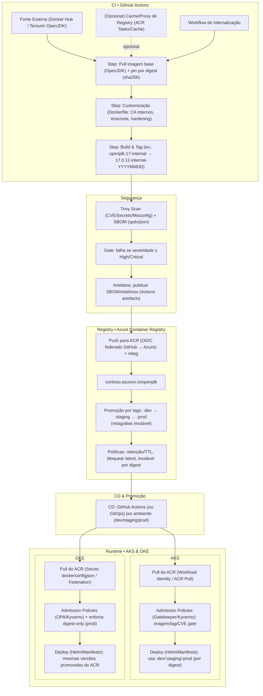

<p align="center">
  
</p>

# 🐳 Internalização de Imagens Docker

## 🎯 Sobre o Módulo

Este módulo contém instruções detalhadas para configuração do Azure Container Registry e recomendações para internalização de imagens Docker do Docker Hub. Seguindo estas diretrizes, você poderá:

- 🛡️ Reduzir dependências externas do Docker Hub
- 🚫 Evitar problemas com limites de rate limiting
- 🔒 Melhorar a segurança com escaneamento de vulnerabilidades
- ⚡ Acelerar o tempo de deploy dos seus containers

## 📑 Índice

- [🎯 Sobre o Módulo](#-sobre-o-módulo)
- [🚀 Proposta](#proposta)
- [🚀 Início Rápido](#-início-rápido)
- [🛠️ Criação e Configuração do ACR](#-criação-e-configuração-do-acr)
  - [Criando um novo Azure Container Registry](#1-criando-um-novo-azure-container-registry)
  - [Habilitando recursos avançados](#2-habilitando-recursos-avançados)
  - [Configurando geo-replicação para alta disponibilidade](#3-configurando-geo-replicação-para-alta-disponibilidade)
- [🔒 Segurança do ACR](#-segurança-do-acr)
  - [Autenticação com Azure AD](#1-autenticação-com-azure-ad)
- [📥 Importando Imagens do Docker Hub](#-importando-imagens-do-docker-hub)
  - [Importação básica de imagens](#1-importação-básica-de-imagens)
  - [Importação com namespace personalizado](#2-importação-com-namespace-personalizado)
  - [Importação com autenticação para registros privados](#3-importação-com-autenticação-para-registros-privados)
  - [Importação em massa de várias tags de uma imagem](#4-importação-em-massa-de-várias-tags-de-uma-imagem)
  - [Boas práticas para importação](#5-boas-práticas-para-importação)
  - [Automação com Azure Logic Apps](#6-automação-com-azure-logic-apps)
- [🔄 Workflows GitHub Actions para Espelhamento](#-workflows-github-actions-para-espelhamento)
  - [Workflow para Imagens Públicas](#workflow-para-imagens-públicas)
  - [Workflow para Imagens Privadas](#workflow-para-imagens-privadas)
- [🔄 Integração com Azure Kubernetes Service (AKS)](#-integração-com-azure-kubernetes-service-aks)
- [🧹 Políticas de Retenção e Limpeza](#-políticas-de-retenção-e-limpeza)
- [📊 Monitoramento e Alertas](#-monitoramento-e-alertas)

## Proposta


```mermaid
flowchart TB
  %% Orientação: Vertical (Top to Bottom)
  classDef dashed stroke-dasharray: 5 5

  subgraph CI[CI • GitHub Actions]
    EXT["Fonte Externa (Docker Hub / Temurin OpenJDK)" ]
    CACHE["(Opcional) Cache/Proxy de Registry (ACR Tasks/Cache)"]:::dashed
    GHA["Workflow de Internalização"]
    PULL["Step: Pull imagem base (OpenJDK) + pin por digest (sha256)"]
    CUST["Step: Customização (Dockerfile: CA internos, timezone, hardening)"]
    BUILD["Step: Build & Tag (ex.: openjdk:17-internal → 17.0.12-internal-YYYYMMDD)"]
  end

  subgraph SEC[Segurança]
    TRIVY["Trivy Scan (CVE/Secrets/Misconfig) + SBOM (spdx/json)"]
    GATE["Gate: falha se severidade ≥ High/Critical"]
    SBOM["Artefatos: publicar SBOM/relatórios (Actions artefacts)"]
  end

  subgraph REG[Registry • Azure Container Registry]
    PUSH["Push para ACR (OIDC federado GitHub → Azure) + retag"]
    ACR_REPO["contoso.azurecr.io/openjdk"]
    TAGS["Promoção por tags: :dev → :staging → :prod (retag/alias imutável)"]
    POLICY["Políticas: retenção/TTL, bloquear latest, imutável por digest"]
  end

  subgraph CD[CD & Promoção]
    CDPIPE["CD: GitHub Actions (ou GitOps) por ambiente (dev/staging/prod)"]
  end

  subgraph RT[Runtime • AKS & OKE]
    subgraph AKS[AKS]
      AKS1["Pull do ACR (Workload Identity / ACR Pull)"]
      AKS2["Admission Policies (Gatekeeper/Kyverno): imagem/tag/CVE gate"]
      AKS3["Deploy (Helm/Manifests): usa :dev/:staging/:prod (por digest)"]
    end
    subgraph OKE[OKE]
      OKE1["Pull do ACR (Secret dockerconfigjson / Federation)"]
      OKE2["Admission Policies (OPA/Kyverno) + enforce digest-only (prod)"]
      OKE3["Deploy (Helm/Manifests): mesmas versões promovidas do ACR"]
    end
  end

  %% Fluxo CI
  EXT --> PULL
  CACHE -. opcional .-> PULL
  GHA --> PULL --> CUST --> BUILD

  %% Segurança
  BUILD --> TRIVY --> GATE --> SBOM

  %% Push/Registry
  SBOM --> PUSH --> ACR_REPO --> TAGS --> POLICY

  %% CD
  POLICY --> CDPIPE

  %% Runtime
  CDPIPE --> AKS1 --> AKS2 --> AKS3
  CDPIPE --> OKE1 --> OKE2 --> OKE3
```

## 🚀 Início Rápido

Para começar rapidamente com a internalização de imagens Docker:

1. Crie um Azure Container Registry Premium: `az acr create --resource-group embracon-infra --name embraconacr --sku Premium`
2. Configure políticas de retenção: `az acr config retention update --registry embraconacr --status enabled --days 7 --type UntaggedManifests`
3. Importe imagens do Docker Hub: `az acr import --name embraconacr --source docker.io/library/nginx:latest --image nginx:latest`

## 🛠️ Criação e Configuração do ACR

### 1. Criando um novo Azure Container Registry

```powershell
# Definir variáveis
$resourceGroupName = "embracon-infra"
$acrName = "embraconacr"
$location = "brazilsouth"
$sku = "Premium"  # Premium é necessário para recursos avançados como geo-replicação e zonas de disponibilidade

# Criar o grupo de recursos (se ainda não existir)
az group create --name $resourceGroupName --location $location

# Criar o Azure Container Registry
az acr create --resource-group $resourceGroupName --name $acrName --sku $sku --admin-enabled false
```

### 2. Habilitando recursos avançados

```powershell
# Configurar retenção de imagens (manter por apenas 7 dias imagens não utilizadas)
az acr config retention update --registry $acrName --resource-group $resourceGroupName --status enabled --days 7 --type UntaggedManifests
```

### 3. Configurando geo-replicação para alta disponibilidade

```powershell
# Adicionar replicação para outra região
az acr replication create --registry $acrName --resource-group $resourceGroupName --location eastus
```

## 🔒 Segurança do ACR

### 1. Autenticação com Azure AD

```powershell
# Criar uma identidade gerenciada para aplicações
$identityName = "app-identity"
az identity create --name $identityName --resource-group $resourceGroupName

# Obter o ID da identidade
$identityPrincipalId = az identity show --name $identityName --resource-group $resourceGroupName --query principalId --output tsv

# Criar um grupo do Azure AD para usuários do ACR
$groupName = "ACR-Users"
$groupDescription = "Grupo para usuários com acesso total ao Azure Container Registry"

# Criar o grupo
az ad group create --display-name $groupName --mail-nickname "acr-users" --description $groupDescription

# Obter o ID do grupo criado
$groupId = az ad group show --group $groupName --query id --output tsv

# Adicionar usuário criado ao grupo
az ad group member add --group $groupName --member-id $identityPrincipalId

# Obter o ID do ACR
$acrId = az acr show --name $acrName --resource-group $resourceGroupName --query id --output tsv

# Conceder permissão total (Owner) ao grupo sobre o ACR
az role assignment create --assignee $groupId --scope $acrId --role Owner

# Alternativamente, conceder permissões específicas do ACR
az role assignment create --assignee $groupId --scope $acrId --role AcrPush
az role assignment create --assignee $groupId --scope $acrId --role AcrPull
az role assignment create --assignee $groupId --scope $acrId --role AcrDelete
az role assignment create --assignee $groupId --scope $acrId --role AcrRead

# Verificar as permissões atribuídas
az role assignment list --scope $acrId --output table
```

```powershell
# Para adicionar mais usuários ao grupo posteriormente
$novoUsuario = "novo.usuario@embracon.com.br"
az ad group member add --group $groupName --member-id $(az ad user show --id $novoUsuario --query id --output tsv)

# Listar membros do grupo
az ad group member list --group $groupName --query "[].{Name:displayName, Email:userPrincipalName}" --output table
# Conceder acesso de AcrPull à identidade
$acrId = az acr show --name $acrName --resource-group $resourceGroupName --query id --output tsv
az role assignment create --assignee $identityPrincipalId --scope $acrId --role AcrPull

# Conceder acesso de push
az role assignment create --assignee $identityPrincipalId --scope $acrId --role AcrPush
```

## 📥 Importando Imagens do Docker Hub

A Azure oferece uma maneira simplificada de importar imagens diretamente do Docker Hub (ou de outros registros) para o ACR sem precisar baixar e fazer upload manualmente.

### 1. Importação básica de imagens

```powershell
# Importar uma imagem do Docker Hub para o ACR
az acr import `
  --name $acrName `
  --source docker.io/library/nginx:latest `
  --image nginx:latest
```

### 2. Importação com namespace personalizado

```powershell
# Importar com namespace personalizado
az acr import `
  --name $acrName `
  --source docker.io/library/redis:6-alpine `
  --image cache/redis:6-alpine
```

### 3. Importação com autenticação para registros privados

```powershell
# Importar de um registro que requer autenticação
az acr import `
  --name $acrName `
  --source docker.io/privateuser/privateimage:tag `
  --image privateimages/privateimage:tag `
  --username <username> `
  --password <password>
```

### 4. Importação em massa de várias tags de uma imagem

```powershell
# Definir as tags a serem importadas
$imageTags = @("18-alpine", "18.12-alpine", "18.13-alpine", "20-alpine")
$sourceRepo = "docker.io/library/node"
$targetRepo = "devops/node"

# Importar cada tag
foreach ($tag in $imageTags) {
    Write-Host "Importando ${sourceRepo}:${tag} para ${targetRepo}:${tag}..."
    az acr import `
      --name $acrName `
      --source "${sourceRepo}:${tag}" `
      --image "${targetRepo}:${tag}"
}
```

### 5. Boas práticas para importação

1. **Use prefixos organizacionais**: Organize suas imagens com prefixos como `prod/`, `dev/`, `mirrors/`
2. **Importe versões específicas**: Evite usar a tag `latest` e prefira versões específicas
3. **Documente as imagens importadas**: Mantenha um registro de quais imagens foram importadas e quando
4. **Configure importação automática**: Use tarefas agendadas para manter imagens atualizadas

### 6. Automação com Azure Logic Apps

Você pode criar um workflow no Azure Logic Apps para importar automaticamente novas versões:

1. **Gatilho**: Timer recorrente (ex: uma vez por semana)
2. **Ação**: Verificar novas tags em repositórios específicos
3. **Condição**: Se houver novas tags, importar para o ACR
4. **Notificação**: Enviar email ou mensagem quando novas imagens forem importadas

## 🔄 Workflows GitHub Actions para Espelhamento

Implementamos dois workflows GitHub Actions para espelhamento de imagens Docker para o ACR usando autenticação OIDC com o Azure:

1. Workflow para imagens públicas (Docker Hub)
2. Workflow para imagens privadas (registros privados)

### Workflow para Imagens Públicas

Este workflow espelha imagens públicas do Docker Hub definidas no arquivo `docker-public-images.json`:

```yaml
name: Mirror Public Docker Images to ACR

on:
  # Executa diariamente à meia-noite
  schedule:
    - cron: '0 0 * * *'
  # Permite execução manual pelo GitHub UI
  workflow_dispatch:
  # Executa quando o arquivo docker-public-images.json é modificado
  push:
    paths:
      - 'internalization-docker-images/docker-public-images.json'

jobs:
  mirror-public-images:
    name: Mirror Public Docker Images to ACR
    runs-on: ubuntu-latest
    
    # Permissões necessárias para autenticação OIDC
    permissions:
      id-token: write
      contents: read
    
    steps:
      - name: Checkout Repository
        uses: actions/checkout@v4
      
      - name: Azure Login via OIDC
        uses: azure/login@v2
        with:
          client-id: ${{ secrets.AZURE_CLIENT_ID }}
          tenant-id: ${{ secrets.AZURE_TENANT_ID }}
          subscription-id: ${{ secrets.AZURE_SUBSCRIPTION_ID }}
      
      # Lógica para espelhar as imagens públicas
      - name: Mirror Public Docker Images
        run: |
          ACR_NAME="embraconacr"
          PREFIX="embracon-"
          
          # Ler imagens do arquivo JSON
          IMAGES=$(cat "internalization-docker-images/docker-public-images.json" | jq -c '.images')
          
          echo "$IMAGES" | jq -c '.[]' | while read -r image; do
            REPO=$(echo "$image" | jq -r '.repository')
            TAG=$(echo "$image" | jq -r '.tag')
            TARGET_REPO=$(echo "$image" | jq -r '.targetRepository')
            
            # Verificar se a imagem já existe no ACR
            # Importar apenas se não existir
            az acr import \
              --name "$ACR_NAME" \
              --source "docker.io/library/$REPO:$TAG" \
              --image "$PREFIX$TARGET_REPO:$TAG" \
              --force
          done
```

### Workflow para Imagens Privadas

Este workflow espelha imagens de registros Docker privados definidas no arquivo `docker-private-images.json`:

```yaml
name: Mirror Private Docker Images to ACR

on:
  # Executa diariamente às 2 da manhã
  schedule:
    - cron: '0 2 * * *'
  # Permite execução manual pelo GitHub UI
  workflow_dispatch:
  # Executa quando o arquivo docker-private-images.json é modificado
  push:
    paths:
      - 'internalization-docker-images/docker-private-images.json'

jobs:
  mirror-private-images:
    name: Mirror Private Docker Images to ACR
    runs-on: ubuntu-latest
    
    # Permissões necessárias para autenticação OIDC
    permissions:
      id-token: write
      contents: read
    
    steps:
      - name: Checkout Repository
        uses: actions/checkout@v4
      
      - name: Azure Login via OIDC
        uses: azure/login@v2
        with:
          client-id: ${{ secrets.AZURE_CLIENT_ID }}
          tenant-id: ${{ secrets.AZURE_TENANT_ID }}
          subscription-id: ${{ secrets.AZURE_SUBSCRIPTION_ID }}
      
      # Login no Docker Hub usando token
      - name: Login to Docker Hub
        uses: docker/login-action@v3
        with:
          username: ${{ secrets.DOCKERHUB_USERNAME }}
          password: ${{ secrets.DOCKERHUB_TOKEN }}
      
      - name: Login to Azure Container Registry
        run: |
          # Usar az acr login para autenticação no ACR
          echo "Conectando ao Azure Container Registry"
          az acr login --name ${{ env.ACR_NAME }}
      
      # Lógica para espelhar as imagens privadas
      - name: Mirror Private Docker Images
        run: |
          # Ler imagens do arquivo JSON
          IMAGES=$(cat "internalization-docker-images/docker-private-images.json" | jq -c '.images')
          
          echo "$IMAGES" | jq -c '.[]' | while read -r image; do
            REPO=$(echo "$image" | jq -r '.repository')
            TAG=$(echo "$image" | jq -r '.tag')
            TARGET_REPO=$(echo "$image" | jq -r '.targetRepository')
            REGISTRY=$(echo "$image" | jq -r '.registry')
            
            # Tentar importação direta via ACR Import se possível
            echo "Tentando importar via ACR Import: $REGISTRY/$REPO:$TAG"
            if az acr import --name "$ACR_NAME" \
                --source "$REGISTRY/$REPO:$TAG" \
                --image "$PREFIX$TARGET_REPO:$TAG" \
                --force 2>/dev/null; then
              echo "Importação via ACR Import bem-sucedida"
              continue
            fi
            
            # Se ACR Import falhar, tentar o método pull/push
            echo "ACR Import falhou, usando método pull/push"
            docker pull "$REGISTRY/$REPO:$TAG"
            docker tag "$REGISTRY/$REPO:$TAG" "$ACR_NAME.azurecr.io/$PREFIX$TARGET_REPO:$TAG"
            docker push "$ACR_NAME.azurecr.io/$PREFIX$TARGET_REPO:$TAG"
            docker rmi "$REGISTRY/$REPO:$TAG" "$ACR_NAME.azurecr.io/$PREFIX$TARGET_REPO:$TAG" || true
          done
```

Para configurar estes workflows, consulte o documento [WORKFLOW-SETUP.md](WORKFLOW-SETUP.md) com instruções detalhadas.

## 🔄 Integração com Azure Kubernetes Service (AKS)

### 1. Configurar AKS para usar o ACR

```powershell
$aksName = "embracon-aks"

# Conceder ao AKS acesso ao ACR
az aks update --name $aksName --resource-group $resourceGroupName --attach-acr $acrName

# Ou usando identidade atribuída pelo usuário
$aksIdentityId = az aks show --name $aksName --resource-group $resourceGroupName --query identityProfile.kubeletidentity.objectId -o tsv
az role assignment create --assignee $aksIdentityId --scope $acrId --role AcrPull
```

### 2. Configurando Pull Secrets (caso necessário)

```powershell
# Obter credenciais do ACR (se autenticação de admin estiver habilitada)
$acrUsername = az acr credential show --name $acrName --query username -o tsv
$acrPassword = az acr credential show --name $acrName --query passwords[0].value -o tsv

# Criar secret no Kubernetes
kubectl create secret docker-registry acr-auth \
    --docker-server="$acrName.azurecr.io" \
    --docker-username="$acrUsername" \
    --docker-password="$acrPassword" \
    --docker-email="admin@embracon.com.br"
```

## 🧹 Políticas de Retenção e Limpeza

### 1. Configurando políticas de limpeza

```powershell
# Configurar retenção para remover imagens não utilizadas após 90 dias
az acr config retention update \
    --registry $acrName \
    --resource-group $resourceGroupName \
    --status enabled \
    --days 90 \
    --type UntaggedManifests

# Criar tarefa para limpeza periódica
az acr task create \
    --name "acrPurgeTask" \
    --registry $acrName \
    --resource-group $resourceGroupName \
    --cmd "acr purge --filter 'mirrors/maven:.*' --ago 90d --untagged" \
    --schedule "0 1 * * Sun" \
    --context /dev/null
```

### 2. Implementando tagging semântico

Diretrizes para uso de tags:
- Use versionamento semântico: `major.minor.patch`
- Adicione data para builds: `v1.2.3-20231115`
- Marque imagens estáveis como: `stable`, `production`
- Nunca sobrescreva tags (sempre adicione novas)

```powershell
# Exemplo de aplicação de múltiplas tags
az acr import \
    --name $acrName \
    --source docker.io/library/node:18-alpine \
    --image mirrors/node:18-alpine \
    --image mirrors/node:18 \
    --image mirrors/node:stable
```

## 📊 Monitoramento e Alertas

### 1. Configurando métricas e logs

```powershell
# Habilitar diagnóstico de logs
$logAnalyticsId = az monitor log-analytics workspace show --resource-group $resourceGroupName --workspace-name "embracon-logs" --query id -o tsv

az monitor diagnostic-settings create \
    --name "acrDiagnostics" \
    --resource $acrId \
    --workspace $logAnalyticsId \
    --logs '[{"category": "ContainerRegistryRepositoryEvents", "enabled": true}, {"category": "ContainerRegistryLoginEvents", "enabled": true}]' \
    --metrics '[{"category": "AllMetrics", "enabled": true}]'
```

### 2. Configurando alertas

```powershell
# Criar alerta para falhas de autenticação
az monitor alert create \
    --name "ACRAuthFailure" \
    --resource-group $resourceGroupName \
    --scopes $acrId \
    --condition "count 'ContainerRegistryLoginEvents' where OperationName == 'Authenticate' and ResultType == 'Failure' > 5" \
    --description "Alerta para múltiplas falhas de autenticação no ACR" \
    --action-group "/subscriptions/{subscriptionId}/resourceGroups/{resourceGroupName}/providers/microsoft.insights/actionGroups/{actionGroupName}"
```

## 📚 Recursos Adicionais

- [Documentação oficial do Azure Container Registry](https://docs.microsoft.com/pt-br/azure/container-registry/)
- [Melhores práticas para ACR](https://docs.microsoft.com/pt-br/azure/container-registry/container-registry-best-practices)
- [Integração de ACR com AKS](https://docs.microsoft.com/pt-br/azure/aks/cluster-container-registry-integration)
- [Azure Policy para ACR](https://docs.microsoft.com/pt-br/azure/governance/policy/samples/built-in-policies#container-registries)
- [Limites de rate limiting do Docker Hub](https://docs.docker.com/docker-hub/download-rate-limit/)
- [Trivy - Scanner de Vulnerabilidades para Containers](https://github.com/aquasecurity/trivy)

---

## 📝 Histórico de Alterações

| Data | Versão | Descrição | Autor |
|------|--------|-----------|-------|
| 04/09/2025 | 1.0.0 | Criação do documento com instruções para ACR | Equipe DevOps |
| 04/09/2025 | 1.0.1 | Correção de sintaxe em scripts PowerShell | Equipe DevOps |
| 04/09/2025 | 1.1.0 | Adição de seção de importação em massa de imagens | Equipe DevOps |

## 📞 Suporte e Contribuição

### **Para Dúvidas e Suporte:**
- 📧 Entre em contato com a equipe de DevOps
- 📖 Consulte a documentação específica de cada módulo
- 🔍 Verifique os guias de troubleshooting

### **Para Contribuições:**
- 🍴 Fork o repositório
- 🌿 Crie uma branch para sua feature
- 📝 Siga as boas práticas de commit
- 📤 Abra um Pull Request

## ⚠️ Aviso Legal

As informações contidas neste documento são apenas para fins educacionais e de orientação. Cada implementação deve ser avaliada de acordo com os requisitos específicos de segurança e conformidade da organização.

---

<p align="center">
  <strong>🚀 Embracon - DevOps e Infraestrutura 🛡️</strong><br>
    <em>🏢 Toolbox Tech - Soluções Padronizadas</em>
</p>
