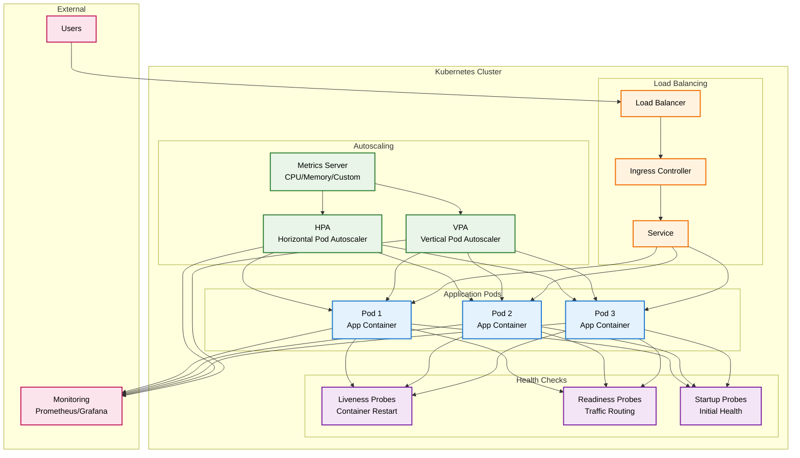

<p align="center">
  
</p>

# 🚢 Kubernetes Templates - Embracon Toolbox

## 🎯 Visão Geral

Este diretório contém **templates e exemplos padronizados** para deploy de aplicações Kubernetes na Embracon, incluindo configurações para **Health Checks**, **Autoscaling (HPA/VPA)** e **boas práticas de observabilidade**.

## 🏗️ Arquitetura da Solução Kubernetes



## 📁 Estrutura do Diretório

```
kubernetes-templates/
├── README.md                           # Este arquivo - Documentação geral
├── helm-charts/                        # Templates Helm Charts
│   ├── Chart.yaml                      # Metadados do Helm Chart
│   ├── values.yaml                     # Valores padrão configuráveis
│   └── templates/                      # Templates Kubernetes
│       ├── deployment.yaml             # Deployment com probes e resources
│       ├── service.yaml                # Service para exposição
│       ├── hpa.yaml                    # Horizontal Pod Autoscaler
│       ├── vpa.yaml                    # Vertical Pod Autoscaler
│       ├── servicemonitor.yaml         # ServiceMonitor para Prometheus
│       └── _helpers.tpl                # Helpers do Helm
└── standalone-yamls/                   # YAMLs independentes
    ├── deployment-complete.yaml        # Deployment completo com todas as features
    ├── hpa-example.yaml                # HPA standalone
    ├── vpa-example.yaml                # VPA standalone
    └── health-checks-examples.yaml     # Exemplos de health checks
```

## ⚡ Features Implementadas

### **🏥 Health Checks**
- ✅ **Liveness Probes** - Detecta containers "mortos" e reinicia automaticamente
- ✅ **Readiness Probes** - Controla quando pod recebe tráfego
- ✅ **Startup Probes** - Protege aplicações com inicialização lenta
- ✅ **Configuração flexível** - HTTP, TCP, exec comandos

### **📈 Autoscaling**
- ✅ **HPA (Horizontal Pod Autoscaler)** - Escala número de pods
- ✅ **VPA (Vertical Pod Autoscaler)** - Escala recursos de CPU/Memory
- ✅ **Métricas customizadas** - CPU, Memory, Custom metrics
- ✅ **Configuração condicional** via Helm

### **🔧 Helm Integration**
- ✅ **Templates parametrizáveis** - Configuração via values.yaml
- ✅ **Condicionais IF** - Habilita/desabilita features
- ✅ **Valores padrão** - Configuração out-of-the-box
- ✅ **Helpers** - Funções reutilizáveis

### **📊 Observabilidade**
- ✅ **ServiceMonitor** - Integração com Prometheus
- ✅ **Labels padronizadas** - Para monitoring e alerting
- ✅ **Annotations** - Metadados para ferramentas

## 🚀 Quick Start

### **1️⃣ Usando Helm Chart (Recomendado)**

```bash
# Clonar o repositório
git clone https://github.com/toolbox-tech/embracon.git
cd embracon/kubernetes-templates/helm-charts

# Instalar com configuração padrão
helm install minha-app . --namespace production

# Customizar configuração
helm install minha-app . \
  --namespace production \
  --set image.repository=nginx \
  --set image.tag=1.21 \
  --set autoscaling.hpa.enabled=true \
  --set autoscaling.vpa.enabled=false \
  --set healthChecks.enabled=true
```

### **2️⃣ Usando YAMLs Standalone**

```bash
# Aplicar deployment completo
kubectl apply -f standalone-yamls/deployment-complete.yaml

# Aplicar HPA
kubectl apply -f standalone-yamls/hpa-example.yaml

# Aplicar VPA
kubectl apply -f standalone-yamls/vpa-example.yaml
```

### **3️⃣ Customização via Values.yaml**

```yaml
# values.yaml
image:
  repository: minha-app
  tag: "v1.0.0"

healthChecks:
  enabled: true
  liveness:
    enabled: true
    path: "/health"
  readiness:
    enabled: true
    path: "/ready"

autoscaling:
  hpa:
    enabled: true
    minReplicas: 2
    maxReplicas: 10
    targetCPU: 70
  vpa:
    enabled: false

resources:
  limits:
    cpu: "1000m"
    memory: "512Mi"
  requests:
    cpu: "500m"
    memory: "256Mi"
```

## 📋 Configurações Principais

### **🏥 Health Checks Configuration**

| Parâmetro | Descrição | Padrão | Tipo |
|-----------|-----------|--------|------|
| `healthChecks.enabled` | Habilita health checks | `true` | boolean |
| `healthChecks.liveness.enabled` | Habilita liveness probe | `true` | boolean |
| `healthChecks.liveness.path` | Path HTTP para liveness | `/health` | string |
| `healthChecks.liveness.port` | Porta para liveness | `8080` | int |
| `healthChecks.liveness.initialDelaySeconds` | Delay inicial | `30` | int |
| `healthChecks.liveness.periodSeconds` | Intervalo entre checks | `10` | int |
| `healthChecks.readiness.enabled` | Habilita readiness probe | `true` | boolean |
| `healthChecks.readiness.path` | Path HTTP para readiness | `/ready` | string |
| `healthChecks.readiness.port` | Porta para readiness | `8080` | int |

### **📈 Autoscaling Configuration**

| Parâmetro | Descrição | Padrão | Tipo |
|-----------|-----------|--------|------|
| `autoscaling.hpa.enabled` | Habilita HPA | `false` | boolean |
| `autoscaling.hpa.minReplicas` | Mínimo de replicas | `1` | int |
| `autoscaling.hpa.maxReplicas` | Máximo de replicas | `10` | int |
| `autoscaling.hpa.targetCPU` | Target CPU (%) | `80` | int |
| `autoscaling.hpa.targetMemory` | Target Memory (%) | `80` | int |
| `autoscaling.vpa.enabled` | Habilita VPA | `false` | boolean |
| `autoscaling.vpa.updateMode` | Modo de update VPA | `Auto` | string |

### **⚙️ Resources Configuration**

| Parâmetro | Descrição | Padrão | Tipo |
|-----------|-----------|--------|------|
| `resources.limits.cpu` | Limite de CPU | `1000m` | string |
| `resources.limits.memory` | Limite de Memory | `512Mi` | string |
| `resources.requests.cpu` | Request de CPU | `500m` | string |
| `resources.requests.memory` | Request de Memory | `256Mi` | string |

## 📖 Documentação Completa

### 🎓 **Para Iniciantes**
- [📚 **GUIA COMPLETO PASSO A PASSO**](./GUIA-INICIANTES.md) - **Comece aqui se é novo no Kubernetes!**
- [🚀 **Exemplo Prático Completo**](./EXEMPLO-PRATICO.md) - Deploy de API REST com DB e Cache
- [⚡ **Comandos Essenciais**](./COMANDOS-ESSENCIAIS.md) - Cheat sheet para troubleshooting

### 🔧 **Para Desenvolvedores**
- [🏥 Implementações de Health Checks](./examples/health-implementations.md) - Python, Java, Node.js, .NET
- [⚙️ Cenários de Configuração](./examples/configuration-scenarios.md) - 7 tipos de aplicação
- [📜 Scripts Personalizados](./scripts/health-check.sh) - Health checks bash

### 📋 **Guias Rápidos**
- [🎯 Quick Start](#-quick-start) - Deploy em 5 minutos
- [🛠️ Troubleshooting](#-troubleshooting) - Soluções para problemas comuns
- [📊 Monitoramento](#-monitoramento) - Métricas e alertas

## 🎯 Casos de Uso

### **📱 Aplicação Web (Frontend)**
```yaml
# values-frontend.yaml
image:
  repository: minha-empresa/frontend
  tag: "v2.1.0"

replicaCount: 3

healthChecks:
  enabled: true
  liveness:
    path: "/health"
    port: 3000
  readiness:
    path: "/ready"
    port: 3000

autoscaling:
  hpa:
    enabled: true
    minReplicas: 2
    maxReplicas: 20
    targetCPU: 70

resources:
  limits:
    cpu: "500m"
    memory: "256Mi"
  requests:
    cpu: "100m"
    memory: "128Mi"
```

### **🔧 API Backend (Microservice)**
```yaml
# values-api.yaml
image:
  repository: minha-empresa/api-backend
  tag: "v1.5.0"

replicaCount: 5

healthChecks:
  enabled: true
  liveness:
    path: "/api/health"
    port: 8080
    initialDelaySeconds: 60
  readiness:
    path: "/api/ready"
    port: 8080
  startup:
    enabled: true
    path: "/api/startup"
    port: 8080

autoscaling:
  hpa:
    enabled: true
    minReplicas: 3
    maxReplicas: 50
    targetCPU: 75
    targetMemory: 80
  vpa:
    enabled: true
    updateMode: "Auto"

resources:
  limits:
    cpu: "2000m"
    memory: "1Gi"
  requests:
    cpu: "1000m"
    memory: "512Mi"
```

### **💾 Worker/Background Jobs**
```yaml
# values-worker.yaml
image:
  repository: minha-empresa/worker
  tag: "v1.0.0"

replicaCount: 2

healthChecks:
  enabled: true
  liveness:
    # TCP check para workers sem HTTP
    tcpSocket:
      port: 9090
  readiness:
    exec:
      command:
        - /health-check.sh

autoscaling:
  hpa:
    enabled: true
    minReplicas: 1
    maxReplicas: 10
    # Métricas customizadas para workers
    customMetrics:
      - type: "Pods"
        pods:
          metric:
            name: "queue_length"
          target:
            type: "AverageValue"
            averageValue: "30"

resources:
  limits:
    cpu: "1000m"
    memory: "512Mi"
  requests:
    cpu: "200m"
    memory: "256Mi"
```

## 🔍 Troubleshooting

### **❌ Pod não está healthy**
```bash
# Verificar status dos probes
kubectl describe pod <pod-name>

# Logs da aplicação
kubectl logs <pod-name> -f

# Teste manual do health check
kubectl exec <pod-name> -- curl localhost:8080/health
```

### **📈 HPA não está escalando**
```bash
# Verificar status do HPA
kubectl get hpa

# Verificar métricas disponíveis
kubectl top pods

# Verificar metrics server
kubectl get pods -n kube-system | grep metrics-server
```

### **🔧 VPA não está funcionando**
```bash
# Verificar se VPA está instalado
kubectl get crd | grep verticalpodautoscaler

# Verificar status do VPA
kubectl describe vpa <vpa-name>

# Verificar recomendações do VPA
kubectl get vpa <vpa-name> -o yaml
```

## 📚 Recursos Relacionados

### **📖 Documentação:**
- 🔗 [Kubernetes Probes](https://kubernetes.io/docs/tasks/configure-pod-container/configure-liveness-readiness-startup-probes/)
- 🔗 [Horizontal Pod Autoscaler](https://kubernetes.io/docs/tasks/run-application/horizontal-pod-autoscale/)
- 🔗 [Vertical Pod Autoscaler](https://github.com/kubernetes/autoscaler/tree/master/vertical-pod-autoscaler)
- 🔗 [Helm Templates](https://helm.sh/docs/chart_template_guide/)

### **🛠️ Ferramentas:**
- 📊 [Kubernetes Dashboard](https://kubernetes.io/docs/tasks/access-application-cluster/web-ui-dashboard/)
- 📈 [Prometheus + Grafana](https://prometheus.io/docs/introduction/overview/)
- 🔍 [kubectl](https://kubernetes.io/docs/reference/kubectl/)
- ⚡ [k9s](https://k9scli.io/) - Terminal UI para Kubernetes

### **🏗️ Integração com Embracon Toolbox:**
- 🔐 [Secret Management](../Secret%20Management/) - Gestão de segredos
- 🚀 [CI-CD Pipelines](../CI-CD/) - Automação de deploy
- 📋 [SDLC Best Practices](../Boas%20práticas%20de%20SDLC/) - Processo de desenvolvimento

---

<p align="center">
  <strong>🚢 Kubernetes Templates - Escalabilidade e Confiabilidade 📈</strong><br>
  <em>Health Checks • Autoscaling • Observability • Best Practices</em>
</p>
