<p align="center">
  
</p>

# Guia Completo: Kubernetes Roles e RBAC

**Entendendo e Criando Roles, ClusterRoles, RoleBindings e ClusterRoleBindings**

## 📋 Índice

- [🏗️ Conceitos Fundamentais](#️-conceitos-fundamentais)
- [🔐 Tipos de Recursos RBAC](#-tipos-de-recursos-rbac)
- [📝 Anatomia de uma Role](#-anatomia-de-uma-role)
- [🌐 Anatomia de uma ClusterRole](#-anatomia-de-uma-clusterrole)
- [🔗 RoleBinding vs ClusterRoleBinding](#-rolebinding-vs-clusterrolebinding)
- [🎯 Exemplos Práticos](#-exemplos-práticos)
- [📊 Referência de APIGroups](#-referência-de-apigroups)
- [🛡️ Melhores Práticas](#️-melhores-práticas)

## 🏗️ Conceitos Fundamentais

### O que é RBAC?

**RBAC (Role-Based Access Control)** é um sistema de autorização que regula o acesso a recursos com base nas funções (roles) dos usuários individuais.

```mermaid
graph LR
    subgraph "👥 Subjects (Quem)"
        USER[👤 User]
        SA[⚙️ ServiceAccount]
        GROUP[👥 Group]
    end

    subgraph "🎭 Roles (O que pode)"
        ROLE[📝 Role]
        CLUSTERROLE[🌐 ClusterRole]
    end

    subgraph "🔗 Bindings (Liga quem ao que)"
        RB[🔗 RoleBinding]
        CRB[🌐 ClusterRoleBinding]
    end

    subgraph "🎯 Resources (Em quê)"
        PODS[🐳 Pods]
        SERVICES[🔧 Services]
        SECRETS[🔐 Secrets]
        NODES[🖥️ Nodes]
    end

    USER --> RB
    SA --> RB
    GROUP --> CRB
    
    RB --> ROLE
    CRB --> CLUSTERROLE
    
    ROLE --> PODS
    ROLE --> SERVICES
    CLUSTERROLE --> SECRETS
    CLUSTERROLE --> NODES
```



### Componentes Principais

| Componente | Escopo | Descrição |
|------------|--------|-----------|
| **Role** | Namespace | Define permissões dentro de um namespace específico |
| **ClusterRole** | Cluster | Define permissões em todo o cluster ou recursos não-namespaceds |
| **RoleBinding** | Namespace | Liga subjects a Roles dentro de um namespace |
| **ClusterRoleBinding** | Cluster | Liga subjects a ClusterRoles em todo o cluster |

## 🔐 Tipos de Recursos RBAC

### Recursos com Namespace vs Sem Namespace

#### ✅ Recursos **COM** Namespace (usar Role)
```yaml
# Recursos que existem dentro de namespaces específicos
- pods, services, deployments
- configmaps, secrets
- ingresses, networkpolicies
- persistentvolumeclaims
- replicasets, statefulsets, daemonsets
```

#### 🌐 Recursos **SEM** Namespace (usar ClusterRole)
```yaml
# Recursos que são globais ao cluster
- nodes, persistentvolumes
- clusterroles, clusterrolebindings
- storageclasses
- customresourcedefinitions (CRDs)
- namespaces (próprios namespaces são cluster-scoped)
```

## 📝 Anatomia de uma Role

### Estrutura Básica

```yaml
apiVersion: rbac.authorization.k8s.io/v1
kind: Role
metadata:
  # 🏷️ METADATA - Informações sobre a Role
  namespace: <namespace-name>        # OBRIGATÓRIO: Namespace onde a role se aplica
  name: <role-name>                  # OBRIGATÓRIO: Nome único da role
  labels:                            # OPCIONAL: Labels para organização
    app: my-app
    environment: production
    team: backend
  annotations:                       # OPCIONAL: Metadados adicionais
    description: "Role para desenvolvedores backend"
    created-by: "devops-team"
    version: "1.0"
rules:
  # 🛡️ RULES - Define as permissões
- apiGroups: [""]                    # OBRIGATÓRIO: Grupos de API
  resources: ["pods", "services"]    # OBRIGATÓRIO: Recursos afetados
  verbs: ["get", "list", "create"]   # OBRIGATÓRIO: Ações permitidas
  resourceNames: ["my-pod"]          # OPCIONAL: Nomes específicos de recursos
```

### 🔍 Detalhamento dos Campos

#### **metadata.namespace**
- **Obrigatório**: ✅ Sim
- **Tipo**: String
- **Descrição**: Define em qual namespace a Role será aplicada
- **Exemplos**:
  ```yaml
  namespace: default           # Namespace padrão
  namespace: kube-system      # Namespace do sistema
  namespace: my-app-prod      # Namespace da aplicação
  namespace: monitoring       # Namespace de monitoramento
  ```

#### **metadata.name**
- **Obrigatório**: ✅ Sim  
- **Tipo**: String
- **Descrição**: Nome único da Role dentro do namespace
- **Convenções**:
  ```yaml
  name: pod-reader                    # Função específica
  name: backend-developer            # Por equipe/função
  name: monitoring-access            # Por categoria
  name: temp-access-2024-01         # Temporária com data
  ```

#### **metadata.labels**
- **Obrigatório**: ❌ Não
- **Tipo**: Map[string]string
- **Descrição**: Metadados para organização e seleção
- **Exemplos Úteis**:
  ```yaml
  labels:
    app: "kubernetes-dashboard"      # Aplicação relacionada
    component: "rbac"                # Componente do sistema
    environment: "production"       # Ambiente
    team: "platform"                # Equipe responsável
    version: "v1.2.0"              # Versão da configuração
    temporary: "true"               # Role temporária
    audit-required: "true"          # Requer auditoria
  ```

#### **rules.apiGroups**
- **Obrigatório**: ✅ Sim
- **Tipo**: Array de strings
- **Descrição**: Especifica quais grupos de API a regra se aplica

**Valores Comuns**:
```yaml
apiGroups: [""]                      # Core API group (pods, services, etc)
apiGroups: ["apps"]                  # Apps API group (deployments, replicasets)
apiGroups: ["extensions"]            # Extensions (ingresses legados)
apiGroups: ["networking.k8s.io"]     # Networking (ingresses, networkpolicies)
apiGroups: ["rbac.authorization.k8s.io"] # RBAC resources
apiGroups: ["metrics.k8s.io"]        # Metrics server
apiGroups: ["apiextensions.k8s.io"]  # Custom Resource Definitions
apiGroups: ["batch"]                 # Jobs e CronJobs
apiGroups: ["autoscaling"]           # HorizontalPodAutoscalers
apiGroups: ["policy"]                # PodDisruptionBudgets, PodSecurityPolicies
apiGroups: ["storage.k8s.io"]        # StorageClasses, VolumeAttachments
apiGroups: ["*"]                     # Todos os grupos (usar com cuidado!)
```

#### **rules.resources**
- **Obrigatório**: ✅ Sim
- **Tipo**: Array de strings  
- **Descrição**: Especifica quais recursos dentro do apiGroup

**Por apiGroup**:
```yaml
# Core API Group ("")
resources: ["pods", "services", "configmaps", "secrets", "events", 
           "endpoints", "persistentvolumeclaims", "serviceaccounts"]

# Apps API Group
resources: ["deployments", "replicasets", "statefulsets", "daemonsets"]

# Networking
resources: ["ingresses", "networkpolicies"] 

# Batch
resources: ["jobs", "cronjobs"]

# RBAC
resources: ["roles", "rolebindings", "clusterroles", "clusterrolebindings"]

# Sub-resources (recursos aninhados)
resources: ["pods/log", "pods/exec", "pods/portforward", "pods/status"]
resources: ["deployments/scale", "deployments/status"]
resources: ["services/status"]

# Wildcards
resources: ["*"]                     # Todos os recursos (cuidado!)
```

#### **rules.verbs**
- **Obrigatório**: ✅ Sim
- **Tipo**: Array de strings
- **Descrição**: Ações que podem ser executadas nos recursos

**Verbos Disponíveis**:
```yaml
verbs: ["get"]          # Obter um recurso específico (kubectl get pod <name>)
verbs: ["list"]         # Listar recursos (kubectl get pods)
verbs: ["watch"]        # Assistir mudanças (kubectl get pods --watch)
verbs: ["create"]       # Criar novos recursos (kubectl create)
verbs: ["update"]       # Atualizar recursos existentes (kubectl replace)
verbs: ["patch"]        # Modificar partes de recursos (kubectl patch)
verbs: ["delete"]       # Deletar recursos (kubectl delete)
verbs: ["deletecollection"] # Deletar múltiplos recursos (kubectl delete pods --all)
verbs: ["impersonate"]  # Fazer-se passar por outro usuário
verbs: ["*"]           # Todos os verbos (máximo cuidado!)

# Combinações comuns
verbs: ["get", "list", "watch"]                    # Read-only completo
verbs: ["get", "list", "watch", "create", "update", "patch", "delete"] # Full access
verbs: ["create", "update", "patch", "delete"]     # Write-only (raro)
```

#### **rules.resourceNames**
- **Obrigatório**: ❌ Não
- **Tipo**: Array de strings
- **Descrição**: Limita a regra a recursos com nomes específicos
- **Exemplo**:
  ```yaml
  rules:
  - apiGroups: [""]
    resources: ["secrets"]
    verbs: ["get"]
    resourceNames: ["database-secret", "api-keys"]  # Só estes secrets específicos
  ```

## 🌐 Anatomia de uma ClusterRole

### Diferenças da Role

```yaml
apiVersion: rbac.authorization.k8s.io/v1
kind: ClusterRole                    # Tipo: ClusterRole (não Role)
metadata:
  # ❌ NÃO tem campo 'namespace' - é cluster-scoped
  name: <clusterrole-name>           # Nome único no cluster inteiro
  labels:
    scope: cluster
  annotations:
    description: "Acesso a recursos cluster-wide"
rules:
  # Mesma estrutura das rules da Role
- apiGroups: [""]
  resources: ["nodes", "namespaces"]  # Pode incluir recursos cluster-scoped
  verbs: ["get", "list"]
- apiGroups: ["rbac.authorization.k8s.io"]
  resources: ["clusterroles", "clusterrolebindings"]
  verbs: ["get", "list", "watch"]
```

### Recursos Típicos de ClusterRole

```yaml
rules:
# Nós do cluster
- apiGroups: [""]
  resources: ["nodes", "nodes/status", "nodes/metrics"]
  verbs: ["get", "list", "watch"]

# Namespaces
- apiGroups: [""]  
  resources: ["namespaces"]
  verbs: ["get", "list", "watch", "create", "delete"]

# Persistent Volumes (não têm namespace)
- apiGroups: [""]
  resources: ["persistentvolumes"]
  verbs: ["get", "list", "watch", "create", "delete"]

# Storage Classes
- apiGroups: ["storage.k8s.io"]
  resources: ["storageclasses"]
  verbs: ["get", "list", "watch"]

# Custom Resource Definitions
- apiGroups: ["apiextensions.k8s.io"]
  resources: ["customresourcedefinitions"]
  verbs: ["get", "list", "watch", "create", "update", "delete"]

# RBAC (gerenciar roles)
- apiGroups: ["rbac.authorization.k8s.io"]
  resources: ["clusterroles", "clusterrolebindings", "roles", "rolebindings"]
  verbs: ["get", "list", "watch", "create", "update", "delete"]
```

## 🔗 RoleBinding vs ClusterRoleBinding

### RoleBinding

```yaml
apiVersion: rbac.authorization.k8s.io/v1
kind: RoleBinding
metadata:
  namespace: <target-namespace>      # OBRIGATÓRIO: Namespace onde se aplica
  name: <binding-name>
subjects:                           # OBRIGATÓRIO: A quem dar permissões
- kind: User                        # Tipo: User, ServiceAccount, ou Group
  name: john@company.com
  apiGroup: rbac.authorization.k8s.io
- kind: ServiceAccount
  name: my-service-account
  namespace: my-namespace           # Namespace do SA (pode ser diferente)
- kind: Group
  name: "admins-group-id"
  apiGroup: rbac.authorization.k8s.io
roleRef:                           # OBRIGATÓRIO: Qual role aplicar
  kind: Role                       # Pode ser Role ou ClusterRole
  name: my-role
  apiGroup: rbac.authorization.k8s.io
```

### ClusterRoleBinding

```yaml
apiVersion: rbac.authorization.k8s.io/v1
kind: ClusterRoleBinding
metadata:
  # ❌ NÃO tem namespace - se aplica a todo o cluster
  name: <binding-name>
subjects:                          # Mesmo formato do RoleBinding
- kind: User
  name: admin@company.com
  apiGroup: rbac.authorization.k8s.io
- kind: Group
  name: "cluster-admins"
  apiGroup: rbac.authorization.k8s.io
roleRef:
  kind: ClusterRole                # APENAS ClusterRole (não Role)
  name: cluster-admin
  apiGroup: rbac.authorization.k8s.io
```

### 🔍 Detalhamento dos Subjects

#### Tipo: **User**
```yaml
subjects:
- kind: User
  name: "john@company.com"           # Email ou username
  apiGroup: rbac.authorization.k8s.io
```

#### Tipo: **ServiceAccount**
```yaml
subjects:
- kind: ServiceAccount
  name: "my-app-sa"                  # Nome do ServiceAccount
  namespace: "my-app-namespace"      # Namespace onde o SA existe
```

#### Tipo: **Group** (para integração com OIDC/LDAP)
```yaml
subjects:
- kind: Group
  name: "developers"                 # Nome do grupo externo
  apiGroup: rbac.authorization.k8s.io
```

## 🎯 Exemplos Práticos

### 1. Role Básica - Pod Reader

```yaml
apiVersion: rbac.authorization.k8s.io/v1
kind: Role
metadata:
  namespace: default
  name: pod-reader
  labels:
    purpose: monitoring
    level: read-only
rules:
- apiGroups: [""]
  resources: ["pods"]
  verbs: ["get", "list", "watch"]
---
apiVersion: rbac.authorization.k8s.io/v1
kind: RoleBinding
metadata:
  name: read-pods
  namespace: default
subjects:
- kind: User
  name: monitoring@company.com
  apiGroup: rbac.authorization.k8s.io
roleRef:
  kind: Role
  name: pod-reader
  apiGroup: rbac.authorization.k8s.io
```

### 2. Role Avançada - Developer Full Access

```yaml
apiVersion: rbac.authorization.k8s.io/v1
kind: Role
metadata:
  namespace: development
  name: developer-full-access
  labels:
    team: backend
    environment: development
    access-level: full
  annotations:
    description: "Acesso completo para developers no namespace development"
    created-date: "2024-01-15"
    review-date: "2024-07-15"
rules:
# Recursos básicos - acesso completo
- apiGroups: [""]
  resources: 
    - pods
    - pods/log
    - pods/exec
    - pods/portforward
    - services
    - endpoints
    - configmaps
    - secrets
    - events
    - persistentvolumeclaims
  verbs: ["get", "list", "watch", "create", "update", "patch", "delete"]

# Deployments e workloads
- apiGroups: ["apps"]
  resources:
    - deployments
    - replicasets
    - statefulsets
    - daemonsets
  verbs: ["get", "list", "watch", "create", "update", "patch", "delete"]
  
# Jobs e CronJobs
- apiGroups: ["batch"]
  resources: ["jobs", "cronjobs"]
  verbs: ["get", "list", "watch", "create", "update", "patch", "delete"]

# Networking
- apiGroups: ["networking.k8s.io"]
  resources: ["ingresses", "networkpolicies"]
  verbs: ["get", "list", "watch", "create", "update", "patch", "delete"]

# Autoscaling
- apiGroups: ["autoscaling"]
  resources: ["horizontalpodautoscalers"]
  verbs: ["get", "list", "watch", "create", "update", "patch", "delete"]

# Métricas (read-only)
- apiGroups: ["metrics.k8s.io"]
  resources: ["pods", "nodes"]
  verbs: ["get", "list"]
```

### 3. ClusterRole - Monitoring Access

```yaml
apiVersion: rbac.authorization.k8s.io/v1
kind: ClusterRole
metadata:
  name: monitoring-cluster-access
  labels:
    purpose: monitoring
    scope: cluster-wide
rules:
# Nodes e métricas
- apiGroups: [""]
  resources: ["nodes", "nodes/metrics", "nodes/stats"]
  verbs: ["get", "list", "watch"]

# Pods em todos os namespaces (read-only)
- apiGroups: [""]
  resources: ["pods", "services", "endpoints"]
  verbs: ["get", "list", "watch"]

# Métricas do cluster
- apiGroups: ["metrics.k8s.io"]
  resources: ["nodes", "pods"]
  verbs: ["get", "list"]

# Eventos do cluster
- apiGroups: [""]
  resources: ["events"]
  verbs: ["get", "list", "watch"]

# Namespaces
- apiGroups: [""]
  resources: ["namespaces"]
  verbs: ["get", "list", "watch"]
---
apiVersion: rbac.authorization.k8s.io/v1
kind: ClusterRoleBinding
metadata:
  name: monitoring-binding
subjects:
- kind: ServiceAccount
  name: prometheus
  namespace: monitoring
roleRef:
  kind: ClusterRole
  name: monitoring-cluster-access
  apiGroup: rbac.authorization.k8s.io
```

### 4. Role com Restrições por Nome

```yaml
apiVersion: rbac.authorization.k8s.io/v1
kind: Role
metadata:
  namespace: production
  name: specific-secret-access
rules:
# Acesso apenas a secrets específicos
- apiGroups: [""]
  resources: ["secrets"]
  verbs: ["get", "list"]
  resourceNames: 
    - "database-credentials"
    - "api-keys"
    - "ssl-certificates"

# Acesso apenas a ConfigMaps específicos
- apiGroups: [""]
  resources: ["configmaps"]  
  verbs: ["get", "list", "watch"]
  resourceNames:
    - "app-config"
    - "feature-flags"
```

### 5. Role Temporária com Data de Expiração

```yaml
apiVersion: rbac.authorization.k8s.io/v1
kind: Role
metadata:
  namespace: troubleshooting
  name: emergency-access-2024-01
  labels:
    temporary: "true"
    emergency: "true"
    expires: "2024-02-01"
  annotations:
    description: "Acesso temporário para troubleshooting do incidente INC-2024-001"
    created-by: "ops-team"
    ticket: "INC-2024-001"
    expires-date: "2024-02-01T23:59:59Z"
    auto-cleanup: "true"
rules:
# Acesso amplo para troubleshooting
- apiGroups: [""]
  resources: ["*"]
  verbs: ["get", "list", "watch", "create", "update", "patch", "delete"]
- apiGroups: ["apps", "extensions"]
  resources: ["*"] 
  verbs: ["get", "list", "watch", "create", "update", "patch", "delete"]
```

## 📊 Referência de APIGroups

### Core API Group (`""`)
```yaml
apiGroups: [""]
resources:
  # Workload Resources
  - pods, pods/log, pods/exec, pods/portforward, pods/status
  - replicationcontrollers
  
  # Service Resources  
  - services, services/status
  - endpoints
  
  # Config & Storage
  - configmaps
  - secrets
  - persistentvolumeclaims
  - persistentvolumes  # cluster-scoped
  
  # Identity & Access
  - serviceaccounts
  
  # Cluster Resources
  - nodes, nodes/status, nodes/metrics  # cluster-scoped
  - namespaces  # cluster-scoped
  
  # Other
  - events
  - limitranges
  - resourcequotas
```

### Apps API Group (`apps`)
```yaml
apiGroups: ["apps"]
resources:
  - deployments, deployments/scale, deployments/status
  - replicasets, replicasets/scale, replicasets/status  
  - statefulsets, statefulsets/scale, statefulsets/status
  - daemonsets, daemonsets/status
  - controllerrevisions
```

### Networking (`networking.k8s.io`)
```yaml
apiGroups: ["networking.k8s.io"]
resources:
  - ingresses, ingresses/status
  - networkpolicies
  - ingressclasses  # cluster-scoped
```

### Batch (`batch`)
```yaml
apiGroups: ["batch"]  
resources:
  - jobs, jobs/status
  - cronjobs, cronjobs/status
```

### RBAC (`rbac.authorization.k8s.io`)
```yaml
apiGroups: ["rbac.authorization.k8s.io"]
resources:
  - roles
  - rolebindings
  - clusterroles      # cluster-scoped
  - clusterrolebindings  # cluster-scoped
```

### Storage (`storage.k8s.io`)
```yaml
apiGroups: ["storage.k8s.io"]
resources:
  - storageclasses    # cluster-scoped
  - volumeattachments # cluster-scoped
  - csidrivers       # cluster-scoped
  - csinodes         # cluster-scoped
```

### Autoscaling (`autoscaling`)
```yaml
apiGroups: ["autoscaling"]
resources:
  - horizontalpodautoscalers
```

### Policy (`policy`)
```yaml
apiGroups: ["policy"]
resources:
  - poddisruptionbudgets
  - podsecuritypolicies  # cluster-scoped (deprecated)
```

### Metrics (`metrics.k8s.io`)
```yaml
apiGroups: ["metrics.k8s.io"]
resources:
  - nodes    # cluster-scoped
  - pods
```

## 🛡️ Melhores Práticas

### 1. 🎯 Princípio do Menor Privilégio

```yaml
# ❌ EVITE - Permissões muito amplas
rules:
- apiGroups: ["*"]
  resources: ["*"] 
  verbs: ["*"]

# ✅ PREFIRA - Permissões específicas
rules:
- apiGroups: [""]
  resources: ["pods", "services"]
  verbs: ["get", "list", "watch"]
```

### 2. 🏷️ Use Labels e Annotations

```yaml
metadata:
  name: developer-role
  labels:
    team: backend
    environment: development
    access-level: read-write
    temporary: "false"
  annotations:
    description: "Acesso para desenvolvedores backend no ambiente de desenvolvimento"
    created-by: "devops-team"
    last-review: "2024-01-15"
    next-review: "2024-07-15"
    compliance-required: "true"
```

### 3. 🔍 Documentação Clara

```yaml
rules:
# Pods - Necessário para deploy e debug da aplicação
- apiGroups: [""]
  resources: ["pods", "pods/log", "pods/exec"]
  verbs: ["get", "list", "watch", "create", "delete"]
  
# Services - Necessário para configurar exposição de serviços  
- apiGroups: [""]
  resources: ["services"]
  verbs: ["get", "list", "watch", "create", "update", "patch"]
  
# ConfigMaps - Apenas leitura para configurações da app
- apiGroups: [""]
  resources: ["configmaps"]
  verbs: ["get", "list", "watch"]
```

### 4. 🎛️ Roles Modulares

```yaml
# Role específica por função
apiVersion: rbac.authorization.k8s.io/v1
kind: Role
metadata:
  name: pod-manager
rules:
- apiGroups: [""]
  resources: ["pods", "pods/log", "pods/exec"]
  verbs: ["*"]
---
apiVersion: rbac.authorization.k8s.io/v1
kind: Role  
metadata:
  name: config-reader
rules:
- apiGroups: [""]
  resources: ["configmaps", "secrets"]
  verbs: ["get", "list", "watch"]
```

### 5. ⏰ Revisão Regular

```yaml
metadata:
  name: temporary-access
  labels:
    temporary: "true"
    expires: "2024-06-30"
  annotations:
    description: "Acesso temporário para projeto X"
    created-date: "2024-01-15"
    expire-date: "2024-06-30"
    ticket: "PROJ-123"
    review-required: "true"
```

### 6. 🧪 Teste as Permissões

```bash
# Testar se a role funciona como esperado
kubectl auth can-i get pods --as=system:serviceaccount:namespace:serviceaccount-name
kubectl auth can-i create services --as=system:serviceaccount:namespace:serviceaccount-name
kubectl auth can-i delete secrets --as=system:serviceaccount:namespace:serviceaccount-name

# Listar todas as permissões de uma role
kubectl auth can-i --list --as=system:serviceaccount:namespace:serviceaccount-name
```

### 7. 📊 Templates por Cenário

#### Template: Read-Only Access
```yaml
apiVersion: rbac.authorization.k8s.io/v1
kind: Role
metadata:
  namespace: <NAMESPACE>
  name: <NAME>-readonly
  labels:
    access-type: readonly
rules:
- apiGroups: [""]
  resources: ["pods", "services", "configmaps", "events"]
  verbs: ["get", "list", "watch"]
- apiGroups: ["apps"]  
  resources: ["deployments", "replicasets"]
  verbs: ["get", "list", "watch"]
```

#### Template: Developer Access
```yaml
apiVersion: rbac.authorization.k8s.io/v1
kind: Role
metadata:
  namespace: <NAMESPACE>
  name: <NAME>-developer
  labels:
    access-type: developer
rules:
- apiGroups: [""]
  resources: ["pods", "services", "configmaps", "secrets", "events"]
  verbs: ["get", "list", "watch", "create", "update", "patch", "delete"]
- apiGroups: ["apps"]
  resources: ["deployments", "replicasets"]  
  verbs: ["get", "list", "watch", "create", "update", "patch"]
```

#### Template: Admin Access
```yaml
apiVersion: rbac.authorization.k8s.io/v1
kind: Role
metadata:
  namespace: <NAMESPACE>
  name: <NAME>-admin
  labels:
    access-type: admin
rules:
- apiGroups: ["*"]
  resources: ["*"]
  verbs: ["*"]
```

## 🔧 Comandos Úteis

### Verificação e Debug

```bash
# Listar todas as roles
kubectl get roles --all-namespaces

# Listar todas as clusterroles  
kubectl get clusterroles

# Descrever uma role específica
kubectl describe role <role-name> -n <namespace>

# Ver YAML de uma role
kubectl get role <role-name> -n <namespace> -o yaml

# Verificar permissões
kubectl auth can-i <verb> <resource> --as=<user> -n <namespace>
kubectl auth can-i --list --as=<user> -n <namespace>

# Verificar quem tem acesso a um recurso
kubectl auth can-i get pods --as=system:serviceaccount:namespace:sa-name

# Debug de rolebinding
kubectl describe rolebinding <binding-name> -n <namespace>
```

### Criação e Aplicação

```bash
# Aplicar role
kubectl apply -f role.yaml

# Criar role via kubectl (básica)
kubectl create role pod-reader --verb=get,list,watch --resource=pods -n <namespace>

# Criar rolebinding via kubectl  
kubectl create rolebinding pod-reader-binding --role=pod-reader --user=john -n <namespace>

# Validar antes de aplicar
kubectl apply -f role.yaml --dry-run=server
```

## 🏷️ Tags

`kubernetes-rbac` `roles` `security` `authorization` `access-control` `permissions`

---

<p align="center">
  <strong>🚀 Kubernetes RBAC Mastery 🛡️</strong><br>
  <em>🔐 Security • Authorization • Best Practices</em>
</p>
