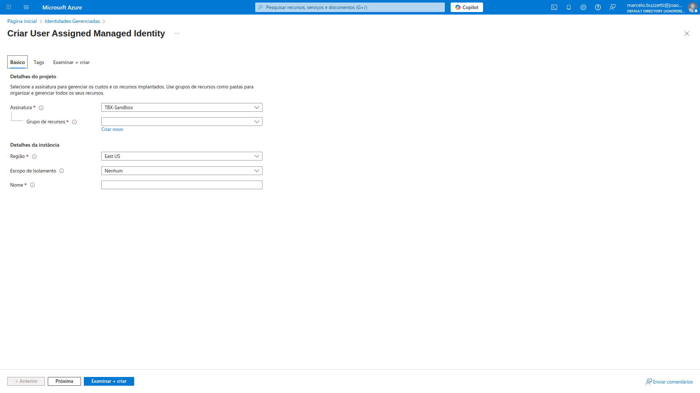
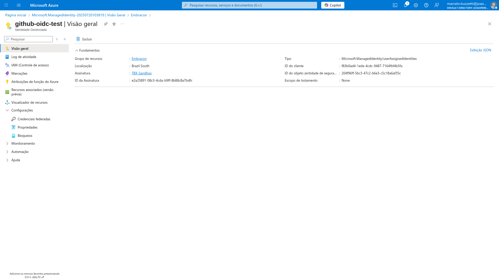
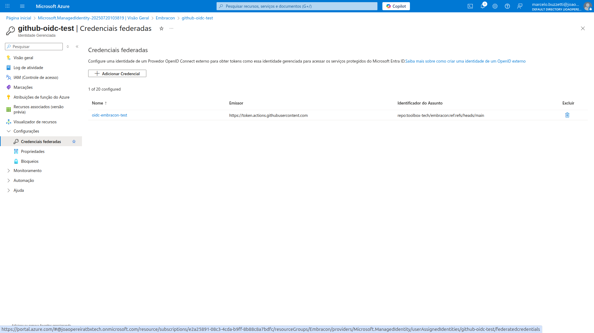
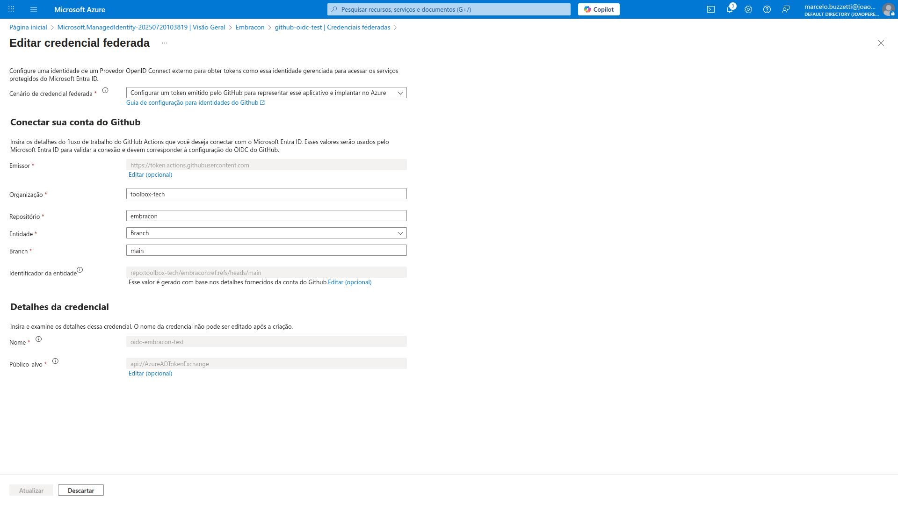
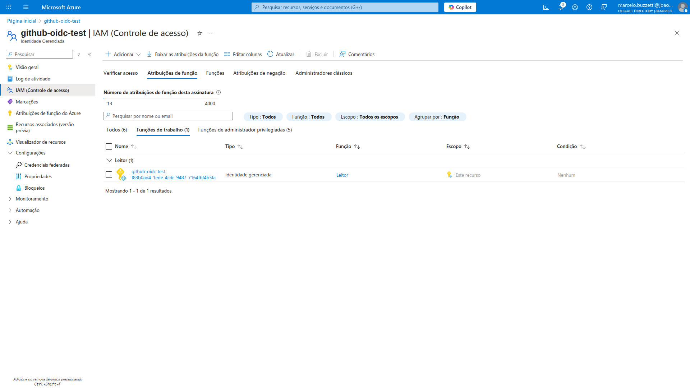

# 🚀 Aprenda a autenticar com segurança em serviços Azure a partir de workflows do GitHub Actions usando Azure Login com OpenID Connect (OIDC)

Neste tutorial, você aprenderá a:

- 🔑 Criar secrets no GitHub para as credenciais de uma aplicação Microsoft Entra (Azure AD) ou Managed Identity atribuída pelo usuário
- ⚙️ Configurar o Azure Login com autenticação OpenID Connect em workflows do GitHub Actions

## 📋 Pré-requisitos

Para usar a ação Azure Login com OIDC, é necessário configurar uma credencial de identidade federada em uma Managed Identity atribuída pelo usuário.

### 👤 Managed Identity atribuída pelo usuário

1. 🆕 Crie uma Managed Identity atribuída pelo usuário.
2. 📋 Copie os valores de Client ID, Subscription ID e Directory (tenant) ID para usar depois no seu workflow do GitHub Actions.
3. 🛡️ Atribua uma role apropriada à sua Managed Identity.
4. 🔗 Configure uma credencial de identidade federada na Managed Identity para confiar em tokens emitidos pelo GitHub Actions para o seu repositório.











## 🔒 Criar secrets no GitHub

1. No seu repositório GitHub, vá em **Settings** ⚙️.
2. Selecione **Security > Secrets and variables > Actions > New repository secret** 🛡️.
3. Crie os secrets `AZURE_CLIENT_ID`, `AZURE_TENANT_ID` e `AZURE_SUBSCRIPTION_ID` usando os valores copiados da sua aplicação Microsoft Entra ou Managed Identity.

> **💡 Observação:**  
> Para maior segurança em repositórios públicos, utilize environment secrets ao invés de repository secrets. Se o ambiente exigir aprovação, um job só acessa os secrets após aprovação de um revisor.

| 🗝️ GitHub secret         | 📄 Valor da aplicação/Managed Identity |
|--------------------------|----------------------------------------|
| AZURE_CLIENT_ID          | Client ID                              |
| AZURE_SUBSCRIPTION_ID    | Subscription ID                        |
| AZURE_TENANT_ID          | Directory (tenant) ID                  |

> **🔐 Recomendação:**  
> Por segurança, use sempre GitHub Secrets ao invés de passar valores diretamente no workflow.

## ☁️ Configurar Azure Login com OIDC no GitHub Actions

Seu workflow do GitHub Actions usará OpenID Connect para autenticar no Azure. Após configurar o Azure Login, você pode usar ações como Azure CLI, Azure PowerShell, Azure WebApp Deploy, etc.

### 📝 Exemplo: Workflow usando apenas Azure CLI

```yaml
name: Executar Azure CLI Login com OpenID Connect
on: [push]

jobs:
  test:
    permissions:
      id-token: write # Permissão necessária para buscar o token OIDC.
      contents: read # Permissão necessária para ler o conteúdo do repositório.
    runs-on: ubuntu-latest
    steps:
    - name: Azure CLI Login
      uses: azure/login@v2
      with:
        client-id: ${{ secrets.AZURE_CLIENT_ID }}
        tenant-id: ${{ secrets.AZURE_TENANT_ID }}
        subscription-id: ${{ secrets.AZURE_SUBSCRIPTION_ID }}

    - name: Azure CLI script
      uses: azure/cli@v2
      with:
        azcliversion: latest
        inlineScript: |
          az account show
          # Você pode adicionar outros comandos Azure CLI aqui.
```

### 📝 Exemplo: Workflow usando Azure CLI e Azure PowerShell
```yaml
name: Executar Azure Login com OpenID Connect
on: [push]

jobs:
  test:
    permissions:
      id-token: write
    runs-on: ubuntu-latest
    steps:
    - name: Azure Login
      uses: azure/login@v2
      with:
        client-id: ${{ secrets.AZURE_CLIENT_ID }}
        tenant-id: ${{ secrets.AZURE_TENANT_ID }}
        subscription-id: ${{ secrets.AZURE_SUBSCRIPTION_ID }}
        enable-AzPSSession: true

    - name: Azure CLI script
      uses: azure/cli@v2
      with:
        azcliversion: latest
        inlineScript: |
          az account show
          # Outros comandos Azure CLI

    - name: Azure PowerShell script
      uses: azure/powershell@v2
      with:
        azPSVersion: latest
        inlineScript: |
          Get-AzContext
          # Outros comandos PowerShell
```

### 🌐 Conectar em clouds Azure Government ou Azure Stack
Para logar em clouds especiais, defina o parâmetro `environment`:
```yaml
jobs:
  test:
    permissions:
      id-token: write
    runs-on: ubuntu-latest
    steps:
    - name: Login no Azure US Gov Cloud com Azure CLI e PowerShell
      uses: azure/login@v2
      with:
        client-id: ${{ secrets.AZURE_CLIENT_ID }}
        tenant-id: ${{ secrets.AZURE_TENANT_ID }}
        subscription-id: ${{ secrets.AZURE_SUBSCRIPTION_ID }}
        environment: 'AzureUSGovernment'
        audience: api://AzureADTokenExchangeUSGov
        enable-AzPSSession: true
```